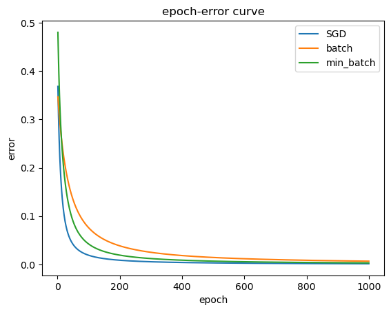

请使用jupyter完成相关代码的运行。
若未安装该依赖，直接阅读该markdown文件同样可以获取练习结果。

# Delta 规则实例

---

## 模型与数据


---

## 准备工作

### 导入依赖。


```python
import numpy as np
import matplotlib.pyplot as plt
```

### sigmoid 函数
g 代表一个常用的逻辑函数（logistic function）为S形函数（Sigmoid function），公式为： \\[g\left( z \right)=\frac{1}{1+{{e}^{-z}}}\\] 


```python
def sigmoid(z):
    '''
    sigmoid 函数
    Args:
        z (m, n): 输入
    Returns:
        g (m, n): sigmoid 函数输出
    '''
    d = 1 + np.exp(-z)
    return 1. / d
```

### Sigmoid函数的梯度的函数


```python
def sigmoid_gradient(z):
    return np.multiply(sigmoid(z), (1 - sigmoid(z)))
```

### 前向传播函数

单层网络，注意偏置 b = 0。


```python
def forward_propagate(X, theta):
    '''
    前向传播函数
    Args:
        X (m, n): m个样本，n个特征
        theta (t, n): t个神经元
    Returns:
        z (m, t)
        h (m, t)
    '''
    z = X * theta.T # b = 0
    h = sigmoid(z)

    return z, h
```

### 代价函数

创建一个以参数θ为特征函数的代价函数
$$J\left( \theta  \right)=\frac{1}{2m}\sum\limits_{i=1}^{m}{{{\left( {{h}_{\theta }}\left( {{x}^{(i)}} \right)-{{y}^{(i)}} \right)}^{2}}}$$
其中：\\[{{h}_{\theta }}\left( x \right)={{\theta }^{T}}X={{\theta }_{0}}{{x}_{0}}+{{\theta }_{1}}{{x}_{1}}+{{\theta }_{2}}{{x}_{2}}+...+{{\theta }_{n}}{{x}_{n}}\\] 


```python
def computeCost(X, y, theta):
    '''
    代价函数
    Args:
        X (m, n): m个样本，n个特征
        y (m, 1): 真实值
        theta (1, n): 参数
    Returns:
        cost: 代价函数
    '''
    _, h =  forward_propagate(X, theta)
    m = X.shape[0]
    J = np.power(h - y, 2)
    return J.sum()/2/m
```

### 批量梯度下降

$${{\theta }_{j}}:={{\theta }_{j}}-\alpha \frac{\partial }{\partial {{\theta }_{j}}}J\left( \theta  \right)$$


```python
def GradientDescent(X, y, theta, alpha, iters, step = -1):
    '''
    小批量梯度下降
    Args:
        X (m, n): m个样本，n个特征
        y (m, 1): 真实值
        theta (1, n): 参数
        alpha (int): 学习率
        iters (int): 最大迭代次数
        step (int): 每组样本的数量
    Returns:
        g(1, n): 参数最终值
        cost(iters, 1): 代价函数历史值
    '''
    m = X.shape[0]
    g = theta.copy()
    cost = np.matrix(np.zeros((iters, 1)))
    
    # 默认为批量
    if step == -1:
        step = m
    
    for i in range(iters):
        for j in range(0, m, step):
            Xs = X[j:j+step, :]
            ys = y[j:j+step]
            z, h = forward_propagate(Xs, g) # 输出
            delta = np.multiply(sigmoid_gradient(z), h - ys)
            gradient = Xs.T * delta / step    # 计算梯度
            g = g - alpha * gradient.T        # 更新参数
        cost[i, 0] = computeCost(X, y, g) # 计算代价函数

    return g, cost
```

---

## 练习1

用SGD、批量和小批量算法，训练网络，给出最终权系数和四个样本的网络输出值。
其中，SGD训练1000轮，批量训练4000轮,小批量(2个样本一组)训练2000轮。


```python
# 数据
X = np.array([[0, 0, 1],
             [0, 1, 1],
             [1, 0, 1],
             [1, 1, 1]])
y = np.array([0, 0, 1, 1])

X = np.matrix(X)
y = np.matrix(y).T

# 初始化设置
alpha = 0.9

# 训练网络
theta = np.matrix(np.random.random((1, 3)) * 2 - 1)
SGDresult, _ = GradientDescent(X, y, theta, alpha, 1000, 1)
print(f"SGD\n系数: {SGDresult}\n网络输出值: {forward_propagate(X, SGDresult)[1]}\n")

theta = np.matrix(np.random.random((1, 3)) * 2 - 1)
batch_result, _ = GradientDescent(X, y, theta, alpha, 4000)
print(f"批量\n系数: {batch_result}\n网络输出值: {forward_propagate(X, batch_result)[1]}\n")

theta = np.matrix(np.random.random((1, 3)) * 2 - 1)
min_batch_result, _ = GradientDescent(X, y, theta, alpha, 2000, 2)
print(f"小批量\n系数: {min_batch_result}\n网络输出值: {forward_propagate(X, min_batch_result)[1]}\n")
```

    SGD
    系数: [[ 7.15293458 -0.21820609 -3.35949009]]
    网络输出值: [[0.03358577]
     [0.02718057]
     [0.97797798]
     [0.97275437]]
    
    批量
    系数: [[ 7.1450131  -0.22279644 -3.35392342]]
    网络输出值: [[0.03376692]
     [0.0272064 ]
     [0.97792721]
     [0.97256969]]
    
    小批量
    系数: [[ 7.15102594 -0.22178861 -3.35694323]]
    网络输出值: [[0.03366853]
     [0.0271532 ]
     [0.97799173]
     [0.97267623]]
    
    

---

## 练习2

结合课堂练习，比较SGD、批量和小批量三种算法学习速度。
说明:每种算法学习1000轮，画出“轮-误差”曲线，其中误差等于4个实际输出与期望输出之差的平方和。


```python
# 训练网络（计算结果为均方误差）
theta = np.matrix(np.random.random((1, 3)) * 2 - 1)
_, SGDcost = GradientDescent(X, y, theta, alpha, 1000, 1)

theta = np.matrix(np.random.random((1, 3)) * 2 - 1)
_, batch_cost = GradientDescent(X, y, theta, alpha, 1000)

theta = np.matrix(np.random.random((1, 3)) * 2 - 1)
_, min_batch_cost = GradientDescent(X, y, theta, alpha, 1000, 2)

# 绘制曲线
fig, ax = plt.subplots()
t = np.linspace(1, 1000, 1000)                # 创建t的取值范围
ax.plot(t, 4 * SGDcost, label='SGD')              # 作SGD的误差曲线
ax.plot(t, 4 * batch_cost, label='batch')         # 作batch的误差曲线
ax.plot(t, 4 * min_batch_cost, label='min_batch') # 作min_batch的误差曲线

ax.set_xlabel('epoch')
ax.set_ylabel('error')
ax.set_title('epoch-error curve')
ax.legend()

plt.show() 
```


    

    


---

## 练习3

用SGD对数据2训练4000轮，给出最终权系数和四个样本的网络输出，验证训练结果是否有效?


```python
# 数据
X = np.array([[0, 0, 1],
             [0, 1, 1],
             [1, 0, 1],
             [1, 1, 1]])
y = np.array([0, 1, 1, 0])

X = np.matrix(X)
y = np.matrix(y).T

# 初始化设置
alpha = 0.9

# 训练网络
theta = np.matrix(np.random.random((1, 3)) * 2 - 1)
SGDresult, _ = GradientDescent(X, y, theta, alpha, 4000, 1)
print(f"SGD\n系数: {SGDresult}\n网络输出值: {forward_propagate(X, SGDresult)[1]}\n")
```

    SGD
    系数: [[-0.23750569 -0.11875285  0.11875285]]
    网络输出值: [[0.52965337]
     [0.5       ]
     [0.47034663]
     [0.44090112]]
    
    

根据网络的输出可以判定训练结果无效。
