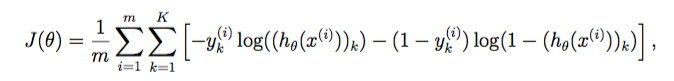

# ReLU & Dropout

请使用jupyter完成相关代码的运行。 若未安装该依赖，直接阅读该 pdf 文件同样可以获取练习结果。

---

## 模型


---

## 准备工作

### 导入依赖。


```python
import numpy as np
import matplotlib.pyplot as plt
```

### ReLU 函数
g 代表一个常用的逻辑函数（logistic function），公式为： \\[g\left( v_i \right)=max(0, v_i)\\] 


```python
def ReLU(z):
    '''
    ReLU 函数
    Args:
        z (m, n): 输入
    Returns:
        g (m, n): ReLU 函数输出
    '''
    return np.maximum(0, z)

def sigmoid(z):
    '''
    sigmoid 函数
    Args:
        z (m, n): 输入
    Returns:
        g (m, n): sigmoid 函数输出
    '''
    d = 1 + np.exp(-z)
    return 1. / d

def softmax(z):
    '''
    softmax 函数
    Args:
        z (m, n): 输入
    Returns:
        g (m, n): softmax 函数输出
    '''
    d = np.exp(z)
    # 注意 d sum时的axis
    return d / d.sum(axis = 1).reshape(-1, 1)
```

### ReLU函数的梯度的函数


```python
def ReLU_gradient(z):
    return z > 0

def sigmoid_gradient(z):
    return np.multiply(sigmoid(z), (1 - sigmoid(z)))

def softmax_gradient(z):
    return np.multiply(softmax(z), (1 - softmax(z)))
```

### 前向传播函数

注意偏置 b = 0。


```python
def forward_propagate(X, thetas, activate_fcn):
    '''
    前向传播函数
    Args:
        X (m, n): m个样本，n个特征
        thetas list[(ti, tj)]: 隐层参数矩阵列表
        activate_fcn : 激活函数
    Returns:
        z_out list[(m, ti)]
        a_out list[(m, ti)]
    '''
    m = X.shape[0]

    # 激活项a, 线性输出z
    z_out, a_out = [X], [X]
    for theta in thetas:
        z_out.append(a_out[-1] * theta.T)
        a_out.append(activate_fcn(z_out[-1]))
    a_out[-1] = softmax(z_out[-1])

    return z_out, a_out
```

### 代价函数

交叉熵代价函数。




```python
def cost_fcn(params, size, index, X, y, activate_fcn):
    '''
    交叉熵代价函数
    Args:
        params (hidden_size * input_size + num_labels * hidden_size, ): 参数
        size (list[int]): 输入的特征数, 隐藏层的神经元数, 输出层神经元数/类别数
        X (m, n): m个样本，n个特征
        y (m, k): 真实值, k个类别
        activate_fcn : 激活函数
    Returns:
        cost (int): 代价
    '''
    m = X.shape[0]
    X = np.matrix(X)
    y = np.matrix(y)
    
    # reshape the parameter array into parameter matrices for each layer
    thetas = []
    index1 = 0
    for i in range(len(index)):
        index2 = index[i]
        thetas.append(np.matrix(np.reshape(params[index1:index2], (size[i + 1], size[i]))))
        index1 = index2
    
    # run the feed-forward pass
    _, a_out = forward_propagate(X, thetas, activate_fcn)
    
    # compute the cost
    h = a_out[-1]
    J = np.multiply(-y, np.log(h)) - np.multiply((1 - y), np.log(1 - h))
    cost = J.sum().sum() / m

    return cost
```

### BP算法

交叉熵代价函数 + Softmax。


```python
def backprop(params, size, index, X, y, activate_fcn, activate_fcn_gradient, ratio = 0.):
    '''
    执行反向传播并返回代价和梯度
    Args:
        params (hidden_size * input_size + num_labels * hidden_size, ): 参数
        size (list[int]): 输入的特征数, 隐藏层的神经元数, 输出层神经元数/类别数
        X (m, n): m个样本，n个特征
        y (m, k): 真实值, k个类别
        activate_fcn : 激活函数
        activate_fcn_gradient : 激活函数的梯度函数
        ratio float: 失活节点占比
    Returns:
        cost (int): 代价
        grad (, ): 梯度
    '''
        
    m = X.shape[0]
    
    # 将参数数组重构为每一层的参数矩阵
    thetas = []
    index1 = 0
    for i in range(len(index)):
        index2 = index[i]
        thetas.append(np.matrix(np.reshape(params[index1:index2], (size[i + 1], size[i]))))
        index1 = index2
    
    # 前向传播
    if ratio > 0:
        z_out, a_out = forward_propagate_dropout(X, thetas, activate_fcn, ratio)
    else:
        z_out, a_out = forward_propagate(X, thetas, activate_fcn)
    h = a_out[-1]
    
    # 使用dropout时，sigmoid和softmax梯度函数都含有a_out本身，而ReLU的梯度函数不含有a_out本身，直接将其梯度
    # 函数由 z_out > 0 替换成 a_out > 0 即可将失活节点的梯度置为0
    if ratio > 0 and activate_fcn == ReLU:
        z_out = a_out
    
    # 计算损失
    if ratio > 0: # ratio > 0时，为避免失活节点的影响，需使用参数重新计算
        cost = cost_fcn(params, size, index, X, y, activate_fcn)
    else:
        J = np.multiply(-y, np.log(h)) - np.multiply((1 - y), np.log(1 - h))
        cost = J.sum().sum() / m
    
    # 误差反向传播
    grads = []
    error = h - y
    delta = error
    for i in range(len(thetas)-1, -1, -1):
        grads.append(delta.T @ a_out[i] / m)
        error = delta @ thetas[i]
        delta = np.multiply(error, activate_fcn_gradient(z_out[i]))
    
    # 将梯度矩阵分解成单个数组
    grad = np.concatenate([np.ravel(grad) for grad in grads[::-1]])
    
    return cost, grad
```

训练函数。


```python
def train(X, y, params, size, alpha, iters, activate_fcn, activate_fcn_gradient, ratio = 0., step = -1):
    '''
    训练函数
    Args:
        X (m, n): m个样本，n个特征
        y (m, k): 真实值, k个类别
        params (hidden_size * input_size + num_labels * hidden_size, ): 参数
        size (list[int]): 输入的特征数, 隐藏层的神经元数, 输出层神经元数/类别数
        alpha (int): 学习率
        iters (int): 最大迭代次数
        activate_fcn : 激活函数
        activate_fcn_gradient : 激活函数的梯度函数
        ratio float: 失活节点占比
        step (int): 每组样本的数量
    Returns:
        g(1, n): 参数最终值
        cost(iters, 1): 代价函数历史值
    '''
    m = X.shape[0]
    g = params.copy()
    cost = np.matrix(np.zeros((iters, 1)))
    
    # 默认为批量
    if step == -1:
        step = m
    
    index = np.array(size)
    index = np.cumsum(index[1:] * index[:-1])
    for i in range(iters):
        for j in range(0, m, step):
            Xs = X[j:j+step, :]
            ys = y[j:j+step]
            
            # 计算梯度和损失
            J, grad = backprop(g, size, index, X, y, activate_fcn, activate_fcn_gradient, ratio)
            
            g = g - alpha * grad
            cost[i, 0] = J

    return g, cost
```

---


```python
# 初始化设置
size = [25, 20, 20, 20, 5] # 三隐层
alpha = 0.05
epoch = 10000

# 设定激活函数
activate_fcn, activate_fcn_gradient = ReLU, ReLU_gradient

# 数据
X = np.array([[[0, 1, 1, 0, 0],
               [0, 0, 1, 0, 0],
               [0, 0, 1, 0, 0],
               [0, 0, 1, 0, 0],
               [0, 1, 1, 1, 0]],
             
              [[1, 1, 1, 1, 0],
               [0, 0, 0, 0, 1],
               [0, 1, 1, 1, 0],
               [1, 0, 0, 0, 0],
               [1, 1, 1, 1, 1]],
              
              [[1, 1, 1, 1, 0],
               [0, 0, 0, 0, 1],
               [0, 1, 1, 1, 0],
               [0, 0, 0, 0, 1],
               [1, 1, 1, 1, 0]],
              
              [[0, 0, 0, 1, 0],
               [0, 0, 1, 1, 0],
               [0, 1, 0, 1, 0],
               [1, 1, 1, 1, 1],
               [0, 0, 0, 1, 0]],
              
              [[1, 1, 1, 1, 1],
               [1, 0, 0, 0, 0],
               [1, 1, 1, 1, 0],
               [0, 0, 0, 0, 1],
               [1, 1, 1, 1, 0]]])

  

y = np.eye(5)

X = X.transpose(0, 2, 1).reshape(5, 25)
m = X.shape[0]
X = np.matrix(X)
y = np.matrix(y)

# 随机初始化完整网络参数大小的参数数组
index = np.array(size)
params = np.random.random(size = np.sum(index[1:] * index[:-1])) * 2 - 1

# 训练
params, cost = train(X, y, params, size, alpha, epoch, activate_fcn, activate_fcn_gradient)

# 观察输出
index = np.cumsum(index[1:] * index[:-1])
thetas = []
index1 = 0
for i in range(len(index)):
    index2 = index[i]
    thetas.append(np.matrix(np.reshape(params[index1:index2], (size[i + 1], size[i]))))
    index1 = index2

print(f'''训练数据网络预测值：\n{forward_propagate(X, thetas, activate_fcn)[-1][-1].argmax(axis=1)+1}
训练数据平均损失: {cost[-1].item()}''')

# 绘制曲线
fig, ax = plt.subplots()
t = np.linspace(1, epoch, epoch)                # 创建t的取值范围
ax.plot(t, m * cost)                            # 作误差曲线

ax.set_xlabel('epoch')
ax.set_ylabel('error')
ax.set_title('epoch-error curve')

plt.show() 
```

    训练数据网络预测值：
    [[1]
     [2]
     [3]
     [4]
     [5]]
    训练数据平均损失: 5.067501620260325e-05
    


    

    


可以看到，训练结果有效。

---


```python
# 初始化设置
size = [25, 50, 5] # 单隐层
alpha = 0.05
epoch = 10000

# 设定激活函数
activate_fcn, activate_fcn_gradient = softmax, softmax_gradient

# 随机初始化完整网络参数大小的参数数组
index = np.array(size)
params = np.random.random(size = np.sum(index[1:] * index[:-1])) * 2 - 1

# 训练
params, softcost = train(X, y, params, size, alpha, epoch, activate_fcn, activate_fcn_gradient)

# 观察输出
index = np.cumsum(index[1:] * index[:-1])
thetas = []
index1 = 0
for i in range(len(index)):
    index2 = index[i]
    thetas.append(np.matrix(np.reshape(params[index1:index2], (size[i + 1], size[i]))))
    index1 = index2

print(f'''训练数据网络预测值：\n{forward_propagate(X, thetas, activate_fcn)[-1][-1].argmax(axis=1)+1}
训练数据平均损失: {softcost[-1].item()}''')

# 绘制曲线
fig, ax = plt.subplots()
t = np.linspace(1, epoch, epoch)                # 创建t的取值范围
ax.plot(t, m * cost, label='ReLU')              # 作误差曲线
ax.plot(t, m * softcost, label='Softmax')       # 作误差曲线
plt.ylim((0, 2))

ax.set_xlabel('epoch')
ax.set_ylabel('error')
ax.set_title('epoch-error curve')
ax.legend()

plt.show() 
```

    训练数据网络预测值：
    [[1]
     [2]
     [3]
     [4]
     [5]]
    训练数据平均损失: 0.11497490610125365
    


    

    


可以看到，在同样的学习率下

激活函数采用 Softmax 的单隐层网络，相比于采用 ReLU 的三隐层网络，其损失函数下降速度更慢

在相同的轮数(10000)下，其训练得到的最终损失远大于采用 ReLU 的三隐层网络

可以判定，ReLU 确实有效。

---

## 练习15 Dropout


Dropout 中，为保证各节点之和（L1范数，节点向量幅值）大致不变，确保训练的稳定性（权值系数容易收敛），有效节点的输出需进行增益。


```python
def Dropout(size, ratio):
    '''
    Dropout
    Args:
        size int: 待处理节点层的大小
        ratio float: 失活节点占比
    Returns:
        ym (size): 经处理后的各节点增益
    '''
    num = np.round(size * (1 - ratio))
    index = np.random.permutation(size)[:int(num)]
    
    ym = np.zeros(size)
    ym[index] = size/num
    return ym
```

引入 dropout 后，需适当修改 train() 和 backprop()，并重写前向传播。


```python
def forward_propagate_dropout(X, thetas, activate_fcn, ratio):
    '''
    前向传播函数
    Args:
        X (m, n): m个样本，n个特征
        thetas list[(ti, tj)]: 隐层参数矩阵列表
        activate_fcn : 激活函数
        ratio float: 失活节点占比
    Returns:
        z_out list[(m, ti)]
        a_out list[(m, ti)]
    '''
    m = X.shape[0]

    # 激活项a, 线性输出z
    z_out, a_out = [X], [X]
    for theta in thetas:
        z_out.append(a_out[-1] * theta.T)
        a_out.append(np.multiply(activate_fcn(z_out[-1]), Dropout(theta.shape[0], ratio)))
    a_out[-1] = softmax(z_out[-1])

    return z_out, a_out
```

激活函数使用 sigmoid，引入 dropout 后。


```python
# 初始化设置
size = [25, 20, 20, 20, 5] # 三隐层
alpha = 0.1
epoch = 10000
ratio = 0.2

# 设定激活函数
activate_fcn, activate_fcn_gradient = sigmoid, sigmoid_gradient

# 随机初始化完整网络参数大小的参数数组
index = np.array(size)
params = np.random.random(size = np.sum(index[1:] * index[:-1])) * 2 - 1

# 训练
params, drop_sigcost = train(X, y, params, size, alpha, epoch, activate_fcn, activate_fcn_gradient, ratio)

# 观察输出
index = np.cumsum(index[1:] * index[:-1])
thetas = []
index1 = 0
for i in range(len(index)):
    index2 = index[i]
    thetas.append(np.matrix(np.reshape(params[index1:index2], (size[i + 1], size[i]))))
    index1 = index2

print(f'''训练数据网络预测值：\n{forward_propagate(X, thetas, activate_fcn)[-1][-1].argmax(axis=1)+1}
训练数据平均损失: {drop_sigcost[-1].item()}''')

# 绘制曲线
fig, ax = plt.subplots()
t = np.linspace(1, epoch, epoch)                # 创建t的取值范围
ax.plot(t, m * drop_sigcost, label='sigmoid')       # 作误差曲线

ax.set_xlabel('epoch')
ax.set_ylabel('error')
ax.set_title('epoch-error curve')
ax.legend()

plt.show() 
```

    训练数据网络预测值：
    [[1]
     [2]
     [3]
     [4]
     [5]]
    训练数据平均损失: 0.00024945353719964773
    


    

    


---

## 练习16

激活函数使用 ReLU，引入 dropout 后。

使用dropout时，sigmoid和softmax梯度函数都含有a_out本身，而ReLU的梯度函数不含有a_out本身，直接将其梯度函数由 z_out > 0 替换成 a_out > 0 即可将失活节点的梯度置为0.


```python
# 初始化设置
size = [25, 20, 20, 20, 5] # 三隐层
alpha = 0.05
epoch = 10000
ratio = 0.2

# 设定激活函数
activate_fcn, activate_fcn_gradient = ReLU, ReLU_gradient

# 随机初始化完整网络参数大小的参数数组
index = np.array(size)
params = np.random.random(size = np.sum(index[1:] * index[:-1])) * 2 - 1

# 训练
params, drop_ReLUcost = train(X, y, params, size, alpha, epoch, activate_fcn, activate_fcn_gradient, ratio)

# 观察输出
index = np.cumsum(index[1:] * index[:-1])
thetas = []
index1 = 0
for i in range(len(index)):
    index2 = index[i]
    thetas.append(np.matrix(np.reshape(params[index1:index2], (size[i + 1], size[i]))))
    index1 = index2

print(f'''训练数据网络预测值：\n{forward_propagate(X, thetas, activate_fcn)[-1][-1].argmax(axis=1)+1}
训练数据平均损失: {drop_ReLUcost[-1].item()}''')

# 绘制曲线
fig, ax = plt.subplots()
t = np.linspace(1, epoch, epoch)                # 创建t的取值范围
ax.plot(t, m * drop_ReLUcost, label='ReLU')       # 作误差曲线

ax.set_xlabel('epoch')
ax.set_ylabel('error')
ax.set_title('epoch-error curve')
ax.legend()

plt.show() 
```

    训练数据网络预测值：
    [[1]
     [2]
     [3]
     [4]
     [5]]
    训练数据平均损失: 6.856842826306805e-08
    


    

    

