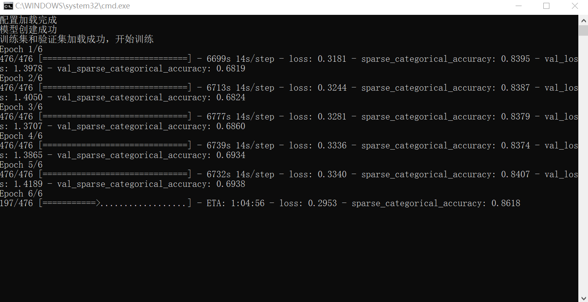
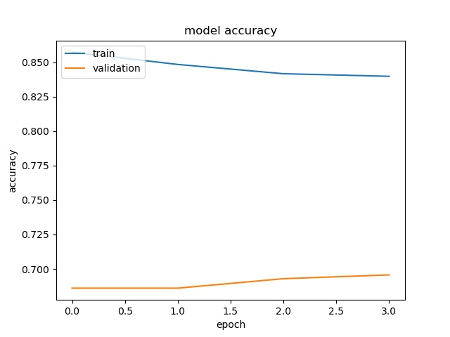
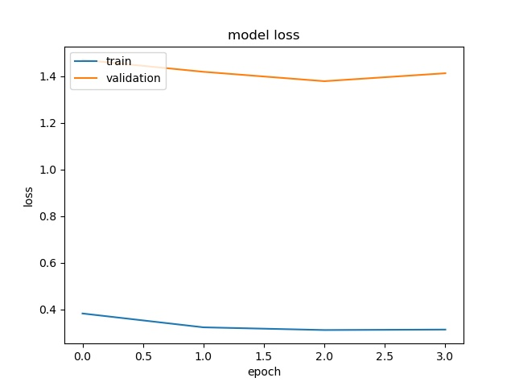
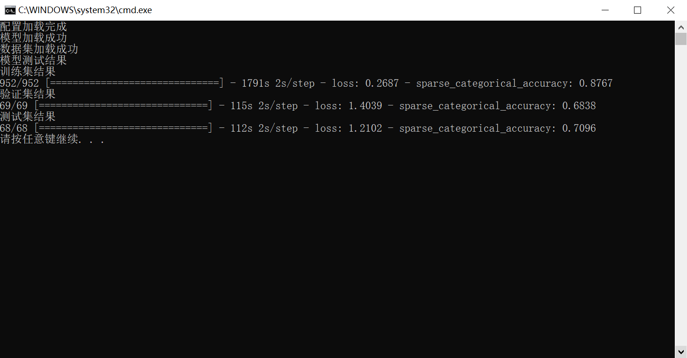

# 大作业

参考文献：李楚杨. 基于毫米波雷达的手势识别算法研究[D].电子科技大学,2020.DOI:10.27005/d.cnki.gdzku.2020.003496.

参考文献的第一章的内容为预备知识，包括 LFM 信号的特点，硬件配置等。

本次作业分为以下三个部分：

1. [Gesture_information](https://github.com/BeiYazi0/Gesture_information) 本部分主要实现参考文献的第二章——手势信号的获取及预处理。

2. [Gesture_recognition](https://github.com/BeiYazi0/Gesture_recognition) 本部分主要实现参考文献的第三章——结合注意力机制的 CNN 多维度特征融合识别算法。

3. [pcr_recognition](https://github.com/BeiYazi0/pcr_recognition) 对某二游角色进行识别，并将成果以插件形式搭载在 HoshinoBot 上。

其中 1、2 部分的原理可以参考[原理简笔](./基于毫米波雷达的手势识别算法研究原理简笔.pdf)。

## Gesture_information

本部分内容可阅读 [README](./Gesture_information/README.md)

预期效果所展示的图片即为下一部分我们用于训练神经网络的输入（当然是三张图压成一张，每张占据 RGB 的一个通道）。

本部分所使用到的毫米波雷达 AWR1642 和数据采集卡 DCA1000 来自于实验室老师暂借，非常感谢。

## Gesture_recognition

本部分内容可阅读 [README](./Gesture_recognition/README.md)

由于人手和时间有限，本部分只做验证，不会使用大量数据，数据集总量仅为 88，验证结果可见其 README。

## pcr_recognition

### pcr 角色识别

既然已经搭了一个神经网络，我们不妨拿它来做一些有趣的事情。

这里本人尝试使用该网络对二游[公主连结Re:Dive](https://game.bilibili.com/pcr/)的角色进行识别，包含 75 个角色。

模型数据集总量为 4w 左右，来源于某站，
由于包含过多不可描述的内容，因此数据集不予展示，
但从中遴选出部分图片置于  [pcr_img](pcr_recognition/res/pcr_img) 下用于实现插件功能。

实际的效果并不好，某次训练的情况如下。



以下是倒数 4 次训练的结果。





模型在训练集上依然欠拟合。

选用某次训练的结果，在训练集、验证集和测试集的表现情况如下。



### qq bot plugin

为了更方便与模型的交互，我们将以 QQ 机器人的形式呈现效果。

当然，我们不需要从零开始，相关的框架非常多，这里我们选择 [HoshinoBot](https://github.com/Ice9Coffee/HoshinoBot)，它是基于 nonebot 的开源Q群bot框架。

选择它并没有特殊的理由，主要是本人对这个框架较为熟悉，且为其编写过数个插件。

编写这个名为 pcr_recognition 的插件并没有太困难，因为 HoshinoBot 以 [go-cqhttp](https://github.com/Mrs4s/go-cqhttp) 作为无头客户端，因此我们需要查阅其[文档](https://docs.go-cqhttp.org/)来实现一些操作（如合并信息转发）。

预测部分代码如下。

```python
async def predict(url, model):
    content = await download(url)
    if not content:
        return []
    img = Image.open(io.BytesIO(content))
    img = img.convert("RGB")
    img = img.resize((224, 224))
    data = np.zeros((1,224, 224, 3), dtype = 'uint8')
    data[0] = np.array(img)
    pred_labels = model.predict(data)
    return pred_labels[0]
```

最终效果见 [README](./pcr_recognition/README.md) 中 princess connect 指令的测试效果，可以看到只需要发出指令并附上图片，hoshinobot就能够调用模型对其进行推理从而识别图中的角色。

## 备注

做到最后才发现，数据集的像素值忘了归一化，以后有机会再改吧。
