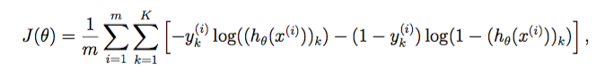
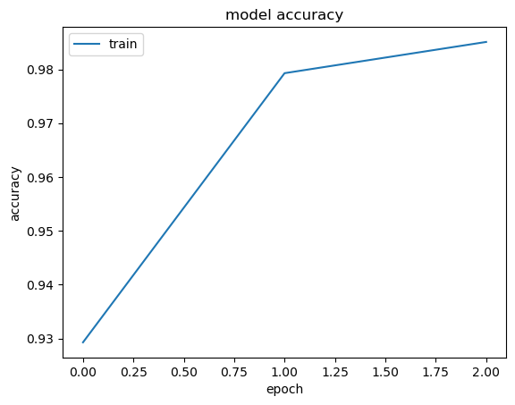
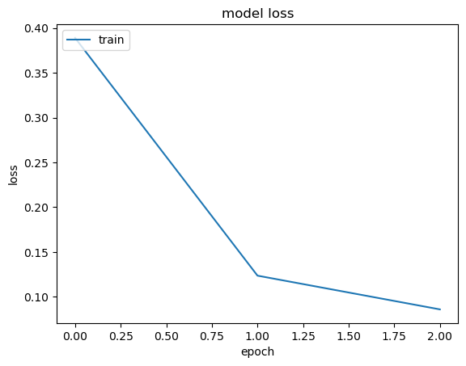
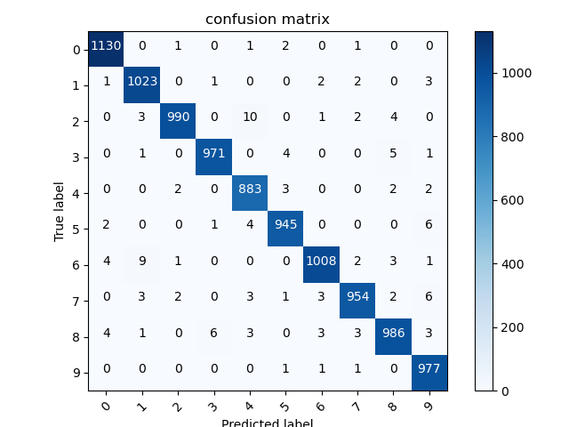

# CNN

直接运行 train.py 可训练一个用于手写数字识别的模型。
直接运行 test.py 可加载一个用于手写数字识别的模型。

# 目录

<ul class="toc-item"></ul></li><li><span><i class="fa fa-fw fa-caret-down"></i><a href="#1.要求" data-toc-modified-id="1.要求"><span class="toc-item-num">&nbsp;&nbsp;</span>1.要求</a></span><ul class="toc-item"><li><span><i class="fa fa-fw"></i><a href="#1.1模型" data-toc-modified-id="1.1模型"><span class="toc-item-num">&nbsp;&nbsp;</span>1.1模型</a></span></li><li><span><i class="fa fa-fw"></i><a href="#1.2要求" data-toc-modified-id="1.2要求"><span class="toc-item-num">&nbsp;&nbsp;</span>1.2要求</a></span></li></ul></li><li><span><i class="fa fa-fw fa-caret-down"></i><a href="#2.准备工作" data-toc-modified-id="2.准备工作"><span class="toc-item-num">&nbsp;&nbsp;</span>2.准备工作</a></span><ul class="toc-item"><li><span><i class="fa fa-fw"></i><a href="#2.1导入依赖。" data-toc-modified-id="2.1导入依赖"><span class="toc-item-num">&nbsp;&nbsp;</span>2.1导入依赖。</a></span></li><li><span><i class="fa fa-fw fa-caret-down"></i><a href="#2.2-MINST数据集" data-toc-modified-id="2.2-MINST数据集"><span class="toc-item-num">&nbsp;&nbsp;</span>2.2 MINST数据集</a></span><ul class="toc-item"><li><span><i class="fa fa-fw"></i><a href="#2.2.1-加载手写数字数据集" data-toc-modified-id="2.2.1-加载手写数字数据集"><span class="toc-item-num">&nbsp;&nbsp;</span>2.2.1 加载手写数字数据集</a></span></li><li><span><i class="fa fa-fw"></i><a href="#2.2.2-数据格式标准化" data-toc-modified-id="2.2.2-数据格式标准化"><span class="toc-item-num">&nbsp;&nbsp;</span>2.2.2 数据格式标准化</a></span></li></ul></li><li><span><i class="fa fa-fw fa-caret-down"></i><a href="#2.3-激活函数" data-toc-modified-id="2.3-激活函数"><span class="toc-item-num">&nbsp;&nbsp;</span>2.3 激活函数</a></span><ul class="toc-item"><li><span><i class="fa fa-fw"></i><a href="#2.3.1-ReLU-&amp;-Sigmoid-&amp;-Softmax" data-toc-modified-id="2.3.1-ReLU-&amp;-Sigmoid-&amp;-Softmax"><span class="toc-item-num">&nbsp;&nbsp;</span>2.3.1 ReLU &amp; Sigmoid &amp; Softmax</a></span></li><li><span><i class="fa fa-fw"></i><a href="#2.3.2-激活函数的梯度的函数" data-toc-modified-id="2.3.2-激活函数的梯度的函数"><span class="toc-item-num">&nbsp;&nbsp;</span>2.3.2 激活函数的梯度的函数</a></span></li></ul></li></ul></li><li><span><i class="fa fa-fw fa-caret-down"></i><a href="#3.CNN构成" data-toc-modified-id="3.CNN构成"><span class="toc-item-num">&nbsp;&nbsp;</span>3.CNN构成</a></span><ul class="toc-item"><li><span><i class="fa fa-fw"></i><a href="#3.1-卷积层" data-toc-modified-id="3.1-卷积层"><span class="toc-item-num">&nbsp;&nbsp;</span>3.1 卷积层</a></span></li><li><span><i class="fa fa-fw"></i><a href="#3.2-池化层" data-toc-modified-id="3.2-池化层"><span class="toc-item-num">&nbsp;&nbsp;</span>3.2 池化层</a></span></li><li><span><i class="fa fa-fw"></i><a href="#3.3-im2col" data-toc-modified-id="3.3-im2col"><span class="toc-item-num">&nbsp;&nbsp;</span>3.3 im2col</a></span></li><li><span><i class="fa fa-fw"></i><a href="#3.4-卷积和池化的高效实现" data-toc-modified-id="3.4-卷积和池化的高效实现"><span class="toc-item-num">&nbsp;&nbsp;</span>3.4 卷积和池化的高效实现</a></span></li></ul></li><li><span><i class="fa fa-fw fa-caret-down"></i><a href="#4.构建神经网络" data-toc-modified-id="4.构建神经网络"><span class="toc-item-num">&nbsp;&nbsp;</span>4.构建神经网络</a></span><ul class="toc-item"><li><span><i class="fa fa-fw"></i><a href="#4.1-前向传播" data-toc-modified-id="4.1-前向传播"><span class="toc-item-num">&nbsp;&nbsp;</span>4.1 前向传播</a></span></li><li><span><i class="fa fa-fw fa-caret-down"></i><a href="#4.2-反向传播" data-toc-modified-id="4.2-反向传播"><span class="toc-item-num">&nbsp;&nbsp;</span>4.2 反向传播</a></span><ul class="toc-item"><li><span><i class="fa fa-fw"></i><a href="#4.2.1-卷积层的反向传播" data-toc-modified-id="4.2.1-卷积层的反向传播"><span class="toc-item-num">&nbsp;&nbsp;</span>4.2.1 卷积层的反向传播</a></span></li><li><span><i class="fa fa-fw"></i><a href="#4.2.2-池化层的反向传播" data-toc-modified-id="4.2.2-池化层的反向传播"><span class="toc-item-num">&nbsp;&nbsp;</span>4.2.2 池化层的反向传播</a></span></li><li><span><i class="fa fa-fw"></i><a href="#4.2.3-flatten-层的反向" data-toc-modified-id="4.2.3-flatten-层的反向"><span class="toc-item-num">&nbsp;&nbsp;</span>4.2.3 flatten 层的反向</a></span></li><li><span><i class="fa fa-fw"></i><a href="#4.2.4-隐层的反向传播" data-toc-modified-id="4.2.4-隐层的反向传播"><span class="toc-item-num">&nbsp;&nbsp;</span>4.2.4 隐层的反向传播</a></span></li></ul></li><li><span><i class="fa fa-fw"></i><a href="#4.3-损失函数" data-toc-modified-id="4.3-损失函数"><span class="toc-item-num">&nbsp;&nbsp;</span>4.3 损失函数</a></span></li><li><span><i class="fa fa-fw"></i><a href="#4.4-层类" data-toc-modified-id="4.4-层类"><span class="toc-item-num">&nbsp;&nbsp;</span>4.4 层类</a></span></li><li><span><i class="fa fa-fw"></i><a href="#4.5-model" data-toc-modified-id="4.5-model"><span class="toc-item-num">&nbsp;&nbsp;</span>4.5 model</a></span></li><li><span><i class="fa fa-fw fa-caret-down"></i><a href="#4.6-模型保存和加载" data-toc-modified-id="4.6-模型保存和加载"><span class="toc-item-num">&nbsp;&nbsp;</span>4.6 模型保存和加载</a></span><ul class="toc-item"><li><span><i class="fa fa-fw"></i><a href="#4.6.1-模型保存" data-toc-modified-id="4.6.1-模型保存"><span class="toc-item-num">&nbsp;&nbsp;</span>4.6.1 模型保存</a></span></li><li><span><i class="fa fa-fw"></i><a href="#4.6.2-模型加载" data-toc-modified-id="4.6.2-模型加载"><span class="toc-item-num">&nbsp;&nbsp;</span>4.6.2 模型加载</a></span></li></ul></li><li><span><i class="fa fa-fw fa-caret-down"></i><a href="#4.7-可视化" data-toc-modified-id="4.7-可视化"><span class="toc-item-num">&nbsp;&nbsp;</span>4.7 可视化</a></span><ul class="toc-item"><li><span><i class="fa fa-fw"></i><a href="#4.7.1-accuracy-&amp;-loss-可视化" data-toc-modified-id="4.7.1-accuracy-&amp;-loss-可视化"><span class="toc-item-num">&nbsp;&nbsp;</span>4.7.1 accuracy &amp; loss 可视化</a></span></li><li><span><i class="fa fa-fw"></i><a href="#4.7.2-混淆矩阵可视化" data-toc-modified-id="4.7.2-混淆矩阵可视化"><span class="toc-item-num">&nbsp;&nbsp;</span>4.7.2 混淆矩阵可视化</a></span></li></ul></li><li><span><i class="fa fa-fw"></i><a href="#4.8-测试" data-toc-modified-id="4.8-测试"><span class="toc-item-num">&nbsp;&nbsp;</span>4.8 测试</a></span></li></ul></li><li><span><i class="fa fa-fw"></i><a href="#5.手写数字识别" data-toc-modified-id="5.手写数字识别"><span class="toc-item-num">&nbsp;&nbsp;</span>5.手写数字识别</a></span></li></ul>

---

## 1.要求

### 1.1模型


### 1.2要求


---

## 2.准备工作

### 2.1导入依赖。


```python
import numpy as np
import matplotlib.pyplot as plt
from scipy.io import loadmat
from scipy.signal import convolve2d
```

### 2.2 MINST数据集

#### 2.2.1 加载手写数字数据集

可以看到手写数据集由 X_Train, X_Test, D_Train 和 D_Test构成。

由于 D 标签已经是 one-hot 编码，因此不需要再进行编码。

X 的样本原本是像素值在 0-255 间的灰度图，现已经将像素值归一化，其值在 0-1 之间。


```python
data = loadmat('data/MNISTData.mat')
data
```


    {'__header__': b'MATLAB 5.0 MAT-file, Platform: PCWIN64, Created on: Tue Nov 06 15:16:32 2018',
     '__version__': '1.0',
     '__globals__': [],
     'D_Train': array([[0, 0, 0, ..., 0, 0, 0],
            [0, 0, 0, ..., 0, 0, 0],
            [0, 0, 0, ..., 0, 0, 0],
            ...,
            [0, 0, 0, ..., 0, 0, 1],
            [0, 0, 0, ..., 0, 0, 0],
            [0, 1, 0, ..., 0, 0, 0]], dtype=uint8),
     'D_Test': array([[0, 0, 1, ..., 0, 0, 0],
            [0, 1, 0, ..., 0, 0, 0],
            [0, 0, 0, ..., 0, 0, 0],
            ...,
            [0, 0, 0, ..., 0, 0, 0],
            [0, 0, 0, ..., 0, 0, 0],
            [0, 0, 0, ..., 0, 0, 0]], dtype=uint8),
     'X_Train': array([[[0., 0., 0., ..., 0., 0., 0.],
             [0., 0., 0., ..., 0., 0., 0.],
             [0., 0., 0., ..., 0., 0., 0.],
             ...,
             [0., 0., 0., ..., 0., 0., 0.],
             [0., 0., 0., ..., 0., 0., 0.],
             [0., 0., 0., ..., 0., 0., 0.]],
     
            [[0., 0., 0., ..., 0., 0., 0.],
             [0., 0., 0., ..., 0., 0., 0.],
             [0., 0., 0., ..., 0., 0., 0.],
             ...,
             [0., 0., 0., ..., 0., 0., 0.],
             [0., 0., 0., ..., 0., 0., 0.],
             [0., 0., 0., ..., 0., 0., 0.]],
     
            [[0., 0., 0., ..., 0., 0., 0.],
             [0., 0., 0., ..., 0., 0., 0.],
             [0., 0., 0., ..., 0., 0., 0.],
             ...,
             [0., 0., 0., ..., 0., 0., 0.],
             [0., 0., 0., ..., 0., 0., 0.],
             [0., 0., 0., ..., 0., 0., 0.]],
     
            ...,
     
            [[0., 0., 0., ..., 0., 0., 0.],
             [0., 0., 0., ..., 0., 0., 0.],
             [0., 0., 0., ..., 0., 0., 0.],
             ...,
             [0., 0., 0., ..., 0., 0., 0.],
             [0., 0., 0., ..., 0., 0., 0.],
             [0., 0., 0., ..., 0., 0., 0.]],
     
            [[0., 0., 0., ..., 0., 0., 0.],
             [0., 0., 0., ..., 0., 0., 0.],
             [0., 0., 0., ..., 0., 0., 0.],
             ...,
             [0., 0., 0., ..., 0., 0., 0.],
             [0., 0., 0., ..., 0., 0., 0.],
             [0., 0., 0., ..., 0., 0., 0.]],
     
            [[0., 0., 0., ..., 0., 0., 0.],
             [0., 0., 0., ..., 0., 0., 0.],
             [0., 0., 0., ..., 0., 0., 0.],
             ...,
             [0., 0., 0., ..., 0., 0., 0.],
             [0., 0., 0., ..., 0., 0., 0.],
             [0., 0., 0., ..., 0., 0., 0.]]]),
     'X_Test': array([[[0., 0., 0., ..., 0., 0., 0.],
             [0., 0., 0., ..., 0., 0., 0.],
             [0., 0., 0., ..., 0., 0., 0.],
             ...,
             [0., 0., 0., ..., 0., 0., 0.],
             [0., 0., 0., ..., 0., 0., 0.],
             [0., 0., 0., ..., 0., 0., 0.]],
     
            [[0., 0., 0., ..., 0., 0., 0.],
             [0., 0., 0., ..., 0., 0., 0.],
             [0., 0., 0., ..., 0., 0., 0.],
             ...,
             [0., 0., 0., ..., 0., 0., 0.],
             [0., 0., 0., ..., 0., 0., 0.],
             [0., 0., 0., ..., 0., 0., 0.]],
     
            [[0., 0., 0., ..., 0., 0., 0.],
             [0., 0., 0., ..., 0., 0., 0.],
             [0., 0., 0., ..., 0., 0., 0.],
             ...,
             [0., 0., 0., ..., 0., 0., 0.],
             [0., 0., 0., ..., 0., 0., 0.],
             [0., 0., 0., ..., 0., 0., 0.]],
     
            ...,
     
            [[0., 0., 0., ..., 0., 0., 0.],
             [0., 0., 0., ..., 0., 0., 0.],
             [0., 0., 0., ..., 0., 0., 0.],
             ...,
             [0., 0., 0., ..., 0., 0., 0.],
             [0., 0., 0., ..., 0., 0., 0.],
             [0., 0., 0., ..., 0., 0., 0.]],
     
            [[0., 0., 0., ..., 0., 0., 0.],
             [0., 0., 0., ..., 0., 0., 0.],
             [0., 0., 0., ..., 0., 0., 0.],
             ...,
             [0., 0., 0., ..., 0., 0., 0.],
             [0., 0., 0., ..., 0., 0., 0.],
             [0., 0., 0., ..., 0., 0., 0.]],
     
            [[0., 0., 0., ..., 0., 0., 0.],
             [0., 0., 0., ..., 0., 0., 0.],
             [0., 0., 0., ..., 0., 0., 0.],
             ...,
             [0., 0., 0., ..., 0., 0., 0.],
             [0., 0., 0., ..., 0., 0., 0.],
             [0., 0., 0., ..., 0., 0., 0.]]])}


由于我们以后需要这些（并将经常使用它们），我们先来创建一些有用的变量。


```python
X_train = data['X_Train']
X_test = data['X_Test']
y_train = data['D_Train'].astype(np.int32)
y_test = data['D_Test'].astype(np.int32)

X_train.shape, y_train.shape, X_test.shape, y_test.shape #看下维度
```


    ((28, 28, 60000), (10, 60000), (28, 28, 10000), (10, 10000))


#### 2.2.2 数据格式标准化

输入shape形式: 样本数、图像通道数、图像高度、图像宽度

输出shape形式: 样本数、输出神经元数


```python
X_train = np.expand_dims(X_train.transpose(2,0,1), axis=1)
X_test = np.expand_dims(X_test.transpose(2,0,1), axis=1)
y_train = y_train.T
y_test = y_test.T

X_train.shape, y_train.shape, X_test.shape, y_test.shape #看下维度
```


    ((60000, 1, 28, 28), (60000, 10), (10000, 1, 28, 28), (10000, 10))


### 2.3 激活函数

见 [activate](cnn/activations/activate_fcn.py)

#### 2.3.1 ReLU & Sigmoid & Softmax


```python
def ReLU(z):
    '''
    ReLU 函数
    Args:
        z (m, n): 输入
    Returns:
        g (m, n): ReLU 函数输出
    '''
    return np.maximum(0, z)

def sigmoid(z):
    '''
    sigmoid 函数
    Args:
        z (m, n): 输入
    Returns:
        g (m, n): sigmoid 函数输出
    '''
    d = 1 + np.exp(-z)
    return 1. / d

def softmax(z):
    '''
    softmax 函数
    Args:
        z (m, n): 输入
    Returns:
        g (m, n): softmax 函数输出
    '''
    d = np.exp(z)
    # 注意 d sum时的axis
    return d / d.sum(axis = 1).reshape(-1, 1)
```

#### 2.3.2 激活函数的梯度的函数


```python
def ReLU_gradient(z):
    return z > 0

def sigmoid_gradient(z):
    return np.multiply(sigmoid(z), (1 - sigmoid(z)))

def softmax_gradient(z):
    return np.multiply(softmax(z), (1 - softmax(z)))
```

---

## 3.CNN构成

### 3.1 卷积层

卷积层的实现原理如图所示，由于较为简单，这里就不再赘述了。


首先尝试使用 scipy.signal.convolve2d 实现二维卷积。

注意 convolve2d 会将卷积核翻转（上下、左右颠倒），因此我们预先翻转卷积核以避免。

见 [conv_standard](cnn/utils/standard.py)


```python
def conv(x, kernel, padding = 0):
    '''
    卷积
    Args:
        x (N, C, H, W): 输入
        kernel (out_k, C, kH, kW): 卷积核
        padding int: 模式——0：valid; 1: same; 2: full.
    Returns:
        z (N, out_k, out_h, out_w): 卷积结果
    '''
    mode = ["valid", "same", "full"]
    mode = mode[padding]
    
    # 根据模式进行填充
    p = padding
    x_padded = np.pad(x, ((0, 0), (0, 0), (p, p), (p, p)), mode = "constant")
    
    # 确定输出的大小
    N, C, H, W = x.shape
    out_k, C, kH, kW = kernel.shape
    out_h = (H + 2 * padding - kH) + 1
    out_w = (W + 2 * padding - kW) + 1
    
    # 卷积实现
    z = np.zeros((N, out_k, out_h, out_w))
    for i in range(N):
        for j in range(out_k):
            for ci in range(C):
                z[i, j] += convolve2d(x[i, ci], kernel[j, ci, ::-1, ::-1], 
                                      boundary = 'fill', mode = mode, fillvalue = 0)
    return z
```

### 3.2 池化层

池化分为最大池化和平均池化，它们的实现原理如图所示，由于较为简单，这里就不再赘述了。

最大池化需要在进行前向传播时记录下最大值神经元的Max_ID位置，详细理由将在反向传播部分论述。

见 [pool_standard](cnn/utils/standard.py)


```python
def average_pool(x, kernel_shape):
    '''
    平均池化
    Args:
        x (N, C, H, W): 输入
        kernel_shape tuple(int): 池化层参数
    Returns:
        z (N, C, out_h, out_w): 池化结果
    '''
    # 确定输出的大小
    N, C, H, W = x.shape
    kH, kW = kernel_shape
    out_h = H // kH
    out_w = W // kW
    
    # 平均池化
    z = np.zeros((N, C, out_h, out_w))
    for i in range(kH):
        for j in range(kW):
            z += x[:, :, i::kH, j::kW]
    
    return z/(kH * kW)

def max_pool(x, kernel_shape):
    '''
    最大池化
    Args:
        x (N, C, H, W): 输入
        kernel_shape tuple(int): 池化层参数
    Returns:
        z (N, C, out_h, out_w): 池化结果
        max_id (N, C, out_h, out_w): 最大值神经元的 Max_ID位置
    '''
    # 确定输出的大小
    N, C, H, W = x.shape
    kH, kW = kernel_shape
    out_h = H // kH
    out_w = W // kW
    
    # 最大池化
    z = np.zeros((N, C, out_h, out_w))
    max_id = np.zeros((N, C, out_h, out_w))
    for i in range(kH):
        for j in range(kW):
            target = x[:, :, i::kH, j::kW]
            mask = target > z
            max_id = max_id * (~mask) + mask * (i * kH + j)
            z = z * (~mask) + mask * target
    
    return z, max_id

def pool(x, kernel_shape, mode = 0):
    '''
    池化
    Args:
        x (N, C, H, W): 输入
        kernel_shape tuple(int): 池化层参数
        mode int: 0-平均池化; 1-最大池化
    Returns:
        z (N, C, out_h, out_w): 池化结果
    '''
    if mode == 0:
        return average_pool(x, kernel_shape)
    else:
        return max_pool(x, kernel_shape)
```

### 3.3 im2col

本部分参考[深度学习入门-卷积神经网络（三）实现](https://zhuanlan.zhihu.com/p/259806556)。

CNN中处理的是4维数据，因此卷积运算的实现看上去会很复杂，但是通过使用下面要介绍的 im2col （image to column）这个技巧，问题就会变得很简单。

im2col 是一个函数，将输入数据展开以适合滤波器（权重）。如图所示，对3维的输入数据应用 im2col 后，数据转换为2维矩阵。


为了便于观察，将步幅设置得很大，以使滤波器的应用区域不重叠。而在实际的卷积运算中，滤波器的应用区域几乎都是重叠的。在滤波器的应用区域重叠的情况下，使用 im2col 展开后，展开后的元素个数会多于原方块的元素个数。因此，使用 im2col 的实现存在比普通的实现消耗更多内存的缺点。

使用 im2col 展开输入数据后，之后就只需将卷积层的滤波器（权重）纵向展开为1列，并计算2个矩阵的乘积即可。


池化层的实现和卷积层相同，都使用 im2col 展开输入数据。不过，池化的情况下，在通道方向上是独立的，这一点和卷积层不同。具体地讲，如图所示，池化的应用区域按通道单独展开。


对于最大池化，展开之后，只需对展开的矩阵求各行的最大值，并转换为合适的形状即可。


对于平均池化，展开之后，只需对展开的矩阵求各行的平均值，并转换为合适的形状即可。

见 [im2col](cnn/utils/im2col.py)


```python
def get_im2col_indices(x_shape, field_height, field_width, padding=0, stride=1):
    '''
    im2col 的高效实现
    Args:
        x_shape tuple(int): 样本数、图像通道数、图像高度、图像宽度
        field_height int: 卷积核高
        field_width int: 卷积核宽
        padding int: 模式——0：valid; 1: same; 2: full.
        stride int: 步长
    Returns:
        tuple((field_height*field_width*C, 1),
        (field_height*field_width*C, out_height*out_width),
        (field_height*field_width*C, out_height*out_width)): 索引
    '''
    N, C, H, W = x_shape
    
    # 卷积输出的大小
    out_height = (H + 2 * padding - field_height) // stride + 1
    out_width = (W + 2 * padding - field_width) // stride + 1

    ## 生成行索引
    # 卷积核框住区域中，所有元素的行索引相对被框住区域左上角元素的偏移量（从左到右，从上到下）
    i0 = np.repeat(np.arange(field_height), field_width) 
    # 复制i0，次数为通道数
    i0 = np.tile(i0, C)
    # 卷积运算时，每个框选区域的左上角元素的行索引
    i1 = stride * np.repeat(np.arange(out_height), out_width)
    
    ## 生成列索引
    # 卷积核框住区域中，所有元素的列索引相对被框住区域左上角元素的偏移量（从左到右，从上到下）， 复制C次
    j0 = np.tile(np.arange(field_width), field_height * C)
    # 卷积运算时，每个框选区域的左上角元素的列索引
    j1 = stride * np.tile(np.arange(out_width), out_height)
    
    ## 生成行列的二维索引
    i = i0.reshape(-1, 1) + i1.reshape(1, -1) # i[m, :]表示参加第m次卷积运算的所有元素的行索引
    j = j0.reshape(-1, 1) + j1.reshape(1, -1) # j[m, :]表示参加第m次卷积运算的所有元素的列索引

    ## 生成通道数索引
    # 卷积核框住区域中，所有元素的通道数索引相对被框住区域左上角元素的偏移量（从左到右，从上到下，从通道0到C）
    k = np.repeat(np.arange(C), field_height * field_width).reshape(-1, 1)

    return (k, i, j)


def im2col_indices(x, field_height, field_width, padding=0, stride=1):
    '''
    im2col
    Args:
        x (N, C, H, W): 输入
        field_height int: 卷积核高
        field_width int: 卷积核宽
        padding int: 模式——0：valid; 1: same; 2: full.
        stride int: 步长
    Returns:
        cols (field_height*field_width*C, out_height*out_width*N): 与卷积核相乘实现卷积的的矩阵
    '''
    # 根据模式进行填充
    p = padding
    x_padded = np.pad(x, ((0, 0), (0, 0), (p, p), (p, p)), mode="constant")

    # 获取cols对应的索引值
    k, i, j = get_im2col_indices(x.shape, field_height, field_width, padding, stride)

    cols = x_padded[:, k, i, j]
    C = x.shape[1]
    # 满足 W.T @ cols = output
    return cols.transpose(1, 0, 2).reshape(field_height * field_width * C, -1)

def col2im_indices(cols, x_shape, field_height=3, field_width=3, padding=0, stride=1):
    '''
    col2im，将 col 还原
    Args:
        cols (field_height*field_width*C, out_height*out_width*N): 与卷积核相乘实现卷积的的矩阵
        x_shape tuple(int): 样本数、图像通道数、图像高度、图像宽度
        field_height int: 卷积核高
        field_width int: 卷积核宽
        padding int: 模式——0：valid; 1: same; 2: full.
        stride int: 步长
    Returns:
        x (N, C, H_padded, W_padded): 原输入
    '''
    
    N, C, H, W = x_shape
    H_padded, W_padded = H + 2 * padding, W + 2 * padding
    x_padded = np.zeros((N, C, H_padded, W_padded), dtype=cols.dtype)
    
    # 获取cols对应的索引值
    k, i, j = get_im2col_indices(x_shape, field_height, field_width, padding, stride)
    cols_reshaped = cols.reshape(C * field_height * field_width, -1, N)
    cols_reshaped = cols_reshaped.transpose(2, 0, 1)
    np.add.at(x_padded, (slice(None), k, i, j), cols_reshaped)
    
    if padding == 0:
        return x_padded
    return x_padded[:, :, padding:-padding, padding:-padding]
```

### 3.4 卷积和池化的高效实现

首先实现 im2col 下的卷积和池化。


```python
def conv_im2col(x, kernel, padding = 0, stride=1):
    '''
    卷积的高效实现
    Args:
        x (N, C, H, W): 输入
        kernel (out_k, C, kH, kW): 卷积核
        padding int: 模式——0：valid; 1: same; 2: full.
        stride int: 步长
    Returns:
        z (N, out_k, out_h, out_w): 卷积结果
    '''
    N, C, H, W = x.shape
    out_k, C, kH, kW = kernel.shape
    out_h = (H + 2 * padding - kH) // stride + 1
    out_w = (W + 2 * padding - kW) // stride + 1
    
    # im2col
    x_col = im2col_indices(x, kH, kW, padding, stride)
    kernel_col = kernel.reshape(out_k, -1)
    
    # 卷积实现
    z = kernel_col @ x_col
    
    return z.reshape(out_k, N, out_h, out_w).transpose(1, 0, 2, 3)


def average_pool_im2col(x, kernel_shape):
    '''
    平均池化的高效实现
    Args:
        x (N, C, H, W): 输入
        kernel (kH, kW): 池化核 (kH == KW)
    Returns:
        z (N, out_k, out_h, out_w): 卷积结果
    '''
    N, C, H, W = x.shape
    kH, kW = kernel_shape
    stride = kH
    out_h = H // stride
    out_w = W // stride
    
    # im2col
    x_col = im2col_indices(x, kH, kW, 0, stride).reshape(C, kH*kW, -1)
    
    # 平均池化
    z = x_col.mean(axis = 1)
    
    return z.reshape(C, N, out_h, out_w).transpose(1, 0, 2, 3)

def max_pool_im2col(x, kernel_shape):
    '''
    最大池化的高效实现
    Args:
        x (N, C, H, W): 输入
        kernel (kH, kW): 池化核 (kH == KW)
    Returns:
        z (N, out_k, out_h, out_w): 卷积结果
        max_id (N, C, out_h, out_w): 最大值神经元的 Max_ID位置
    '''
    N, C, H, W = x.shape
    kH, kW = kernel_shape
    stride = kH
    out_h = H // stride
    out_w = W // stride
    
    # im2col
    x_col = im2col_indices(x, kH, kW, 0, stride).reshape(C, kH*kW, -1)
    
    # 最大池化
    max_id = x_col.argmax(axis = 1)
    z = x_col.max(axis = 1)
    
    return z.reshape(C, N, out_h, out_w).transpose(1, 0, 2, 3), max_id.reshape(C, N, out_h, out_w).transpose(1, 0, 2, 3)

def pool_im2col(x, kernel_shape, mode = 0):
    '''
    池化的高效实现
    Args:
        x (N, C, H, W): 输入
        kernel_shape tuple(int): 池化层参数
        mode int: 0-平均池化; 1-最大池化
    Returns:
        z (N, C, out_h, out_w): 池化结果
    '''
    if mode == 0:
        return average_pool_im2col(x, kernel_shape)
    else:
        return max_pool_im2col(x, kernel_shape)
```

下面的测试中，我们将证明应用 im2col 后，得到的结果是正确的（两个 array 各元素误差之和极其小）。

测试的数据为 X_train 的前 100 个样本。


```python
# 生成卷积核
kernel = np.random.randn(20, 1, 9, 9)

# 卷积输出
test = conv(X_train[:100], kernel)

# 使用 im2col 实现卷积
test_im2col = conv_im2col(X_train[:100], kernel, padding=0, stride=1)

# 总误差
print(f"卷积输出error: {np.sum(test-test_im2col)}")

# 平均池化
test = pool(X_train[:100], (2,2), mode = 0)
test_im2col = pool_im2col(X_train[:100], (2,2), mode = 0)
print(f"平均池化error: {np.sum(test-test_im2col)}")

# 最大池化
test = pool(X_train[:100], (2,2), mode = 1)
test_im2col = pool_im2col(X_train[:100], (2,2), mode = 1)
print(f"最大池化error: {np.sum(test[0]-test_im2col[0])}\n最大池化id error: {np.sum(test[1]-test_im2col[1])}")
```

    卷积输出error: 5.064037844319954e-12
    平均池化error: 0.0
    最大池化error: 0.0
    最大池化id error: 0.0
    

接下来，我们需要比较两者的运行性能。

测试的数据为 X_train 的前 100 个样本。


```python
%timeit conv(X_train[:100], kernel)

%timeit conv_im2col(X_train[:100], kernel, padding=0, stride=1)
```

    169 ms ± 1.47 ms per loop (mean ± std. dev. of 7 runs, 10 loops each)
    22.3 ms ± 1.7 ms per loop (mean ± std. dev. of 7 runs, 10 loops each)
    


```python
%timeit pool(X_train[:1000], (14,14), mode = 0)

%timeit pool_im2col(X_train[:1000], (14,14), mode = 0)
```

    4.33 ms ± 412 µs per loop (mean ± std. dev. of 7 runs, 100 loops each)
    8.69 ms ± 92.5 µs per loop (mean ± std. dev. of 7 runs, 100 loops each)
    


```python
%timeit pool(X_train[:100], (14,14), mode = 1)

%timeit pool_im2col(X_train[:100], (14,14), mode = 1)
```

    2.64 ms ± 47.6 µs per loop (mean ± std. dev. of 7 runs, 100 loops each)
    842 µs ± 7.8 µs per loop (mean ± std. dev. of 7 runs, 1000 loops each)
    

可以看到，在 100 个样本的情况下，conv_im2col 的耗时约为 conv 的 1/7。这说明卷积运算的计算量较大，使用 im2col 可以将卷积运算转化为计算量相对较小的矩阵乘法。

然而， average_pool_im2col 耗时却大于 average_pool， 这是因为 im2col 以及将结果 reshape 都需要一定的开销，池化的计算量较小，使用 im2col 技巧并不显得高效，反而增加了耗时。

当池化核较大时，max_pool_im2col 耗时远低于 max_pool，这是因为对于 col 来说获取 max_id 的运算更为简单。

---

## 4.构建神经网络

### 4.1 前向传播

偏置 b = 0。

前面已经实现了卷积层和池化层的前向传播， 接下来我们将实现 flatten 层和 hidden 层的前向传播。

flatten层用来将输入“压平”，即把多维的输入一维化，常用在从卷积层到全连接层的过渡。flatten不影响batch的大小。


```python
def flatten_forward(x):
    '''
    flatten 
    Args:
        x (N, C, H, W): 输入
    Returns:
        z (N, C*H*W): flatten 输出
    '''
    N = x.shape[0]
    return x.reshape(N, -1)

def hidden_forward(x, theta, activate_fcn):
    '''
    hidden
    Args:
        x (m, n): m 个样本，n个特征
        theta (t, n): t 个输出神经元，n个输入神经元
        activate_fcn method: 激活函数
    Returns:
        z (m, t): 输出
        a (m, t): 激活输出
    '''
    z = x @ theta.T
    a = activate_fcn(z)
    
    return z, a
```

### 4.2 反向传播

#### 4.2.1 卷积层的反向传播

更新卷积层的系数。

[png](./img/conv_bp.png)

梯度穿越卷积层

[png](./img/conv_bp2.png)


```python
def conv_bp(x, z, error, kernel, activate_fcn_gradient):
    '''
    卷积层系数更新和反向传播
    Args:
        x (N, C, H, W): 正向传播中卷积层的输入
        z (N, out_k, out_h, out_w): 正向传播中卷积层的输出
        error (N, out_k, out_h, out_w): 从下一层反向传播而来的误差
        kernel (out_k, C, KH, KW): 卷积核
        activate_fcn_gradient method: 激活函数的梯度函数
        bp_flag boolean: 是否执行反向传播
    Returns:
        grad (out_k, C, KH, KW): 卷积层系数的梯度
        error_bp (N, C, H, W): 卷积层向上一层反向传播的误差
    '''
    N, C, H, W = x.shape
    
    # 计算delta
    delta = np.multiply(error, activate_fcn_gradient(z))
    
    # 计算 grad
    grad = conv_im2col(x.transpose(1, 0, 2, 3), 
                       delta.transpose(1, 0, 2, 3)).transpose(1, 0, 2, 3) / N
    
    # 反向传播
    error_bp = conv_im2col(delta, kernel.transpose(1, 0, 2, 3), padding = kernel.shape[-1]-1)
    
    return grad, error_bp
```

测试

可以看到，卷积层反向传播的梯度和误差完全正确。


```python
from cnn.utils.standard import conv_bp_standard
conv_bp_standard??
```


```python
kernel = np.random.randn(2, 3, 9, 9)
x = np.random.randn(10, 3, 28, 28)
z = conv_im2col(x, kernel)
error = np.random.randn(10, 2, 20, 20)

grad, error_bp = conv_bp_standard(x, z, error, kernel, ReLU_gradient)
test_bp = conv_bp(x, z, error, kernel, ReLU_gradient)

print(f"grad error: {np.sum(grad - test_bp[0])}")
print(f"error_bp error: {np.sum(error_bp - test_bp[1])}")
```

    grad error: 7.305636130772175e-14
    error_bp error: 4.794602215252297e-14
    

#### 4.2.2 池化层的反向传播

由于池化层的系数无需变化，因此只需要将误差反向传播即可。

对于平均池化，其前向传播是取某特征区域的平均值进行输出，这个区域的每一个神经元都是有参与前向传播了的，因此，在反向传播时，框架需要将梯度平均分配给每一个神经元再进行反向传播。

对于最大池化，其前向传播是取某特征区域的最大值进行输出，这个区域仅有最大值神经元参与了前向传播，因此，在反向传播时，框架仅需要将该区域的梯度直接分配到最大值神经元即可，其他神经元的梯度被分配为0且是被舍弃不参与反向传播的，但如何确认最大值神经元，这个还得框架在进行前向传播时记录下最大值神经元的 Max_ID 位置，这是最大池化与平均池化差异的地方。


```python
def average_pool_backward(error, kernel_shape):
    '''
    平均池化的反向传播
    Args:
        error (N, out_k, out_h, out_w): 从下一层反向传播来的误差
        kernel_shape tuple(int): 池化核 (kH == KW)
    Returns:
        error_bp (N, out_k, KH * out_h, KW * out_w): 向上一层反向传播的误差
    '''
    KH, KW = kernel_shape
    # delta = error
    return error.repeat(KH, axis = -2).repeat(KW, axis = -1) / (KH * KW)

def max_pool_backward(error, max_id, kernel_shape):
    '''
    最大池化的反向传播
    Args:
        error (N, out_k, out_h, out_w): 从下一层反向传播来的误差
        max_id (N, out_k, out_h, out_w): 最大值神经元的 Max_ID 位置
        kernel_shape tuple(int): 池化核 (kH == KW)
    Returns:
        error_bp (N, out_k, KH * out_h, KW * out_w): 向上一层反向传播的误差
    '''
    N, out_k, out_h, out_w = error.shape
    KH, KW = kernel_shape

    ## 使用 mask 使得扩展后的 max_id 只有在索引位置和值相对应时为 True
    max_id = max_id.repeat(KH, axis = -2).repeat(KW, axis = -1)
    mask = np.tile(np.arange(KH * KW).reshape(KH, KW), [out_h, out_w])
    
    # delta = error
    return error.repeat(KH, axis = -2).repeat(KW, axis = -1) * (max_id == mask)
```

测试

由于平均池化的反向传播较为简单，这里仅测试最大池化的反向传播。


```python
error = np.random.randn(3, 3, 8, 8)
max_id = np.random.randint(0, 4, (3, 3, 8, 8))
test = np.zeros((3, 3, 16, 16))
for i in range(3):
    for j in range(3):
        row = max_id[i, j] // 2 + np.arange(8).reshape(-1, 1) * 2
        col = max_id[i, j] % 2 + np.arange(8).reshape(1, -1) * 2
        test[i, j, row, col] = error[i, j]
test_bp = max_pool_backward(error, max_id, (2, 2))
print(f"max_pool error: {np.sum(test - test_bp)}")
```

    max_pool error: 0.0
    

#### 4.2.3 flatten 层的反向

将 error 恢复为输入 flatten 层前的形状。


```python
def flatten_backford(error, input_shape):
    '''
    flatten reverse
    Args:
        error (N, -1): 从下一层反向传播来的误差
        input_shape (C, H, W): 输入 flatten 层前的形状
    Returns:
        error_bp (N, C, H, W): 向上一次反向传播的误差
    '''
    C, H, W = input_shape
    
    return error.reshape((error.shape[0], C, H, W))
```

测试


```python
x = np.random.randn(10, 3, 5, 5)
test = flatten_backford(flatten_forward(x), x.shape[1:])
print(f"flatten_backford error: {np.sum(x - test)}")
```

    flatten_backford error: 0.0
    

#### 4.2.4 隐层的反向传播

该部分较为简单，已经在前面的练习中实现，不再赘述。


```python
def hidden_backward(z, a, error, theta, activate_fcn_gradient, outflag = False):
    '''
    隐层系数更新和反向传播
    Args:
        z (m, t): 正向传播中隐层的输出
        a (m, n): 正向传播中隐层的输入
        error (m, t): 从下一层反向传播而来的误差
        theta (t, n): 参数矩阵
        activate_fcn_gradient method: 激活函数的梯度函数
        outflag boolean: 是否是输出层
    Returns:
        grad (n, t): 隐层系数的梯度
        error_bp (m, n): 隐层向上一层反向传播的误差
    '''
    m = z.shape[0]
    
    # 计算delta
    if outflag: # 交叉熵 + softmax
        delta = error
    else:
        delta = np.multiply(error, activate_fcn_gradient(z))
    
    # 计算 grad
    grad = delta.T @ a 
    
    # 反向传播
    error_bp = delta @ theta
    
    return grad, error_bp
```

### 4.3 损失函数

详见 [loss](cnn/losses/loss.py)

交叉熵损失




```python
def cross_tropy(h, y):
    '''
    交叉熵代价函数
    Args:
        h (m, k): 输出
        y (m, k): 真实值, k个类别
    Returns:
        cost float: 代价
    '''
    m = y.shape[0]
    
    # compute the cost
    J = np.multiply(-y, np.log(h)) - np.multiply((1 - y), np.log(1 - h))
    cost = np.sum(J) / m

    return cost
```

### 4.4 层类

构建神经网络的构件类。

包括 Input, Conv2D, MaxPooling2D, AveragePooling2D, Flatten, Dense, Output。

见[layers](cnn/layers)

如 Conv2D 类，其包含

1. 成员变量：
    - kernel_shape: 卷积核shape
    - kernel: 卷积核参数
    - activate_fcn: 激活函数
    - activate_gradient_fcn: 激活函数的梯度函数
    - input_shape: 该层输入的维度
    - stride: 步长
    - padding: valid; same; full.
    - output_shape: 该层输出的维度
2. 成员方法：
    - set_input(x): 设置输入
    - conv_im2col(x, kernel, padding = 0, stride = 1): 卷积的高效实现
    - fordwrd_propagate(): 前向传播
    - conv_bp(x, z, error, kernel, activate_fcn_gradient): 卷积层系数更新和反向传播
    - backward_propagate(error, lr): 反向传播
    - summary(): 返回层类型、输入数据维度、参数量
    - save(): 返回用于构建卷积层的参数及卷积核的参数

其余层的成员变量和方法同卷积层大同小异，可以通过下述命令进行查看。


```python
from cnn.layers import Conv2D

Conv2D??
```


```python
class Conv2D():
    __name__ = "Conv2D"
    '''
    卷积层
    当前仅用于padding = valid, stride = 1
    '''
    def __init__(self, filters, kernel_size, activate_fcn, input_shape, 
                 stride = 1, padding = "valid"):
        '''
        Args:
            filters int: 卷积核个数
            kernel_size int: 卷积核大小
            activate_fcn string: 激活函数
            input_shape (C, H, W): 该层输入的维度
            stride int: 步长
            padding string: valid; same; full.
        '''
        _dict = NetworkDict(kernel_size)
        C, H, W = input_shape
        self.kernel_shape = (filters, input_shape[0], kernel_size, kernel_size)
        self.kernel = Kaiming_std(np.prod(input_shape), self.kernel_shape)
        self.activate_fcn = _dict.get_activate_fcn(activate_fcn)
        self.activate_gradient_fcn = _dict.get_activate_gradient_fcn(activate_fcn)
        self.input_shape = input_shape
        self.stride = stride
        self.padding = _dict.get_padding(padding)
        self.output_shape = (None, filters, (H + 2 * self.padding - kernel_size) // stride + 1, (W + 2 * self.padding - kernel_size) // stride + 1)
        
        # 输入，输出，激活项
        self.x = None
        self.z = None
        self.a = None
```

为了便于获取激活函数及其梯度函数，使用 [NetworkDict](cnn/utils/nndict.py) 类来导入相关函数，使用时只需正确输入相应的字符串即可。

另外，卷积核的初始化采用了 Kaiming 正态分布的[初始化](cnn/utils/weight_initialization.py)，而隐层参数的初始化采用了 Kaiming 均匀分布的初始化。

详见[Pytorch权重初始化方法——Kaiming、Xavier](https://blog.csdn.net/qhaaha/article/details/116141633)。

### 4.5 model

已经准备好 CNN 的构件，下面实现神经网络，其功能包括添加网络层、配置、训练、预测、评估等。

见 [model](cnn/models/model.py)

构造方法

规定了网络的输入层、当前输出的形状和神经网络的名字。

loss_fcn 由 cnn.losses 中导入。


```python
class Model():
    '''
    神经网络
    '''
    def __init__(self, Input_layer, name = "cnn"):
        '''
        Args:
            Input_layer <class 'Input'>: 输入层
            name string: Model名
        Returns:
            None
        '''
        self.input = Input_layer
        self.cur_output_shape = Input_layer.input_shape
        self.name = name
        
        self.layers = [] # 网络层
        self.lr = 0.0    # 学习率
        
        self.loss_fcn = None # 损失函数
```

添加网络层

首先判断新加入的层的输入数据维度与模型当前输出数据的维度是否匹配。

接着将网络层加入 Model 的 layers 列表中，并修改模型当前输出数据的维度。


```python
    def add_layer(self, layer):
            '''
            添加层
            Args:
                layer <class '?'>: 网络层
            Returns:
                None
            '''
            assert layer.input_shape == self.cur_output_shape
            self.layers.append(layer)
            self.cur_output_shape = layer.output_shape[1:]
```

compile

model.compile()的作用就是为搭建好的神经网络模型设置损失函数loss、优化器optimizer、准确性评价函数metrics。

例如
    - model.compile(optimizer = Adam(learning_rate=learning_rate),
                 loss = 'sparse_categorical_crossentropy',
                 metrics = ['sparse_categorical_accuracy'])

由于能力有限，在 Model 中，compile 用于指定学习率和设置损失函数。


```python
    def compile(self, learning_rate, loss_fcn = "cross_tropy"):
            '''
            设置损失函数 loss、学习率 learning_rate
            Args:
                learning_rate float: 学习率
                loss_fcn string: 损失函数
            Returns:
                None
            '''
            assert learning_rate > 1e-6 and learning_rate < 1
            self.lr = learning_rate

            loss_dic = {"cross_tropy": cross_tropy}
            self.loss_fcn = loss_dic[loss_fcn] if loss_fcn in loss_dic else MSE
```

前向传播和后向传播

由于我们已经在各个网络层对应的类中定义了前向传播和后向传播，因此只需要依次调用各层的前后向传播即可实现 Model 的前后向传播，so easy。


```python
    def forward(self):
            '''
            前向传播
            Args:
                None
            Returns:
                a (m, k): 输出
            '''
            a = self.input.fordwrd_propagate()
            for layer in self.layers:
                layer.set_input(a)
                a = layer.fordwrd_propagate()
            return a

    def backward(self, error):
        '''
        反向传播
        Args:
            error (N, k): 误差
        Returns:
            None
        '''
        for layer in self.layers[::-1]:
            error = layer.backward_propagate(error, self.lr)
```

训练

Model.fit() 将训练数据在模型中训练一定次数，返回loss和测量指标，其典型的参数如下。

|参数|含义|
|---|---|
|x	|输入|
|y	|输出|
|batch_size|每一个batch的大小（批尺寸），即训练一次网络所用的样本数|
|epochs|迭代次数，即全部样本数据将被“轮”多少次，轮完训练停止|
|verbose|0:不输出信息；1:显示进度条(一般默认为1)；2:每个epoch输出一行记录|
|validation_split|(0,1)的浮点数，分割数据当验证数据，其它当训练数据|
|validation_data|指定验证数据，该数据将覆盖validation_spilt设定的数据|
|validation_freq|指定验证数据的epoch|
|callback|在每个training/epoch/batch结束时，可以通过回调函数Callbacks查看一些内部信息|

本 Model 的参数暂未采用验证集相关参数和 callback。

值得注意的是，通过 callback 可以在训练中适当修改学习率（如每经过 30 epoch 学习率减半）。

batch_size 默认为 -1，此时为批量，实际上一般认为大于 32 的 batch_size 是有害的，另外需要注意样本数不能恰好分成 batch_size 份的情况。

shuffle 默认为 True，执行将训练模型的数据集进行打乱的操作，详见[TF模型训练中数据shuffle对模型性能的影响](https://blog.csdn.net/pearl8899/article/details/121792312)。


```python
    def fit(self, x, y, batch_size = -1, epochs = 1, verbose = 1, shuffle = True):
            '''
            训练模型
            Args:
                x (N, C, H, W): 输入
                y (N, k): 输出
                batch_size int: 每次梯度更新的样本数
                epochs int: 训练模型迭代次数
                verbose int: 日志展示
                    0:不在标准输出流输出日志信息
                    1:显示进度条
                    2:每个epoch输出一行记录
                shuffle boolean: 是否在每轮迭代之前混洗数据
            Returns:
                history dict{string: (epochs, )}: 准确率和损失历史值
            '''
            N = x.shape[0]                         # 样本数量
            batchs = int(np.ceil(N / batch_size))  # 总 batch 数
            index = np.arange(N)                   # 用于随机打乱的索引
            y_true = y.argmax(axis=1)              # label

            # 默认为批量
            if batch_size == -1:
                batch_size = N

            history = {"accuracy": np.zeros((epochs)), "loss": np.zeros((epochs))}
            print("Model train start.")
            print("=================================================================")
            for i in range(epochs):
                if shuffle: # 每轮 epoch 打乱数据
                    np.random.shuffle(index)
                    x = x[index]
                    y = y[index]
                    y_true = y.argmax(axis=1)
                h = np.zeros(y.shape) # 每轮的输出
                for j in range(0, N, batch_size):
                    k = min(j+batch_size, N)
                    Xs = x[j:k] # 每次取 batch_size 个数据
                    ys = y[j:k]
                    self.input.set_input(Xs)

                    # 前向传播
                    a = self.forward()
                    h[j:k] = a

                    if verbose == 1: # batch 日志
                        accuracy = np.sum(y_true[j:k] == a.argmax(axis=1)) / (k - j)
                        print("batch %8s/%-8s\taccuracy: %-10s\tloss: %-10s" % (j//batch_size+1, batchs, np.round(accuracy, 6), np.round(self.loss_fcn(a, ys), 6)))

                    # 后向传播
                    self.backward(a - ys)
                    
                history["loss"][i] = self.loss_fcn(h, y)
                history["accuracy"][i] = np.sum(y_true == h.argmax(axis=1)) / N
                if verbose > 0: # epoch 日志
                    print("_________________________________________________________________")
                    print("epoch %8s/%-8s\taccuracy: %-10s\tloss: %-10s" % (i+1, epochs, np.round(history["accuracy"][i], 6), np.round(history["loss"][i], 6)))
                    print("=================================================================")
            return history
```

预测和评估

训练好的模型可以对新的数据做出预测和评估。


```python
    def predict(self, test_data):
        '''
        预测输出
        Args:
            test_data (m, n): 输入
        Return:
            a (m, k): 输出
        '''
        self.input.set_intput(test_data)
        return self.forward()
    
    def predict_classes(self, test_data):
        '''
        预测分类
        Args:
            test_data (m, n): 输入
        Return:
            classes (m, 1): 输出
        '''
        return self.predict(test_data).argmax(axis = 1)
    
    def evaluate(x_test, y_test):
        '''
        模型在测试数据上的准确率和损失
        Args:
            x_test (m, n): 输入
            y_test (m, k): label
        Return:
            accuracy float: 准确率
            loss float: 损失
        '''
        a = self.predict(x_test)
        return np.sum(y_test.argmax(axis = 1) - a.argmax(axis = 1)), self.loss_fcn(a, y_test)
```

查看 Model 的构成

可以查看模型的网络层构成、各层的输出及其参数量。


```python
    def summary(self):
        '''
        查看模型各个层的组成
        Args:
            None
        Returns:
            None
        '''
        total_params = 0
        print("model name: " + self.name)
        print("_________________________________________________________________")
        print("Layer                        Output Shape              Param #   ")
        print("=================================================================")
        for layer in self.layers:
            name, input_shape, params = layer.summary()
            total_params += params
            print("%-29s%-26s%-28s" % (name, input_shape, params))
            print("_________________________________________________________________")
        print("=================================================================")
        print("Total params: %d" % total_params)
        print("_________________________________________________________________")
```

### 4.6 模型保存和加载

经过上面的讨论，我们已经具备了搭建一个简单的神经网络的能力，在进行训练前，我们需要思考的是，对于一个训练好的模型，我们应当如何将其保存，以便后面需要再次使用或者继续训练时可以重新加载模型。

一般来说，深度学习的训练数据和训练后的参数都会保存为h5格式文件，这里我们只保存参数。

h5 文件的读写详见[python操作h5(h5py)文件](https://zhuanlan.zhihu.com/p/549538285)。

#### 4.6.1 模型保存

见[modelSave](cnn/models/modelSave.py)。

1. 对于模型来说，需要保存以下变量：
    - input_shape
    - lr
    - layer_cnt: 网络层的数量
    - name
    - loss_fcn_name: 损失函数
2. 对于网络层来说，需要保存以下变量：
    - init_params: 用于构建层的参数 (卷积层：[filters, kernel_size, stride])
    - params: 层的参数 (卷积层: kernel)
    - _str: 相关的字符串列表 （卷积层：["Conv2D", padding(如"valid"), activate_fcn（如"ReLU"）]

值得注意的是，不是所有的层都会有 params 或 init_params (如 flatten 层)。


```python
def save_model(filename, model):
    '''
    模型保存
    Args:
        filename string: 文件名
        model <class 'Model'>: 模型
    Returns:
        None
    '''
    # 创建文件
    f = h5py.File(filename, "w")
    
    # 存储模型的成员变量
    f.create_dataset("input_shape", data = model.input.input_shape)
    f.create_dataset("lr", data = model.lr)
    f.create_dataset("layer_cnt", data = len(model.layers))
    # 字符串的存储
    dt = h5py.special_dtype(vlen = str)
    data = np.array([model.name, model.loss_fcn_name])
    ds = f.create_dataset('name', data.shape, dtype = dt)
    ds[:] = data

    # 存储网络层
    for i, layer in enumerate(model.layers):
        save_layer(f, f"layer_{i}", layer)
    
    f.close()
```


```python
def save_layer(f, group_name, layer):
    '''
    网络层保存
    Args:
        f <class 'h5py._hl.files.File'>: h5文件
        group_name string: 组名
        layer <class '?'>: 网络层
    Returns:
        None
    '''
    # 创建组
    cur_group = f.create_group(group_name)
    
    # 获取参数
    init_params, params, _str = layer.save()
    
    # 存储 string
    dt = h5py.special_dtype(vlen = str)
    ds = cur_group.create_dataset('_str', _str.shape, dtype = dt)
    ds[:] = _str
    
    # 存储构建参数
    if init_params is None:
        cur_group.create_dataset('init_params_flag', data = 0)
    else:
        cur_group.create_dataset('init_params_flag', data = 1)
        cur_group.create_dataset('init_params', data = init_params)
        
    # 存储参数
    if params is None:
        cur_group.create_dataset('params_flag', data = 0)
    else:
        cur_group.create_dataset('params_flag', data = 1)
        cur_group.create_dataset('params', data = params)
```

#### 4.6.2 模型加载

见[modelLoad](cnn/models/modelLoad.py)。

根据 model 的参数对其重构是较为简单的，难点在于恢复其网络层及可能的参数。

对卷积层、隐层和输出层的构造方法稍作修改，加入可以指定参数（如卷积核）的情况，若不指定则作初始化。

值得注意的是，初始化网络层的 input_shape 来自于 model 的 cur_output_shape。


```python
def load_model(filename):
    '''
    模型加载
    Args:
        filename string: 文件名
    Returns:
        model <class 'Model'>: 模型
    '''
    # 读取文件
    f = h5py.File(filename, "r")
    
    # 构建 Model
    input_layer = Input(tuple(f["/input_shape"][:].tolist()))
    name = f["/name"][:].astype('<U32')
    model = Model(input_layer, name[0])
    
    # 添加网络层
    layer_cnt = f["/layer_cnt"][()]
    for i in range(layer_cnt):
        model.add_layer(load_layer(f, f"/layer_{i}", model.cur_output_shape))
    
    # compile
    lr = f["lr"][()]
    model.compile(lr, name[1])
    
    f.close()
    return model
```


```python
def load_layer(f, group_name, input_shape):
    '''
    网络层加载
    Args:
        f <class 'h5py._hl.files.File'>: h5文件
        group_name string: 组名
        input_shape <?>: 输入数据维度
    Returns:
        layer <class '?'>: 网络层
    '''
    # 指定组
    cur_group = f[group_name]
    
    # 获取参数
    if cur_group["init_params_flag"][()] == 1:
        init_params = cur_group["init_params"][:].tolist()
    else:
        init_params = []
    init_params.append(input_shape)
        
    _str = cur_group["_str"][:].astype('<U32').tolist()
    layer_class = layer_dic[_str[0]]
    layer_params = init_params + _str[1:]
    if cur_group["params_flag"][()] == 1:
        layer_params.append(cur_group["params"][:])
    
    return layer_class(*layer_params)
```

### 4.7 可视化

见[visualization.py](cnn/utils/visualization.py)。

#### 4.7.1 accuracy & loss 可视化

将 model.fit() 得到的 history 可视化。


```python
def history_show(history, accuracy_file = None, loss_file = None):
    # accuracy的历史
    plt.plot(history['accuracy'])
    plt.title('model accuracy')
    plt.ylabel('accuracy')
    plt.xlabel('epoch')
    plt.legend(['train'], loc='upper left')
    if accuracy_file is not None:
        plt.savefig(accuracy_file)
    plt.show()
    # loss的历史
    plt.plot(history['loss'])
    plt.title('model loss')
    plt.ylabel('loss')
    plt.xlabel('epoch')
    plt.legend(['train'], loc='upper left')
    if loss_file is not None:
        plt.savefig(loss_file)
    plt.show()
```

#### 4.7.2 混淆矩阵可视化

注意到在混淆矩阵中，真实类别为 i，预测类别为 j 的样本被统计到第 i 行第 j 列，若将混淆矩阵拉直成一个行向量，则对应索引位置为 n ∗ i + j。

若预测数组为 pred，标签数组为 true，类别数为 n。则数组 p = n * true + pred 存储了混淆矩阵的索引值。

np.bincount 可以用于统计一个非负数组中元素的出现次数(使用参数 minlength 指定了最小长度为类别数的平方)，我们使用该函数即可统计 p 中各索引的出现次数，再进行 reshpae 即可得到混淆矩阵。


```python
def confusionsave(labels, y_pred, y_true, normalize = False, confusion_file = None):
    '''
    混淆矩阵可视化
    Args:
        labels List[string]: 标签
        y_pred (m, 1): 预测分类
        y_true (m, 1): 真实分类
        normalize boolean: 归一化
        confusion_file string: 文件名
    Returns:
        None
    '''
    classes = len(labels) # 总类别数
    
    # 混淆矩阵
    cm = np.bincount(classes * y_true.astype(np.int32) + y_pred, 
                minlength = classes**2).reshape(classes, classes) 
    if normalize:
        cm = cm.astype(np.float64) / cm.max()
    
    plt.imshow(cm, interpolation='nearest', cmap=plt.cm.Blues)
    plt.title('confusion matrix')
    plt.colorbar()
    
    plt.xticks(range(classes), labels, rotation=45)
    plt.yticks(range(classes), labels)
    plt.ylim(classes - 0.5, -0.5)

    fmt = '.2f' if normalize else 'd'
    thresh = cm.max() / 2.
    for i, j in itertools.product(range(cm.shape[0]), range(cm.shape[1])):
        plt.text(j, i, format(cm[i, j], fmt),
                 horizontalalignment="center",
                 color="white" if cm[i, j] > thresh else "black")
    plt.tight_layout()
    plt.ylabel('True label')
    plt.xlabel('Predicted label')
    
    if confusion_file is not None:
        plt.savefig(confusion_file)
    plt.show()
```

### 4.8 测试

[框架](cnn)的构成如下:

1. activations
    - __init__.py
    - activate_fcn.py
2. layers
    - __init__.py
    - AveragePooling.py 
    - Convolutional.py 
    - Dense.py 
    - Flatten.py 
    - Input.py 
    - MaxPooling.py 
    - Output.py
3. losses
    - __init__.py 
    - loss.py
4. models
    - __init__.py 
    - model.py 
    - modelLoad.py 
    - modelSave.py
5. utils
    - __init__.py 
    - im2col.py 
    - nndict.py 
    - standard.py 
    - weight_initialization.py


```python
from cnn.layers import *
from cnn.models import Model, load_model
```

首先构建一个模型，并添加网络层


```python
input_layer = Input((1, 28, 28))
model = Model(input_layer, "test_cnn")

# 添加网络层
model.add_layer(Conv2D(20, 9, input_shape = (1, 28, 28), activate_fcn = "ReLU"))
model.add_layer(MaxPooling2D(2, input_shape = (20, 20, 20)))
model.add_layer(Flatten((20, 10, 10)))
model.add_layer(Dense(100, 2000, activate_fcn = "ReLU"))
model.add_layer(Output(10, 100))

model.summary()
```

    model name: test_cnn
    _________________________________________________________________
    Layer                        Output Shape              Param #   
    =================================================================
    Conv2D                       (None, 20, 20, 20)        1620                        
    _________________________________________________________________
    MaxPooling2D                 (None, 20, 10, 10)        0                           
    _________________________________________________________________
    Flatten                      (None, 2000)              0                           
    _________________________________________________________________
    Dense                        (None, 100)               200000                      
    _________________________________________________________________
    Output                       (None, 10)                1000                        
    _________________________________________________________________
    =================================================================
    Total params: 202620
    _________________________________________________________________
    

开始训练


```python
model.compile(0.05, "cross_tropy")
model.fit(X_train[:10], y_train[:10], batch_size = 3, epochs = 10, verbose = 1, shuffle = True)
```

    Model train start.
    =================================================================
    batch        1/4       	accuracy: 0.0       	loss: 3.224424  
    batch        2/4       	accuracy: 0.0       	loss: 3.278616  
    batch        3/4       	accuracy: 0.0       	loss: 3.254986  
    batch        4/4       	accuracy: 0.0       	loss: 3.332663  
    _________________________________________________________________
    epoch        1/10      	accuracy: 0.0       	loss: 3.260674  
    =================================================================
    batch        1/4       	accuracy: 1.0       	loss: 3.1982    
    batch        2/4       	accuracy: 0.0       	loss: 3.192243  
    batch        3/4       	accuracy: 0.666667  	loss: 3.169087  
    batch        4/4       	accuracy: 0.0       	loss: 3.219267  
    _________________________________________________________________
    epoch        2/10      	accuracy: 0.5       	loss: 3.189785  
    =================================================================
    batch        1/4       	accuracy: 0.666667  	loss: 3.121282  
    batch        2/4       	accuracy: 0.0       	loss: 3.12877   
    batch        3/4       	accuracy: 0.666667  	loss: 2.989336  
    batch        4/4       	accuracy: 0.0       	loss: 3.369686  
    _________________________________________________________________
    epoch        3/10      	accuracy: 0.4       	loss: 3.108785  
    =================================================================
    batch        1/4       	accuracy: 1.0       	loss: 2.924733  
    batch        2/4       	accuracy: 0.333333  	loss: 2.8663    
    batch        3/4       	accuracy: 0.0       	loss: 3.095714  
    batch        4/4       	accuracy: 0.0       	loss: 3.640336  
    _________________________________________________________________
    epoch        4/10      	accuracy: 0.4       	loss: 3.030057  
    =================================================================
    batch        1/4       	accuracy: 1.0       	loss: 2.930157  
    batch        2/4       	accuracy: 0.666667  	loss: 2.684996  
    batch        3/4       	accuracy: 0.333333  	loss: 2.839116  
    batch        4/4       	accuracy: 0.0       	loss: 3.434279  
    _________________________________________________________________
    epoch        5/10      	accuracy: 0.6       	loss: 2.879709  
    =================================================================
    batch        1/4       	accuracy: 0.666667  	loss: 2.533086  
    batch        2/4       	accuracy: 0.666667  	loss: 2.509037  
    batch        3/4       	accuracy: 0.666667  	loss: 2.177832  
    batch        4/4       	accuracy: 0.0       	loss: 3.819276  
    _________________________________________________________________
    epoch        6/10      	accuracy: 0.6       	loss: 2.547914  
    =================================================================
    batch        1/4       	accuracy: 0.666667  	loss: 2.443365  
    batch        2/4       	accuracy: 1.0       	loss: 1.765604  
    batch        3/4       	accuracy: 0.333333  	loss: 2.247406  
    batch        4/4       	accuracy: 1.0       	loss: 1.191871  
    _________________________________________________________________
    epoch        7/10      	accuracy: 0.7       	loss: 2.056099  
    =================================================================
    batch        1/4       	accuracy: 0.666667  	loss: 0.988562  
    batch        2/4       	accuracy: 0.333333  	loss: 2.483307  
    batch        3/4       	accuracy: 0.333333  	loss: 2.049502  
    batch        4/4       	accuracy: 1.0       	loss: 1.886481  
    _________________________________________________________________
    epoch        8/10      	accuracy: 0.5       	loss: 1.84506   
    =================================================================
    batch        1/4       	accuracy: 0.666667  	loss: 1.230237  
    batch        2/4       	accuracy: 1.0       	loss: 1.170836  
    batch        3/4       	accuracy: 1.0       	loss: 0.525093  
    batch        4/4       	accuracy: 1.0       	loss: 0.330994  
    _________________________________________________________________
    epoch        9/10      	accuracy: 0.9       	loss: 0.910949  
    =================================================================
    batch        1/4       	accuracy: 1.0       	loss: 0.063484  
    batch        2/4       	accuracy: 1.0       	loss: 0.376555  
    batch        3/4       	accuracy: 0.666667  	loss: 1.744558  
    batch        4/4       	accuracy: 1.0       	loss: 0.771848  
    _________________________________________________________________
    epoch       10/10      	accuracy: 0.9       	loss: 0.732564  
    =================================================================
    


    {'accuracy': array([0. , 0.5, 0.4, 0.4, 0.6, 0.6, 0.7, 0.5, 0.9, 0.9]),
     'loss': array([3.2606742 , 3.18978545, 3.10878522, 3.03005749, 2.87970875,
            2.54791423, 2.05609944, 1.84505968, 0.91094923, 0.73256411])}


保存模型


```python
print(model.evaluate(X_test[:10], y_test[:10]))
model.save("model\\test.h5")
```

    (0.6, 2.5067969639914716)
    

重新加载模型，可以看到，对于同样的测试集，重新加载的模型和保存之前的模型有着完全相同的表现。


```python
model_l = load_model("model\\test.h5")
print(model_l.evaluate(X_test[:10], y_test[:10]))
```

    (0.6, 2.5067969639914716)
    

对于前面的模型，将最大池化层更换为平均池化层重新测试一次。


```python
model = Model(input_layer, "test_cnn")

# 添加网络层
model.add_layer(Conv2D(20, 9, input_shape = (1, 28, 28), activate_fcn = "ReLU"))
model.add_layer(AveragePooling2D(2, input_shape = (20, 20, 20)))
model.add_layer(Flatten((20, 10, 10)))
model.add_layer(Dense(100, 2000, activate_fcn = "ReLU"))
model.add_layer(Output(10, 100))

model.compile(0.1, "cross_tropy")
model.fit(X_train[:10], y_train[:10], batch_size = 5, epochs = 20, verbose = 1, shuffle = True)
```

    Model train start.
    =================================================================
    batch        1/2       	accuracy: 0.2       	loss: 3.247908  
    batch        2/2       	accuracy: 0.0       	loss: 3.252666  
    _________________________________________________________________
    epoch        1/20      	accuracy: 0.1       	loss: 3.250287  
    =================================================================
    batch        1/2       	accuracy: 0.6       	loss: 3.198366  
    batch        2/2       	accuracy: 0.2       	loss: 3.168405  
    _________________________________________________________________
    epoch        2/20      	accuracy: 0.4       	loss: 3.183385  
    =================================================================
    batch        1/2       	accuracy: 0.4       	loss: 3.077214  
    batch        2/2       	accuracy: 0.2       	loss: 3.089108  
    _________________________________________________________________
    epoch        3/20      	accuracy: 0.3       	loss: 3.083161  
    =================================================================
    batch        1/2       	accuracy: 0.6       	loss: 2.772974  
    batch        2/2       	accuracy: 0.4       	loss: 3.166044  
    _________________________________________________________________
    epoch        4/20      	accuracy: 0.5       	loss: 2.969509  
    =================================================================
    batch        1/2       	accuracy: 0.8       	loss: 2.913519  
    batch        2/2       	accuracy: 0.0       	loss: 3.045081  
    _________________________________________________________________
    epoch        5/20      	accuracy: 0.4       	loss: 2.9793    
    =================================================================
    batch        1/2       	accuracy: 0.4       	loss: 2.190139  
    batch        2/2       	accuracy: 1.0       	loss: 2.761849  
    _________________________________________________________________
    epoch        6/20      	accuracy: 0.7       	loss: 2.475994  
    =================================================================
    batch        1/2       	accuracy: 0.8       	loss: 1.443617  
    batch        2/2       	accuracy: 0.4       	loss: 2.136301  
    _________________________________________________________________
    epoch        7/20      	accuracy: 0.6       	loss: 1.789959  
    =================================================================
    batch        1/2       	accuracy: 1.0       	loss: 0.8925    
    batch        2/2       	accuracy: 0.4       	loss: 2.533739  
    _________________________________________________________________
    epoch        8/20      	accuracy: 0.7       	loss: 1.71312   
    =================================================================
    batch        1/2       	accuracy: 0.2       	loss: 2.589302  
    batch        2/2       	accuracy: 0.8       	loss: 1.610626  
    _________________________________________________________________
    epoch        9/20      	accuracy: 0.5       	loss: 2.099964  
    =================================================================
    batch        1/2       	accuracy: 1.0       	loss: 1.102571  
    batch        2/2       	accuracy: 0.8       	loss: 1.376593  
    _________________________________________________________________
    epoch       10/20      	accuracy: 0.9       	loss: 1.239582  
    =================================================================
    batch        1/2       	accuracy: 0.8       	loss: 1.077559  
    batch        2/2       	accuracy: 1.0       	loss: 0.233536  
    _________________________________________________________________
    epoch       11/20      	accuracy: 0.9       	loss: 0.655547  
    =================================================================
    batch        1/2       	accuracy: 1.0       	loss: 0.317185  
    batch        2/2       	accuracy: 0.8       	loss: 0.402382  
    _________________________________________________________________
    epoch       12/20      	accuracy: 0.9       	loss: 0.359783  
    =================================================================
    batch        1/2       	accuracy: 0.8       	loss: 0.508331  
    batch        2/2       	accuracy: 1.0       	loss: 0.33223   
    _________________________________________________________________
    epoch       13/20      	accuracy: 0.9       	loss: 0.42028   
    =================================================================
    batch        1/2       	accuracy: 1.0       	loss: 0.031503  
    batch        2/2       	accuracy: 1.0       	loss: 0.042259  
    _________________________________________________________________
    epoch       14/20      	accuracy: 1.0       	loss: 0.036881  
    =================================================================
    batch        1/2       	accuracy: 1.0       	loss: 0.016377  
    batch        2/2       	accuracy: 1.0       	loss: 0.025588  
    _________________________________________________________________
    epoch       15/20      	accuracy: 1.0       	loss: 0.020983  
    =================================================================
    batch        1/2       	accuracy: 1.0       	loss: 0.011621  
    batch        2/2       	accuracy: 1.0       	loss: 0.019322  
    _________________________________________________________________
    epoch       16/20      	accuracy: 1.0       	loss: 0.015471  
    =================================================================
    batch        1/2       	accuracy: 1.0       	loss: 0.01246   
    batch        2/2       	accuracy: 1.0       	loss: 0.012742  
    _________________________________________________________________
    epoch       17/20      	accuracy: 1.0       	loss: 0.012601  
    =================================================================
    batch        1/2       	accuracy: 1.0       	loss: 0.009657  
    batch        2/2       	accuracy: 1.0       	loss: 0.010998  
    _________________________________________________________________
    epoch       18/20      	accuracy: 1.0       	loss: 0.010327  
    =================================================================
    batch        1/2       	accuracy: 1.0       	loss: 0.009013  
    batch        2/2       	accuracy: 1.0       	loss: 0.008491  
    _________________________________________________________________
    epoch       19/20      	accuracy: 1.0       	loss: 0.008752  
    =================================================================
    batch        1/2       	accuracy: 1.0       	loss: 0.009022  
    batch        2/2       	accuracy: 1.0       	loss: 0.006634  
    _________________________________________________________________
    epoch       20/20      	accuracy: 1.0       	loss: 0.007828  
    =================================================================
    


    {'accuracy': array([0.1, 0.4, 0.3, 0.5, 0.4, 0.7, 0.6, 0.7, 0.5, 0.9, 0.9, 0.9, 0.9,
            1. , 1. , 1. , 1. , 1. , 1. , 1. ]),
     'loss': array([3.25028673, 3.18338529, 3.0831613 , 2.96950919, 2.97930025,
            2.47599417, 1.78995893, 1.71311979, 2.09996429, 1.23958194,
            0.65554734, 0.35978344, 0.42028034, 0.03688121, 0.02098259,
            0.01547147, 0.01260104, 0.01032719, 0.00875201, 0.00782821])}


可以看到，加大 epochs，对于训练数据具有较好的拟合效果，在测试数据上的表现不佳，非常明显的过拟合。


```python
print(model.evaluate(X_test[:1000], y_test[:1000]))
```

    (0.424, 4.196688663409455)
    

---

## 5.手写数字识别

见[train](train.py)。

batch_size 为 1000，训练 10 轮。废话不多说，直接开始训练。


```python
from cnn.layers import *
from cnn.models import Model, load_model
import numpy as np
from scipy.io import loadmat
import time

data = loadmat('data/MNISTData.mat')

X_train = data['X_Train']
X_test = data['X_Test']
y_train = data['D_Train'].astype(np.int32)
y_test = data['D_Test'].astype(np.int32)

X_train = np.expand_dims(X_train.transpose(2,0,1), axis=1)
X_test = np.expand_dims(X_test.transpose(2,0,1), axis=1)
y_train = y_train.T
y_test = y_test.T

input_layer = Input((1, 28, 28))
model = Model(input_layer, "MNIST_cnn")

# 添加网络层
model.add_layer(Conv2D(20, 9, input_shape = (1, 28, 28), activate_fcn = "ReLU"))
model.add_layer(AveragePooling2D(2, input_shape = (20, 20, 20)))
model.add_layer(Flatten((20, 10, 10)))
model.add_layer(Dense(100, 2000, activate_fcn = "ReLU"))
model.add_layer(Output(10, 100))

model.compile(0.01, "cross_tropy")

T1 = time.time()
history = model.fit(X_train, y_train, batch_size = 32, epochs = 3, verbose = 1, shuffle = True)
T2 = time.time()
print('训练用时:%s秒' % (T2 - T1))
```

    Model train start.
    =================================================================
    batch        1/1875    	accuracy: 0.125     	loss: 3.249178  
    batch        2/1875    	accuracy: 0.25      	loss: 3.240767  
    batch        3/1875    	accuracy: 0.15625   	loss: 3.242914  
    batch        4/1875    	accuracy: 0.0625    	loss: 3.237305  
    batch        5/1875    	accuracy: 0.3125    	loss: 3.236453  
    batch        6/1875    	accuracy: 0.34375   	loss: 3.234558  
    batch        7/1875    	accuracy: 0.34375   	loss: 3.228349  
    batch        8/1875    	accuracy: 0.28125   	loss: 3.227297  
    batch        9/1875    	accuracy: 0.5625    	loss: 3.216537  
    batch       10/1875    	accuracy: 0.4375    	loss: 3.217163  
    batch       11/1875    	accuracy: 0.5625    	loss: 3.192961  
    batch       12/1875    	accuracy: 0.5625    	loss: 3.193757  
    batch       13/1875    	accuracy: 0.34375   	loss: 3.192736  
    batch       14/1875    	accuracy: 0.4375    	loss: 3.185905  
    batch       15/1875    	accuracy: 0.28125   	loss: 3.157979  
    batch       16/1875    	accuracy: 0.59375   	loss: 3.135978  
    batch       17/1875    	accuracy: 0.25      	loss: 3.154874  
    batch       18/1875    	accuracy: 0.375     	loss: 3.137956  
    batch       19/1875    	accuracy: 0.5       	loss: 3.12826   
    batch       20/1875    	accuracy: 0.46875   	loss: 3.121816  
    batch       21/1875    	accuracy: 0.5       	loss: 3.043333  
    batch       22/1875    	accuracy: 0.4375    	loss: 3.044825  
    batch       23/1875    	accuracy: 0.3125    	loss: 3.050282  
    batch       24/1875    	accuracy: 0.5       	loss: 3.002797  
    batch       25/1875    	accuracy: 0.46875   	loss: 2.984555  
    batch       26/1875    	accuracy: 0.625     	loss: 2.934199  
    batch       27/1875    	accuracy: 0.59375   	loss: 2.848412  
    batch       28/1875    	accuracy: 0.4375    	loss: 2.839579  
    batch       29/1875    	accuracy: 0.4375    	loss: 2.738862  
    batch       30/1875    	accuracy: 0.4375    	loss: 2.65213   
    batch       31/1875    	accuracy: 0.71875   	loss: 2.396174  
    batch       32/1875    	accuracy: 0.3125    	loss: 2.507565  
    batch       33/1875    	accuracy: 0.3125    	loss: 2.639732  
    batch       34/1875    	accuracy: 0.46875   	loss: 2.615641  
    batch       35/1875    	accuracy: 0.625     	loss: 2.346852  
    batch       36/1875    	accuracy: 0.5       	loss: 2.295566  
    batch       37/1875    	accuracy: 0.59375   	loss: 2.270637  
    batch       38/1875    	accuracy: 0.53125   	loss: 2.218282  
    batch       39/1875    	accuracy: 0.625     	loss: 2.028351  
    batch       40/1875    	accuracy: 0.375     	loss: 2.572783  
    batch       41/1875    	accuracy: 0.53125   	loss: 2.277715  
    batch       42/1875    	accuracy: 0.625     	loss: 2.059117  
    batch       43/1875    	accuracy: 0.5625    	loss: 1.976642  
    batch       44/1875    	accuracy: 0.53125   	loss: 2.244403  
    batch       45/1875    	accuracy: 0.6875    	loss: 1.886776  
    batch       46/1875    	accuracy: 0.59375   	loss: 1.903207  
    batch       47/1875    	accuracy: 0.5625    	loss: 1.748264  
    batch       48/1875    	accuracy: 0.65625   	loss: 1.611174  
    batch       49/1875    	accuracy: 0.625     	loss: 1.966593  
    batch       50/1875    	accuracy: 0.65625   	loss: 1.685463  
    batch       51/1875    	accuracy: 0.40625   	loss: 2.505118  
    batch       52/1875    	accuracy: 0.75      	loss: 1.757447  
    batch       53/1875    	accuracy: 0.75      	loss: 1.600186  
    batch       54/1875    	accuracy: 0.75      	loss: 1.512774  
    batch       55/1875    	accuracy: 0.78125   	loss: 1.271477  
    batch       56/1875    	accuracy: 0.53125   	loss: 1.95141   
    batch       57/1875    	accuracy: 0.53125   	loss: 2.505973  
    batch       58/1875    	accuracy: 0.5625    	loss: 2.132368  
    batch       59/1875    	accuracy: 0.71875   	loss: 1.648677  
    batch       60/1875    	accuracy: 0.71875   	loss: 1.384785  
    batch       61/1875    	accuracy: 0.71875   	loss: 1.330824  
    batch       62/1875    	accuracy: 0.8125    	loss: 1.18404   
    batch       63/1875    	accuracy: 0.75      	loss: 1.531744  
    batch       64/1875    	accuracy: 0.625     	loss: 1.610391  
    batch       65/1875    	accuracy: 0.75      	loss: 1.4407    
    batch       66/1875    	accuracy: 0.625     	loss: 1.747259  
    batch       67/1875    	accuracy: 0.65625   	loss: 1.44027   
    batch       68/1875    	accuracy: 0.75      	loss: 1.405908  
    batch       69/1875    	accuracy: 0.84375   	loss: 1.034554  
    batch       70/1875    	accuracy: 0.875     	loss: 0.947622  
    batch       71/1875    	accuracy: 0.65625   	loss: 1.560754  
    batch       72/1875    	accuracy: 0.5625    	loss: 1.838375  
    batch       73/1875    	accuracy: 0.78125   	loss: 1.170996  
    batch       74/1875    	accuracy: 0.875     	loss: 0.968615  
    batch       75/1875    	accuracy: 0.71875   	loss: 1.474556  
    batch       76/1875    	accuracy: 0.75      	loss: 1.361063  
    batch       77/1875    	accuracy: 0.84375   	loss: 0.791909  
    batch       78/1875    	accuracy: 0.75      	loss: 0.840364  
    batch       79/1875    	accuracy: 0.625     	loss: 1.557647  
    batch       80/1875    	accuracy: 0.71875   	loss: 1.339008  
    batch       81/1875    	accuracy: 0.78125   	loss: 0.867262  
    batch       82/1875    	accuracy: 0.71875   	loss: 0.965139  
    batch       83/1875    	accuracy: 0.71875   	loss: 1.342039  
    batch       84/1875    	accuracy: 0.6875    	loss: 1.502337  
    batch       85/1875    	accuracy: 0.9375    	loss: 0.670235  
    batch       86/1875    	accuracy: 0.625     	loss: 1.4046    
    batch       87/1875    	accuracy: 0.6875    	loss: 1.421815  
    batch       88/1875    	accuracy: 0.75      	loss: 1.135527  
    batch       89/1875    	accuracy: 0.875     	loss: 0.760892  
    batch       90/1875    	accuracy: 0.875     	loss: 0.772046  
    batch       91/1875    	accuracy: 0.625     	loss: 1.255171  
    batch       92/1875    	accuracy: 0.6875    	loss: 1.439807  
    batch       93/1875    	accuracy: 0.8125    	loss: 0.94323   
    batch       94/1875    	accuracy: 0.75      	loss: 0.936797  
    batch       95/1875    	accuracy: 0.90625   	loss: 0.749638  
    batch       96/1875    	accuracy: 0.90625   	loss: 0.802523  
    batch       97/1875    	accuracy: 0.84375   	loss: 0.753625  
    batch       98/1875    	accuracy: 0.65625   	loss: 1.543748  
    batch       99/1875    	accuracy: 0.84375   	loss: 0.737505  
    batch      100/1875    	accuracy: 0.90625   	loss: 0.949679  
    batch      101/1875    	accuracy: 0.9375    	loss: 0.757811  
    batch      102/1875    	accuracy: 0.8125    	loss: 0.992784  
    batch      103/1875    	accuracy: 0.75      	loss: 1.656382  
    batch      104/1875    	accuracy: 0.8125    	loss: 0.855876  
    batch      105/1875    	accuracy: 0.84375   	loss: 0.796678  
    batch      106/1875    	accuracy: 0.8125    	loss: 0.755651  
    batch      107/1875    	accuracy: 0.78125   	loss: 1.218483  
    batch      108/1875    	accuracy: 0.59375   	loss: 1.494658  
    batch      109/1875    	accuracy: 0.53125   	loss: 1.973435  
    batch      110/1875    	accuracy: 0.6875    	loss: 1.566709  
    batch      111/1875    	accuracy: 0.875     	loss: 0.727172  
    batch      112/1875    	accuracy: 0.90625   	loss: 0.692897  
    batch      113/1875    	accuracy: 0.90625   	loss: 0.696522  
    batch      114/1875    	accuracy: 0.875     	loss: 0.716193  
    batch      115/1875    	accuracy: 0.75      	loss: 1.0379    
    batch      116/1875    	accuracy: 0.875     	loss: 0.769278  
    batch      117/1875    	accuracy: 0.84375   	loss: 0.733966  
    batch      118/1875    	accuracy: 0.65625   	loss: 1.699606  
    batch      119/1875    	accuracy: 0.8125    	loss: 1.090643  
    batch      120/1875    	accuracy: 0.75      	loss: 1.027745  
    batch      121/1875    	accuracy: 0.78125   	loss: 0.887969  
    batch      122/1875    	accuracy: 0.875     	loss: 0.729471  
    batch      123/1875    	accuracy: 0.8125    	loss: 1.177347  
    batch      124/1875    	accuracy: 0.84375   	loss: 1.001011  
    batch      125/1875    	accuracy: 0.90625   	loss: 0.661154  
    batch      126/1875    	accuracy: 0.875     	loss: 0.597311  
    batch      127/1875    	accuracy: 0.78125   	loss: 0.898259  
    batch      128/1875    	accuracy: 0.71875   	loss: 1.135078  
    batch      129/1875    	accuracy: 0.8125    	loss: 1.127293  
    batch      130/1875    	accuracy: 0.8125    	loss: 0.829327  
    batch      131/1875    	accuracy: 0.90625   	loss: 0.469618  
    batch      132/1875    	accuracy: 0.84375   	loss: 0.671826  
    batch      133/1875    	accuracy: 0.8125    	loss: 0.868304  
    batch      134/1875    	accuracy: 1.0       	loss: 0.446895  
    batch      135/1875    	accuracy: 0.9375    	loss: 0.516492  
    batch      136/1875    	accuracy: 0.9375    	loss: 0.643402  
    batch      137/1875    	accuracy: 0.9375    	loss: 0.525649  
    batch      138/1875    	accuracy: 0.84375   	loss: 0.727382  
    batch      139/1875    	accuracy: 0.9375    	loss: 0.493046  
    batch      140/1875    	accuracy: 0.90625   	loss: 0.526223  
    batch      141/1875    	accuracy: 0.90625   	loss: 0.49768   
    batch      142/1875    	accuracy: 0.78125   	loss: 1.14762   
    batch      143/1875    	accuracy: 0.9375    	loss: 0.611636  
    batch      144/1875    	accuracy: 0.875     	loss: 0.797636  
    batch      145/1875    	accuracy: 0.90625   	loss: 0.537874  
    batch      146/1875    	accuracy: 0.90625   	loss: 0.612156  
    batch      147/1875    	accuracy: 0.78125   	loss: 0.866255  
    batch      148/1875    	accuracy: 0.6875    	loss: 1.531569  
    batch      149/1875    	accuracy: 0.65625   	loss: 2.312287  
    batch      150/1875    	accuracy: 0.5625    	loss: 1.554027  
    batch      151/1875    	accuracy: 0.8125    	loss: 0.800876  
    batch      152/1875    	accuracy: 0.875     	loss: 0.804597  
    batch      153/1875    	accuracy: 0.8125    	loss: 1.025767  
    batch      154/1875    	accuracy: 0.96875   	loss: 0.385869  
    batch      155/1875    	accuracy: 0.90625   	loss: 0.710217  
    batch      156/1875    	accuracy: 0.90625   	loss: 0.679637  
    batch      157/1875    	accuracy: 0.78125   	loss: 0.851062  
    batch      158/1875    	accuracy: 0.90625   	loss: 0.991642  
    batch      159/1875    	accuracy: 0.9375    	loss: 0.518816  
    batch      160/1875    	accuracy: 0.9375    	loss: 0.469517  
    batch      161/1875    	accuracy: 0.84375   	loss: 0.696582  
    batch      162/1875    	accuracy: 0.90625   	loss: 0.620574  
    batch      163/1875    	accuracy: 0.875     	loss: 0.84382   
    batch      164/1875    	accuracy: 0.90625   	loss: 0.514436  
    batch      165/1875    	accuracy: 0.84375   	loss: 0.907459  
    batch      166/1875    	accuracy: 0.84375   	loss: 0.565484  
    batch      167/1875    	accuracy: 0.90625   	loss: 0.47269   
    batch      168/1875    	accuracy: 0.875     	loss: 0.727798  
    batch      169/1875    	accuracy: 0.9375    	loss: 0.440421  
    batch      170/1875    	accuracy: 0.875     	loss: 0.667192  
    batch      171/1875    	accuracy: 0.84375   	loss: 0.570592  
    batch      172/1875    	accuracy: 0.875     	loss: 0.763366  
    batch      173/1875    	accuracy: 0.875     	loss: 0.670405  
    batch      174/1875    	accuracy: 0.875     	loss: 0.944388  
    batch      175/1875    	accuracy: 0.90625   	loss: 0.497253  
    batch      176/1875    	accuracy: 0.84375   	loss: 0.820038  
    batch      177/1875    	accuracy: 0.84375   	loss: 0.782011  
    batch      178/1875    	accuracy: 0.9375    	loss: 0.321293  
    batch      179/1875    	accuracy: 0.875     	loss: 0.651625  
    batch      180/1875    	accuracy: 0.875     	loss: 0.859285  
    batch      181/1875    	accuracy: 0.875     	loss: 0.561848  
    batch      182/1875    	accuracy: 0.875     	loss: 0.527028  
    batch      183/1875    	accuracy: 0.84375   	loss: 0.713992  
    batch      184/1875    	accuracy: 0.78125   	loss: 0.821186  
    batch      185/1875    	accuracy: 0.78125   	loss: 1.00801   
    batch      186/1875    	accuracy: 0.8125    	loss: 0.685417  
    batch      187/1875    	accuracy: 0.84375   	loss: 0.906661  
    batch      188/1875    	accuracy: 0.84375   	loss: 1.001918  
    batch      189/1875    	accuracy: 0.84375   	loss: 0.618908  
    batch      190/1875    	accuracy: 0.8125    	loss: 0.92165   
    batch      191/1875    	accuracy: 0.90625   	loss: 0.669538  
    batch      192/1875    	accuracy: 0.9375    	loss: 0.4763    
    batch      193/1875    	accuracy: 0.96875   	loss: 0.486623  
    batch      194/1875    	accuracy: 0.875     	loss: 0.753052  
    batch      195/1875    	accuracy: 0.84375   	loss: 1.155351  
    batch      196/1875    	accuracy: 0.84375   	loss: 1.001986  
    batch      197/1875    	accuracy: 0.9375    	loss: 0.328997  
    batch      198/1875    	accuracy: 0.90625   	loss: 0.500109  
    batch      199/1875    	accuracy: 0.84375   	loss: 0.576089  
    batch      200/1875    	accuracy: 0.84375   	loss: 0.735311  
    batch      201/1875    	accuracy: 0.8125    	loss: 0.883023  
    batch      202/1875    	accuracy: 0.96875   	loss: 0.35638   
    batch      203/1875    	accuracy: 0.78125   	loss: 0.955174  
    batch      204/1875    	accuracy: 1.0       	loss: 0.168968  
    batch      205/1875    	accuracy: 0.71875   	loss: 1.088441  
    batch      206/1875    	accuracy: 0.78125   	loss: 1.105455  
    batch      207/1875    	accuracy: 0.90625   	loss: 0.665148  
    batch      208/1875    	accuracy: 0.875     	loss: 0.672703  
    batch      209/1875    	accuracy: 0.875     	loss: 0.55722   
    batch      210/1875    	accuracy: 0.75      	loss: 1.104416  
    batch      211/1875    	accuracy: 0.84375   	loss: 0.642551  
    batch      212/1875    	accuracy: 0.96875   	loss: 0.318455  
    batch      213/1875    	accuracy: 0.84375   	loss: 1.007261  
    batch      214/1875    	accuracy: 0.96875   	loss: 0.483088  
    batch      215/1875    	accuracy: 0.875     	loss: 0.699599  
    batch      216/1875    	accuracy: 1.0       	loss: 0.170085  
    batch      217/1875    	accuracy: 0.875     	loss: 0.774808  
    batch      218/1875    	accuracy: 0.78125   	loss: 0.989417  
    batch      219/1875    	accuracy: 0.90625   	loss: 0.545749  
    batch      220/1875    	accuracy: 0.875     	loss: 0.889815  
    batch      221/1875    	accuracy: 0.96875   	loss: 0.47491   
    batch      222/1875    	accuracy: 0.90625   	loss: 0.508525  
    batch      223/1875    	accuracy: 0.8125    	loss: 0.885342  
    batch      224/1875    	accuracy: 0.8125    	loss: 0.808522  
    batch      225/1875    	accuracy: 0.84375   	loss: 1.002925  
    batch      226/1875    	accuracy: 0.90625   	loss: 0.384323  
    batch      227/1875    	accuracy: 0.875     	loss: 0.76882   
    batch      228/1875    	accuracy: 0.875     	loss: 0.843747  
    batch      229/1875    	accuracy: 0.9375    	loss: 0.629468  
    batch      230/1875    	accuracy: 0.96875   	loss: 0.373837  
    batch      231/1875    	accuracy: 0.78125   	loss: 0.91909   
    batch      232/1875    	accuracy: 0.96875   	loss: 0.323003  
    batch      233/1875    	accuracy: 0.84375   	loss: 0.583285  
    batch      234/1875    	accuracy: 0.84375   	loss: 0.623655  
    batch      235/1875    	accuracy: 0.90625   	loss: 0.442756  
    batch      236/1875    	accuracy: 0.90625   	loss: 0.287532  
    batch      237/1875    	accuracy: 0.9375    	loss: 0.438042  
    batch      238/1875    	accuracy: 0.96875   	loss: 0.368387  
    batch      239/1875    	accuracy: 0.8125    	loss: 0.85755   
    batch      240/1875    	accuracy: 0.90625   	loss: 0.449604  
    batch      241/1875    	accuracy: 0.84375   	loss: 0.576755  
    batch      242/1875    	accuracy: 0.90625   	loss: 0.62451   
    batch      243/1875    	accuracy: 0.9375    	loss: 0.343683  
    batch      244/1875    	accuracy: 1.0       	loss: 0.139225  
    batch      245/1875    	accuracy: 0.96875   	loss: 0.200462  
    batch      246/1875    	accuracy: 0.9375    	loss: 0.495517  
    batch      247/1875    	accuracy: 0.90625   	loss: 0.507335  
    batch      248/1875    	accuracy: 0.9375    	loss: 0.280142  
    batch      249/1875    	accuracy: 1.0       	loss: 0.37296   
    batch      250/1875    	accuracy: 0.84375   	loss: 0.900373  
    batch      251/1875    	accuracy: 0.9375    	loss: 0.315962  
    batch      252/1875    	accuracy: 0.9375    	loss: 0.488563  
    batch      253/1875    	accuracy: 1.0       	loss: 0.162216  
    batch      254/1875    	accuracy: 0.96875   	loss: 0.329976  
    batch      255/1875    	accuracy: 1.0       	loss: 0.124828  
    batch      256/1875    	accuracy: 0.9375    	loss: 0.284873  
    batch      257/1875    	accuracy: 0.96875   	loss: 0.27184   
    batch      258/1875    	accuracy: 1.0       	loss: 0.185839  
    batch      259/1875    	accuracy: 0.9375    	loss: 0.317369  
    batch      260/1875    	accuracy: 0.96875   	loss: 0.275203  
    batch      261/1875    	accuracy: 0.90625   	loss: 1.107547  
    batch      262/1875    	accuracy: 0.90625   	loss: 0.442545  
    batch      263/1875    	accuracy: 0.9375    	loss: 0.362703  
    batch      264/1875    	accuracy: 0.84375   	loss: 0.76136   
    batch      265/1875    	accuracy: 0.90625   	loss: 0.438146  
    batch      266/1875    	accuracy: 0.9375    	loss: 0.346263  
    batch      267/1875    	accuracy: 0.875     	loss: 0.6998    
    batch      268/1875    	accuracy: 0.96875   	loss: 0.464108  
    batch      269/1875    	accuracy: 0.90625   	loss: 0.511786  
    batch      270/1875    	accuracy: 0.96875   	loss: 0.177838  
    batch      271/1875    	accuracy: 0.96875   	loss: 0.470453  
    batch      272/1875    	accuracy: 0.9375    	loss: 0.413985  
    batch      273/1875    	accuracy: 0.96875   	loss: 0.254048  
    batch      274/1875    	accuracy: 0.78125   	loss: 1.248224  
    batch      275/1875    	accuracy: 0.96875   	loss: 0.416645  
    batch      276/1875    	accuracy: 0.9375    	loss: 0.447251  
    batch      277/1875    	accuracy: 0.84375   	loss: 0.89818   
    batch      278/1875    	accuracy: 0.90625   	loss: 0.443916  
    batch      279/1875    	accuracy: 0.9375    	loss: 0.405356  
    batch      280/1875    	accuracy: 0.90625   	loss: 1.016929  
    batch      281/1875    	accuracy: 0.9375    	loss: 0.384103  
    batch      282/1875    	accuracy: 0.9375    	loss: 0.315851  
    batch      283/1875    	accuracy: 0.96875   	loss: 0.176918  
    batch      284/1875    	accuracy: 0.8125    	loss: 0.955412  
    batch      285/1875    	accuracy: 0.96875   	loss: 0.297729  
    batch      286/1875    	accuracy: 0.875     	loss: 0.502315  
    batch      287/1875    	accuracy: 0.875     	loss: 0.520701  
    batch      288/1875    	accuracy: 0.96875   	loss: 0.225132  
    batch      289/1875    	accuracy: 1.0       	loss: 0.175826  
    batch      290/1875    	accuracy: 0.9375    	loss: 0.516168  
    batch      291/1875    	accuracy: 0.8125    	loss: 0.759602  
    batch      292/1875    	accuracy: 0.90625   	loss: 0.697654  
    batch      293/1875    	accuracy: 0.875     	loss: 0.472966  
    batch      294/1875    	accuracy: 0.90625   	loss: 0.799137  
    batch      295/1875    	accuracy: 0.9375    	loss: 0.302857  
    batch      296/1875    	accuracy: 0.84375   	loss: 0.692679  
    batch      297/1875    	accuracy: 0.90625   	loss: 0.764771  
    batch      298/1875    	accuracy: 0.875     	loss: 0.691881  
    batch      299/1875    	accuracy: 0.9375    	loss: 0.31587   
    batch      300/1875    	accuracy: 0.96875   	loss: 0.502598  
    batch      301/1875    	accuracy: 0.84375   	loss: 0.577516  
    batch      302/1875    	accuracy: 0.875     	loss: 0.562108  
    batch      303/1875    	accuracy: 0.84375   	loss: 0.557058  
    batch      304/1875    	accuracy: 0.90625   	loss: 0.41378   
    batch      305/1875    	accuracy: 0.9375    	loss: 0.339038  
    batch      306/1875    	accuracy: 0.9375    	loss: 0.412141  
    batch      307/1875    	accuracy: 0.9375    	loss: 0.444919  
    batch      308/1875    	accuracy: 0.8125    	loss: 0.889536  
    batch      309/1875    	accuracy: 0.96875   	loss: 0.221533  
    batch      310/1875    	accuracy: 0.875     	loss: 0.626079  
    batch      311/1875    	accuracy: 0.875     	loss: 0.651892  
    batch      312/1875    	accuracy: 0.96875   	loss: 0.291694  
    batch      313/1875    	accuracy: 0.9375    	loss: 0.386925  
    batch      314/1875    	accuracy: 0.9375    	loss: 0.330031  
    batch      315/1875    	accuracy: 0.90625   	loss: 0.549577  
    batch      316/1875    	accuracy: 0.9375    	loss: 0.345832  
    batch      317/1875    	accuracy: 0.8125    	loss: 0.857887  
    batch      318/1875    	accuracy: 0.90625   	loss: 0.688894  
    batch      319/1875    	accuracy: 0.96875   	loss: 0.420166  
    batch      320/1875    	accuracy: 0.9375    	loss: 0.458098  
    batch      321/1875    	accuracy: 0.875     	loss: 0.482755  
    batch      322/1875    	accuracy: 0.9375    	loss: 0.260772  
    batch      323/1875    	accuracy: 0.875     	loss: 0.650345  
    batch      324/1875    	accuracy: 0.84375   	loss: 0.610756  
    batch      325/1875    	accuracy: 0.875     	loss: 0.477062  
    batch      326/1875    	accuracy: 0.875     	loss: 0.81149   
    batch      327/1875    	accuracy: 0.9375    	loss: 0.628088  
    batch      328/1875    	accuracy: 0.90625   	loss: 0.755401  
    batch      329/1875    	accuracy: 0.875     	loss: 0.436164  
    batch      330/1875    	accuracy: 0.90625   	loss: 0.391932  
    batch      331/1875    	accuracy: 0.96875   	loss: 0.309605  
    batch      332/1875    	accuracy: 0.90625   	loss: 0.60659   
    batch      333/1875    	accuracy: 0.875     	loss: 0.699273  
    batch      334/1875    	accuracy: 0.9375    	loss: 0.447261  
    batch      335/1875    	accuracy: 0.96875   	loss: 0.263753  
    batch      336/1875    	accuracy: 0.9375    	loss: 0.412048  
    batch      337/1875    	accuracy: 0.875     	loss: 0.613002  
    batch      338/1875    	accuracy: 0.96875   	loss: 0.222893  
    batch      339/1875    	accuracy: 0.875     	loss: 0.659524  
    batch      340/1875    	accuracy: 0.90625   	loss: 0.359683  
    batch      341/1875    	accuracy: 0.90625   	loss: 0.403624  
    batch      342/1875    	accuracy: 0.90625   	loss: 0.486573  
    batch      343/1875    	accuracy: 1.0       	loss: 0.077193  
    batch      344/1875    	accuracy: 0.875     	loss: 0.775894  
    batch      345/1875    	accuracy: 0.84375   	loss: 0.800083  
    batch      346/1875    	accuracy: 0.9375    	loss: 0.247285  
    batch      347/1875    	accuracy: 0.96875   	loss: 0.202484  
    batch      348/1875    	accuracy: 0.875     	loss: 0.500934  
    batch      349/1875    	accuracy: 0.90625   	loss: 0.504374  
    batch      350/1875    	accuracy: 0.96875   	loss: 0.259253  
    batch      351/1875    	accuracy: 0.875     	loss: 0.956543  
    batch      352/1875    	accuracy: 0.90625   	loss: 0.400914  
    batch      353/1875    	accuracy: 0.9375    	loss: 0.541218  
    batch      354/1875    	accuracy: 0.875     	loss: 0.471488  
    batch      355/1875    	accuracy: 0.96875   	loss: 0.438713  
    batch      356/1875    	accuracy: 0.84375   	loss: 0.530642  
    batch      357/1875    	accuracy: 0.9375    	loss: 0.461999  
    batch      358/1875    	accuracy: 0.96875   	loss: 0.261344  
    batch      359/1875    	accuracy: 0.84375   	loss: 0.538851  
    batch      360/1875    	accuracy: 0.96875   	loss: 0.233931  
    batch      361/1875    	accuracy: 0.9375    	loss: 0.302646  
    batch      362/1875    	accuracy: 0.9375    	loss: 0.290776  
    batch      363/1875    	accuracy: 0.9375    	loss: 0.348978  
    batch      364/1875    	accuracy: 0.90625   	loss: 0.401637  
    batch      365/1875    	accuracy: 0.90625   	loss: 0.66991   
    batch      366/1875    	accuracy: 0.96875   	loss: 0.264896  
    batch      367/1875    	accuracy: 0.875     	loss: 0.617641  
    batch      368/1875    	accuracy: 0.875     	loss: 0.913609  
    batch      369/1875    	accuracy: 0.96875   	loss: 0.210119  
    batch      370/1875    	accuracy: 0.875     	loss: 0.701749  
    batch      371/1875    	accuracy: 0.96875   	loss: 0.298917  
    batch      372/1875    	accuracy: 0.90625   	loss: 0.54955   
    batch      373/1875    	accuracy: 0.9375    	loss: 0.315666  
    batch      374/1875    	accuracy: 0.8125    	loss: 0.902372  
    batch      375/1875    	accuracy: 0.90625   	loss: 0.758623  
    batch      376/1875    	accuracy: 0.96875   	loss: 0.156831  
    batch      377/1875    	accuracy: 0.9375    	loss: 0.354345  
    batch      378/1875    	accuracy: 0.90625   	loss: 0.978707  
    batch      379/1875    	accuracy: 0.90625   	loss: 0.845634  
    batch      380/1875    	accuracy: 0.90625   	loss: 0.716016  
    batch      381/1875    	accuracy: 0.8125    	loss: 0.975527  
    batch      382/1875    	accuracy: 0.96875   	loss: 0.372279  
    batch      383/1875    	accuracy: 0.875     	loss: 0.729444  
    batch      384/1875    	accuracy: 0.875     	loss: 0.519623  
    batch      385/1875    	accuracy: 0.9375    	loss: 0.352282  
    batch      386/1875    	accuracy: 0.9375    	loss: 0.541401  
    batch      387/1875    	accuracy: 1.0       	loss: 0.205144  
    batch      388/1875    	accuracy: 1.0       	loss: 0.215251  
    batch      389/1875    	accuracy: 0.96875   	loss: 0.277496  
    batch      390/1875    	accuracy: 0.78125   	loss: 1.04083   
    batch      391/1875    	accuracy: 0.875     	loss: 0.663122  
    batch      392/1875    	accuracy: 0.96875   	loss: 0.224576  
    batch      393/1875    	accuracy: 0.9375    	loss: 0.324826  
    batch      394/1875    	accuracy: 0.90625   	loss: 0.349418  
    batch      395/1875    	accuracy: 0.96875   	loss: 0.234166  
    batch      396/1875    	accuracy: 0.90625   	loss: 0.481802  
    batch      397/1875    	accuracy: 1.0       	loss: 0.151974  
    batch      398/1875    	accuracy: 0.875     	loss: 0.800104  
    batch      399/1875    	accuracy: 0.96875   	loss: 0.254802  
    batch      400/1875    	accuracy: 0.90625   	loss: 0.621162  
    batch      401/1875    	accuracy: 0.96875   	loss: 0.266514  
    batch      402/1875    	accuracy: 0.875     	loss: 0.748985  
    batch      403/1875    	accuracy: 0.875     	loss: 0.483471  
    batch      404/1875    	accuracy: 0.9375    	loss: 0.423616  
    batch      405/1875    	accuracy: 0.96875   	loss: 0.238838  
    batch      406/1875    	accuracy: 0.9375    	loss: 0.476992  
    batch      407/1875    	accuracy: 0.96875   	loss: 0.222116  
    batch      408/1875    	accuracy: 0.90625   	loss: 0.514476  
    batch      409/1875    	accuracy: 0.9375    	loss: 0.402531  
    batch      410/1875    	accuracy: 1.0       	loss: 0.142849  
    batch      411/1875    	accuracy: 0.90625   	loss: 0.41348   
    batch      412/1875    	accuracy: 0.90625   	loss: 0.713884  
    batch      413/1875    	accuracy: 0.96875   	loss: 0.252276  
    batch      414/1875    	accuracy: 1.0       	loss: 0.10799   
    batch      415/1875    	accuracy: 0.90625   	loss: 0.4094    
    batch      416/1875    	accuracy: 0.9375    	loss: 0.311591  
    batch      417/1875    	accuracy: 0.90625   	loss: 0.381831  
    batch      418/1875    	accuracy: 0.90625   	loss: 0.40457   
    batch      419/1875    	accuracy: 0.9375    	loss: 0.220846  
    batch      420/1875    	accuracy: 0.875     	loss: 0.578018  
    batch      421/1875    	accuracy: 0.96875   	loss: 0.187481  
    batch      422/1875    	accuracy: 0.9375    	loss: 0.351332  
    batch      423/1875    	accuracy: 0.8125    	loss: 0.554224  
    batch      424/1875    	accuracy: 0.9375    	loss: 0.351376  
    batch      425/1875    	accuracy: 0.9375    	loss: 0.588087  
    batch      426/1875    	accuracy: 0.9375    	loss: 0.357778  
    batch      427/1875    	accuracy: 1.0       	loss: 0.212705  
    batch      428/1875    	accuracy: 0.96875   	loss: 0.291376  
    batch      429/1875    	accuracy: 0.9375    	loss: 0.44586   
    batch      430/1875    	accuracy: 0.90625   	loss: 0.468812  
    batch      431/1875    	accuracy: 0.84375   	loss: 0.937016  
    batch      432/1875    	accuracy: 0.9375    	loss: 0.267983  
    batch      433/1875    	accuracy: 0.90625   	loss: 0.529557  
    batch      434/1875    	accuracy: 0.90625   	loss: 0.479072  
    batch      435/1875    	accuracy: 1.0       	loss: 0.185877  
    batch      436/1875    	accuracy: 0.90625   	loss: 0.387607  
    batch      437/1875    	accuracy: 0.96875   	loss: 0.158247  
    batch      438/1875    	accuracy: 1.0       	loss: 0.172104  
    batch      439/1875    	accuracy: 0.9375    	loss: 0.358543  
    batch      440/1875    	accuracy: 0.90625   	loss: 0.333842  
    batch      441/1875    	accuracy: 0.96875   	loss: 0.18062   
    batch      442/1875    	accuracy: 0.84375   	loss: 0.52358   
    batch      443/1875    	accuracy: 0.9375    	loss: 0.353187  
    batch      444/1875    	accuracy: 0.90625   	loss: 0.466254  
    batch      445/1875    	accuracy: 0.9375    	loss: 0.459279  
    batch      446/1875    	accuracy: 0.96875   	loss: 0.263982  
    batch      447/1875    	accuracy: 0.9375    	loss: 0.310343  
    batch      448/1875    	accuracy: 0.9375    	loss: 0.32015   
    batch      449/1875    	accuracy: 0.875     	loss: 0.486735  
    batch      450/1875    	accuracy: 0.9375    	loss: 0.400439  
    batch      451/1875    	accuracy: 0.90625   	loss: 0.487537  
    batch      452/1875    	accuracy: 0.9375    	loss: 0.306699  
    batch      453/1875    	accuracy: 0.9375    	loss: 0.316277  
    batch      454/1875    	accuracy: 0.96875   	loss: 0.156563  
    batch      455/1875    	accuracy: 1.0       	loss: 0.135508  
    batch      456/1875    	accuracy: 0.90625   	loss: 0.723673  
    batch      457/1875    	accuracy: 0.9375    	loss: 0.318252  
    batch      458/1875    	accuracy: 1.0       	loss: 0.153367  
    batch      459/1875    	accuracy: 0.9375    	loss: 0.374983  
    batch      460/1875    	accuracy: 0.96875   	loss: 0.183448  
    batch      461/1875    	accuracy: 0.9375    	loss: 0.283274  
    batch      462/1875    	accuracy: 1.0       	loss: 0.106949  
    batch      463/1875    	accuracy: 0.9375    	loss: 0.285792  
    batch      464/1875    	accuracy: 0.90625   	loss: 0.334892  
    batch      465/1875    	accuracy: 0.9375    	loss: 0.36995   
    batch      466/1875    	accuracy: 0.90625   	loss: 0.532092  
    batch      467/1875    	accuracy: 0.9375    	loss: 0.445889  
    batch      468/1875    	accuracy: 0.9375    	loss: 0.28945   
    batch      469/1875    	accuracy: 0.96875   	loss: 0.196248  
    batch      470/1875    	accuracy: 0.90625   	loss: 0.468567  
    batch      471/1875    	accuracy: 0.875     	loss: 0.566083  
    batch      472/1875    	accuracy: 0.90625   	loss: 0.594902  
    batch      473/1875    	accuracy: 0.90625   	loss: 0.443656  
    batch      474/1875    	accuracy: 0.9375    	loss: 0.210389  
    batch      475/1875    	accuracy: 0.875     	loss: 0.974064  
    batch      476/1875    	accuracy: 0.90625   	loss: 0.503734  
    batch      477/1875    	accuracy: 0.9375    	loss: 0.284134  
    batch      478/1875    	accuracy: 0.96875   	loss: 0.208604  
    batch      479/1875    	accuracy: 0.96875   	loss: 0.174633  
    batch      480/1875    	accuracy: 0.96875   	loss: 0.176243  
    batch      481/1875    	accuracy: 0.96875   	loss: 0.262824  
    batch      482/1875    	accuracy: 0.96875   	loss: 0.3047    
    batch      483/1875    	accuracy: 0.90625   	loss: 0.343317  
    batch      484/1875    	accuracy: 0.9375    	loss: 0.337895  
    batch      485/1875    	accuracy: 0.9375    	loss: 0.503344  
    batch      486/1875    	accuracy: 0.9375    	loss: 0.420226  
    batch      487/1875    	accuracy: 1.0       	loss: 0.131576  
    batch      488/1875    	accuracy: 0.9375    	loss: 0.3891    
    batch      489/1875    	accuracy: 0.9375    	loss: 0.377352  
    batch      490/1875    	accuracy: 0.875     	loss: 0.513885  
    batch      491/1875    	accuracy: 0.9375    	loss: 0.351339  
    batch      492/1875    	accuracy: 0.90625   	loss: 1.045714  
    batch      493/1875    	accuracy: 1.0       	loss: 0.133752  
    batch      494/1875    	accuracy: 1.0       	loss: 0.179615  
    batch      495/1875    	accuracy: 0.875     	loss: 0.552829  
    batch      496/1875    	accuracy: 0.96875   	loss: 0.26356   
    batch      497/1875    	accuracy: 1.0       	loss: 0.097655  
    batch      498/1875    	accuracy: 0.9375    	loss: 0.297543  
    batch      499/1875    	accuracy: 0.9375    	loss: 0.586842  
    batch      500/1875    	accuracy: 0.90625   	loss: 0.315452  
    batch      501/1875    	accuracy: 0.96875   	loss: 0.247863  
    batch      502/1875    	accuracy: 0.96875   	loss: 0.245666  
    batch      503/1875    	accuracy: 0.96875   	loss: 0.25068   
    batch      504/1875    	accuracy: 0.90625   	loss: 0.393377  
    batch      505/1875    	accuracy: 0.9375    	loss: 0.244957  
    batch      506/1875    	accuracy: 0.96875   	loss: 0.150897  
    batch      507/1875    	accuracy: 1.0       	loss: 0.108581  
    batch      508/1875    	accuracy: 0.96875   	loss: 0.365098  
    batch      509/1875    	accuracy: 0.96875   	loss: 0.234167  
    batch      510/1875    	accuracy: 0.96875   	loss: 0.218379  
    batch      511/1875    	accuracy: 0.9375    	loss: 0.589625  
    batch      512/1875    	accuracy: 0.90625   	loss: 0.522671  
    batch      513/1875    	accuracy: 0.96875   	loss: 0.461737  
    batch      514/1875    	accuracy: 0.9375    	loss: 0.309732  
    batch      515/1875    	accuracy: 0.96875   	loss: 0.336878  
    batch      516/1875    	accuracy: 0.96875   	loss: 0.217638  
    batch      517/1875    	accuracy: 0.96875   	loss: 0.201342  
    batch      518/1875    	accuracy: 0.9375    	loss: 0.233813  
    batch      519/1875    	accuracy: 1.0       	loss: 0.132044  
    batch      520/1875    	accuracy: 0.875     	loss: 0.408137  
    batch      521/1875    	accuracy: 0.96875   	loss: 0.162463  
    batch      522/1875    	accuracy: 1.0       	loss: 0.068639  
    batch      523/1875    	accuracy: 0.96875   	loss: 0.151533  
    batch      524/1875    	accuracy: 0.9375    	loss: 0.310814  
    batch      525/1875    	accuracy: 0.9375    	loss: 0.274319  
    batch      526/1875    	accuracy: 0.96875   	loss: 0.117442  
    batch      527/1875    	accuracy: 0.96875   	loss: 0.165527  
    batch      528/1875    	accuracy: 0.9375    	loss: 0.28251   
    batch      529/1875    	accuracy: 0.96875   	loss: 0.142343  
    batch      530/1875    	accuracy: 0.9375    	loss: 0.392123  
    batch      531/1875    	accuracy: 0.90625   	loss: 0.690423  
    batch      532/1875    	accuracy: 0.9375    	loss: 0.158125  
    batch      533/1875    	accuracy: 0.90625   	loss: 0.420404  
    batch      534/1875    	accuracy: 0.96875   	loss: 0.139377  
    batch      535/1875    	accuracy: 0.96875   	loss: 0.309838  
    batch      536/1875    	accuracy: 0.90625   	loss: 0.340917  
    batch      537/1875    	accuracy: 0.90625   	loss: 0.57452   
    batch      538/1875    	accuracy: 0.96875   	loss: 0.232547  
    batch      539/1875    	accuracy: 0.96875   	loss: 0.189491  
    batch      540/1875    	accuracy: 0.96875   	loss: 0.169293  
    batch      541/1875    	accuracy: 0.90625   	loss: 0.63977   
    batch      542/1875    	accuracy: 0.9375    	loss: 0.369503  
    batch      543/1875    	accuracy: 0.96875   	loss: 0.135344  
    batch      544/1875    	accuracy: 1.0       	loss: 0.183373  
    batch      545/1875    	accuracy: 1.0       	loss: 0.053309  
    batch      546/1875    	accuracy: 0.90625   	loss: 0.511164  
    batch      547/1875    	accuracy: 0.9375    	loss: 0.450209  
    batch      548/1875    	accuracy: 0.875     	loss: 0.569054  
    batch      549/1875    	accuracy: 1.0       	loss: 0.145134  
    batch      550/1875    	accuracy: 0.9375    	loss: 0.258367  
    batch      551/1875    	accuracy: 0.96875   	loss: 0.375649  
    batch      552/1875    	accuracy: 1.0       	loss: 0.09049   
    batch      553/1875    	accuracy: 0.96875   	loss: 0.336176  
    batch      554/1875    	accuracy: 0.96875   	loss: 0.148017  
    batch      555/1875    	accuracy: 0.90625   	loss: 0.46752   
    batch      556/1875    	accuracy: 0.9375    	loss: 0.485076  
    batch      557/1875    	accuracy: 0.96875   	loss: 0.313972  
    batch      558/1875    	accuracy: 0.9375    	loss: 0.205535  
    batch      559/1875    	accuracy: 0.875     	loss: 0.4811    
    batch      560/1875    	accuracy: 0.9375    	loss: 0.313923  
    batch      561/1875    	accuracy: 0.90625   	loss: 0.488195  
    batch      562/1875    	accuracy: 0.96875   	loss: 0.220022  
    batch      563/1875    	accuracy: 0.96875   	loss: 0.322804  
    batch      564/1875    	accuracy: 0.90625   	loss: 0.33932   
    batch      565/1875    	accuracy: 0.875     	loss: 0.349761  
    batch      566/1875    	accuracy: 0.9375    	loss: 0.350163  
    batch      567/1875    	accuracy: 0.9375    	loss: 0.218375  
    batch      568/1875    	accuracy: 0.9375    	loss: 0.400459  
    batch      569/1875    	accuracy: 0.875     	loss: 0.484342  
    batch      570/1875    	accuracy: 0.90625   	loss: 0.439707  
    batch      571/1875    	accuracy: 0.875     	loss: 0.475733  
    batch      572/1875    	accuracy: 0.96875   	loss: 0.190461  
    batch      573/1875    	accuracy: 0.96875   	loss: 0.255315  
    batch      574/1875    	accuracy: 0.9375    	loss: 0.468181  
    batch      575/1875    	accuracy: 0.875     	loss: 0.555417  
    batch      576/1875    	accuracy: 1.0       	loss: 0.096465  
    batch      577/1875    	accuracy: 0.9375    	loss: 0.18447   
    batch      578/1875    	accuracy: 0.90625   	loss: 0.314134  
    batch      579/1875    	accuracy: 0.96875   	loss: 0.141618  
    batch      580/1875    	accuracy: 0.9375    	loss: 0.216677  
    batch      581/1875    	accuracy: 0.9375    	loss: 0.341647  
    batch      582/1875    	accuracy: 1.0       	loss: 0.131171  
    batch      583/1875    	accuracy: 0.90625   	loss: 0.37599   
    batch      584/1875    	accuracy: 0.96875   	loss: 0.196217  
    batch      585/1875    	accuracy: 0.96875   	loss: 0.316807  
    batch      586/1875    	accuracy: 0.90625   	loss: 0.361856  
    batch      587/1875    	accuracy: 0.96875   	loss: 0.14425   
    batch      588/1875    	accuracy: 0.96875   	loss: 0.216481  
    batch      589/1875    	accuracy: 0.90625   	loss: 1.173473  
    batch      590/1875    	accuracy: 1.0       	loss: 0.105231  
    batch      591/1875    	accuracy: 0.96875   	loss: 0.330019  
    batch      592/1875    	accuracy: 0.90625   	loss: 0.625996  
    batch      593/1875    	accuracy: 0.90625   	loss: 0.481228  
    batch      594/1875    	accuracy: 0.875     	loss: 0.523373  
    batch      595/1875    	accuracy: 0.90625   	loss: 0.496072  
    batch      596/1875    	accuracy: 1.0       	loss: 0.10627   
    batch      597/1875    	accuracy: 1.0       	loss: 0.143301  
    batch      598/1875    	accuracy: 0.9375    	loss: 0.30013   
    batch      599/1875    	accuracy: 0.9375    	loss: 0.272131  
    batch      600/1875    	accuracy: 0.9375    	loss: 0.231271  
    batch      601/1875    	accuracy: 0.9375    	loss: 0.308769  
    batch      602/1875    	accuracy: 0.96875   	loss: 0.219163  
    batch      603/1875    	accuracy: 0.90625   	loss: 0.560776  
    batch      604/1875    	accuracy: 0.9375    	loss: 0.292456  
    batch      605/1875    	accuracy: 0.96875   	loss: 0.164799  
    batch      606/1875    	accuracy: 0.9375    	loss: 0.295802  
    batch      607/1875    	accuracy: 1.0       	loss: 0.098267  
    batch      608/1875    	accuracy: 0.96875   	loss: 0.344232  
    batch      609/1875    	accuracy: 0.96875   	loss: 0.117222  
    batch      610/1875    	accuracy: 0.9375    	loss: 0.441608  
    batch      611/1875    	accuracy: 1.0       	loss: 0.059126  
    batch      612/1875    	accuracy: 0.9375    	loss: 0.310081  
    batch      613/1875    	accuracy: 0.9375    	loss: 0.498027  
    batch      614/1875    	accuracy: 0.96875   	loss: 0.294552  
    batch      615/1875    	accuracy: 1.0       	loss: 0.079186  
    batch      616/1875    	accuracy: 1.0       	loss: 0.085015  
    batch      617/1875    	accuracy: 1.0       	loss: 0.081623  
    batch      618/1875    	accuracy: 0.875     	loss: 0.519414  
    batch      619/1875    	accuracy: 0.96875   	loss: 0.289493  
    batch      620/1875    	accuracy: 1.0       	loss: 0.087261  
    batch      621/1875    	accuracy: 0.9375    	loss: 0.3348    
    batch      622/1875    	accuracy: 0.96875   	loss: 0.241054  
    batch      623/1875    	accuracy: 0.90625   	loss: 0.435125  
    batch      624/1875    	accuracy: 0.9375    	loss: 0.255466  
    batch      625/1875    	accuracy: 0.9375    	loss: 0.362962  
    batch      626/1875    	accuracy: 0.96875   	loss: 0.305153  
    batch      627/1875    	accuracy: 0.90625   	loss: 0.385465  
    batch      628/1875    	accuracy: 0.96875   	loss: 0.296376  
    batch      629/1875    	accuracy: 0.96875   	loss: 0.127822  
    batch      630/1875    	accuracy: 0.9375    	loss: 0.286038  
    batch      631/1875    	accuracy: 1.0       	loss: 0.151193  
    batch      632/1875    	accuracy: 1.0       	loss: 0.120607  
    batch      633/1875    	accuracy: 0.96875   	loss: 0.165457  
    batch      634/1875    	accuracy: 0.90625   	loss: 0.250587  
    batch      635/1875    	accuracy: 1.0       	loss: 0.035784  
    batch      636/1875    	accuracy: 0.90625   	loss: 0.414846  
    batch      637/1875    	accuracy: 0.875     	loss: 0.752389  
    batch      638/1875    	accuracy: 1.0       	loss: 0.0723    
    batch      639/1875    	accuracy: 0.96875   	loss: 0.133945  
    batch      640/1875    	accuracy: 0.96875   	loss: 0.088853  
    batch      641/1875    	accuracy: 0.84375   	loss: 0.598278  
    batch      642/1875    	accuracy: 0.96875   	loss: 0.197012  
    batch      643/1875    	accuracy: 0.96875   	loss: 0.29612   
    batch      644/1875    	accuracy: 0.9375    	loss: 0.267467  
    batch      645/1875    	accuracy: 0.9375    	loss: 0.512725  
    batch      646/1875    	accuracy: 0.96875   	loss: 0.266203  
    batch      647/1875    	accuracy: 0.96875   	loss: 0.164295  
    batch      648/1875    	accuracy: 0.96875   	loss: 0.252318  
    batch      649/1875    	accuracy: 0.9375    	loss: 0.218121  
    batch      650/1875    	accuracy: 0.9375    	loss: 0.226555  
    batch      651/1875    	accuracy: 0.875     	loss: 0.381995  
    batch      652/1875    	accuracy: 0.96875   	loss: 0.235329  
    batch      653/1875    	accuracy: 1.0       	loss: 0.207229  
    batch      654/1875    	accuracy: 1.0       	loss: 0.129697  
    batch      655/1875    	accuracy: 0.96875   	loss: 0.115553  
    batch      656/1875    	accuracy: 0.9375    	loss: 0.50503   
    batch      657/1875    	accuracy: 0.96875   	loss: 0.257707  
    batch      658/1875    	accuracy: 0.9375    	loss: 0.35639   
    batch      659/1875    	accuracy: 1.0       	loss: 0.215561  
    batch      660/1875    	accuracy: 1.0       	loss: 0.021942  
    batch      661/1875    	accuracy: 0.96875   	loss: 0.109094  
    batch      662/1875    	accuracy: 0.9375    	loss: 0.263565  
    batch      663/1875    	accuracy: 0.9375    	loss: 0.280206  
    batch      664/1875    	accuracy: 0.90625   	loss: 0.283765  
    batch      665/1875    	accuracy: 0.90625   	loss: 0.34887   
    batch      666/1875    	accuracy: 0.96875   	loss: 0.512856  
    batch      667/1875    	accuracy: 0.96875   	loss: 0.162978  
    batch      668/1875    	accuracy: 0.96875   	loss: 0.27108   
    batch      669/1875    	accuracy: 0.96875   	loss: 0.127765  
    batch      670/1875    	accuracy: 0.90625   	loss: 0.457963  
    batch      671/1875    	accuracy: 0.9375    	loss: 0.418069  
    batch      672/1875    	accuracy: 1.0       	loss: 0.114136  
    batch      673/1875    	accuracy: 0.875     	loss: 0.376804  
    batch      674/1875    	accuracy: 0.9375    	loss: 0.354209  
    batch      675/1875    	accuracy: 0.96875   	loss: 0.288535  
    batch      676/1875    	accuracy: 0.96875   	loss: 0.164193  
    batch      677/1875    	accuracy: 0.96875   	loss: 0.337714  
    batch      678/1875    	accuracy: 1.0       	loss: 0.07109   
    batch      679/1875    	accuracy: 0.96875   	loss: 0.15049   
    batch      680/1875    	accuracy: 0.9375    	loss: 0.286002  
    batch      681/1875    	accuracy: 0.875     	loss: 0.451095  
    batch      682/1875    	accuracy: 1.0       	loss: 0.039649  
    batch      683/1875    	accuracy: 0.96875   	loss: 0.167228  
    batch      684/1875    	accuracy: 0.96875   	loss: 0.145755  
    batch      685/1875    	accuracy: 0.96875   	loss: 0.332374  
    batch      686/1875    	accuracy: 0.96875   	loss: 0.318383  
    batch      687/1875    	accuracy: 0.9375    	loss: 0.378605  
    batch      688/1875    	accuracy: 0.96875   	loss: 0.17804   
    batch      689/1875    	accuracy: 0.96875   	loss: 0.161233  
    batch      690/1875    	accuracy: 0.9375    	loss: 0.648248  
    batch      691/1875    	accuracy: 0.96875   	loss: 0.24233   
    batch      692/1875    	accuracy: 0.90625   	loss: 0.381387  
    batch      693/1875    	accuracy: 0.96875   	loss: 0.191366  
    batch      694/1875    	accuracy: 0.96875   	loss: 0.24442   
    batch      695/1875    	accuracy: 0.90625   	loss: 0.592223  
    batch      696/1875    	accuracy: 0.96875   	loss: 0.225761  
    batch      697/1875    	accuracy: 0.9375    	loss: 0.190782  
    batch      698/1875    	accuracy: 1.0       	loss: 0.172457  
    batch      699/1875    	accuracy: 0.96875   	loss: 0.137737  
    batch      700/1875    	accuracy: 0.96875   	loss: 0.162307  
    batch      701/1875    	accuracy: 0.9375    	loss: 0.444184  
    batch      702/1875    	accuracy: 0.90625   	loss: 0.633232  
    batch      703/1875    	accuracy: 0.96875   	loss: 0.177111  
    batch      704/1875    	accuracy: 0.96875   	loss: 0.246214  
    batch      705/1875    	accuracy: 0.9375    	loss: 0.228288  
    batch      706/1875    	accuracy: 0.96875   	loss: 0.160526  
    batch      707/1875    	accuracy: 0.9375    	loss: 0.418805  
    batch      708/1875    	accuracy: 1.0       	loss: 0.058475  
    batch      709/1875    	accuracy: 0.9375    	loss: 0.454274  
    batch      710/1875    	accuracy: 0.96875   	loss: 0.16321   
    batch      711/1875    	accuracy: 1.0       	loss: 0.109725  
    batch      712/1875    	accuracy: 0.9375    	loss: 0.530424  
    batch      713/1875    	accuracy: 0.9375    	loss: 0.268715  
    batch      714/1875    	accuracy: 0.96875   	loss: 0.200795  
    batch      715/1875    	accuracy: 1.0       	loss: 0.084369  
    batch      716/1875    	accuracy: 0.875     	loss: 0.569021  
    batch      717/1875    	accuracy: 0.90625   	loss: 0.330907  
    batch      718/1875    	accuracy: 0.9375    	loss: 0.152472  
    batch      719/1875    	accuracy: 1.0       	loss: 0.113818  
    batch      720/1875    	accuracy: 0.9375    	loss: 0.350691  
    batch      721/1875    	accuracy: 0.90625   	loss: 0.373504  
    batch      722/1875    	accuracy: 0.96875   	loss: 0.249939  
    batch      723/1875    	accuracy: 0.9375    	loss: 0.16919   
    batch      724/1875    	accuracy: 0.96875   	loss: 0.254237  
    batch      725/1875    	accuracy: 0.875     	loss: 0.669873  
    batch      726/1875    	accuracy: 0.875     	loss: 0.549244  
    batch      727/1875    	accuracy: 0.875     	loss: 0.421853  
    batch      728/1875    	accuracy: 0.96875   	loss: 0.172971  
    batch      729/1875    	accuracy: 0.90625   	loss: 0.774354  
    batch      730/1875    	accuracy: 0.9375    	loss: 0.33134   
    batch      731/1875    	accuracy: 0.96875   	loss: 0.207242  
    batch      732/1875    	accuracy: 0.90625   	loss: 0.365181  
    batch      733/1875    	accuracy: 0.90625   	loss: 0.258729  
    batch      734/1875    	accuracy: 1.0       	loss: 0.059869  
    batch      735/1875    	accuracy: 1.0       	loss: 0.052113  
    batch      736/1875    	accuracy: 0.90625   	loss: 0.626791  
    batch      737/1875    	accuracy: 0.96875   	loss: 0.260786  
    batch      738/1875    	accuracy: 0.9375    	loss: 0.349526  
    batch      739/1875    	accuracy: 0.90625   	loss: 0.437483  
    batch      740/1875    	accuracy: 1.0       	loss: 0.151256  
    batch      741/1875    	accuracy: 1.0       	loss: 0.131019  
    batch      742/1875    	accuracy: 0.9375    	loss: 0.270382  
    batch      743/1875    	accuracy: 0.9375    	loss: 0.198889  
    batch      744/1875    	accuracy: 1.0       	loss: 0.073503  
    batch      745/1875    	accuracy: 0.9375    	loss: 0.216146  
    batch      746/1875    	accuracy: 0.90625   	loss: 0.483855  
    batch      747/1875    	accuracy: 0.96875   	loss: 0.156498  
    batch      748/1875    	accuracy: 0.96875   	loss: 0.179213  
    batch      749/1875    	accuracy: 1.0       	loss: 0.076576  
    batch      750/1875    	accuracy: 0.9375    	loss: 0.615637  
    batch      751/1875    	accuracy: 0.96875   	loss: 0.168884  
    batch      752/1875    	accuracy: 0.90625   	loss: 0.459354  
    batch      753/1875    	accuracy: 0.96875   	loss: 0.223901  
    batch      754/1875    	accuracy: 0.96875   	loss: 0.315777  
    batch      755/1875    	accuracy: 1.0       	loss: 0.054187  
    batch      756/1875    	accuracy: 0.9375    	loss: 0.635033  
    batch      757/1875    	accuracy: 0.96875   	loss: 0.157082  
    batch      758/1875    	accuracy: 0.96875   	loss: 0.12188   
    batch      759/1875    	accuracy: 0.96875   	loss: 0.127664  
    batch      760/1875    	accuracy: 0.9375    	loss: 0.375943  
    batch      761/1875    	accuracy: 0.90625   	loss: 0.379297  
    batch      762/1875    	accuracy: 0.90625   	loss: 0.362057  
    batch      763/1875    	accuracy: 1.0       	loss: 0.058547  
    batch      764/1875    	accuracy: 1.0       	loss: 0.118693  
    batch      765/1875    	accuracy: 1.0       	loss: 0.132395  
    batch      766/1875    	accuracy: 0.9375    	loss: 0.374917  
    batch      767/1875    	accuracy: 0.96875   	loss: 0.363037  
    batch      768/1875    	accuracy: 0.96875   	loss: 0.202773  
    batch      769/1875    	accuracy: 0.9375    	loss: 0.187759  
    batch      770/1875    	accuracy: 0.96875   	loss: 0.268649  
    batch      771/1875    	accuracy: 1.0       	loss: 0.094622  
    batch      772/1875    	accuracy: 0.96875   	loss: 0.150828  
    batch      773/1875    	accuracy: 1.0       	loss: 0.128565  
    batch      774/1875    	accuracy: 1.0       	loss: 0.063564  
    batch      775/1875    	accuracy: 0.90625   	loss: 0.735251  
    batch      776/1875    	accuracy: 0.9375    	loss: 0.307077  
    batch      777/1875    	accuracy: 0.96875   	loss: 0.223792  
    batch      778/1875    	accuracy: 0.96875   	loss: 0.223628  
    batch      779/1875    	accuracy: 0.96875   	loss: 0.138297  
    batch      780/1875    	accuracy: 0.875     	loss: 0.51459   
    batch      781/1875    	accuracy: 0.9375    	loss: 0.215843  
    batch      782/1875    	accuracy: 1.0       	loss: 0.045637  
    batch      783/1875    	accuracy: 0.96875   	loss: 0.153504  
    batch      784/1875    	accuracy: 0.875     	loss: 0.393552  
    batch      785/1875    	accuracy: 0.96875   	loss: 0.234352  
    batch      786/1875    	accuracy: 0.90625   	loss: 0.665211  
    batch      787/1875    	accuracy: 0.96875   	loss: 0.150923  
    batch      788/1875    	accuracy: 0.96875   	loss: 0.140378  
    batch      789/1875    	accuracy: 1.0       	loss: 0.153226  
    batch      790/1875    	accuracy: 0.96875   	loss: 0.154041  
    batch      791/1875    	accuracy: 1.0       	loss: 0.129537  
    batch      792/1875    	accuracy: 1.0       	loss: 0.084495  
    batch      793/1875    	accuracy: 1.0       	loss: 0.085128  
    batch      794/1875    	accuracy: 0.9375    	loss: 0.305636  
    batch      795/1875    	accuracy: 0.96875   	loss: 0.221524  
    batch      796/1875    	accuracy: 0.90625   	loss: 0.389473  
    batch      797/1875    	accuracy: 0.84375   	loss: 0.864445  
    batch      798/1875    	accuracy: 0.90625   	loss: 0.293477  
    batch      799/1875    	accuracy: 1.0       	loss: 0.09889   
    batch      800/1875    	accuracy: 0.90625   	loss: 0.317635  
    batch      801/1875    	accuracy: 0.96875   	loss: 0.226843  
    batch      802/1875    	accuracy: 0.9375    	loss: 0.270002  
    batch      803/1875    	accuracy: 1.0       	loss: 0.13978   
    batch      804/1875    	accuracy: 0.96875   	loss: 0.375596  
    batch      805/1875    	accuracy: 0.96875   	loss: 0.274658  
    batch      806/1875    	accuracy: 0.90625   	loss: 0.506702  
    batch      807/1875    	accuracy: 0.875     	loss: 0.843553  
    batch      808/1875    	accuracy: 1.0       	loss: 0.036996  
    batch      809/1875    	accuracy: 1.0       	loss: 0.12153   
    batch      810/1875    	accuracy: 0.96875   	loss: 0.191682  
    batch      811/1875    	accuracy: 1.0       	loss: 0.193641  
    batch      812/1875    	accuracy: 0.90625   	loss: 0.393315  
    batch      813/1875    	accuracy: 1.0       	loss: 0.10133   
    batch      814/1875    	accuracy: 1.0       	loss: 0.03152   
    batch      815/1875    	accuracy: 0.84375   	loss: 0.65383   
    batch      816/1875    	accuracy: 0.96875   	loss: 0.16921   
    batch      817/1875    	accuracy: 0.9375    	loss: 0.406149  
    batch      818/1875    	accuracy: 0.96875   	loss: 0.256217  
    batch      819/1875    	accuracy: 0.90625   	loss: 0.392509  
    batch      820/1875    	accuracy: 1.0       	loss: 0.061879  
    batch      821/1875    	accuracy: 0.9375    	loss: 0.367578  
    batch      822/1875    	accuracy: 0.9375    	loss: 0.318567  
    batch      823/1875    	accuracy: 1.0       	loss: 0.06313   
    batch      824/1875    	accuracy: 0.96875   	loss: 0.353989  
    batch      825/1875    	accuracy: 0.9375    	loss: 0.521935  
    batch      826/1875    	accuracy: 0.96875   	loss: 0.145242  
    batch      827/1875    	accuracy: 0.9375    	loss: 0.328035  
    batch      828/1875    	accuracy: 1.0       	loss: 0.115748  
    batch      829/1875    	accuracy: 1.0       	loss: 0.074732  
    batch      830/1875    	accuracy: 0.9375    	loss: 0.517096  
    batch      831/1875    	accuracy: 0.9375    	loss: 0.201035  
    batch      832/1875    	accuracy: 1.0       	loss: 0.114137  
    batch      833/1875    	accuracy: 1.0       	loss: 0.109345  
    batch      834/1875    	accuracy: 0.90625   	loss: 0.448726  
    batch      835/1875    	accuracy: 1.0       	loss: 0.075005  
    batch      836/1875    	accuracy: 0.96875   	loss: 0.20857   
    batch      837/1875    	accuracy: 1.0       	loss: 0.080521  
    batch      838/1875    	accuracy: 1.0       	loss: 0.054619  
    batch      839/1875    	accuracy: 0.96875   	loss: 0.233206  
    batch      840/1875    	accuracy: 0.90625   	loss: 0.533177  
    batch      841/1875    	accuracy: 0.96875   	loss: 0.217729  
    batch      842/1875    	accuracy: 0.96875   	loss: 0.323247  
    batch      843/1875    	accuracy: 0.9375    	loss: 0.28568   
    batch      844/1875    	accuracy: 0.96875   	loss: 0.356186  
    batch      845/1875    	accuracy: 0.9375    	loss: 0.25884   
    batch      846/1875    	accuracy: 0.96875   	loss: 0.307401  
    batch      847/1875    	accuracy: 0.96875   	loss: 0.193525  
    batch      848/1875    	accuracy: 0.96875   	loss: 0.226332  
    batch      849/1875    	accuracy: 1.0       	loss: 0.057301  
    batch      850/1875    	accuracy: 1.0       	loss: 0.12185   
    batch      851/1875    	accuracy: 0.90625   	loss: 0.406584  
    batch      852/1875    	accuracy: 0.9375    	loss: 0.331335  
    batch      853/1875    	accuracy: 0.96875   	loss: 0.165484  
    batch      854/1875    	accuracy: 1.0       	loss: 0.066448  
    batch      855/1875    	accuracy: 0.9375    	loss: 0.366185  
    batch      856/1875    	accuracy: 1.0       	loss: 0.066282  
    batch      857/1875    	accuracy: 0.9375    	loss: 0.613569  
    batch      858/1875    	accuracy: 0.90625   	loss: 0.318872  
    batch      859/1875    	accuracy: 0.9375    	loss: 0.428388  
    batch      860/1875    	accuracy: 1.0       	loss: 0.151841  
    batch      861/1875    	accuracy: 1.0       	loss: 0.058203  
    batch      862/1875    	accuracy: 0.9375    	loss: 0.280018  
    batch      863/1875    	accuracy: 0.96875   	loss: 0.157307  
    batch      864/1875    	accuracy: 0.9375    	loss: 0.350429  
    batch      865/1875    	accuracy: 1.0       	loss: 0.051175  
    batch      866/1875    	accuracy: 1.0       	loss: 0.043381  
    batch      867/1875    	accuracy: 0.96875   	loss: 0.186193  
    batch      868/1875    	accuracy: 0.96875   	loss: 0.179203  
    batch      869/1875    	accuracy: 0.9375    	loss: 0.32446   
    batch      870/1875    	accuracy: 1.0       	loss: 0.11324   
    batch      871/1875    	accuracy: 0.8125    	loss: 0.495432  
    batch      872/1875    	accuracy: 1.0       	loss: 0.091255  
    batch      873/1875    	accuracy: 1.0       	loss: 0.067598  
    batch      874/1875    	accuracy: 0.96875   	loss: 0.170883  
    batch      875/1875    	accuracy: 1.0       	loss: 0.122928  
    batch      876/1875    	accuracy: 0.96875   	loss: 0.161975  
    batch      877/1875    	accuracy: 0.9375    	loss: 0.285852  
    batch      878/1875    	accuracy: 0.9375    	loss: 0.241409  
    batch      879/1875    	accuracy: 1.0       	loss: 0.115733  
    batch      880/1875    	accuracy: 0.96875   	loss: 0.1801    
    batch      881/1875    	accuracy: 1.0       	loss: 0.049664  
    batch      882/1875    	accuracy: 1.0       	loss: 0.050577  
    batch      883/1875    	accuracy: 0.96875   	loss: 0.110938  
    batch      884/1875    	accuracy: 0.96875   	loss: 0.193992  
    batch      885/1875    	accuracy: 1.0       	loss: 0.078064  
    batch      886/1875    	accuracy: 0.9375    	loss: 0.299412  
    batch      887/1875    	accuracy: 0.90625   	loss: 0.395025  
    batch      888/1875    	accuracy: 1.0       	loss: 0.014921  
    batch      889/1875    	accuracy: 0.96875   	loss: 0.194509  
    batch      890/1875    	accuracy: 0.9375    	loss: 0.193205  
    batch      891/1875    	accuracy: 0.90625   	loss: 0.536818  
    batch      892/1875    	accuracy: 0.9375    	loss: 0.372016  
    batch      893/1875    	accuracy: 0.96875   	loss: 0.289559  
    batch      894/1875    	accuracy: 0.96875   	loss: 0.189679  
    batch      895/1875    	accuracy: 0.9375    	loss: 0.133248  
    batch      896/1875    	accuracy: 0.9375    	loss: 0.211577  
    batch      897/1875    	accuracy: 1.0       	loss: 0.068707  
    batch      898/1875    	accuracy: 0.96875   	loss: 0.226667  
    batch      899/1875    	accuracy: 0.96875   	loss: 0.125879  
    batch      900/1875    	accuracy: 1.0       	loss: 0.031001  
    batch      901/1875    	accuracy: 0.90625   	loss: 0.444194  
    batch      902/1875    	accuracy: 0.90625   	loss: 0.386324  
    batch      903/1875    	accuracy: 0.96875   	loss: 0.103724  
    batch      904/1875    	accuracy: 0.875     	loss: 0.375048  
    batch      905/1875    	accuracy: 0.96875   	loss: 0.339558  
    batch      906/1875    	accuracy: 0.9375    	loss: 0.290652  
    batch      907/1875    	accuracy: 0.96875   	loss: 0.254448  
    batch      908/1875    	accuracy: 1.0       	loss: 0.101478  
    batch      909/1875    	accuracy: 0.96875   	loss: 0.245603  
    batch      910/1875    	accuracy: 1.0       	loss: 0.092434  
    batch      911/1875    	accuracy: 0.90625   	loss: 0.332897  
    batch      912/1875    	accuracy: 0.9375    	loss: 0.421871  
    batch      913/1875    	accuracy: 0.9375    	loss: 0.382342  
    batch      914/1875    	accuracy: 0.96875   	loss: 0.150613  
    batch      915/1875    	accuracy: 1.0       	loss: 0.214537  
    batch      916/1875    	accuracy: 0.96875   	loss: 0.322323  
    batch      917/1875    	accuracy: 0.96875   	loss: 0.215146  
    batch      918/1875    	accuracy: 0.96875   	loss: 0.159137  
    batch      919/1875    	accuracy: 0.9375    	loss: 0.230473  
    batch      920/1875    	accuracy: 0.9375    	loss: 0.208383  
    batch      921/1875    	accuracy: 1.0       	loss: 0.050892  
    batch      922/1875    	accuracy: 1.0       	loss: 0.120243  
    batch      923/1875    	accuracy: 0.9375    	loss: 0.221571  
    batch      924/1875    	accuracy: 0.96875   	loss: 0.091737  
    batch      925/1875    	accuracy: 0.9375    	loss: 0.382889  
    batch      926/1875    	accuracy: 0.875     	loss: 0.353167  
    batch      927/1875    	accuracy: 0.96875   	loss: 0.16089   
    batch      928/1875    	accuracy: 0.9375    	loss: 0.162725  
    batch      929/1875    	accuracy: 1.0       	loss: 0.053841  
    batch      930/1875    	accuracy: 1.0       	loss: 0.05758   
    batch      931/1875    	accuracy: 0.96875   	loss: 0.097596  
    batch      932/1875    	accuracy: 0.84375   	loss: 0.543838  
    batch      933/1875    	accuracy: 0.875     	loss: 0.627745  
    batch      934/1875    	accuracy: 0.9375    	loss: 0.225519  
    batch      935/1875    	accuracy: 0.96875   	loss: 0.159629  
    batch      936/1875    	accuracy: 0.9375    	loss: 0.252796  
    batch      937/1875    	accuracy: 1.0       	loss: 0.079838  
    batch      938/1875    	accuracy: 1.0       	loss: 0.130132  
    batch      939/1875    	accuracy: 0.9375    	loss: 0.267589  
    batch      940/1875    	accuracy: 0.9375    	loss: 0.281219  
    batch      941/1875    	accuracy: 1.0       	loss: 0.0453    
    batch      942/1875    	accuracy: 1.0       	loss: 0.037095  
    batch      943/1875    	accuracy: 1.0       	loss: 0.058818  
    batch      944/1875    	accuracy: 0.9375    	loss: 0.265979  
    batch      945/1875    	accuracy: 1.0       	loss: 0.040495  
    batch      946/1875    	accuracy: 1.0       	loss: 0.045418  
    batch      947/1875    	accuracy: 0.9375    	loss: 0.307821  
    batch      948/1875    	accuracy: 0.96875   	loss: 0.103706  
    batch      949/1875    	accuracy: 1.0       	loss: 0.036172  
    batch      950/1875    	accuracy: 0.90625   	loss: 0.402289  
    batch      951/1875    	accuracy: 0.96875   	loss: 0.225709  
    batch      952/1875    	accuracy: 0.96875   	loss: 0.378547  
    batch      953/1875    	accuracy: 0.96875   	loss: 0.101447  
    batch      954/1875    	accuracy: 0.9375    	loss: 0.46249   
    batch      955/1875    	accuracy: 0.9375    	loss: 0.233756  
    batch      956/1875    	accuracy: 0.90625   	loss: 0.242743  
    batch      957/1875    	accuracy: 0.96875   	loss: 0.184819  
    batch      958/1875    	accuracy: 0.90625   	loss: 0.990325  
    batch      959/1875    	accuracy: 0.90625   	loss: 1.023793  
    batch      960/1875    	accuracy: 0.96875   	loss: 0.328388  
    batch      961/1875    	accuracy: 0.9375    	loss: 0.194494  
    batch      962/1875    	accuracy: 0.9375    	loss: 0.374376  
    batch      963/1875    	accuracy: 1.0       	loss: 0.140834  
    batch      964/1875    	accuracy: 0.96875   	loss: 0.187704  
    batch      965/1875    	accuracy: 0.96875   	loss: 0.188182  
    batch      966/1875    	accuracy: 1.0       	loss: 0.079789  
    batch      967/1875    	accuracy: 1.0       	loss: 0.084445  
    batch      968/1875    	accuracy: 1.0       	loss: 0.120775  
    batch      969/1875    	accuracy: 0.96875   	loss: 0.15454   
    batch      970/1875    	accuracy: 0.875     	loss: 0.560006  
    batch      971/1875    	accuracy: 0.96875   	loss: 0.185993  
    batch      972/1875    	accuracy: 1.0       	loss: 0.110794  
    batch      973/1875    	accuracy: 0.96875   	loss: 0.151425  
    batch      974/1875    	accuracy: 0.90625   	loss: 0.605065  
    batch      975/1875    	accuracy: 0.9375    	loss: 0.309159  
    batch      976/1875    	accuracy: 0.875     	loss: 0.380331  
    batch      977/1875    	accuracy: 1.0       	loss: 0.139255  
    batch      978/1875    	accuracy: 0.96875   	loss: 0.154404  
    batch      979/1875    	accuracy: 1.0       	loss: 0.112208  
    batch      980/1875    	accuracy: 0.96875   	loss: 0.123802  
    batch      981/1875    	accuracy: 0.90625   	loss: 0.471469  
    batch      982/1875    	accuracy: 0.9375    	loss: 0.276161  
    batch      983/1875    	accuracy: 0.90625   	loss: 0.446159  
    batch      984/1875    	accuracy: 0.96875   	loss: 0.387473  
    batch      985/1875    	accuracy: 0.90625   	loss: 0.311468  
    batch      986/1875    	accuracy: 1.0       	loss: 0.06165   
    batch      987/1875    	accuracy: 1.0       	loss: 0.117867  
    batch      988/1875    	accuracy: 0.96875   	loss: 0.177565  
    batch      989/1875    	accuracy: 0.9375    	loss: 0.230846  
    batch      990/1875    	accuracy: 0.90625   	loss: 0.332182  
    batch      991/1875    	accuracy: 0.84375   	loss: 0.468706  
    batch      992/1875    	accuracy: 0.96875   	loss: 0.305517  
    batch      993/1875    	accuracy: 0.96875   	loss: 0.216286  
    batch      994/1875    	accuracy: 1.0       	loss: 0.059359  
    batch      995/1875    	accuracy: 1.0       	loss: 0.037217  
    batch      996/1875    	accuracy: 0.96875   	loss: 0.116341  
    batch      997/1875    	accuracy: 0.9375    	loss: 0.166146  
    batch      998/1875    	accuracy: 1.0       	loss: 0.094103  
    batch      999/1875    	accuracy: 0.96875   	loss: 0.182918  
    batch     1000/1875    	accuracy: 0.90625   	loss: 0.667766  
    batch     1001/1875    	accuracy: 0.96875   	loss: 0.191152  
    batch     1002/1875    	accuracy: 0.96875   	loss: 0.514781  
    batch     1003/1875    	accuracy: 0.9375    	loss: 0.38055   
    batch     1004/1875    	accuracy: 1.0       	loss: 0.11477   
    batch     1005/1875    	accuracy: 0.96875   	loss: 0.339599  
    batch     1006/1875    	accuracy: 0.90625   	loss: 0.348691  
    batch     1007/1875    	accuracy: 1.0       	loss: 0.086931  
    batch     1008/1875    	accuracy: 0.9375    	loss: 0.286481  
    batch     1009/1875    	accuracy: 0.96875   	loss: 0.255603  
    batch     1010/1875    	accuracy: 0.96875   	loss: 0.33641   
    batch     1011/1875    	accuracy: 0.96875   	loss: 0.181949  
    batch     1012/1875    	accuracy: 0.96875   	loss: 0.210314  
    batch     1013/1875    	accuracy: 0.96875   	loss: 0.201816  
    batch     1014/1875    	accuracy: 0.96875   	loss: 0.159468  
    batch     1015/1875    	accuracy: 0.9375    	loss: 0.251016  
    batch     1016/1875    	accuracy: 0.90625   	loss: 0.633817  
    batch     1017/1875    	accuracy: 1.0       	loss: 0.09982   
    batch     1018/1875    	accuracy: 0.9375    	loss: 0.322709  
    batch     1019/1875    	accuracy: 1.0       	loss: 0.037039  
    batch     1020/1875    	accuracy: 0.96875   	loss: 0.156071  
    batch     1021/1875    	accuracy: 0.96875   	loss: 0.240222  
    batch     1022/1875    	accuracy: 1.0       	loss: 0.120983  
    batch     1023/1875    	accuracy: 0.9375    	loss: 0.294073  
    batch     1024/1875    	accuracy: 0.9375    	loss: 0.354798  
    batch     1025/1875    	accuracy: 0.96875   	loss: 0.206502  
    batch     1026/1875    	accuracy: 0.96875   	loss: 0.270311  
    batch     1027/1875    	accuracy: 0.9375    	loss: 0.389488  
    batch     1028/1875    	accuracy: 0.9375    	loss: 0.326048  
    batch     1029/1875    	accuracy: 1.0       	loss: 0.112037  
    batch     1030/1875    	accuracy: 0.96875   	loss: 0.165239  
    batch     1031/1875    	accuracy: 0.9375    	loss: 0.491462  
    batch     1032/1875    	accuracy: 1.0       	loss: 0.070939  
    batch     1033/1875    	accuracy: 1.0       	loss: 0.044966  
    batch     1034/1875    	accuracy: 0.9375    	loss: 0.426564  
    batch     1035/1875    	accuracy: 0.96875   	loss: 0.308822  
    batch     1036/1875    	accuracy: 0.9375    	loss: 0.316907  
    batch     1037/1875    	accuracy: 0.9375    	loss: 0.26785   
    batch     1038/1875    	accuracy: 0.9375    	loss: 0.224589  
    batch     1039/1875    	accuracy: 0.96875   	loss: 0.175423  
    batch     1040/1875    	accuracy: 0.96875   	loss: 0.109555  
    batch     1041/1875    	accuracy: 0.9375    	loss: 0.224902  
    batch     1042/1875    	accuracy: 1.0       	loss: 0.105818  
    batch     1043/1875    	accuracy: 0.90625   	loss: 0.209901  
    batch     1044/1875    	accuracy: 0.9375    	loss: 0.465679  
    batch     1045/1875    	accuracy: 0.90625   	loss: 0.243565  
    batch     1046/1875    	accuracy: 0.96875   	loss: 0.179475  
    batch     1047/1875    	accuracy: 0.96875   	loss: 0.128554  
    batch     1048/1875    	accuracy: 0.96875   	loss: 0.292654  
    batch     1049/1875    	accuracy: 0.9375    	loss: 0.487799  
    batch     1050/1875    	accuracy: 0.96875   	loss: 0.118956  
    batch     1051/1875    	accuracy: 0.96875   	loss: 0.115473  
    batch     1052/1875    	accuracy: 0.90625   	loss: 0.31839   
    batch     1053/1875    	accuracy: 0.9375    	loss: 0.201638  
    batch     1054/1875    	accuracy: 0.96875   	loss: 0.37565   
    batch     1055/1875    	accuracy: 0.96875   	loss: 0.164566  
    batch     1056/1875    	accuracy: 0.96875   	loss: 0.134781  
    batch     1057/1875    	accuracy: 0.96875   	loss: 0.167548  
    batch     1058/1875    	accuracy: 1.0       	loss: 0.089831  
    batch     1059/1875    	accuracy: 0.96875   	loss: 0.175759  
    batch     1060/1875    	accuracy: 0.96875   	loss: 0.168584  
    batch     1061/1875    	accuracy: 1.0       	loss: 0.093439  
    batch     1062/1875    	accuracy: 1.0       	loss: 0.086805  
    batch     1063/1875    	accuracy: 0.9375    	loss: 0.374519  
    batch     1064/1875    	accuracy: 0.96875   	loss: 0.251143  
    batch     1065/1875    	accuracy: 0.90625   	loss: 0.3926    
    batch     1066/1875    	accuracy: 0.96875   	loss: 0.143589  
    batch     1067/1875    	accuracy: 0.96875   	loss: 0.220097  
    batch     1068/1875    	accuracy: 0.96875   	loss: 0.163487  
    batch     1069/1875    	accuracy: 1.0       	loss: 0.091937  
    batch     1070/1875    	accuracy: 0.96875   	loss: 0.159002  
    batch     1071/1875    	accuracy: 0.96875   	loss: 0.091127  
    batch     1072/1875    	accuracy: 0.9375    	loss: 0.352511  
    batch     1073/1875    	accuracy: 0.9375    	loss: 0.306399  
    batch     1074/1875    	accuracy: 0.96875   	loss: 0.149457  
    batch     1075/1875    	accuracy: 1.0       	loss: 0.05213   
    batch     1076/1875    	accuracy: 0.84375   	loss: 0.546157  
    batch     1077/1875    	accuracy: 0.96875   	loss: 0.150917  
    batch     1078/1875    	accuracy: 0.9375    	loss: 0.383768  
    batch     1079/1875    	accuracy: 0.96875   	loss: 0.230156  
    batch     1080/1875    	accuracy: 1.0       	loss: 0.134512  
    batch     1081/1875    	accuracy: 0.9375    	loss: 0.213762  
    batch     1082/1875    	accuracy: 0.96875   	loss: 0.215851  
    batch     1083/1875    	accuracy: 0.96875   	loss: 0.150733  
    batch     1084/1875    	accuracy: 1.0       	loss: 0.081449  
    batch     1085/1875    	accuracy: 0.9375    	loss: 0.234989  
    batch     1086/1875    	accuracy: 0.96875   	loss: 0.162615  
    batch     1087/1875    	accuracy: 0.96875   	loss: 0.148498  
    batch     1088/1875    	accuracy: 0.96875   	loss: 0.095074  
    batch     1089/1875    	accuracy: 0.875     	loss: 0.704953  
    batch     1090/1875    	accuracy: 0.9375    	loss: 0.279315  
    batch     1091/1875    	accuracy: 0.96875   	loss: 0.154202  
    batch     1092/1875    	accuracy: 1.0       	loss: 0.079706  
    batch     1093/1875    	accuracy: 0.96875   	loss: 0.101821  
    batch     1094/1875    	accuracy: 0.96875   	loss: 0.417545  
    batch     1095/1875    	accuracy: 0.9375    	loss: 0.428314  
    batch     1096/1875    	accuracy: 0.96875   	loss: 0.376697  
    batch     1097/1875    	accuracy: 0.90625   	loss: 0.500313  
    batch     1098/1875    	accuracy: 0.96875   	loss: 0.512901  
    batch     1099/1875    	accuracy: 0.90625   	loss: 0.338565  
    batch     1100/1875    	accuracy: 0.96875   	loss: 0.183902  
    batch     1101/1875    	accuracy: 0.875     	loss: 0.382751  
    batch     1102/1875    	accuracy: 1.0       	loss: 0.107546  
    batch     1103/1875    	accuracy: 0.90625   	loss: 0.486378  
    batch     1104/1875    	accuracy: 1.0       	loss: 0.02284   
    batch     1105/1875    	accuracy: 1.0       	loss: 0.112222  
    batch     1106/1875    	accuracy: 1.0       	loss: 0.128634  
    batch     1107/1875    	accuracy: 1.0       	loss: 0.043405  
    batch     1108/1875    	accuracy: 0.96875   	loss: 0.115571  
    batch     1109/1875    	accuracy: 0.96875   	loss: 0.36064   
    batch     1110/1875    	accuracy: 1.0       	loss: 0.132491  
    batch     1111/1875    	accuracy: 0.96875   	loss: 0.157104  
    batch     1112/1875    	accuracy: 0.96875   	loss: 0.249742  
    batch     1113/1875    	accuracy: 0.96875   	loss: 0.15624   
    batch     1114/1875    	accuracy: 0.96875   	loss: 0.246197  
    batch     1115/1875    	accuracy: 0.9375    	loss: 0.41214   
    batch     1116/1875    	accuracy: 1.0       	loss: 0.186971  
    batch     1117/1875    	accuracy: 0.90625   	loss: 0.732592  
    batch     1118/1875    	accuracy: 1.0       	loss: 0.114282  
    batch     1119/1875    	accuracy: 0.9375    	loss: 0.283173  
    batch     1120/1875    	accuracy: 0.9375    	loss: 0.266365  
    batch     1121/1875    	accuracy: 0.90625   	loss: 0.609409  
    batch     1122/1875    	accuracy: 0.96875   	loss: 0.187431  
    batch     1123/1875    	accuracy: 0.9375    	loss: 0.310268  
    batch     1124/1875    	accuracy: 0.96875   	loss: 0.192937  
    batch     1125/1875    	accuracy: 0.9375    	loss: 0.238316  
    batch     1126/1875    	accuracy: 0.96875   	loss: 0.207269  
    batch     1127/1875    	accuracy: 0.96875   	loss: 0.163392  
    batch     1128/1875    	accuracy: 0.9375    	loss: 0.248408  
    batch     1129/1875    	accuracy: 1.0       	loss: 0.093211  
    batch     1130/1875    	accuracy: 0.96875   	loss: 0.221159  
    batch     1131/1875    	accuracy: 0.96875   	loss: 0.215064  
    batch     1132/1875    	accuracy: 0.96875   	loss: 0.160533  
    batch     1133/1875    	accuracy: 1.0       	loss: 0.116139  
    batch     1134/1875    	accuracy: 0.9375    	loss: 0.32172   
    batch     1135/1875    	accuracy: 1.0       	loss: 0.106508  
    batch     1136/1875    	accuracy: 0.96875   	loss: 0.144089  
    batch     1137/1875    	accuracy: 0.96875   	loss: 0.191061  
    batch     1138/1875    	accuracy: 0.96875   	loss: 0.092467  
    batch     1139/1875    	accuracy: 1.0       	loss: 0.028694  
    batch     1140/1875    	accuracy: 0.96875   	loss: 0.156456  
    batch     1141/1875    	accuracy: 0.96875   	loss: 0.150587  
    batch     1142/1875    	accuracy: 0.9375    	loss: 0.268667  
    batch     1143/1875    	accuracy: 0.96875   	loss: 0.295911  
    batch     1144/1875    	accuracy: 0.9375    	loss: 0.423293  
    batch     1145/1875    	accuracy: 0.9375    	loss: 0.282477  
    batch     1146/1875    	accuracy: 1.0       	loss: 0.068207  
    batch     1147/1875    	accuracy: 0.90625   	loss: 0.351098  
    batch     1148/1875    	accuracy: 0.90625   	loss: 0.520072  
    batch     1149/1875    	accuracy: 0.9375    	loss: 0.409157  
    batch     1150/1875    	accuracy: 0.90625   	loss: 0.468488  
    batch     1151/1875    	accuracy: 1.0       	loss: 0.082856  
    batch     1152/1875    	accuracy: 0.96875   	loss: 0.139172  
    batch     1153/1875    	accuracy: 0.96875   	loss: 0.272031  
    batch     1154/1875    	accuracy: 0.9375    	loss: 0.27365   
    batch     1155/1875    	accuracy: 0.9375    	loss: 0.211128  
    batch     1156/1875    	accuracy: 0.96875   	loss: 0.123049  
    batch     1157/1875    	accuracy: 1.0       	loss: 0.136605  
    batch     1158/1875    	accuracy: 0.96875   	loss: 0.21063   
    batch     1159/1875    	accuracy: 0.96875   	loss: 0.127305  
    batch     1160/1875    	accuracy: 0.96875   	loss: 0.175357  
    batch     1161/1875    	accuracy: 1.0       	loss: 0.04932   
    batch     1162/1875    	accuracy: 0.90625   	loss: 0.381229  
    batch     1163/1875    	accuracy: 0.96875   	loss: 0.314735  
    batch     1164/1875    	accuracy: 1.0       	loss: 0.058799  
    batch     1165/1875    	accuracy: 0.96875   	loss: 0.151935  
    batch     1166/1875    	accuracy: 0.96875   	loss: 0.174365  
    batch     1167/1875    	accuracy: 1.0       	loss: 0.01975   
    batch     1168/1875    	accuracy: 1.0       	loss: 0.076672  
    batch     1169/1875    	accuracy: 0.96875   	loss: 0.16499   
    batch     1170/1875    	accuracy: 0.9375    	loss: 0.290062  
    batch     1171/1875    	accuracy: 0.96875   	loss: 0.158982  
    batch     1172/1875    	accuracy: 0.96875   	loss: 0.072801  
    batch     1173/1875    	accuracy: 1.0       	loss: 0.083631  
    batch     1174/1875    	accuracy: 0.96875   	loss: 0.220356  
    batch     1175/1875    	accuracy: 0.96875   	loss: 0.241553  
    batch     1176/1875    	accuracy: 0.96875   	loss: 0.290938  
    batch     1177/1875    	accuracy: 0.9375    	loss: 0.137328  
    batch     1178/1875    	accuracy: 0.96875   	loss: 0.155876  
    batch     1179/1875    	accuracy: 0.96875   	loss: 0.137013  
    batch     1180/1875    	accuracy: 0.96875   	loss: 0.094067  
    batch     1181/1875    	accuracy: 0.875     	loss: 0.429207  
    batch     1182/1875    	accuracy: 0.96875   	loss: 0.117692  
    batch     1183/1875    	accuracy: 0.90625   	loss: 0.456879  
    batch     1184/1875    	accuracy: 0.9375    	loss: 0.294519  
    batch     1185/1875    	accuracy: 1.0       	loss: 0.083102  
    batch     1186/1875    	accuracy: 0.96875   	loss: 0.247675  
    batch     1187/1875    	accuracy: 0.96875   	loss: 0.152861  
    batch     1188/1875    	accuracy: 0.96875   	loss: 0.223952  
    batch     1189/1875    	accuracy: 0.96875   	loss: 0.190008  
    batch     1190/1875    	accuracy: 1.0       	loss: 0.036908  
    batch     1191/1875    	accuracy: 0.90625   	loss: 0.631432  
    batch     1192/1875    	accuracy: 1.0       	loss: 0.081824  
    batch     1193/1875    	accuracy: 0.9375    	loss: 0.425936  
    batch     1194/1875    	accuracy: 0.9375    	loss: 0.205729  
    batch     1195/1875    	accuracy: 0.96875   	loss: 0.202487  
    batch     1196/1875    	accuracy: 0.875     	loss: 0.503357  
    batch     1197/1875    	accuracy: 0.96875   	loss: 0.214957  
    batch     1198/1875    	accuracy: 0.875     	loss: 0.690779  
    batch     1199/1875    	accuracy: 0.96875   	loss: 0.138894  
    batch     1200/1875    	accuracy: 0.9375    	loss: 0.420593  
    batch     1201/1875    	accuracy: 0.96875   	loss: 0.196205  
    batch     1202/1875    	accuracy: 1.0       	loss: 0.046813  
    batch     1203/1875    	accuracy: 0.9375    	loss: 0.195481  
    batch     1204/1875    	accuracy: 0.8125    	loss: 0.665518  
    batch     1205/1875    	accuracy: 0.9375    	loss: 0.629199  
    batch     1206/1875    	accuracy: 0.9375    	loss: 0.423259  
    batch     1207/1875    	accuracy: 0.96875   	loss: 0.201121  
    batch     1208/1875    	accuracy: 0.9375    	loss: 0.247601  
    batch     1209/1875    	accuracy: 0.96875   	loss: 0.137618  
    batch     1210/1875    	accuracy: 1.0       	loss: 0.025769  
    batch     1211/1875    	accuracy: 1.0       	loss: 0.081149  
    batch     1212/1875    	accuracy: 0.9375    	loss: 0.452237  
    batch     1213/1875    	accuracy: 1.0       	loss: 0.057239  
    batch     1214/1875    	accuracy: 1.0       	loss: 0.075368  
    batch     1215/1875    	accuracy: 0.9375    	loss: 0.459888  
    batch     1216/1875    	accuracy: 0.90625   	loss: 1.122247  
    batch     1217/1875    	accuracy: 0.96875   	loss: 0.19712   
    batch     1218/1875    	accuracy: 0.96875   	loss: 0.114704  
    batch     1219/1875    	accuracy: 1.0       	loss: 0.143108  
    batch     1220/1875    	accuracy: 1.0       	loss: 0.036392  
    batch     1221/1875    	accuracy: 1.0       	loss: 0.054133  
    batch     1222/1875    	accuracy: 0.96875   	loss: 0.140273  
    batch     1223/1875    	accuracy: 0.96875   	loss: 0.123373  
    batch     1224/1875    	accuracy: 1.0       	loss: 0.148732  
    batch     1225/1875    	accuracy: 0.9375    	loss: 0.229554  
    batch     1226/1875    	accuracy: 1.0       	loss: 0.057331  
    batch     1227/1875    	accuracy: 0.9375    	loss: 0.261372  
    batch     1228/1875    	accuracy: 1.0       	loss: 0.069086  
    batch     1229/1875    	accuracy: 1.0       	loss: 0.023686  
    batch     1230/1875    	accuracy: 0.9375    	loss: 0.419739  
    batch     1231/1875    	accuracy: 0.90625   	loss: 0.728485  
    batch     1232/1875    	accuracy: 1.0       	loss: 0.117335  
    batch     1233/1875    	accuracy: 1.0       	loss: 0.063053  
    batch     1234/1875    	accuracy: 0.9375    	loss: 0.148565  
    batch     1235/1875    	accuracy: 0.9375    	loss: 0.28539   
    batch     1236/1875    	accuracy: 0.90625   	loss: 0.379086  
    batch     1237/1875    	accuracy: 0.90625   	loss: 0.474611  
    batch     1238/1875    	accuracy: 0.875     	loss: 0.55973   
    batch     1239/1875    	accuracy: 1.0       	loss: 0.053745  
    batch     1240/1875    	accuracy: 0.9375    	loss: 0.181172  
    batch     1241/1875    	accuracy: 0.90625   	loss: 0.263414  
    batch     1242/1875    	accuracy: 0.96875   	loss: 0.195615  
    batch     1243/1875    	accuracy: 0.875     	loss: 0.835028  
    batch     1244/1875    	accuracy: 0.96875   	loss: 0.157015  
    batch     1245/1875    	accuracy: 1.0       	loss: 0.101336  
    batch     1246/1875    	accuracy: 0.96875   	loss: 0.187674  
    batch     1247/1875    	accuracy: 0.96875   	loss: 0.113981  
    batch     1248/1875    	accuracy: 1.0       	loss: 0.032985  
    batch     1249/1875    	accuracy: 0.90625   	loss: 0.40489   
    batch     1250/1875    	accuracy: 1.0       	loss: 0.050472  
    batch     1251/1875    	accuracy: 1.0       	loss: 0.055908  
    batch     1252/1875    	accuracy: 0.96875   	loss: 0.118088  
    batch     1253/1875    	accuracy: 1.0       	loss: 0.034505  
    batch     1254/1875    	accuracy: 0.96875   	loss: 0.196948  
    batch     1255/1875    	accuracy: 0.9375    	loss: 0.59407   
    batch     1256/1875    	accuracy: 0.9375    	loss: 0.368055  
    batch     1257/1875    	accuracy: 0.96875   	loss: 0.239665  
    batch     1258/1875    	accuracy: 1.0       	loss: 0.090233  
    batch     1259/1875    	accuracy: 0.90625   	loss: 0.303897  
    batch     1260/1875    	accuracy: 0.9375    	loss: 0.306047  
    batch     1261/1875    	accuracy: 1.0       	loss: 0.042423  
    batch     1262/1875    	accuracy: 0.96875   	loss: 0.200647  
    batch     1263/1875    	accuracy: 1.0       	loss: 0.074152  
    batch     1264/1875    	accuracy: 0.9375    	loss: 0.190143  
    batch     1265/1875    	accuracy: 0.9375    	loss: 0.299545  
    batch     1266/1875    	accuracy: 0.90625   	loss: 0.416423  
    batch     1267/1875    	accuracy: 0.96875   	loss: 0.422538  
    batch     1268/1875    	accuracy: 0.96875   	loss: 0.33624   
    batch     1269/1875    	accuracy: 1.0       	loss: 0.056006  
    batch     1270/1875    	accuracy: 0.96875   	loss: 0.140091  
    batch     1271/1875    	accuracy: 1.0       	loss: 0.044385  
    batch     1272/1875    	accuracy: 0.96875   	loss: 0.149655  
    batch     1273/1875    	accuracy: 0.875     	loss: 0.551716  
    batch     1274/1875    	accuracy: 0.96875   	loss: 0.145972  
    batch     1275/1875    	accuracy: 0.96875   	loss: 0.195998  
    batch     1276/1875    	accuracy: 0.96875   	loss: 0.070739  
    batch     1277/1875    	accuracy: 0.9375    	loss: 0.161098  
    batch     1278/1875    	accuracy: 1.0       	loss: 0.06199   
    batch     1279/1875    	accuracy: 1.0       	loss: 0.086031  
    batch     1280/1875    	accuracy: 0.9375    	loss: 0.308437  
    batch     1281/1875    	accuracy: 0.9375    	loss: 0.230806  
    batch     1282/1875    	accuracy: 1.0       	loss: 0.014694  
    batch     1283/1875    	accuracy: 1.0       	loss: 0.093349  
    batch     1284/1875    	accuracy: 1.0       	loss: 0.032891  
    batch     1285/1875    	accuracy: 0.96875   	loss: 0.112647  
    batch     1286/1875    	accuracy: 0.9375    	loss: 0.263536  
    batch     1287/1875    	accuracy: 0.96875   	loss: 0.166155  
    batch     1288/1875    	accuracy: 1.0       	loss: 0.076619  
    batch     1289/1875    	accuracy: 0.96875   	loss: 0.383647  
    batch     1290/1875    	accuracy: 0.96875   	loss: 0.19659   
    batch     1291/1875    	accuracy: 0.9375    	loss: 0.213355  
    batch     1292/1875    	accuracy: 1.0       	loss: 0.029711  
    batch     1293/1875    	accuracy: 0.96875   	loss: 0.093692  
    batch     1294/1875    	accuracy: 0.96875   	loss: 0.218712  
    batch     1295/1875    	accuracy: 0.96875   	loss: 0.195779  
    batch     1296/1875    	accuracy: 0.9375    	loss: 0.267987  
    batch     1297/1875    	accuracy: 0.96875   	loss: 0.142296  
    batch     1298/1875    	accuracy: 0.90625   	loss: 0.342202  
    batch     1299/1875    	accuracy: 0.96875   	loss: 0.188818  
    batch     1300/1875    	accuracy: 1.0       	loss: 0.033103  
    batch     1301/1875    	accuracy: 0.96875   	loss: 0.189496  
    batch     1302/1875    	accuracy: 0.96875   	loss: 0.211602  
    batch     1303/1875    	accuracy: 0.96875   	loss: 0.232937  
    batch     1304/1875    	accuracy: 0.90625   	loss: 0.447208  
    batch     1305/1875    	accuracy: 0.96875   	loss: 0.22517   
    batch     1306/1875    	accuracy: 0.96875   	loss: 0.264793  
    batch     1307/1875    	accuracy: 1.0       	loss: 0.113411  
    batch     1308/1875    	accuracy: 0.9375    	loss: 0.352691  
    batch     1309/1875    	accuracy: 0.96875   	loss: 0.1339    
    batch     1310/1875    	accuracy: 0.96875   	loss: 0.237009  
    batch     1311/1875    	accuracy: 0.96875   	loss: 0.183338  
    batch     1312/1875    	accuracy: 1.0       	loss: 0.049138  
    batch     1313/1875    	accuracy: 0.90625   	loss: 0.347857  
    batch     1314/1875    	accuracy: 0.9375    	loss: 0.179183  
    batch     1315/1875    	accuracy: 0.875     	loss: 0.600054  
    batch     1316/1875    	accuracy: 0.96875   	loss: 0.306896  
    batch     1317/1875    	accuracy: 0.96875   	loss: 0.143603  
    batch     1318/1875    	accuracy: 0.96875   	loss: 0.188971  
    batch     1319/1875    	accuracy: 0.96875   	loss: 0.149286  
    batch     1320/1875    	accuracy: 0.96875   	loss: 0.201149  
    batch     1321/1875    	accuracy: 0.96875   	loss: 0.137935  
    batch     1322/1875    	accuracy: 1.0       	loss: 0.035852  
    batch     1323/1875    	accuracy: 0.9375    	loss: 0.278703  
    batch     1324/1875    	accuracy: 1.0       	loss: 0.099879  
    batch     1325/1875    	accuracy: 1.0       	loss: 0.07313   
    batch     1326/1875    	accuracy: 1.0       	loss: 0.069144  
    batch     1327/1875    	accuracy: 0.9375    	loss: 0.151068  
    batch     1328/1875    	accuracy: 0.96875   	loss: 0.220567  
    batch     1329/1875    	accuracy: 0.96875   	loss: 0.129042  
    batch     1330/1875    	accuracy: 0.875     	loss: 0.483367  
    batch     1331/1875    	accuracy: 1.0       	loss: 0.108199  
    batch     1332/1875    	accuracy: 1.0       	loss: 0.062724  
    batch     1333/1875    	accuracy: 0.96875   	loss: 0.127706  
    batch     1334/1875    	accuracy: 0.96875   	loss: 0.128851  
    batch     1335/1875    	accuracy: 0.96875   	loss: 0.128477  
    batch     1336/1875    	accuracy: 0.9375    	loss: 0.484719  
    batch     1337/1875    	accuracy: 0.96875   	loss: 0.250685  
    batch     1338/1875    	accuracy: 1.0       	loss: 0.111564  
    batch     1339/1875    	accuracy: 0.96875   	loss: 0.277361  
    batch     1340/1875    	accuracy: 0.90625   	loss: 0.426286  
    batch     1341/1875    	accuracy: 0.9375    	loss: 0.252814  
    batch     1342/1875    	accuracy: 0.96875   	loss: 0.123611  
    batch     1343/1875    	accuracy: 1.0       	loss: 0.082114  
    batch     1344/1875    	accuracy: 0.96875   	loss: 0.213225  
    batch     1345/1875    	accuracy: 1.0       	loss: 0.045723  
    batch     1346/1875    	accuracy: 0.9375    	loss: 0.224247  
    batch     1347/1875    	accuracy: 0.96875   	loss: 0.104677  
    batch     1348/1875    	accuracy: 1.0       	loss: 0.031587  
    batch     1349/1875    	accuracy: 0.9375    	loss: 0.320507  
    batch     1350/1875    	accuracy: 0.96875   	loss: 0.257501  
    batch     1351/1875    	accuracy: 0.96875   	loss: 0.128856  
    batch     1352/1875    	accuracy: 1.0       	loss: 0.088726  
    batch     1353/1875    	accuracy: 0.9375    	loss: 0.403617  
    batch     1354/1875    	accuracy: 0.96875   	loss: 0.522132  
    batch     1355/1875    	accuracy: 1.0       	loss: 0.066959  
    batch     1356/1875    	accuracy: 1.0       	loss: 0.041929  
    batch     1357/1875    	accuracy: 1.0       	loss: 0.09703   
    batch     1358/1875    	accuracy: 1.0       	loss: 0.092237  
    batch     1359/1875    	accuracy: 0.96875   	loss: 0.119972  
    batch     1360/1875    	accuracy: 0.96875   	loss: 0.153489  
    batch     1361/1875    	accuracy: 1.0       	loss: 0.025951  
    batch     1362/1875    	accuracy: 1.0       	loss: 0.016141  
    batch     1363/1875    	accuracy: 0.96875   	loss: 0.095568  
    batch     1364/1875    	accuracy: 0.96875   	loss: 0.217891  
    batch     1365/1875    	accuracy: 0.9375    	loss: 0.335438  
    batch     1366/1875    	accuracy: 0.9375    	loss: 0.455168  
    batch     1367/1875    	accuracy: 0.9375    	loss: 0.196267  
    batch     1368/1875    	accuracy: 0.96875   	loss: 0.165746  
    batch     1369/1875    	accuracy: 0.875     	loss: 0.297562  
    batch     1370/1875    	accuracy: 0.96875   	loss: 0.237242  
    batch     1371/1875    	accuracy: 0.9375    	loss: 0.195034  
    batch     1372/1875    	accuracy: 1.0       	loss: 0.056176  
    batch     1373/1875    	accuracy: 0.96875   	loss: 0.16559   
    batch     1374/1875    	accuracy: 0.96875   	loss: 0.138293  
    batch     1375/1875    	accuracy: 0.9375    	loss: 0.283574  
    batch     1376/1875    	accuracy: 0.96875   	loss: 0.104077  
    batch     1377/1875    	accuracy: 0.96875   	loss: 0.123538  
    batch     1378/1875    	accuracy: 0.9375    	loss: 0.21078   
    batch     1379/1875    	accuracy: 0.9375    	loss: 0.437542  
    batch     1380/1875    	accuracy: 0.96875   	loss: 0.231833  
    batch     1381/1875    	accuracy: 1.0       	loss: 0.093355  
    batch     1382/1875    	accuracy: 1.0       	loss: 0.09951   
    batch     1383/1875    	accuracy: 1.0       	loss: 0.051733  
    batch     1384/1875    	accuracy: 1.0       	loss: 0.034474  
    batch     1385/1875    	accuracy: 1.0       	loss: 0.101615  
    batch     1386/1875    	accuracy: 0.90625   	loss: 0.30517   
    batch     1387/1875    	accuracy: 1.0       	loss: 0.10075   
    batch     1388/1875    	accuracy: 0.9375    	loss: 0.359549  
    batch     1389/1875    	accuracy: 0.96875   	loss: 0.37043   
    batch     1390/1875    	accuracy: 1.0       	loss: 0.052091  
    batch     1391/1875    	accuracy: 1.0       	loss: 0.179544  
    batch     1392/1875    	accuracy: 0.96875   	loss: 0.282741  
    batch     1393/1875    	accuracy: 0.96875   	loss: 0.18621   
    batch     1394/1875    	accuracy: 1.0       	loss: 0.044917  
    batch     1395/1875    	accuracy: 0.96875   	loss: 0.169338  
    batch     1396/1875    	accuracy: 0.875     	loss: 0.464541  
    batch     1397/1875    	accuracy: 1.0       	loss: 0.10689   
    batch     1398/1875    	accuracy: 0.9375    	loss: 0.272002  
    batch     1399/1875    	accuracy: 1.0       	loss: 0.054017  
    batch     1400/1875    	accuracy: 1.0       	loss: 0.033647  
    batch     1401/1875    	accuracy: 0.96875   	loss: 0.146853  
    batch     1402/1875    	accuracy: 0.96875   	loss: 0.082058  
    batch     1403/1875    	accuracy: 0.96875   	loss: 0.097396  
    batch     1404/1875    	accuracy: 0.9375    	loss: 0.224944  
    batch     1405/1875    	accuracy: 1.0       	loss: 0.130718  
    batch     1406/1875    	accuracy: 1.0       	loss: 0.038567  
    batch     1407/1875    	accuracy: 0.96875   	loss: 0.09173   
    batch     1408/1875    	accuracy: 0.96875   	loss: 0.240393  
    batch     1409/1875    	accuracy: 0.96875   	loss: 0.231235  
    batch     1410/1875    	accuracy: 0.90625   	loss: 0.546186  
    batch     1411/1875    	accuracy: 0.9375    	loss: 0.267837  
    batch     1412/1875    	accuracy: 1.0       	loss: 0.061452  
    batch     1413/1875    	accuracy: 1.0       	loss: 0.021228  
    batch     1414/1875    	accuracy: 0.96875   	loss: 0.239255  
    batch     1415/1875    	accuracy: 1.0       	loss: 0.016218  
    batch     1416/1875    	accuracy: 0.9375    	loss: 0.310741  
    batch     1417/1875    	accuracy: 0.90625   	loss: 0.297268  
    batch     1418/1875    	accuracy: 1.0       	loss: 0.05573   
    batch     1419/1875    	accuracy: 0.90625   	loss: 0.555802  
    batch     1420/1875    	accuracy: 1.0       	loss: 0.061735  
    batch     1421/1875    	accuracy: 0.96875   	loss: 0.226767  
    batch     1422/1875    	accuracy: 0.875     	loss: 0.411242  
    batch     1423/1875    	accuracy: 1.0       	loss: 0.037545  
    batch     1424/1875    	accuracy: 1.0       	loss: 0.077106  
    batch     1425/1875    	accuracy: 1.0       	loss: 0.038465  
    batch     1426/1875    	accuracy: 0.96875   	loss: 0.221266  
    batch     1427/1875    	accuracy: 1.0       	loss: 0.21681   
    batch     1428/1875    	accuracy: 1.0       	loss: 0.031984  
    batch     1429/1875    	accuracy: 1.0       	loss: 0.075616  
    batch     1430/1875    	accuracy: 1.0       	loss: 0.026423  
    batch     1431/1875    	accuracy: 0.9375    	loss: 0.267547  
    batch     1432/1875    	accuracy: 0.9375    	loss: 0.600895  
    batch     1433/1875    	accuracy: 1.0       	loss: 0.126241  
    batch     1434/1875    	accuracy: 0.96875   	loss: 0.169562  
    batch     1435/1875    	accuracy: 0.96875   	loss: 0.214345  
    batch     1436/1875    	accuracy: 0.9375    	loss: 0.278582  
    batch     1437/1875    	accuracy: 1.0       	loss: 0.049467  
    batch     1438/1875    	accuracy: 0.9375    	loss: 0.181057  
    batch     1439/1875    	accuracy: 0.9375    	loss: 0.190923  
    batch     1440/1875    	accuracy: 0.9375    	loss: 0.204137  
    batch     1441/1875    	accuracy: 1.0       	loss: 0.037561  
    batch     1442/1875    	accuracy: 0.96875   	loss: 0.108533  
    batch     1443/1875    	accuracy: 0.96875   	loss: 0.241313  
    batch     1444/1875    	accuracy: 0.96875   	loss: 0.159148  
    batch     1445/1875    	accuracy: 0.9375    	loss: 0.410225  
    batch     1446/1875    	accuracy: 0.9375    	loss: 0.241532  
    batch     1447/1875    	accuracy: 0.9375    	loss: 0.359039  
    batch     1448/1875    	accuracy: 0.96875   	loss: 0.076128  
    batch     1449/1875    	accuracy: 1.0       	loss: 0.092565  
    batch     1450/1875    	accuracy: 1.0       	loss: 0.051011  
    batch     1451/1875    	accuracy: 1.0       	loss: 0.014246  
    batch     1452/1875    	accuracy: 1.0       	loss: 0.052196  
    batch     1453/1875    	accuracy: 0.9375    	loss: 0.176907  
    batch     1454/1875    	accuracy: 0.96875   	loss: 0.089433  
    batch     1455/1875    	accuracy: 1.0       	loss: 0.064796  
    batch     1456/1875    	accuracy: 1.0       	loss: 0.011537  
    batch     1457/1875    	accuracy: 1.0       	loss: 0.091222  
    batch     1458/1875    	accuracy: 0.96875   	loss: 0.15312   
    batch     1459/1875    	accuracy: 0.9375    	loss: 0.343192  
    batch     1460/1875    	accuracy: 0.96875   	loss: 0.183137  
    batch     1461/1875    	accuracy: 1.0       	loss: 0.073881  
    batch     1462/1875    	accuracy: 1.0       	loss: 0.063635  
    batch     1463/1875    	accuracy: 0.9375    	loss: 0.200627  
    batch     1464/1875    	accuracy: 1.0       	loss: 0.018728  
    batch     1465/1875    	accuracy: 0.96875   	loss: 0.29601   
    batch     1466/1875    	accuracy: 1.0       	loss: 0.062778  
    batch     1467/1875    	accuracy: 0.875     	loss: 0.626139  
    batch     1468/1875    	accuracy: 0.96875   	loss: 0.163238  
    batch     1469/1875    	accuracy: 0.96875   	loss: 0.162833  
    batch     1470/1875    	accuracy: 0.90625   	loss: 0.56668   
    batch     1471/1875    	accuracy: 0.96875   	loss: 0.281779  
    batch     1472/1875    	accuracy: 0.9375    	loss: 0.26141   
    batch     1473/1875    	accuracy: 1.0       	loss: 0.039471  
    batch     1474/1875    	accuracy: 0.96875   	loss: 0.380654  
    batch     1475/1875    	accuracy: 0.96875   	loss: 0.151897  
    batch     1476/1875    	accuracy: 1.0       	loss: 0.109868  
    batch     1477/1875    	accuracy: 0.90625   	loss: 0.486436  
    batch     1478/1875    	accuracy: 0.96875   	loss: 0.165807  
    batch     1479/1875    	accuracy: 0.9375    	loss: 0.173925  
    batch     1480/1875    	accuracy: 0.96875   	loss: 0.171496  
    batch     1481/1875    	accuracy: 0.90625   	loss: 0.520442  
    batch     1482/1875    	accuracy: 0.9375    	loss: 0.346118  
    batch     1483/1875    	accuracy: 0.90625   	loss: 0.381643  
    batch     1484/1875    	accuracy: 0.96875   	loss: 0.249839  
    batch     1485/1875    	accuracy: 1.0       	loss: 0.080315  
    batch     1486/1875    	accuracy: 1.0       	loss: 0.086629  
    batch     1487/1875    	accuracy: 1.0       	loss: 0.019375  
    batch     1488/1875    	accuracy: 0.96875   	loss: 0.12384   
    batch     1489/1875    	accuracy: 0.9375    	loss: 0.24289   
    batch     1490/1875    	accuracy: 0.96875   	loss: 0.306992  
    batch     1491/1875    	accuracy: 1.0       	loss: 0.051289  
    batch     1492/1875    	accuracy: 0.90625   	loss: 0.416812  
    batch     1493/1875    	accuracy: 0.9375    	loss: 0.195567  
    batch     1494/1875    	accuracy: 0.96875   	loss: 0.306295  
    batch     1495/1875    	accuracy: 1.0       	loss: 0.047056  
    batch     1496/1875    	accuracy: 1.0       	loss: 0.139629  
    batch     1497/1875    	accuracy: 0.9375    	loss: 0.22591   
    batch     1498/1875    	accuracy: 0.84375   	loss: 0.533519  
    batch     1499/1875    	accuracy: 0.96875   	loss: 0.192065  
    batch     1500/1875    	accuracy: 0.96875   	loss: 0.140353  
    batch     1501/1875    	accuracy: 0.96875   	loss: 0.433432  
    batch     1502/1875    	accuracy: 0.90625   	loss: 0.361716  
    batch     1503/1875    	accuracy: 1.0       	loss: 0.031954  
    batch     1504/1875    	accuracy: 0.96875   	loss: 0.289434  
    batch     1505/1875    	accuracy: 0.875     	loss: 0.562585  
    batch     1506/1875    	accuracy: 1.0       	loss: 0.041043  
    batch     1507/1875    	accuracy: 0.9375    	loss: 0.136041  
    batch     1508/1875    	accuracy: 0.875     	loss: 0.459292  
    batch     1509/1875    	accuracy: 1.0       	loss: 0.021029  
    batch     1510/1875    	accuracy: 0.875     	loss: 0.520916  
    batch     1511/1875    	accuracy: 0.96875   	loss: 0.09919   
    batch     1512/1875    	accuracy: 1.0       	loss: 0.097027  
    batch     1513/1875    	accuracy: 0.96875   	loss: 0.131482  
    batch     1514/1875    	accuracy: 0.96875   	loss: 0.14167   
    batch     1515/1875    	accuracy: 1.0       	loss: 0.104214  
    batch     1516/1875    	accuracy: 1.0       	loss: 0.030919  
    batch     1517/1875    	accuracy: 0.96875   	loss: 0.3234    
    batch     1518/1875    	accuracy: 1.0       	loss: 0.029972  
    batch     1519/1875    	accuracy: 0.9375    	loss: 0.185145  
    batch     1520/1875    	accuracy: 0.90625   	loss: 0.350262  
    batch     1521/1875    	accuracy: 0.96875   	loss: 0.121287  
    batch     1522/1875    	accuracy: 0.96875   	loss: 0.109417  
    batch     1523/1875    	accuracy: 0.96875   	loss: 0.129475  
    batch     1524/1875    	accuracy: 0.96875   	loss: 0.252263  
    batch     1525/1875    	accuracy: 1.0       	loss: 0.155474  
    batch     1526/1875    	accuracy: 1.0       	loss: 0.047426  
    batch     1527/1875    	accuracy: 1.0       	loss: 0.023841  
    batch     1528/1875    	accuracy: 0.96875   	loss: 0.200826  
    batch     1529/1875    	accuracy: 0.9375    	loss: 0.179635  
    batch     1530/1875    	accuracy: 0.90625   	loss: 0.359754  
    batch     1531/1875    	accuracy: 1.0       	loss: 0.034287  
    batch     1532/1875    	accuracy: 1.0       	loss: 0.054401  
    batch     1533/1875    	accuracy: 0.96875   	loss: 0.085902  
    batch     1534/1875    	accuracy: 0.96875   	loss: 0.153072  
    batch     1535/1875    	accuracy: 0.96875   	loss: 0.302232  
    batch     1536/1875    	accuracy: 1.0       	loss: 0.07209   
    batch     1537/1875    	accuracy: 0.96875   	loss: 0.176294  
    batch     1538/1875    	accuracy: 0.96875   	loss: 0.139286  
    batch     1539/1875    	accuracy: 0.9375    	loss: 0.300543  
    batch     1540/1875    	accuracy: 1.0       	loss: 0.016789  
    batch     1541/1875    	accuracy: 1.0       	loss: 0.010215  
    batch     1542/1875    	accuracy: 0.96875   	loss: 0.138469  
    batch     1543/1875    	accuracy: 0.96875   	loss: 0.113965  
    batch     1544/1875    	accuracy: 1.0       	loss: 0.082091  
    batch     1545/1875    	accuracy: 0.96875   	loss: 0.13702   
    batch     1546/1875    	accuracy: 0.96875   	loss: 0.143543  
    batch     1547/1875    	accuracy: 1.0       	loss: 0.037046  
    batch     1548/1875    	accuracy: 1.0       	loss: 0.094105  
    batch     1549/1875    	accuracy: 0.96875   	loss: 0.18115   
    batch     1550/1875    	accuracy: 0.9375    	loss: 0.358886  
    batch     1551/1875    	accuracy: 0.96875   	loss: 0.163578  
    batch     1552/1875    	accuracy: 0.90625   	loss: 0.328825  
    batch     1553/1875    	accuracy: 1.0       	loss: 0.061254  
    batch     1554/1875    	accuracy: 1.0       	loss: 0.040788  
    batch     1555/1875    	accuracy: 1.0       	loss: 0.056     
    batch     1556/1875    	accuracy: 0.9375    	loss: 0.266301  
    batch     1557/1875    	accuracy: 1.0       	loss: 0.061082  
    batch     1558/1875    	accuracy: 0.96875   	loss: 0.268668  
    batch     1559/1875    	accuracy: 1.0       	loss: 0.117901  
    batch     1560/1875    	accuracy: 0.96875   	loss: 0.354211  
    batch     1561/1875    	accuracy: 0.96875   	loss: 0.13961   
    batch     1562/1875    	accuracy: 0.9375    	loss: 0.211974  
    batch     1563/1875    	accuracy: 0.96875   	loss: 0.08498   
    batch     1564/1875    	accuracy: 1.0       	loss: 0.091288  
    batch     1565/1875    	accuracy: 1.0       	loss: 0.040068  
    batch     1566/1875    	accuracy: 1.0       	loss: 0.120272  
    batch     1567/1875    	accuracy: 1.0       	loss: 0.06708   
    batch     1568/1875    	accuracy: 0.9375    	loss: 0.209648  
    batch     1569/1875    	accuracy: 0.9375    	loss: 0.229512  
    batch     1570/1875    	accuracy: 0.90625   	loss: 0.395834  
    batch     1571/1875    	accuracy: 0.96875   	loss: 0.201416  
    batch     1572/1875    	accuracy: 1.0       	loss: 0.009638  
    batch     1573/1875    	accuracy: 0.9375    	loss: 0.206356  
    batch     1574/1875    	accuracy: 0.9375    	loss: 0.234014  
    batch     1575/1875    	accuracy: 0.96875   	loss: 0.187828  
    batch     1576/1875    	accuracy: 0.96875   	loss: 0.129696  
    batch     1577/1875    	accuracy: 0.96875   	loss: 0.141959  
    batch     1578/1875    	accuracy: 0.9375    	loss: 0.209521  
    batch     1579/1875    	accuracy: 0.9375    	loss: 0.219733  
    batch     1580/1875    	accuracy: 0.875     	loss: 0.425039  
    batch     1581/1875    	accuracy: 1.0       	loss: 0.007124  
    batch     1582/1875    	accuracy: 1.0       	loss: 0.05858   
    batch     1583/1875    	accuracy: 1.0       	loss: 0.123003  
    batch     1584/1875    	accuracy: 1.0       	loss: 0.027364  
    batch     1585/1875    	accuracy: 0.96875   	loss: 0.21474   
    batch     1586/1875    	accuracy: 0.96875   	loss: 0.137552  
    batch     1587/1875    	accuracy: 0.96875   	loss: 0.485639  
    batch     1588/1875    	accuracy: 0.96875   	loss: 0.106742  
    batch     1589/1875    	accuracy: 1.0       	loss: 0.079853  
    batch     1590/1875    	accuracy: 0.9375    	loss: 0.296308  
    batch     1591/1875    	accuracy: 1.0       	loss: 0.06151   
    batch     1592/1875    	accuracy: 0.96875   	loss: 0.179722  
    batch     1593/1875    	accuracy: 0.96875   	loss: 0.235517  
    batch     1594/1875    	accuracy: 0.9375    	loss: 0.299722  
    batch     1595/1875    	accuracy: 0.875     	loss: 0.417815  
    batch     1596/1875    	accuracy: 0.96875   	loss: 0.139247  
    batch     1597/1875    	accuracy: 0.9375    	loss: 0.272936  
    batch     1598/1875    	accuracy: 0.96875   	loss: 0.110253  
    batch     1599/1875    	accuracy: 1.0       	loss: 0.038247  
    batch     1600/1875    	accuracy: 1.0       	loss: 0.04824   
    batch     1601/1875    	accuracy: 1.0       	loss: 0.03874   
    batch     1602/1875    	accuracy: 0.9375    	loss: 0.230362  
    batch     1603/1875    	accuracy: 1.0       	loss: 0.032016  
    batch     1604/1875    	accuracy: 1.0       	loss: 0.140124  
    batch     1605/1875    	accuracy: 1.0       	loss: 0.045101  
    batch     1606/1875    	accuracy: 1.0       	loss: 0.111059  
    batch     1607/1875    	accuracy: 1.0       	loss: 0.033121  
    batch     1608/1875    	accuracy: 1.0       	loss: 0.054451  
    batch     1609/1875    	accuracy: 0.90625   	loss: 0.604379  
    batch     1610/1875    	accuracy: 1.0       	loss: 0.020439  
    batch     1611/1875    	accuracy: 1.0       	loss: 0.055089  
    batch     1612/1875    	accuracy: 1.0       	loss: 0.033575  
    batch     1613/1875    	accuracy: 0.96875   	loss: 0.177701  
    batch     1614/1875    	accuracy: 1.0       	loss: 0.072492  
    batch     1615/1875    	accuracy: 1.0       	loss: 0.024218  
    batch     1616/1875    	accuracy: 1.0       	loss: 0.030969  
    batch     1617/1875    	accuracy: 1.0       	loss: 0.079726  
    batch     1618/1875    	accuracy: 0.9375    	loss: 0.738991  
    batch     1619/1875    	accuracy: 1.0       	loss: 0.0194    
    batch     1620/1875    	accuracy: 1.0       	loss: 0.055789  
    batch     1621/1875    	accuracy: 0.96875   	loss: 0.361159  
    batch     1622/1875    	accuracy: 0.9375    	loss: 0.140667  
    batch     1623/1875    	accuracy: 1.0       	loss: 0.042952  
    batch     1624/1875    	accuracy: 0.9375    	loss: 0.26098   
    batch     1625/1875    	accuracy: 0.96875   	loss: 0.110194  
    batch     1626/1875    	accuracy: 1.0       	loss: 0.058406  
    batch     1627/1875    	accuracy: 1.0       	loss: 0.023121  
    batch     1628/1875    	accuracy: 1.0       	loss: 0.101759  
    batch     1629/1875    	accuracy: 0.96875   	loss: 0.091556  
    batch     1630/1875    	accuracy: 0.9375    	loss: 0.272422  
    batch     1631/1875    	accuracy: 1.0       	loss: 0.055594  
    batch     1632/1875    	accuracy: 1.0       	loss: 0.087142  
    batch     1633/1875    	accuracy: 1.0       	loss: 0.042209  
    batch     1634/1875    	accuracy: 0.96875   	loss: 0.156983  
    batch     1635/1875    	accuracy: 1.0       	loss: 0.039011  
    batch     1636/1875    	accuracy: 0.96875   	loss: 0.101104  
    batch     1637/1875    	accuracy: 0.96875   	loss: 0.322826  
    batch     1638/1875    	accuracy: 1.0       	loss: 0.046803  
    batch     1639/1875    	accuracy: 1.0       	loss: 0.026835  
    batch     1640/1875    	accuracy: 0.90625   	loss: 0.296255  
    batch     1641/1875    	accuracy: 0.96875   	loss: 0.169349  
    batch     1642/1875    	accuracy: 0.96875   	loss: 0.191796  
    batch     1643/1875    	accuracy: 1.0       	loss: 0.032485  
    batch     1644/1875    	accuracy: 1.0       	loss: 0.023769  
    batch     1645/1875    	accuracy: 1.0       	loss: 0.031051  
    batch     1646/1875    	accuracy: 0.96875   	loss: 0.194935  
    batch     1647/1875    	accuracy: 0.96875   	loss: 0.249716  
    batch     1648/1875    	accuracy: 0.96875   	loss: 0.091772  
    batch     1649/1875    	accuracy: 0.9375    	loss: 0.233397  
    batch     1650/1875    	accuracy: 1.0       	loss: 0.012532  
    batch     1651/1875    	accuracy: 0.96875   	loss: 0.113919  
    batch     1652/1875    	accuracy: 0.96875   	loss: 0.320047  
    batch     1653/1875    	accuracy: 0.96875   	loss: 0.149579  
    batch     1654/1875    	accuracy: 0.96875   	loss: 0.161292  
    batch     1655/1875    	accuracy: 1.0       	loss: 0.062273  
    batch     1656/1875    	accuracy: 0.96875   	loss: 0.145913  
    batch     1657/1875    	accuracy: 0.96875   	loss: 0.280292  
    batch     1658/1875    	accuracy: 0.90625   	loss: 0.357145  
    batch     1659/1875    	accuracy: 0.9375    	loss: 0.590856  
    batch     1660/1875    	accuracy: 0.90625   	loss: 0.628859  
    batch     1661/1875    	accuracy: 0.96875   	loss: 0.325175  
    batch     1662/1875    	accuracy: 0.84375   	loss: 0.438089  
    batch     1663/1875    	accuracy: 0.96875   	loss: 0.344939  
    batch     1664/1875    	accuracy: 0.96875   	loss: 0.26095   
    batch     1665/1875    	accuracy: 0.9375    	loss: 0.253235  
    batch     1666/1875    	accuracy: 0.96875   	loss: 0.229804  
    batch     1667/1875    	accuracy: 0.96875   	loss: 0.216216  
    batch     1668/1875    	accuracy: 0.90625   	loss: 0.341187  
    batch     1669/1875    	accuracy: 1.0       	loss: 0.02759   
    batch     1670/1875    	accuracy: 1.0       	loss: 0.031808  
    batch     1671/1875    	accuracy: 1.0       	loss: 0.056347  
    batch     1672/1875    	accuracy: 0.90625   	loss: 0.283074  
    batch     1673/1875    	accuracy: 1.0       	loss: 0.044984  
    batch     1674/1875    	accuracy: 0.96875   	loss: 0.1622    
    batch     1675/1875    	accuracy: 0.96875   	loss: 0.373943  
    batch     1676/1875    	accuracy: 1.0       	loss: 0.062284  
    batch     1677/1875    	accuracy: 0.96875   	loss: 0.136184  
    batch     1678/1875    	accuracy: 0.96875   	loss: 0.302894  
    batch     1679/1875    	accuracy: 1.0       	loss: 0.012222  
    batch     1680/1875    	accuracy: 1.0       	loss: 0.048553  
    batch     1681/1875    	accuracy: 0.96875   	loss: 0.080986  
    batch     1682/1875    	accuracy: 0.96875   	loss: 0.221696  
    batch     1683/1875    	accuracy: 1.0       	loss: 0.051655  
    batch     1684/1875    	accuracy: 0.96875   	loss: 0.161171  
    batch     1685/1875    	accuracy: 0.90625   	loss: 0.496069  
    batch     1686/1875    	accuracy: 0.96875   	loss: 0.239654  
    batch     1687/1875    	accuracy: 0.96875   	loss: 0.139281  
    batch     1688/1875    	accuracy: 0.9375    	loss: 0.157682  
    batch     1689/1875    	accuracy: 1.0       	loss: 0.097929  
    batch     1690/1875    	accuracy: 0.96875   	loss: 0.224152  
    batch     1691/1875    	accuracy: 0.90625   	loss: 0.405488  
    batch     1692/1875    	accuracy: 0.9375    	loss: 0.395819  
    batch     1693/1875    	accuracy: 1.0       	loss: 0.042917  
    batch     1694/1875    	accuracy: 1.0       	loss: 0.022095  
    batch     1695/1875    	accuracy: 1.0       	loss: 0.064851  
    batch     1696/1875    	accuracy: 0.90625   	loss: 0.339473  
    batch     1697/1875    	accuracy: 1.0       	loss: 0.060631  
    batch     1698/1875    	accuracy: 1.0       	loss: 0.073629  
    batch     1699/1875    	accuracy: 0.96875   	loss: 0.071789  
    batch     1700/1875    	accuracy: 1.0       	loss: 0.071226  
    batch     1701/1875    	accuracy: 0.96875   	loss: 0.144166  
    batch     1702/1875    	accuracy: 0.9375    	loss: 0.41506   
    batch     1703/1875    	accuracy: 0.9375    	loss: 0.371737  
    batch     1704/1875    	accuracy: 0.96875   	loss: 0.136767  
    batch     1705/1875    	accuracy: 0.9375    	loss: 0.17761   
    batch     1706/1875    	accuracy: 1.0       	loss: 0.068112  
    batch     1707/1875    	accuracy: 0.9375    	loss: 0.322791  
    batch     1708/1875    	accuracy: 1.0       	loss: 0.041601  
    batch     1709/1875    	accuracy: 0.9375    	loss: 0.235795  
    batch     1710/1875    	accuracy: 1.0       	loss: 0.069265  
    batch     1711/1875    	accuracy: 1.0       	loss: 0.017649  
    batch     1712/1875    	accuracy: 1.0       	loss: 0.038814  
    batch     1713/1875    	accuracy: 0.96875   	loss: 0.150294  
    batch     1714/1875    	accuracy: 0.96875   	loss: 0.133654  
    batch     1715/1875    	accuracy: 0.96875   	loss: 0.162211  
    batch     1716/1875    	accuracy: 0.96875   	loss: 0.281678  
    batch     1717/1875    	accuracy: 1.0       	loss: 0.093597  
    batch     1718/1875    	accuracy: 0.96875   	loss: 0.248888  
    batch     1719/1875    	accuracy: 0.96875   	loss: 0.110859  
    batch     1720/1875    	accuracy: 1.0       	loss: 0.113752  
    batch     1721/1875    	accuracy: 0.96875   	loss: 0.38721   
    batch     1722/1875    	accuracy: 0.9375    	loss: 0.165587  
    batch     1723/1875    	accuracy: 1.0       	loss: 0.042051  
    batch     1724/1875    	accuracy: 0.9375    	loss: 0.266451  
    batch     1725/1875    	accuracy: 1.0       	loss: 0.042825  
    batch     1726/1875    	accuracy: 0.96875   	loss: 0.208796  
    batch     1727/1875    	accuracy: 1.0       	loss: 0.035341  
    batch     1728/1875    	accuracy: 1.0       	loss: 0.082456  
    batch     1729/1875    	accuracy: 0.96875   	loss: 0.35287   
    batch     1730/1875    	accuracy: 0.9375    	loss: 0.219899  
    batch     1731/1875    	accuracy: 0.96875   	loss: 0.106351  
    batch     1732/1875    	accuracy: 0.9375    	loss: 0.194439  
    batch     1733/1875    	accuracy: 0.9375    	loss: 0.287888  
    batch     1734/1875    	accuracy: 1.0       	loss: 0.107964  
    batch     1735/1875    	accuracy: 0.9375    	loss: 0.258834  
    batch     1736/1875    	accuracy: 0.96875   	loss: 0.118469  
    batch     1737/1875    	accuracy: 1.0       	loss: 0.037646  
    batch     1738/1875    	accuracy: 0.96875   	loss: 0.139876  
    batch     1739/1875    	accuracy: 1.0       	loss: 0.062982  
    batch     1740/1875    	accuracy: 1.0       	loss: 0.096927  
    batch     1741/1875    	accuracy: 1.0       	loss: 0.034313  
    batch     1742/1875    	accuracy: 0.875     	loss: 0.622168  
    batch     1743/1875    	accuracy: 1.0       	loss: 0.019747  
    batch     1744/1875    	accuracy: 0.96875   	loss: 0.147641  
    batch     1745/1875    	accuracy: 0.96875   	loss: 0.240106  
    batch     1746/1875    	accuracy: 1.0       	loss: 0.008654  
    batch     1747/1875    	accuracy: 0.9375    	loss: 0.284816  
    batch     1748/1875    	accuracy: 0.96875   	loss: 0.113408  
    batch     1749/1875    	accuracy: 0.9375    	loss: 0.242299  
    batch     1750/1875    	accuracy: 0.96875   	loss: 0.237325  
    batch     1751/1875    	accuracy: 0.96875   	loss: 0.107859  
    batch     1752/1875    	accuracy: 0.9375    	loss: 0.135236  
    batch     1753/1875    	accuracy: 1.0       	loss: 0.031632  
    batch     1754/1875    	accuracy: 0.96875   	loss: 0.156313  
    batch     1755/1875    	accuracy: 0.96875   	loss: 0.194031  
    batch     1756/1875    	accuracy: 0.96875   	loss: 0.095161  
    batch     1757/1875    	accuracy: 0.9375    	loss: 0.327669  
    batch     1758/1875    	accuracy: 0.96875   	loss: 0.085526  
    batch     1759/1875    	accuracy: 0.96875   	loss: 0.124984  
    batch     1760/1875    	accuracy: 1.0       	loss: 0.089427  
    batch     1761/1875    	accuracy: 0.9375    	loss: 0.529098  
    batch     1762/1875    	accuracy: 0.96875   	loss: 0.14551   
    batch     1763/1875    	accuracy: 1.0       	loss: 0.051607  
    batch     1764/1875    	accuracy: 0.96875   	loss: 0.147287  
    batch     1765/1875    	accuracy: 0.96875   	loss: 0.224266  
    batch     1766/1875    	accuracy: 0.90625   	loss: 0.414543  
    batch     1767/1875    	accuracy: 1.0       	loss: 0.040585  
    batch     1768/1875    	accuracy: 0.96875   	loss: 0.159951  
    batch     1769/1875    	accuracy: 0.96875   	loss: 0.156774  
    batch     1770/1875    	accuracy: 1.0       	loss: 0.037536  
    batch     1771/1875    	accuracy: 1.0       	loss: 0.083134  
    batch     1772/1875    	accuracy: 1.0       	loss: 0.054939  
    batch     1773/1875    	accuracy: 1.0       	loss: 0.023528  
    batch     1774/1875    	accuracy: 0.9375    	loss: 0.238873  
    batch     1775/1875    	accuracy: 1.0       	loss: 0.035555  
    batch     1776/1875    	accuracy: 0.96875   	loss: 0.251363  
    batch     1777/1875    	accuracy: 0.96875   	loss: 0.099162  
    batch     1778/1875    	accuracy: 0.96875   	loss: 0.159812  
    batch     1779/1875    	accuracy: 0.96875   	loss: 0.164217  
    batch     1780/1875    	accuracy: 0.96875   	loss: 0.147365  
    batch     1781/1875    	accuracy: 0.875     	loss: 0.75938   
    batch     1782/1875    	accuracy: 0.90625   	loss: 0.351876  
    batch     1783/1875    	accuracy: 0.96875   	loss: 0.237768  
    batch     1784/1875    	accuracy: 1.0       	loss: 0.180981  
    batch     1785/1875    	accuracy: 0.96875   	loss: 0.157199  
    batch     1786/1875    	accuracy: 0.96875   	loss: 0.22273   
    batch     1787/1875    	accuracy: 0.9375    	loss: 0.217855  
    batch     1788/1875    	accuracy: 0.96875   	loss: 0.121663  
    batch     1789/1875    	accuracy: 1.0       	loss: 0.049833  
    batch     1790/1875    	accuracy: 1.0       	loss: 0.041265  
    batch     1791/1875    	accuracy: 1.0       	loss: 0.029725  
    batch     1792/1875    	accuracy: 0.9375    	loss: 0.251375  
    batch     1793/1875    	accuracy: 0.96875   	loss: 0.140488  
    batch     1794/1875    	accuracy: 1.0       	loss: 0.084495  
    batch     1795/1875    	accuracy: 1.0       	loss: 0.145641  
    batch     1796/1875    	accuracy: 1.0       	loss: 0.03349   
    batch     1797/1875    	accuracy: 1.0       	loss: 0.058743  
    batch     1798/1875    	accuracy: 0.96875   	loss: 0.1662    
    batch     1799/1875    	accuracy: 1.0       	loss: 0.075999  
    batch     1800/1875    	accuracy: 1.0       	loss: 0.022     
    batch     1801/1875    	accuracy: 0.90625   	loss: 0.327446  
    batch     1802/1875    	accuracy: 0.9375    	loss: 0.120784  
    batch     1803/1875    	accuracy: 1.0       	loss: 0.083924  
    batch     1804/1875    	accuracy: 0.96875   	loss: 0.096161  
    batch     1805/1875    	accuracy: 0.96875   	loss: 0.092865  
    batch     1806/1875    	accuracy: 1.0       	loss: 0.047859  
    batch     1807/1875    	accuracy: 0.9375    	loss: 0.158828  
    batch     1808/1875    	accuracy: 0.96875   	loss: 0.527591  
    batch     1809/1875    	accuracy: 0.96875   	loss: 0.190486  
    batch     1810/1875    	accuracy: 0.96875   	loss: 0.152888  
    batch     1811/1875    	accuracy: 1.0       	loss: 0.028779  
    batch     1812/1875    	accuracy: 0.96875   	loss: 0.191084  
    batch     1813/1875    	accuracy: 1.0       	loss: 0.017981  
    batch     1814/1875    	accuracy: 1.0       	loss: 0.039256  
    batch     1815/1875    	accuracy: 1.0       	loss: 0.061765  
    batch     1816/1875    	accuracy: 0.9375    	loss: 0.463798  
    batch     1817/1875    	accuracy: 1.0       	loss: 0.023632  
    batch     1818/1875    	accuracy: 0.90625   	loss: 0.773186  
    batch     1819/1875    	accuracy: 0.9375    	loss: 0.340913  
    batch     1820/1875    	accuracy: 0.96875   	loss: 0.126198  
    batch     1821/1875    	accuracy: 0.9375    	loss: 0.553346  
    batch     1822/1875    	accuracy: 0.90625   	loss: 0.508724  
    batch     1823/1875    	accuracy: 1.0       	loss: 0.036277  
    batch     1824/1875    	accuracy: 0.96875   	loss: 0.106173  
    batch     1825/1875    	accuracy: 0.96875   	loss: 0.256905  
    batch     1826/1875    	accuracy: 1.0       	loss: 0.1611    
    batch     1827/1875    	accuracy: 0.875     	loss: 0.724397  
    batch     1828/1875    	accuracy: 1.0       	loss: 0.065726  
    batch     1829/1875    	accuracy: 1.0       	loss: 0.030971  
    batch     1830/1875    	accuracy: 1.0       	loss: 0.015051  
    batch     1831/1875    	accuracy: 1.0       	loss: 0.075748  
    batch     1832/1875    	accuracy: 1.0       	loss: 0.074555  
    batch     1833/1875    	accuracy: 0.96875   	loss: 0.171031  
    batch     1834/1875    	accuracy: 1.0       	loss: 0.098644  
    batch     1835/1875    	accuracy: 0.96875   	loss: 0.314966  
    batch     1836/1875    	accuracy: 0.9375    	loss: 0.353384  
    batch     1837/1875    	accuracy: 1.0       	loss: 0.056547  
    batch     1838/1875    	accuracy: 1.0       	loss: 0.040729  
    batch     1839/1875    	accuracy: 0.96875   	loss: 0.195123  
    batch     1840/1875    	accuracy: 0.90625   	loss: 0.493771  
    batch     1841/1875    	accuracy: 0.96875   	loss: 0.103538  
    batch     1842/1875    	accuracy: 1.0       	loss: 0.017186  
    batch     1843/1875    	accuracy: 1.0       	loss: 0.031993  
    batch     1844/1875    	accuracy: 0.9375    	loss: 0.190702  
    batch     1845/1875    	accuracy: 0.96875   	loss: 0.164947  
    batch     1846/1875    	accuracy: 1.0       	loss: 0.012684  
    batch     1847/1875    	accuracy: 1.0       	loss: 0.031568  
    batch     1848/1875    	accuracy: 0.96875   	loss: 0.130779  
    batch     1849/1875    	accuracy: 0.96875   	loss: 0.136094  
    batch     1850/1875    	accuracy: 0.90625   	loss: 0.411895  
    batch     1851/1875    	accuracy: 0.9375    	loss: 0.246924  
    batch     1852/1875    	accuracy: 0.96875   	loss: 0.136363  
    batch     1853/1875    	accuracy: 1.0       	loss: 0.08966   
    batch     1854/1875    	accuracy: 0.90625   	loss: 0.430057  
    batch     1855/1875    	accuracy: 0.96875   	loss: 0.15132   
    batch     1856/1875    	accuracy: 0.96875   	loss: 0.284314  
    batch     1857/1875    	accuracy: 0.96875   	loss: 0.241242  
    batch     1858/1875    	accuracy: 1.0       	loss: 0.041575  
    batch     1859/1875    	accuracy: 0.96875   	loss: 0.12737   
    batch     1860/1875    	accuracy: 1.0       	loss: 0.042424  
    batch     1861/1875    	accuracy: 1.0       	loss: 0.073092  
    batch     1862/1875    	accuracy: 1.0       	loss: 0.095784  
    batch     1863/1875    	accuracy: 1.0       	loss: 0.015261  
    batch     1864/1875    	accuracy: 0.96875   	loss: 0.3133    
    batch     1865/1875    	accuracy: 1.0       	loss: 0.022203  
    batch     1866/1875    	accuracy: 1.0       	loss: 0.055175  
    batch     1867/1875    	accuracy: 0.96875   	loss: 0.31697   
    batch     1868/1875    	accuracy: 0.96875   	loss: 0.222526  
    batch     1869/1875    	accuracy: 0.96875   	loss: 0.333688  
    batch     1870/1875    	accuracy: 0.96875   	loss: 0.072699  
    batch     1871/1875    	accuracy: 0.9375    	loss: 0.409955  
    batch     1872/1875    	accuracy: 0.9375    	loss: 0.182862  
    batch     1873/1875    	accuracy: 0.96875   	loss: 0.134857  
    batch     1874/1875    	accuracy: 0.9375    	loss: 0.228055  
    batch     1875/1875    	accuracy: 1.0       	loss: 0.044003  
    _________________________________________________________________
    epoch        1/3       	accuracy: 0.929283  	loss: 0.388856  
    =================================================================
    batch        1/1875    	accuracy: 1.0       	loss: 0.087017  
    batch        2/1875    	accuracy: 1.0       	loss: 0.034707  
    batch        3/1875    	accuracy: 0.96875   	loss: 0.074929  
    batch        4/1875    	accuracy: 1.0       	loss: 0.139863  
    batch        5/1875    	accuracy: 1.0       	loss: 0.076382  
    batch        6/1875    	accuracy: 1.0       	loss: 0.068836  
    batch        7/1875    	accuracy: 1.0       	loss: 0.034531  
    batch        8/1875    	accuracy: 0.96875   	loss: 0.139307  
    batch        9/1875    	accuracy: 1.0       	loss: 0.08297   
    batch       10/1875    	accuracy: 0.96875   	loss: 0.105239  
    batch       11/1875    	accuracy: 1.0       	loss: 0.043985  
    batch       12/1875    	accuracy: 0.96875   	loss: 0.072993  
    batch       13/1875    	accuracy: 0.96875   	loss: 0.101608  
    batch       14/1875    	accuracy: 0.96875   	loss: 0.136595  
    batch       15/1875    	accuracy: 0.96875   	loss: 0.072438  
    batch       16/1875    	accuracy: 0.96875   	loss: 0.185004  
    batch       17/1875    	accuracy: 0.9375    	loss: 0.370062  
    batch       18/1875    	accuracy: 1.0       	loss: 0.04188   
    batch       19/1875    	accuracy: 0.9375    	loss: 0.174285  
    batch       20/1875    	accuracy: 0.9375    	loss: 0.236744  
    batch       21/1875    	accuracy: 0.875     	loss: 0.695238  
    batch       22/1875    	accuracy: 1.0       	loss: 0.020516  
    batch       23/1875    	accuracy: 0.96875   	loss: 0.352854  
    batch       24/1875    	accuracy: 0.96875   	loss: 0.339937  
    batch       25/1875    	accuracy: 1.0       	loss: 0.04218   
    batch       26/1875    	accuracy: 0.90625   	loss: 0.442741  
    batch       27/1875    	accuracy: 0.96875   	loss: 0.135091  
    batch       28/1875    	accuracy: 0.96875   	loss: 0.354755  
    batch       29/1875    	accuracy: 1.0       	loss: 0.115203  
    batch       30/1875    	accuracy: 0.9375    	loss: 0.318736  
    batch       31/1875    	accuracy: 0.90625   	loss: 0.449916  
    batch       32/1875    	accuracy: 0.96875   	loss: 0.235448  
    batch       33/1875    	accuracy: 1.0       	loss: 0.010589  
    batch       34/1875    	accuracy: 1.0       	loss: 0.044995  
    batch       35/1875    	accuracy: 0.90625   	loss: 0.432776  
    batch       36/1875    	accuracy: 0.96875   	loss: 0.148612  
    batch       37/1875    	accuracy: 0.96875   	loss: 0.093611  
    batch       38/1875    	accuracy: 0.96875   	loss: 0.232834  
    batch       39/1875    	accuracy: 0.96875   	loss: 0.27952   
    batch       40/1875    	accuracy: 1.0       	loss: 0.041988  
    batch       41/1875    	accuracy: 0.96875   	loss: 0.118306  
    batch       42/1875    	accuracy: 1.0       	loss: 0.084695  
    batch       43/1875    	accuracy: 1.0       	loss: 0.03189   
    batch       44/1875    	accuracy: 1.0       	loss: 0.112717  
    batch       45/1875    	accuracy: 0.96875   	loss: 0.345121  
    batch       46/1875    	accuracy: 1.0       	loss: 0.065451  
    batch       47/1875    	accuracy: 1.0       	loss: 0.077509  
    batch       48/1875    	accuracy: 1.0       	loss: 0.059477  
    batch       49/1875    	accuracy: 1.0       	loss: 0.046014  
    batch       50/1875    	accuracy: 1.0       	loss: 0.074323  
    batch       51/1875    	accuracy: 1.0       	loss: 0.057394  
    batch       52/1875    	accuracy: 0.96875   	loss: 0.162814  
    batch       53/1875    	accuracy: 1.0       	loss: 0.023541  
    batch       54/1875    	accuracy: 0.96875   	loss: 0.129424  
    batch       55/1875    	accuracy: 0.9375    	loss: 0.178458  
    batch       56/1875    	accuracy: 0.9375    	loss: 0.42513   
    batch       57/1875    	accuracy: 0.96875   	loss: 0.152333  
    batch       58/1875    	accuracy: 1.0       	loss: 0.04318   
    batch       59/1875    	accuracy: 1.0       	loss: 0.083602  
    batch       60/1875    	accuracy: 1.0       	loss: 0.035647  
    batch       61/1875    	accuracy: 0.96875   	loss: 0.148503  
    batch       62/1875    	accuracy: 1.0       	loss: 0.019681  
    batch       63/1875    	accuracy: 0.96875   	loss: 0.105367  
    batch       64/1875    	accuracy: 0.9375    	loss: 0.195324  
    batch       65/1875    	accuracy: 1.0       	loss: 0.008978  
    batch       66/1875    	accuracy: 1.0       	loss: 0.059238  
    batch       67/1875    	accuracy: 1.0       	loss: 0.053161  
    batch       68/1875    	accuracy: 0.90625   	loss: 0.321331  
    batch       69/1875    	accuracy: 0.96875   	loss: 0.191832  
    batch       70/1875    	accuracy: 0.96875   	loss: 0.244418  
    batch       71/1875    	accuracy: 0.96875   	loss: 0.124392  
    batch       72/1875    	accuracy: 0.96875   	loss: 0.21446   
    batch       73/1875    	accuracy: 0.90625   	loss: 0.588571  
    batch       74/1875    	accuracy: 1.0       	loss: 0.069261  
    batch       75/1875    	accuracy: 0.96875   	loss: 0.284619  
    batch       76/1875    	accuracy: 0.96875   	loss: 0.199028  
    batch       77/1875    	accuracy: 1.0       	loss: 0.041324  
    batch       78/1875    	accuracy: 1.0       	loss: 0.033702  
    batch       79/1875    	accuracy: 1.0       	loss: 0.028838  
    batch       80/1875    	accuracy: 0.96875   	loss: 0.158033  
    batch       81/1875    	accuracy: 1.0       	loss: 0.088006  
    batch       82/1875    	accuracy: 1.0       	loss: 0.093168  
    batch       83/1875    	accuracy: 1.0       	loss: 0.031412  
    batch       84/1875    	accuracy: 1.0       	loss: 0.02015   
    batch       85/1875    	accuracy: 0.9375    	loss: 0.243172  
    batch       86/1875    	accuracy: 1.0       	loss: 0.118175  
    batch       87/1875    	accuracy: 0.90625   	loss: 0.350051  
    batch       88/1875    	accuracy: 0.96875   	loss: 0.175876  
    batch       89/1875    	accuracy: 0.9375    	loss: 0.530389  
    batch       90/1875    	accuracy: 0.96875   	loss: 0.100148  
    batch       91/1875    	accuracy: 1.0       	loss: 0.051201  
    batch       92/1875    	accuracy: 1.0       	loss: 0.041919  
    batch       93/1875    	accuracy: 0.96875   	loss: 0.313236  
    batch       94/1875    	accuracy: 0.96875   	loss: 0.117603  
    batch       95/1875    	accuracy: 0.96875   	loss: 0.093159  
    batch       96/1875    	accuracy: 1.0       	loss: 0.103901  
    batch       97/1875    	accuracy: 1.0       	loss: 0.117821  
    batch       98/1875    	accuracy: 0.96875   	loss: 0.263857  
    batch       99/1875    	accuracy: 1.0       	loss: 0.052105  
    batch      100/1875    	accuracy: 1.0       	loss: 0.04442   
    batch      101/1875    	accuracy: 1.0       	loss: 0.038985  
    batch      102/1875    	accuracy: 0.96875   	loss: 0.110395  
    batch      103/1875    	accuracy: 0.96875   	loss: 0.418168  
    batch      104/1875    	accuracy: 1.0       	loss: 0.127614  
    batch      105/1875    	accuracy: 0.96875   	loss: 0.100515  
    batch      106/1875    	accuracy: 0.96875   	loss: 0.141231  
    batch      107/1875    	accuracy: 1.0       	loss: 0.009619  
    batch      108/1875    	accuracy: 0.9375    	loss: 0.620346  
    batch      109/1875    	accuracy: 1.0       	loss: 0.051425  
    batch      110/1875    	accuracy: 0.96875   	loss: 0.446676  
    batch      111/1875    	accuracy: 0.9375    	loss: 0.407722  
    batch      112/1875    	accuracy: 1.0       	loss: 0.137687  
    batch      113/1875    	accuracy: 0.9375    	loss: 0.501008  
    batch      114/1875    	accuracy: 0.96875   	loss: 0.207318  
    batch      115/1875    	accuracy: 0.96875   	loss: 0.169491  
    batch      116/1875    	accuracy: 0.96875   	loss: 0.170046  
    batch      117/1875    	accuracy: 1.0       	loss: 0.044737  
    batch      118/1875    	accuracy: 0.96875   	loss: 0.117708  
    batch      119/1875    	accuracy: 0.96875   	loss: 0.104306  
    batch      120/1875    	accuracy: 1.0       	loss: 0.086552  
    batch      121/1875    	accuracy: 0.96875   	loss: 0.179296  
    batch      122/1875    	accuracy: 1.0       	loss: 0.064904  
    batch      123/1875    	accuracy: 1.0       	loss: 0.101301  
    batch      124/1875    	accuracy: 0.96875   	loss: 0.2887    
    batch      125/1875    	accuracy: 0.96875   	loss: 0.174592  
    batch      126/1875    	accuracy: 0.96875   	loss: 0.158279  
    batch      127/1875    	accuracy: 1.0       	loss: 0.048409  
    batch      128/1875    	accuracy: 0.96875   	loss: 0.546816  
    batch      129/1875    	accuracy: 1.0       	loss: 0.072381  
    batch      130/1875    	accuracy: 0.96875   	loss: 0.151049  
    batch      131/1875    	accuracy: 1.0       	loss: 0.094519  
    batch      132/1875    	accuracy: 1.0       	loss: 0.084097  
    batch      133/1875    	accuracy: 1.0       	loss: 0.083583  
    batch      134/1875    	accuracy: 0.96875   	loss: 0.068562  
    batch      135/1875    	accuracy: 0.96875   	loss: 0.176673  
    batch      136/1875    	accuracy: 0.96875   	loss: 0.158761  
    batch      137/1875    	accuracy: 1.0       	loss: 0.085732  
    batch      138/1875    	accuracy: 1.0       	loss: 0.066286  
    batch      139/1875    	accuracy: 1.0       	loss: 0.030479  
    batch      140/1875    	accuracy: 1.0       	loss: 0.050061  
    batch      141/1875    	accuracy: 1.0       	loss: 0.035659  
    batch      142/1875    	accuracy: 0.96875   	loss: 0.210101  
    batch      143/1875    	accuracy: 1.0       	loss: 0.03206   
    batch      144/1875    	accuracy: 0.9375    	loss: 0.237707  
    batch      145/1875    	accuracy: 0.875     	loss: 0.625344  
    batch      146/1875    	accuracy: 0.96875   	loss: 0.090431  
    batch      147/1875    	accuracy: 0.96875   	loss: 0.164835  
    batch      148/1875    	accuracy: 1.0       	loss: 0.090173  
    batch      149/1875    	accuracy: 1.0       	loss: 0.035054  
    batch      150/1875    	accuracy: 1.0       	loss: 0.091267  
    batch      151/1875    	accuracy: 0.9375    	loss: 0.360338  
    batch      152/1875    	accuracy: 1.0       	loss: 0.051148  
    batch      153/1875    	accuracy: 1.0       	loss: 0.115976  
    batch      154/1875    	accuracy: 0.9375    	loss: 0.322425  
    batch      155/1875    	accuracy: 1.0       	loss: 0.033867  
    batch      156/1875    	accuracy: 0.9375    	loss: 0.205825  
    batch      157/1875    	accuracy: 0.96875   	loss: 0.142697  
    batch      158/1875    	accuracy: 0.9375    	loss: 0.267016  
    batch      159/1875    	accuracy: 1.0       	loss: 0.034214  
    batch      160/1875    	accuracy: 0.96875   	loss: 0.161051  
    batch      161/1875    	accuracy: 1.0       	loss: 0.034969  
    batch      162/1875    	accuracy: 1.0       	loss: 0.048398  
    batch      163/1875    	accuracy: 1.0       	loss: 0.039703  
    batch      164/1875    	accuracy: 0.96875   	loss: 0.066953  
    batch      165/1875    	accuracy: 1.0       	loss: 0.064314  
    batch      166/1875    	accuracy: 1.0       	loss: 0.062908  
    batch      167/1875    	accuracy: 0.96875   	loss: 0.075486  
    batch      168/1875    	accuracy: 1.0       	loss: 0.015684  
    batch      169/1875    	accuracy: 1.0       	loss: 0.006795  
    batch      170/1875    	accuracy: 1.0       	loss: 0.018691  
    batch      171/1875    	accuracy: 1.0       	loss: 0.028599  
    batch      172/1875    	accuracy: 0.96875   	loss: 0.21994   
    batch      173/1875    	accuracy: 0.96875   	loss: 0.098354  
    batch      174/1875    	accuracy: 1.0       	loss: 0.071134  
    batch      175/1875    	accuracy: 0.96875   	loss: 0.137881  
    batch      176/1875    	accuracy: 0.9375    	loss: 0.360881  
    batch      177/1875    	accuracy: 1.0       	loss: 0.02659   
    batch      178/1875    	accuracy: 1.0       	loss: 0.044946  
    batch      179/1875    	accuracy: 0.96875   	loss: 0.070836  
    batch      180/1875    	accuracy: 0.96875   	loss: 0.110682  
    batch      181/1875    	accuracy: 0.96875   	loss: 0.225914  
    batch      182/1875    	accuracy: 0.96875   	loss: 0.250052  
    batch      183/1875    	accuracy: 1.0       	loss: 0.08635   
    batch      184/1875    	accuracy: 1.0       	loss: 0.056984  
    batch      185/1875    	accuracy: 0.96875   	loss: 0.15883   
    batch      186/1875    	accuracy: 0.9375    	loss: 0.332199  
    batch      187/1875    	accuracy: 0.96875   	loss: 0.127263  
    batch      188/1875    	accuracy: 1.0       	loss: 0.049551  
    batch      189/1875    	accuracy: 0.96875   	loss: 0.154865  
    batch      190/1875    	accuracy: 0.90625   	loss: 0.256888  
    batch      191/1875    	accuracy: 1.0       	loss: 0.079032  
    batch      192/1875    	accuracy: 0.9375    	loss: 0.220846  
    batch      193/1875    	accuracy: 0.9375    	loss: 0.45102   
    batch      194/1875    	accuracy: 1.0       	loss: 0.030107  
    batch      195/1875    	accuracy: 0.96875   	loss: 0.08542   
    batch      196/1875    	accuracy: 1.0       	loss: 0.0393    
    batch      197/1875    	accuracy: 1.0       	loss: 0.058678  
    batch      198/1875    	accuracy: 0.96875   	loss: 0.058255  
    batch      199/1875    	accuracy: 0.96875   	loss: 0.193936  
    batch      200/1875    	accuracy: 0.96875   	loss: 0.136038  
    batch      201/1875    	accuracy: 0.9375    	loss: 0.29809   
    batch      202/1875    	accuracy: 1.0       	loss: 0.075371  
    batch      203/1875    	accuracy: 0.96875   	loss: 0.126144  
    batch      204/1875    	accuracy: 0.9375    	loss: 0.18563   
    batch      205/1875    	accuracy: 1.0       	loss: 0.011776  
    batch      206/1875    	accuracy: 1.0       	loss: 0.009512  
    batch      207/1875    	accuracy: 0.9375    	loss: 0.19111   
    batch      208/1875    	accuracy: 1.0       	loss: 0.051531  
    batch      209/1875    	accuracy: 1.0       	loss: 0.03003   
    batch      210/1875    	accuracy: 1.0       	loss: 0.120095  
    batch      211/1875    	accuracy: 1.0       	loss: 0.021119  
    batch      212/1875    	accuracy: 0.96875   	loss: 0.189144  
    batch      213/1875    	accuracy: 1.0       	loss: 0.046556  
    batch      214/1875    	accuracy: 0.96875   	loss: 0.235491  
    batch      215/1875    	accuracy: 1.0       	loss: 0.043015  
    batch      216/1875    	accuracy: 1.0       	loss: 0.107227  
    batch      217/1875    	accuracy: 1.0       	loss: 0.03621   
    batch      218/1875    	accuracy: 0.96875   	loss: 0.217626  
    batch      219/1875    	accuracy: 0.96875   	loss: 0.148952  
    batch      220/1875    	accuracy: 1.0       	loss: 0.003577  
    batch      221/1875    	accuracy: 0.96875   	loss: 0.154741  
    batch      222/1875    	accuracy: 1.0       	loss: 0.078204  
    batch      223/1875    	accuracy: 0.9375    	loss: 0.137602  
    batch      224/1875    	accuracy: 1.0       	loss: 0.034348  
    batch      225/1875    	accuracy: 0.96875   	loss: 0.106899  
    batch      226/1875    	accuracy: 0.96875   	loss: 0.091506  
    batch      227/1875    	accuracy: 0.9375    	loss: 0.399137  
    batch      228/1875    	accuracy: 0.9375    	loss: 0.272806  
    batch      229/1875    	accuracy: 1.0       	loss: 0.028001  
    batch      230/1875    	accuracy: 0.96875   	loss: 0.160511  
    batch      231/1875    	accuracy: 1.0       	loss: 0.005939  
    batch      232/1875    	accuracy: 1.0       	loss: 0.111826  
    batch      233/1875    	accuracy: 1.0       	loss: 0.017283  
    batch      234/1875    	accuracy: 1.0       	loss: 0.02255   
    batch      235/1875    	accuracy: 1.0       	loss: 0.047992  
    batch      236/1875    	accuracy: 0.96875   	loss: 0.370677  
    batch      237/1875    	accuracy: 0.96875   	loss: 0.135988  
    batch      238/1875    	accuracy: 1.0       	loss: 0.045505  
    batch      239/1875    	accuracy: 0.90625   	loss: 0.517186  
    batch      240/1875    	accuracy: 0.96875   	loss: 0.125226  
    batch      241/1875    	accuracy: 0.9375    	loss: 0.300288  
    batch      242/1875    	accuracy: 0.96875   	loss: 0.096861  
    batch      243/1875    	accuracy: 0.96875   	loss: 0.40235   
    batch      244/1875    	accuracy: 1.0       	loss: 0.05836   
    batch      245/1875    	accuracy: 1.0       	loss: 0.045892  
    batch      246/1875    	accuracy: 0.9375    	loss: 0.299945  
    batch      247/1875    	accuracy: 0.96875   	loss: 0.146771  
    batch      248/1875    	accuracy: 1.0       	loss: 0.088187  
    batch      249/1875    	accuracy: 0.9375    	loss: 0.261926  
    batch      250/1875    	accuracy: 1.0       	loss: 0.067871  
    batch      251/1875    	accuracy: 1.0       	loss: 0.09332   
    batch      252/1875    	accuracy: 1.0       	loss: 0.038703  
    batch      253/1875    	accuracy: 1.0       	loss: 0.057774  
    batch      254/1875    	accuracy: 0.875     	loss: 0.893126  
    batch      255/1875    	accuracy: 0.96875   	loss: 0.404171  
    batch      256/1875    	accuracy: 1.0       	loss: 0.027647  
    batch      257/1875    	accuracy: 1.0       	loss: 0.068286  
    batch      258/1875    	accuracy: 1.0       	loss: 0.030753  
    batch      259/1875    	accuracy: 0.9375    	loss: 0.247336  
    batch      260/1875    	accuracy: 0.96875   	loss: 0.173641  
    batch      261/1875    	accuracy: 1.0       	loss: 0.137343  
    batch      262/1875    	accuracy: 1.0       	loss: 0.00698   
    batch      263/1875    	accuracy: 1.0       	loss: 0.021293  
    batch      264/1875    	accuracy: 1.0       	loss: 0.032866  
    batch      265/1875    	accuracy: 0.96875   	loss: 0.163196  
    batch      266/1875    	accuracy: 1.0       	loss: 0.066573  
    batch      267/1875    	accuracy: 0.9375    	loss: 0.138833  
    batch      268/1875    	accuracy: 1.0       	loss: 0.112427  
    batch      269/1875    	accuracy: 0.96875   	loss: 0.210242  
    batch      270/1875    	accuracy: 1.0       	loss: 0.031881  
    batch      271/1875    	accuracy: 0.96875   	loss: 0.201653  
    batch      272/1875    	accuracy: 1.0       	loss: 0.050605  
    batch      273/1875    	accuracy: 0.9375    	loss: 0.299806  
    batch      274/1875    	accuracy: 1.0       	loss: 0.061787  
    batch      275/1875    	accuracy: 0.96875   	loss: 0.244452  
    batch      276/1875    	accuracy: 0.96875   	loss: 0.176692  
    batch      277/1875    	accuracy: 0.96875   	loss: 0.071396  
    batch      278/1875    	accuracy: 1.0       	loss: 0.074574  
    batch      279/1875    	accuracy: 0.96875   	loss: 0.311631  
    batch      280/1875    	accuracy: 0.96875   	loss: 0.242573  
    batch      281/1875    	accuracy: 1.0       	loss: 0.016224  
    batch      282/1875    	accuracy: 0.9375    	loss: 0.265909  
    batch      283/1875    	accuracy: 1.0       	loss: 0.040742  
    batch      284/1875    	accuracy: 0.96875   	loss: 0.303903  
    batch      285/1875    	accuracy: 0.9375    	loss: 0.328418  
    batch      286/1875    	accuracy: 0.96875   	loss: 0.12304   
    batch      287/1875    	accuracy: 1.0       	loss: 0.017834  
    batch      288/1875    	accuracy: 0.96875   	loss: 0.088462  
    batch      289/1875    	accuracy: 0.96875   	loss: 0.3611    
    batch      290/1875    	accuracy: 0.9375    	loss: 0.241523  
    batch      291/1875    	accuracy: 1.0       	loss: 0.015065  
    batch      292/1875    	accuracy: 0.96875   	loss: 0.075759  
    batch      293/1875    	accuracy: 1.0       	loss: 0.025465  
    batch      294/1875    	accuracy: 1.0       	loss: 0.042704  
    batch      295/1875    	accuracy: 1.0       	loss: 0.051971  
    batch      296/1875    	accuracy: 1.0       	loss: 0.048492  
    batch      297/1875    	accuracy: 1.0       	loss: 0.042535  
    batch      298/1875    	accuracy: 1.0       	loss: 0.023352  
    batch      299/1875    	accuracy: 1.0       	loss: 0.074352  
    batch      300/1875    	accuracy: 1.0       	loss: 0.006875  
    batch      301/1875    	accuracy: 0.96875   	loss: 0.07499   
    batch      302/1875    	accuracy: 1.0       	loss: 0.039824  
    batch      303/1875    	accuracy: 1.0       	loss: 0.03367   
    batch      304/1875    	accuracy: 0.96875   	loss: 0.217994  
    batch      305/1875    	accuracy: 1.0       	loss: 0.115121  
    batch      306/1875    	accuracy: 1.0       	loss: 0.055588  
    batch      307/1875    	accuracy: 0.9375    	loss: 0.186124  
    batch      308/1875    	accuracy: 1.0       	loss: 0.044757  
    batch      309/1875    	accuracy: 1.0       	loss: 0.0183    
    batch      310/1875    	accuracy: 0.96875   	loss: 0.239997  
    batch      311/1875    	accuracy: 1.0       	loss: 0.070416  
    batch      312/1875    	accuracy: 0.9375    	loss: 0.59013   
    batch      313/1875    	accuracy: 0.96875   	loss: 0.225007  
    batch      314/1875    	accuracy: 0.96875   	loss: 0.295358  
    batch      315/1875    	accuracy: 0.9375    	loss: 0.302036  
    batch      316/1875    	accuracy: 1.0       	loss: 0.032515  
    batch      317/1875    	accuracy: 0.96875   	loss: 0.115651  
    batch      318/1875    	accuracy: 0.96875   	loss: 0.094259  
    batch      319/1875    	accuracy: 0.96875   	loss: 0.093134  
    batch      320/1875    	accuracy: 0.96875   	loss: 0.441725  
    batch      321/1875    	accuracy: 1.0       	loss: 0.059552  
    batch      322/1875    	accuracy: 0.9375    	loss: 0.212688  
    batch      323/1875    	accuracy: 0.96875   	loss: 0.295863  
    batch      324/1875    	accuracy: 0.96875   	loss: 0.161293  
    batch      325/1875    	accuracy: 0.9375    	loss: 0.19195   
    batch      326/1875    	accuracy: 0.9375    	loss: 0.251044  
    batch      327/1875    	accuracy: 0.96875   	loss: 0.117245  
    batch      328/1875    	accuracy: 1.0       	loss: 0.102     
    batch      329/1875    	accuracy: 1.0       	loss: 0.024281  
    batch      330/1875    	accuracy: 0.96875   	loss: 0.07603   
    batch      331/1875    	accuracy: 1.0       	loss: 0.013241  
    batch      332/1875    	accuracy: 1.0       	loss: 0.097648  
    batch      333/1875    	accuracy: 0.96875   	loss: 0.149429  
    batch      334/1875    	accuracy: 0.96875   	loss: 0.087973  
    batch      335/1875    	accuracy: 0.9375    	loss: 0.221878  
    batch      336/1875    	accuracy: 1.0       	loss: 0.033358  
    batch      337/1875    	accuracy: 0.96875   	loss: 0.146038  
    batch      338/1875    	accuracy: 0.96875   	loss: 0.117452  
    batch      339/1875    	accuracy: 1.0       	loss: 0.046605  
    batch      340/1875    	accuracy: 1.0       	loss: 0.05265   
    batch      341/1875    	accuracy: 0.9375    	loss: 0.134417  
    batch      342/1875    	accuracy: 0.96875   	loss: 0.111029  
    batch      343/1875    	accuracy: 1.0       	loss: 0.014604  
    batch      344/1875    	accuracy: 0.96875   	loss: 0.138772  
    batch      345/1875    	accuracy: 1.0       	loss: 0.023634  
    batch      346/1875    	accuracy: 1.0       	loss: 0.104517  
    batch      347/1875    	accuracy: 0.96875   	loss: 0.166079  
    batch      348/1875    	accuracy: 1.0       	loss: 0.078128  
    batch      349/1875    	accuracy: 0.96875   	loss: 0.419943  
    batch      350/1875    	accuracy: 0.9375    	loss: 0.293457  
    batch      351/1875    	accuracy: 1.0       	loss: 0.044307  
    batch      352/1875    	accuracy: 1.0       	loss: 0.106373  
    batch      353/1875    	accuracy: 1.0       	loss: 0.010799  
    batch      354/1875    	accuracy: 0.96875   	loss: 0.091585  
    batch      355/1875    	accuracy: 1.0       	loss: 0.081818  
    batch      356/1875    	accuracy: 0.96875   	loss: 0.208661  
    batch      357/1875    	accuracy: 1.0       	loss: 0.008725  
    batch      358/1875    	accuracy: 0.96875   	loss: 0.100538  
    batch      359/1875    	accuracy: 0.96875   	loss: 0.143005  
    batch      360/1875    	accuracy: 1.0       	loss: 0.046354  
    batch      361/1875    	accuracy: 0.9375    	loss: 0.648283  
    batch      362/1875    	accuracy: 0.96875   	loss: 0.138908  
    batch      363/1875    	accuracy: 1.0       	loss: 0.166252  
    batch      364/1875    	accuracy: 0.96875   	loss: 0.2166    
    batch      365/1875    	accuracy: 0.96875   	loss: 0.171181  
    batch      366/1875    	accuracy: 1.0       	loss: 0.027971  
    batch      367/1875    	accuracy: 0.96875   	loss: 0.08024   
    batch      368/1875    	accuracy: 0.96875   	loss: 0.244392  
    batch      369/1875    	accuracy: 1.0       	loss: 0.026135  
    batch      370/1875    	accuracy: 1.0       	loss: 0.010955  
    batch      371/1875    	accuracy: 0.96875   	loss: 0.296483  
    batch      372/1875    	accuracy: 0.96875   	loss: 0.072258  
    batch      373/1875    	accuracy: 0.96875   	loss: 0.181203  
    batch      374/1875    	accuracy: 1.0       	loss: 0.058328  
    batch      375/1875    	accuracy: 0.96875   	loss: 0.184261  
    batch      376/1875    	accuracy: 1.0       	loss: 0.047193  
    batch      377/1875    	accuracy: 0.9375    	loss: 0.231644  
    batch      378/1875    	accuracy: 0.96875   	loss: 0.160152  
    batch      379/1875    	accuracy: 0.96875   	loss: 0.155697  
    batch      380/1875    	accuracy: 1.0       	loss: 0.032594  
    batch      381/1875    	accuracy: 1.0       	loss: 0.081998  
    batch      382/1875    	accuracy: 0.96875   	loss: 0.088586  
    batch      383/1875    	accuracy: 0.96875   	loss: 0.099171  
    batch      384/1875    	accuracy: 0.96875   	loss: 0.138513  
    batch      385/1875    	accuracy: 1.0       	loss: 0.031739  
    batch      386/1875    	accuracy: 1.0       	loss: 0.016816  
    batch      387/1875    	accuracy: 1.0       	loss: 0.043294  
    batch      388/1875    	accuracy: 0.96875   	loss: 0.161003  
    batch      389/1875    	accuracy: 1.0       	loss: 0.04842   
    batch      390/1875    	accuracy: 0.9375    	loss: 0.259115  
    batch      391/1875    	accuracy: 1.0       	loss: 0.074811  
    batch      392/1875    	accuracy: 0.96875   	loss: 0.096242  
    batch      393/1875    	accuracy: 1.0       	loss: 0.015305  
    batch      394/1875    	accuracy: 0.9375    	loss: 0.305021  
    batch      395/1875    	accuracy: 0.9375    	loss: 0.198263  
    batch      396/1875    	accuracy: 1.0       	loss: 0.023365  
    batch      397/1875    	accuracy: 1.0       	loss: 0.018816  
    batch      398/1875    	accuracy: 1.0       	loss: 0.017519  
    batch      399/1875    	accuracy: 0.96875   	loss: 0.062823  
    batch      400/1875    	accuracy: 1.0       	loss: 0.065927  
    batch      401/1875    	accuracy: 1.0       	loss: 0.093723  
    batch      402/1875    	accuracy: 0.9375    	loss: 0.26446   
    batch      403/1875    	accuracy: 0.96875   	loss: 0.088525  
    batch      404/1875    	accuracy: 1.0       	loss: 0.046934  
    batch      405/1875    	accuracy: 1.0       	loss: 0.087127  
    batch      406/1875    	accuracy: 0.96875   	loss: 0.118503  
    batch      407/1875    	accuracy: 0.9375    	loss: 0.313656  
    batch      408/1875    	accuracy: 0.9375    	loss: 0.259217  
    batch      409/1875    	accuracy: 1.0       	loss: 0.061525  
    batch      410/1875    	accuracy: 0.9375    	loss: 0.637258  
    batch      411/1875    	accuracy: 0.96875   	loss: 0.283772  
    batch      412/1875    	accuracy: 1.0       	loss: 0.03506   
    batch      413/1875    	accuracy: 1.0       	loss: 0.082418  
    batch      414/1875    	accuracy: 0.96875   	loss: 0.156957  
    batch      415/1875    	accuracy: 0.96875   	loss: 0.210083  
    batch      416/1875    	accuracy: 1.0       	loss: 0.057536  
    batch      417/1875    	accuracy: 0.96875   	loss: 0.1166    
    batch      418/1875    	accuracy: 0.875     	loss: 0.545567  
    batch      419/1875    	accuracy: 1.0       	loss: 0.05024   
    batch      420/1875    	accuracy: 1.0       	loss: 0.032236  
    batch      421/1875    	accuracy: 1.0       	loss: 0.021528  
    batch      422/1875    	accuracy: 1.0       	loss: 0.165899  
    batch      423/1875    	accuracy: 1.0       	loss: 0.030202  
    batch      424/1875    	accuracy: 1.0       	loss: 0.033052  
    batch      425/1875    	accuracy: 0.90625   	loss: 0.401007  
    batch      426/1875    	accuracy: 1.0       	loss: 0.033598  
    batch      427/1875    	accuracy: 1.0       	loss: 0.052492  
    batch      428/1875    	accuracy: 1.0       	loss: 0.00674   
    batch      429/1875    	accuracy: 1.0       	loss: 0.036847  
    batch      430/1875    	accuracy: 0.9375    	loss: 0.350923  
    batch      431/1875    	accuracy: 1.0       	loss: 0.062394  
    batch      432/1875    	accuracy: 1.0       	loss: 0.059939  
    batch      433/1875    	accuracy: 1.0       	loss: 0.053513  
    batch      434/1875    	accuracy: 0.96875   	loss: 0.157159  
    batch      435/1875    	accuracy: 0.96875   	loss: 0.100139  
    batch      436/1875    	accuracy: 1.0       	loss: 0.052295  
    batch      437/1875    	accuracy: 0.9375    	loss: 0.138545  
    batch      438/1875    	accuracy: 1.0       	loss: 0.064162  
    batch      439/1875    	accuracy: 0.9375    	loss: 0.146631  
    batch      440/1875    	accuracy: 0.9375    	loss: 0.288686  
    batch      441/1875    	accuracy: 1.0       	loss: 0.009791  
    batch      442/1875    	accuracy: 1.0       	loss: 0.031102  
    batch      443/1875    	accuracy: 0.96875   	loss: 0.069924  
    batch      444/1875    	accuracy: 0.96875   	loss: 0.081243  
    batch      445/1875    	accuracy: 1.0       	loss: 0.026197  
    batch      446/1875    	accuracy: 1.0       	loss: 0.04351   
    batch      447/1875    	accuracy: 0.96875   	loss: 0.1006    
    batch      448/1875    	accuracy: 1.0       	loss: 0.051657  
    batch      449/1875    	accuracy: 1.0       	loss: 0.0396    
    batch      450/1875    	accuracy: 0.96875   	loss: 0.066112  
    batch      451/1875    	accuracy: 1.0       	loss: 0.0508    
    batch      452/1875    	accuracy: 0.9375    	loss: 0.226016  
    batch      453/1875    	accuracy: 1.0       	loss: 0.016832  
    batch      454/1875    	accuracy: 0.96875   	loss: 0.085447  
    batch      455/1875    	accuracy: 1.0       	loss: 0.048053  
    batch      456/1875    	accuracy: 1.0       	loss: 0.082554  
    batch      457/1875    	accuracy: 0.96875   	loss: 0.151483  
    batch      458/1875    	accuracy: 0.9375    	loss: 0.450405  
    batch      459/1875    	accuracy: 1.0       	loss: 0.100933  
    batch      460/1875    	accuracy: 1.0       	loss: 0.060601  
    batch      461/1875    	accuracy: 1.0       	loss: 0.013257  
    batch      462/1875    	accuracy: 1.0       	loss: 0.044002  
    batch      463/1875    	accuracy: 0.96875   	loss: 0.101306  
    batch      464/1875    	accuracy: 0.96875   	loss: 0.105817  
    batch      465/1875    	accuracy: 0.96875   	loss: 0.085207  
    batch      466/1875    	accuracy: 0.96875   	loss: 0.080056  
    batch      467/1875    	accuracy: 0.96875   	loss: 0.223161  
    batch      468/1875    	accuracy: 0.9375    	loss: 0.268202  
    batch      469/1875    	accuracy: 0.96875   	loss: 0.13613   
    batch      470/1875    	accuracy: 1.0       	loss: 0.173846  
    batch      471/1875    	accuracy: 0.9375    	loss: 0.163908  
    batch      472/1875    	accuracy: 0.96875   	loss: 0.10493   
    batch      473/1875    	accuracy: 1.0       	loss: 0.03643   
    batch      474/1875    	accuracy: 0.9375    	loss: 0.215247  
    batch      475/1875    	accuracy: 0.96875   	loss: 0.090065  
    batch      476/1875    	accuracy: 1.0       	loss: 0.020762  
    batch      477/1875    	accuracy: 0.9375    	loss: 0.465388  
    batch      478/1875    	accuracy: 1.0       	loss: 0.031704  
    batch      479/1875    	accuracy: 0.96875   	loss: 0.100439  
    batch      480/1875    	accuracy: 0.96875   	loss: 0.329638  
    batch      481/1875    	accuracy: 0.96875   	loss: 0.286293  
    batch      482/1875    	accuracy: 1.0       	loss: 0.0407    
    batch      483/1875    	accuracy: 1.0       	loss: 0.015966  
    batch      484/1875    	accuracy: 0.96875   	loss: 0.110602  
    batch      485/1875    	accuracy: 0.90625   	loss: 0.257131  
    batch      486/1875    	accuracy: 0.96875   	loss: 0.123492  
    batch      487/1875    	accuracy: 0.96875   	loss: 0.177832  
    batch      488/1875    	accuracy: 1.0       	loss: 0.154112  
    batch      489/1875    	accuracy: 1.0       	loss: 0.061979  
    batch      490/1875    	accuracy: 1.0       	loss: 0.067441  
    batch      491/1875    	accuracy: 0.96875   	loss: 0.140999  
    batch      492/1875    	accuracy: 1.0       	loss: 0.009735  
    batch      493/1875    	accuracy: 0.9375    	loss: 0.140965  
    batch      494/1875    	accuracy: 1.0       	loss: 0.033096  
    batch      495/1875    	accuracy: 1.0       	loss: 0.035439  
    batch      496/1875    	accuracy: 1.0       	loss: 0.003016  
    batch      497/1875    	accuracy: 1.0       	loss: 0.041258  
    batch      498/1875    	accuracy: 1.0       	loss: 0.014298  
    batch      499/1875    	accuracy: 0.96875   	loss: 0.107793  
    batch      500/1875    	accuracy: 1.0       	loss: 0.026246  
    batch      501/1875    	accuracy: 0.96875   	loss: 0.242297  
    batch      502/1875    	accuracy: 1.0       	loss: 0.021236  
    batch      503/1875    	accuracy: 1.0       	loss: 0.044222  
    batch      504/1875    	accuracy: 0.96875   	loss: 0.180112  
    batch      505/1875    	accuracy: 1.0       	loss: 0.057242  
    batch      506/1875    	accuracy: 0.96875   	loss: 0.251157  
    batch      507/1875    	accuracy: 0.9375    	loss: 0.553951  
    batch      508/1875    	accuracy: 1.0       	loss: 0.00933   
    batch      509/1875    	accuracy: 1.0       	loss: 0.07101   
    batch      510/1875    	accuracy: 1.0       	loss: 0.099285  
    batch      511/1875    	accuracy: 0.96875   	loss: 0.308534  
    batch      512/1875    	accuracy: 1.0       	loss: 0.020149  
    batch      513/1875    	accuracy: 0.9375    	loss: 0.35748   
    batch      514/1875    	accuracy: 0.96875   	loss: 0.078138  
    batch      515/1875    	accuracy: 0.96875   	loss: 0.13724   
    batch      516/1875    	accuracy: 1.0       	loss: 0.07381   
    batch      517/1875    	accuracy: 1.0       	loss: 0.031136  
    batch      518/1875    	accuracy: 0.96875   	loss: 0.152278  
    batch      519/1875    	accuracy: 1.0       	loss: 0.101584  
    batch      520/1875    	accuracy: 0.96875   	loss: 0.1683    
    batch      521/1875    	accuracy: 0.96875   	loss: 0.084338  
    batch      522/1875    	accuracy: 0.96875   	loss: 0.284202  
    batch      523/1875    	accuracy: 1.0       	loss: 0.046376  
    batch      524/1875    	accuracy: 0.875     	loss: 0.960599  
    batch      525/1875    	accuracy: 0.96875   	loss: 0.453568  
    batch      526/1875    	accuracy: 0.96875   	loss: 0.12953   
    batch      527/1875    	accuracy: 1.0       	loss: 0.092045  
    batch      528/1875    	accuracy: 1.0       	loss: 0.007793  
    batch      529/1875    	accuracy: 1.0       	loss: 0.019877  
    batch      530/1875    	accuracy: 1.0       	loss: 0.045763  
    batch      531/1875    	accuracy: 0.9375    	loss: 0.400546  
    batch      532/1875    	accuracy: 0.90625   	loss: 0.461459  
    batch      533/1875    	accuracy: 0.9375    	loss: 0.352181  
    batch      534/1875    	accuracy: 0.96875   	loss: 0.2139    
    batch      535/1875    	accuracy: 1.0       	loss: 0.069121  
    batch      536/1875    	accuracy: 0.9375    	loss: 0.274519  
    batch      537/1875    	accuracy: 1.0       	loss: 0.037457  
    batch      538/1875    	accuracy: 0.9375    	loss: 0.297402  
    batch      539/1875    	accuracy: 0.9375    	loss: 0.191662  
    batch      540/1875    	accuracy: 1.0       	loss: 0.040664  
    batch      541/1875    	accuracy: 0.96875   	loss: 0.130155  
    batch      542/1875    	accuracy: 1.0       	loss: 0.033968  
    batch      543/1875    	accuracy: 0.96875   	loss: 0.185419  
    batch      544/1875    	accuracy: 0.9375    	loss: 0.277503  
    batch      545/1875    	accuracy: 1.0       	loss: 0.069461  
    batch      546/1875    	accuracy: 0.96875   	loss: 0.175323  
    batch      547/1875    	accuracy: 0.96875   	loss: 0.141489  
    batch      548/1875    	accuracy: 1.0       	loss: 0.06605   
    batch      549/1875    	accuracy: 1.0       	loss: 0.076614  
    batch      550/1875    	accuracy: 1.0       	loss: 0.049287  
    batch      551/1875    	accuracy: 1.0       	loss: 0.047487  
    batch      552/1875    	accuracy: 0.96875   	loss: 0.165284  
    batch      553/1875    	accuracy: 1.0       	loss: 0.01378   
    batch      554/1875    	accuracy: 0.96875   	loss: 0.103662  
    batch      555/1875    	accuracy: 1.0       	loss: 0.016348  
    batch      556/1875    	accuracy: 1.0       	loss: 0.012168  
    batch      557/1875    	accuracy: 1.0       	loss: 0.031461  
    batch      558/1875    	accuracy: 0.96875   	loss: 0.175906  
    batch      559/1875    	accuracy: 1.0       	loss: 0.066774  
    batch      560/1875    	accuracy: 0.9375    	loss: 0.294944  
    batch      561/1875    	accuracy: 1.0       	loss: 0.063831  
    batch      562/1875    	accuracy: 1.0       	loss: 0.051385  
    batch      563/1875    	accuracy: 0.96875   	loss: 0.229428  
    batch      564/1875    	accuracy: 0.96875   	loss: 0.087989  
    batch      565/1875    	accuracy: 0.9375    	loss: 0.468609  
    batch      566/1875    	accuracy: 0.96875   	loss: 0.108546  
    batch      567/1875    	accuracy: 0.96875   	loss: 0.104666  
    batch      568/1875    	accuracy: 0.96875   	loss: 0.195541  
    batch      569/1875    	accuracy: 1.0       	loss: 0.050376  
    batch      570/1875    	accuracy: 0.96875   	loss: 0.287994  
    batch      571/1875    	accuracy: 0.90625   	loss: 0.40806   
    batch      572/1875    	accuracy: 0.96875   	loss: 0.12012   
    batch      573/1875    	accuracy: 0.96875   	loss: 0.16441   
    batch      574/1875    	accuracy: 1.0       	loss: 0.019736  
    batch      575/1875    	accuracy: 1.0       	loss: 0.050002  
    batch      576/1875    	accuracy: 1.0       	loss: 0.021478  
    batch      577/1875    	accuracy: 1.0       	loss: 0.037044  
    batch      578/1875    	accuracy: 1.0       	loss: 0.018603  
    batch      579/1875    	accuracy: 0.96875   	loss: 0.105885  
    batch      580/1875    	accuracy: 0.96875   	loss: 0.107859  
    batch      581/1875    	accuracy: 1.0       	loss: 0.046488  
    batch      582/1875    	accuracy: 0.96875   	loss: 0.11746   
    batch      583/1875    	accuracy: 0.96875   	loss: 0.141963  
    batch      584/1875    	accuracy: 0.9375    	loss: 0.166933  
    batch      585/1875    	accuracy: 1.0       	loss: 0.079821  
    batch      586/1875    	accuracy: 1.0       	loss: 0.092078  
    batch      587/1875    	accuracy: 1.0       	loss: 0.021769  
    batch      588/1875    	accuracy: 0.96875   	loss: 0.089985  
    batch      589/1875    	accuracy: 0.9375    	loss: 0.232237  
    batch      590/1875    	accuracy: 1.0       	loss: 0.04823   
    batch      591/1875    	accuracy: 1.0       	loss: 0.042858  
    batch      592/1875    	accuracy: 1.0       	loss: 0.054085  
    batch      593/1875    	accuracy: 0.96875   	loss: 0.240432  
    batch      594/1875    	accuracy: 1.0       	loss: 0.081189  
    batch      595/1875    	accuracy: 1.0       	loss: 0.008256  
    batch      596/1875    	accuracy: 1.0       	loss: 0.052608  
    batch      597/1875    	accuracy: 1.0       	loss: 0.032406  
    batch      598/1875    	accuracy: 0.96875   	loss: 0.181411  
    batch      599/1875    	accuracy: 1.0       	loss: 0.006242  
    batch      600/1875    	accuracy: 1.0       	loss: 0.057104  
    batch      601/1875    	accuracy: 0.96875   	loss: 0.173462  
    batch      602/1875    	accuracy: 1.0       	loss: 0.022107  
    batch      603/1875    	accuracy: 1.0       	loss: 0.071605  
    batch      604/1875    	accuracy: 1.0       	loss: 0.059126  
    batch      605/1875    	accuracy: 0.96875   	loss: 0.142549  
    batch      606/1875    	accuracy: 1.0       	loss: 0.047481  
    batch      607/1875    	accuracy: 1.0       	loss: 0.024823  
    batch      608/1875    	accuracy: 0.96875   	loss: 0.171358  
    batch      609/1875    	accuracy: 1.0       	loss: 0.015708  
    batch      610/1875    	accuracy: 1.0       	loss: 0.016019  
    batch      611/1875    	accuracy: 0.9375    	loss: 0.168486  
    batch      612/1875    	accuracy: 1.0       	loss: 0.015449  
    batch      613/1875    	accuracy: 0.96875   	loss: 0.098821  
    batch      614/1875    	accuracy: 0.96875   	loss: 0.083722  
    batch      615/1875    	accuracy: 1.0       	loss: 0.008541  
    batch      616/1875    	accuracy: 0.96875   	loss: 0.112336  
    batch      617/1875    	accuracy: 1.0       	loss: 0.078526  
    batch      618/1875    	accuracy: 1.0       	loss: 0.017872  
    batch      619/1875    	accuracy: 0.96875   	loss: 0.113233  
    batch      620/1875    	accuracy: 0.96875   	loss: 0.100155  
    batch      621/1875    	accuracy: 1.0       	loss: 0.085276  
    batch      622/1875    	accuracy: 1.0       	loss: 0.013576  
    batch      623/1875    	accuracy: 1.0       	loss: 0.020693  
    batch      624/1875    	accuracy: 0.96875   	loss: 0.238394  
    batch      625/1875    	accuracy: 1.0       	loss: 0.010296  
    batch      626/1875    	accuracy: 1.0       	loss: 0.045878  
    batch      627/1875    	accuracy: 1.0       	loss: 0.016183  
    batch      628/1875    	accuracy: 0.9375    	loss: 0.157554  
    batch      629/1875    	accuracy: 0.9375    	loss: 0.20414   
    batch      630/1875    	accuracy: 1.0       	loss: 0.114323  
    batch      631/1875    	accuracy: 1.0       	loss: 0.048702  
    batch      632/1875    	accuracy: 0.96875   	loss: 0.059611  
    batch      633/1875    	accuracy: 1.0       	loss: 0.005659  
    batch      634/1875    	accuracy: 1.0       	loss: 0.028635  
    batch      635/1875    	accuracy: 1.0       	loss: 0.071066  
    batch      636/1875    	accuracy: 1.0       	loss: 0.016263  
    batch      637/1875    	accuracy: 0.96875   	loss: 0.091597  
    batch      638/1875    	accuracy: 1.0       	loss: 0.014865  
    batch      639/1875    	accuracy: 0.9375    	loss: 0.26902   
    batch      640/1875    	accuracy: 0.96875   	loss: 0.205077  
    batch      641/1875    	accuracy: 1.0       	loss: 0.02408   
    batch      642/1875    	accuracy: 1.0       	loss: 0.112272  
    batch      643/1875    	accuracy: 0.96875   	loss: 0.102212  
    batch      644/1875    	accuracy: 0.96875   	loss: 0.308698  
    batch      645/1875    	accuracy: 0.96875   	loss: 0.093699  
    batch      646/1875    	accuracy: 0.96875   	loss: 0.393286  
    batch      647/1875    	accuracy: 1.0       	loss: 0.032734  
    batch      648/1875    	accuracy: 1.0       	loss: 0.092795  
    batch      649/1875    	accuracy: 0.9375    	loss: 0.345911  
    batch      650/1875    	accuracy: 0.96875   	loss: 0.149798  
    batch      651/1875    	accuracy: 0.96875   	loss: 0.191651  
    batch      652/1875    	accuracy: 0.9375    	loss: 0.184794  
    batch      653/1875    	accuracy: 0.9375    	loss: 0.682523  
    batch      654/1875    	accuracy: 0.96875   	loss: 0.430619  
    batch      655/1875    	accuracy: 1.0       	loss: 0.031918  
    batch      656/1875    	accuracy: 1.0       	loss: 0.060065  
    batch      657/1875    	accuracy: 0.96875   	loss: 0.071459  
    batch      658/1875    	accuracy: 1.0       	loss: 0.016243  
    batch      659/1875    	accuracy: 0.96875   	loss: 0.241563  
    batch      660/1875    	accuracy: 1.0       	loss: 0.01249   
    batch      661/1875    	accuracy: 0.9375    	loss: 0.217119  
    batch      662/1875    	accuracy: 1.0       	loss: 0.043158  
    batch      663/1875    	accuracy: 1.0       	loss: 0.02356   
    batch      664/1875    	accuracy: 0.9375    	loss: 0.307946  
    batch      665/1875    	accuracy: 1.0       	loss: 0.049707  
    batch      666/1875    	accuracy: 0.90625   	loss: 0.372165  
    batch      667/1875    	accuracy: 1.0       	loss: 0.04477   
    batch      668/1875    	accuracy: 1.0       	loss: 0.026515  
    batch      669/1875    	accuracy: 1.0       	loss: 0.009545  
    batch      670/1875    	accuracy: 0.96875   	loss: 0.207485  
    batch      671/1875    	accuracy: 1.0       	loss: 0.013658  
    batch      672/1875    	accuracy: 1.0       	loss: 0.05065   
    batch      673/1875    	accuracy: 0.96875   	loss: 0.090096  
    batch      674/1875    	accuracy: 1.0       	loss: 0.029213  
    batch      675/1875    	accuracy: 0.96875   	loss: 0.089672  
    batch      676/1875    	accuracy: 1.0       	loss: 0.095582  
    batch      677/1875    	accuracy: 0.9375    	loss: 0.300346  
    batch      678/1875    	accuracy: 1.0       	loss: 0.007218  
    batch      679/1875    	accuracy: 0.96875   	loss: 0.12679   
    batch      680/1875    	accuracy: 0.9375    	loss: 0.419319  
    batch      681/1875    	accuracy: 1.0       	loss: 0.044757  
    batch      682/1875    	accuracy: 0.96875   	loss: 0.19167   
    batch      683/1875    	accuracy: 0.96875   	loss: 0.156531  
    batch      684/1875    	accuracy: 0.9375    	loss: 0.425214  
    batch      685/1875    	accuracy: 0.9375    	loss: 0.237062  
    batch      686/1875    	accuracy: 1.0       	loss: 0.012407  
    batch      687/1875    	accuracy: 1.0       	loss: 0.05948   
    batch      688/1875    	accuracy: 1.0       	loss: 0.061478  
    batch      689/1875    	accuracy: 0.875     	loss: 0.602394  
    batch      690/1875    	accuracy: 1.0       	loss: 0.062774  
    batch      691/1875    	accuracy: 1.0       	loss: 0.060853  
    batch      692/1875    	accuracy: 0.96875   	loss: 0.211247  
    batch      693/1875    	accuracy: 1.0       	loss: 0.026754  
    batch      694/1875    	accuracy: 1.0       	loss: 0.031379  
    batch      695/1875    	accuracy: 1.0       	loss: 0.022698  
    batch      696/1875    	accuracy: 0.96875   	loss: 0.096945  
    batch      697/1875    	accuracy: 1.0       	loss: 0.084613  
    batch      698/1875    	accuracy: 0.96875   	loss: 0.099075  
    batch      699/1875    	accuracy: 0.96875   	loss: 0.201641  
    batch      700/1875    	accuracy: 1.0       	loss: 0.083218  
    batch      701/1875    	accuracy: 0.96875   	loss: 0.053597  
    batch      702/1875    	accuracy: 1.0       	loss: 0.098019  
    batch      703/1875    	accuracy: 0.9375    	loss: 0.193462  
    batch      704/1875    	accuracy: 1.0       	loss: 0.033277  
    batch      705/1875    	accuracy: 0.96875   	loss: 0.11388   
    batch      706/1875    	accuracy: 1.0       	loss: 0.015253  
    batch      707/1875    	accuracy: 1.0       	loss: 0.014081  
    batch      708/1875    	accuracy: 0.96875   	loss: 0.85979   
    batch      709/1875    	accuracy: 0.96875   	loss: 0.149995  
    batch      710/1875    	accuracy: 1.0       	loss: 0.079533  
    batch      711/1875    	accuracy: 0.96875   	loss: 0.094908  
    batch      712/1875    	accuracy: 0.90625   	loss: 0.508956  
    batch      713/1875    	accuracy: 0.96875   	loss: 0.091631  
    batch      714/1875    	accuracy: 0.96875   	loss: 0.240252  
    batch      715/1875    	accuracy: 1.0       	loss: 0.0402    
    batch      716/1875    	accuracy: 1.0       	loss: 0.057345  
    batch      717/1875    	accuracy: 0.96875   	loss: 0.383966  
    batch      718/1875    	accuracy: 1.0       	loss: 0.045317  
    batch      719/1875    	accuracy: 0.96875   	loss: 0.195213  
    batch      720/1875    	accuracy: 0.90625   	loss: 0.503658  
    batch      721/1875    	accuracy: 0.96875   	loss: 0.295783  
    batch      722/1875    	accuracy: 1.0       	loss: 0.125712  
    batch      723/1875    	accuracy: 1.0       	loss: 0.055201  
    batch      724/1875    	accuracy: 1.0       	loss: 0.013136  
    batch      725/1875    	accuracy: 1.0       	loss: 0.03484   
    batch      726/1875    	accuracy: 0.9375    	loss: 0.272025  
    batch      727/1875    	accuracy: 1.0       	loss: 0.004645  
    batch      728/1875    	accuracy: 1.0       	loss: 0.036069  
    batch      729/1875    	accuracy: 1.0       	loss: 0.063807  
    batch      730/1875    	accuracy: 0.96875   	loss: 0.13773   
    batch      731/1875    	accuracy: 1.0       	loss: 0.108464  
    batch      732/1875    	accuracy: 1.0       	loss: 0.078628  
    batch      733/1875    	accuracy: 1.0       	loss: 0.047535  
    batch      734/1875    	accuracy: 1.0       	loss: 0.03569   
    batch      735/1875    	accuracy: 0.96875   	loss: 0.16906   
    batch      736/1875    	accuracy: 1.0       	loss: 0.06077   
    batch      737/1875    	accuracy: 0.96875   	loss: 0.178547  
    batch      738/1875    	accuracy: 0.96875   	loss: 0.282526  
    batch      739/1875    	accuracy: 1.0       	loss: 0.013542  
    batch      740/1875    	accuracy: 1.0       	loss: 0.016953  
    batch      741/1875    	accuracy: 1.0       	loss: 0.039415  
    batch      742/1875    	accuracy: 1.0       	loss: 0.0339    
    batch      743/1875    	accuracy: 0.9375    	loss: 0.344778  
    batch      744/1875    	accuracy: 1.0       	loss: 0.032349  
    batch      745/1875    	accuracy: 1.0       	loss: 0.011883  
    batch      746/1875    	accuracy: 0.9375    	loss: 0.201041  
    batch      747/1875    	accuracy: 1.0       	loss: 0.080267  
    batch      748/1875    	accuracy: 1.0       	loss: 0.048611  
    batch      749/1875    	accuracy: 0.96875   	loss: 0.199857  
    batch      750/1875    	accuracy: 0.96875   	loss: 0.193198  
    batch      751/1875    	accuracy: 0.96875   	loss: 0.075325  
    batch      752/1875    	accuracy: 0.96875   	loss: 0.062999  
    batch      753/1875    	accuracy: 1.0       	loss: 0.003045  
    batch      754/1875    	accuracy: 0.96875   	loss: 0.169756  
    batch      755/1875    	accuracy: 0.96875   	loss: 0.103285  
    batch      756/1875    	accuracy: 0.9375    	loss: 0.381568  
    batch      757/1875    	accuracy: 0.9375    	loss: 0.415669  
    batch      758/1875    	accuracy: 0.96875   	loss: 0.177321  
    batch      759/1875    	accuracy: 1.0       	loss: 0.049454  
    batch      760/1875    	accuracy: 1.0       	loss: 0.115321  
    batch      761/1875    	accuracy: 1.0       	loss: 0.029982  
    batch      762/1875    	accuracy: 0.9375    	loss: 0.460905  
    batch      763/1875    	accuracy: 0.96875   	loss: 0.092493  
    batch      764/1875    	accuracy: 1.0       	loss: 0.059389  
    batch      765/1875    	accuracy: 1.0       	loss: 0.007456  
    batch      766/1875    	accuracy: 1.0       	loss: 0.093431  
    batch      767/1875    	accuracy: 1.0       	loss: 0.039341  
    batch      768/1875    	accuracy: 1.0       	loss: 0.016095  
    batch      769/1875    	accuracy: 0.96875   	loss: 0.074218  
    batch      770/1875    	accuracy: 1.0       	loss: 0.020178  
    batch      771/1875    	accuracy: 1.0       	loss: 0.008656  
    batch      772/1875    	accuracy: 0.9375    	loss: 0.19738   
    batch      773/1875    	accuracy: 0.9375    	loss: 0.704097  
    batch      774/1875    	accuracy: 0.96875   	loss: 0.219407  
    batch      775/1875    	accuracy: 1.0       	loss: 0.073696  
    batch      776/1875    	accuracy: 0.9375    	loss: 0.152505  
    batch      777/1875    	accuracy: 0.90625   	loss: 0.516457  
    batch      778/1875    	accuracy: 0.96875   	loss: 0.185714  
    batch      779/1875    	accuracy: 0.96875   	loss: 0.20242   
    batch      780/1875    	accuracy: 0.9375    	loss: 0.28324   
    batch      781/1875    	accuracy: 1.0       	loss: 0.039834  
    batch      782/1875    	accuracy: 1.0       	loss: 0.070194  
    batch      783/1875    	accuracy: 1.0       	loss: 0.083731  
    batch      784/1875    	accuracy: 1.0       	loss: 0.055751  
    batch      785/1875    	accuracy: 0.96875   	loss: 0.087384  
    batch      786/1875    	accuracy: 0.96875   	loss: 0.080298  
    batch      787/1875    	accuracy: 0.9375    	loss: 0.20393   
    batch      788/1875    	accuracy: 1.0       	loss: 0.054952  
    batch      789/1875    	accuracy: 1.0       	loss: 0.043113  
    batch      790/1875    	accuracy: 0.96875   	loss: 0.166457  
    batch      791/1875    	accuracy: 1.0       	loss: 0.061034  
    batch      792/1875    	accuracy: 1.0       	loss: 0.028912  
    batch      793/1875    	accuracy: 0.90625   	loss: 0.378313  
    batch      794/1875    	accuracy: 0.96875   	loss: 0.159933  
    batch      795/1875    	accuracy: 1.0       	loss: 0.036341  
    batch      796/1875    	accuracy: 1.0       	loss: 0.031795  
    batch      797/1875    	accuracy: 0.9375    	loss: 0.158321  
    batch      798/1875    	accuracy: 0.96875   	loss: 0.082142  
    batch      799/1875    	accuracy: 1.0       	loss: 0.011272  
    batch      800/1875    	accuracy: 0.9375    	loss: 0.191699  
    batch      801/1875    	accuracy: 0.96875   	loss: 0.151522  
    batch      802/1875    	accuracy: 1.0       	loss: 0.030271  
    batch      803/1875    	accuracy: 0.9375    	loss: 0.303777  
    batch      804/1875    	accuracy: 0.96875   	loss: 0.079158  
    batch      805/1875    	accuracy: 1.0       	loss: 0.011757  
    batch      806/1875    	accuracy: 0.96875   	loss: 0.16343   
    batch      807/1875    	accuracy: 0.96875   	loss: 0.324191  
    batch      808/1875    	accuracy: 1.0       	loss: 0.058643  
    batch      809/1875    	accuracy: 1.0       	loss: 0.04345   
    batch      810/1875    	accuracy: 1.0       	loss: 0.021111  
    batch      811/1875    	accuracy: 0.96875   	loss: 0.067925  
    batch      812/1875    	accuracy: 0.96875   	loss: 0.071836  
    batch      813/1875    	accuracy: 1.0       	loss: 0.139899  
    batch      814/1875    	accuracy: 1.0       	loss: 0.089242  
    batch      815/1875    	accuracy: 1.0       	loss: 0.034809  
    batch      816/1875    	accuracy: 1.0       	loss: 0.049851  
    batch      817/1875    	accuracy: 0.9375    	loss: 0.233559  
    batch      818/1875    	accuracy: 1.0       	loss: 0.011202  
    batch      819/1875    	accuracy: 1.0       	loss: 0.024389  
    batch      820/1875    	accuracy: 0.9375    	loss: 0.365775  
    batch      821/1875    	accuracy: 0.96875   	loss: 0.250304  
    batch      822/1875    	accuracy: 1.0       	loss: 0.051431  
    batch      823/1875    	accuracy: 0.9375    	loss: 0.539885  
    batch      824/1875    	accuracy: 0.9375    	loss: 0.754636  
    batch      825/1875    	accuracy: 1.0       	loss: 0.079028  
    batch      826/1875    	accuracy: 0.9375    	loss: 0.161817  
    batch      827/1875    	accuracy: 0.9375    	loss: 0.192468  
    batch      828/1875    	accuracy: 1.0       	loss: 0.035169  
    batch      829/1875    	accuracy: 1.0       	loss: 0.048764  
    batch      830/1875    	accuracy: 1.0       	loss: 0.060285  
    batch      831/1875    	accuracy: 1.0       	loss: 0.021254  
    batch      832/1875    	accuracy: 1.0       	loss: 0.042622  
    batch      833/1875    	accuracy: 0.96875   	loss: 0.121346  
    batch      834/1875    	accuracy: 0.96875   	loss: 0.187209  
    batch      835/1875    	accuracy: 1.0       	loss: 0.038667  
    batch      836/1875    	accuracy: 0.90625   	loss: 0.36666   
    batch      837/1875    	accuracy: 0.9375    	loss: 0.211751  
    batch      838/1875    	accuracy: 0.90625   	loss: 0.318164  
    batch      839/1875    	accuracy: 1.0       	loss: 0.085625  
    batch      840/1875    	accuracy: 1.0       	loss: 0.019914  
    batch      841/1875    	accuracy: 0.90625   	loss: 0.237326  
    batch      842/1875    	accuracy: 1.0       	loss: 0.02485   
    batch      843/1875    	accuracy: 1.0       	loss: 0.016014  
    batch      844/1875    	accuracy: 1.0       	loss: 0.086104  
    batch      845/1875    	accuracy: 0.96875   	loss: 0.1016    
    batch      846/1875    	accuracy: 0.96875   	loss: 0.077681  
    batch      847/1875    	accuracy: 1.0       	loss: 0.008867  
    batch      848/1875    	accuracy: 1.0       	loss: 0.035993  
    batch      849/1875    	accuracy: 1.0       	loss: 0.034601  
    batch      850/1875    	accuracy: 1.0       	loss: 0.045817  
    batch      851/1875    	accuracy: 1.0       	loss: 0.018289  
    batch      852/1875    	accuracy: 1.0       	loss: 0.011923  
    batch      853/1875    	accuracy: 1.0       	loss: 0.049081  
    batch      854/1875    	accuracy: 0.9375    	loss: 0.61036   
    batch      855/1875    	accuracy: 0.9375    	loss: 0.190532  
    batch      856/1875    	accuracy: 1.0       	loss: 0.03984   
    batch      857/1875    	accuracy: 0.96875   	loss: 0.080306  
    batch      858/1875    	accuracy: 1.0       	loss: 0.110545  
    batch      859/1875    	accuracy: 1.0       	loss: 0.009075  
    batch      860/1875    	accuracy: 1.0       	loss: 0.010641  
    batch      861/1875    	accuracy: 0.96875   	loss: 0.237844  
    batch      862/1875    	accuracy: 0.96875   	loss: 0.193059  
    batch      863/1875    	accuracy: 0.96875   	loss: 0.145811  
    batch      864/1875    	accuracy: 1.0       	loss: 0.070186  
    batch      865/1875    	accuracy: 1.0       	loss: 0.018894  
    batch      866/1875    	accuracy: 1.0       	loss: 0.01443   
    batch      867/1875    	accuracy: 0.9375    	loss: 0.156707  
    batch      868/1875    	accuracy: 0.96875   	loss: 0.066999  
    batch      869/1875    	accuracy: 1.0       	loss: 0.021901  
    batch      870/1875    	accuracy: 1.0       	loss: 0.08782   
    batch      871/1875    	accuracy: 0.96875   	loss: 0.103014  
    batch      872/1875    	accuracy: 0.96875   	loss: 0.179541  
    batch      873/1875    	accuracy: 1.0       	loss: 0.011937  
    batch      874/1875    	accuracy: 0.96875   	loss: 0.107211  
    batch      875/1875    	accuracy: 1.0       	loss: 0.021568  
    batch      876/1875    	accuracy: 1.0       	loss: 0.046015  
    batch      877/1875    	accuracy: 1.0       	loss: 0.055374  
    batch      878/1875    	accuracy: 1.0       	loss: 0.018434  
    batch      879/1875    	accuracy: 0.96875   	loss: 0.090961  
    batch      880/1875    	accuracy: 1.0       	loss: 0.025992  
    batch      881/1875    	accuracy: 1.0       	loss: 0.01914   
    batch      882/1875    	accuracy: 1.0       	loss: 0.018417  
    batch      883/1875    	accuracy: 1.0       	loss: 0.024542  
    batch      884/1875    	accuracy: 0.96875   	loss: 0.13431   
    batch      885/1875    	accuracy: 0.96875   	loss: 0.168693  
    batch      886/1875    	accuracy: 1.0       	loss: 0.015371  
    batch      887/1875    	accuracy: 1.0       	loss: 0.009632  
    batch      888/1875    	accuracy: 1.0       	loss: 0.01325   
    batch      889/1875    	accuracy: 1.0       	loss: 0.033244  
    batch      890/1875    	accuracy: 0.96875   	loss: 0.091783  
    batch      891/1875    	accuracy: 1.0       	loss: 0.046515  
    batch      892/1875    	accuracy: 0.96875   	loss: 0.201305  
    batch      893/1875    	accuracy: 1.0       	loss: 0.064794  
    batch      894/1875    	accuracy: 0.96875   	loss: 0.10856   
    batch      895/1875    	accuracy: 0.96875   	loss: 0.178344  
    batch      896/1875    	accuracy: 1.0       	loss: 0.042179  
    batch      897/1875    	accuracy: 0.96875   	loss: 0.166663  
    batch      898/1875    	accuracy: 0.96875   	loss: 0.196585  
    batch      899/1875    	accuracy: 0.96875   	loss: 0.310094  
    batch      900/1875    	accuracy: 0.9375    	loss: 0.258813  
    batch      901/1875    	accuracy: 1.0       	loss: 0.011477  
    batch      902/1875    	accuracy: 1.0       	loss: 0.05136   
    batch      903/1875    	accuracy: 0.96875   	loss: 0.357136  
    batch      904/1875    	accuracy: 0.96875   	loss: 0.131224  
    batch      905/1875    	accuracy: 1.0       	loss: 0.057995  
    batch      906/1875    	accuracy: 0.96875   	loss: 0.268542  
    batch      907/1875    	accuracy: 0.96875   	loss: 0.059259  
    batch      908/1875    	accuracy: 0.96875   	loss: 0.618977  
    batch      909/1875    	accuracy: 1.0       	loss: 0.039424  
    batch      910/1875    	accuracy: 1.0       	loss: 0.049378  
    batch      911/1875    	accuracy: 1.0       	loss: 0.094646  
    batch      912/1875    	accuracy: 1.0       	loss: 0.050382  
    batch      913/1875    	accuracy: 1.0       	loss: 0.021922  
    batch      914/1875    	accuracy: 1.0       	loss: 0.077698  
    batch      915/1875    	accuracy: 1.0       	loss: 0.01794   
    batch      916/1875    	accuracy: 0.96875   	loss: 0.134187  
    batch      917/1875    	accuracy: 1.0       	loss: 0.111713  
    batch      918/1875    	accuracy: 1.0       	loss: 0.043411  
    batch      919/1875    	accuracy: 0.90625   	loss: 0.304253  
    batch      920/1875    	accuracy: 0.90625   	loss: 0.215565  
    batch      921/1875    	accuracy: 1.0       	loss: 0.019609  
    batch      922/1875    	accuracy: 0.875     	loss: 0.253211  
    batch      923/1875    	accuracy: 1.0       	loss: 0.010415  
    batch      924/1875    	accuracy: 0.9375    	loss: 0.3804    
    batch      925/1875    	accuracy: 0.90625   	loss: 0.278211  
    batch      926/1875    	accuracy: 1.0       	loss: 0.10203   
    batch      927/1875    	accuracy: 1.0       	loss: 0.074403  
    batch      928/1875    	accuracy: 0.96875   	loss: 0.176964  
    batch      929/1875    	accuracy: 1.0       	loss: 0.088025  
    batch      930/1875    	accuracy: 1.0       	loss: 0.038698  
    batch      931/1875    	accuracy: 0.9375    	loss: 0.214241  
    batch      932/1875    	accuracy: 0.96875   	loss: 0.110615  
    batch      933/1875    	accuracy: 0.9375    	loss: 0.328575  
    batch      934/1875    	accuracy: 0.9375    	loss: 0.135688  
    batch      935/1875    	accuracy: 1.0       	loss: 0.047459  
    batch      936/1875    	accuracy: 0.9375    	loss: 0.194344  
    batch      937/1875    	accuracy: 1.0       	loss: 0.056472  
    batch      938/1875    	accuracy: 1.0       	loss: 0.035271  
    batch      939/1875    	accuracy: 0.96875   	loss: 0.225496  
    batch      940/1875    	accuracy: 0.96875   	loss: 0.079685  
    batch      941/1875    	accuracy: 0.96875   	loss: 0.127343  
    batch      942/1875    	accuracy: 0.96875   	loss: 0.104316  
    batch      943/1875    	accuracy: 1.0       	loss: 0.124554  
    batch      944/1875    	accuracy: 1.0       	loss: 0.042106  
    batch      945/1875    	accuracy: 1.0       	loss: 0.028273  
    batch      946/1875    	accuracy: 1.0       	loss: 0.032861  
    batch      947/1875    	accuracy: 0.9375    	loss: 0.226868  
    batch      948/1875    	accuracy: 0.9375    	loss: 0.267518  
    batch      949/1875    	accuracy: 0.96875   	loss: 0.471148  
    batch      950/1875    	accuracy: 0.96875   	loss: 0.116471  
    batch      951/1875    	accuracy: 1.0       	loss: 0.056665  
    batch      952/1875    	accuracy: 0.96875   	loss: 0.171113  
    batch      953/1875    	accuracy: 0.96875   	loss: 0.151153  
    batch      954/1875    	accuracy: 1.0       	loss: 0.012105  
    batch      955/1875    	accuracy: 1.0       	loss: 0.038035  
    batch      956/1875    	accuracy: 1.0       	loss: 0.044111  
    batch      957/1875    	accuracy: 1.0       	loss: 0.019394  
    batch      958/1875    	accuracy: 1.0       	loss: 0.029115  
    batch      959/1875    	accuracy: 1.0       	loss: 0.016687  
    batch      960/1875    	accuracy: 1.0       	loss: 0.037965  
    batch      961/1875    	accuracy: 1.0       	loss: 0.080825  
    batch      962/1875    	accuracy: 0.96875   	loss: 0.288716  
    batch      963/1875    	accuracy: 0.96875   	loss: 0.13921   
    batch      964/1875    	accuracy: 0.96875   	loss: 0.221374  
    batch      965/1875    	accuracy: 1.0       	loss: 0.071244  
    batch      966/1875    	accuracy: 1.0       	loss: 0.034899  
    batch      967/1875    	accuracy: 0.90625   	loss: 0.208505  
    batch      968/1875    	accuracy: 1.0       	loss: 0.043101  
    batch      969/1875    	accuracy: 0.96875   	loss: 0.059017  
    batch      970/1875    	accuracy: 0.96875   	loss: 0.108817  
    batch      971/1875    	accuracy: 1.0       	loss: 0.020688  
    batch      972/1875    	accuracy: 0.9375    	loss: 0.420945  
    batch      973/1875    	accuracy: 1.0       	loss: 0.043213  
    batch      974/1875    	accuracy: 0.96875   	loss: 0.157542  
    batch      975/1875    	accuracy: 1.0       	loss: 0.009233  
    batch      976/1875    	accuracy: 0.96875   	loss: 0.101909  
    batch      977/1875    	accuracy: 1.0       	loss: 0.029139  
    batch      978/1875    	accuracy: 0.9375    	loss: 0.269671  
    batch      979/1875    	accuracy: 0.96875   	loss: 0.102068  
    batch      980/1875    	accuracy: 0.96875   	loss: 0.107827  
    batch      981/1875    	accuracy: 1.0       	loss: 0.011791  
    batch      982/1875    	accuracy: 0.96875   	loss: 0.174268  
    batch      983/1875    	accuracy: 0.96875   	loss: 0.361009  
    batch      984/1875    	accuracy: 1.0       	loss: 0.033624  
    batch      985/1875    	accuracy: 1.0       	loss: 0.065933  
    batch      986/1875    	accuracy: 1.0       	loss: 0.0628    
    batch      987/1875    	accuracy: 1.0       	loss: 0.040468  
    batch      988/1875    	accuracy: 0.875     	loss: 0.428969  
    batch      989/1875    	accuracy: 1.0       	loss: 0.006618  
    batch      990/1875    	accuracy: 0.96875   	loss: 0.237636  
    batch      991/1875    	accuracy: 0.96875   	loss: 0.080372  
    batch      992/1875    	accuracy: 0.96875   	loss: 0.193356  
    batch      993/1875    	accuracy: 1.0       	loss: 0.017126  
    batch      994/1875    	accuracy: 1.0       	loss: 0.009694  
    batch      995/1875    	accuracy: 0.9375    	loss: 0.23368   
    batch      996/1875    	accuracy: 1.0       	loss: 0.02955   
    batch      997/1875    	accuracy: 1.0       	loss: 0.064583  
    batch      998/1875    	accuracy: 1.0       	loss: 0.083194  
    batch      999/1875    	accuracy: 1.0       	loss: 0.024264  
    batch     1000/1875    	accuracy: 0.90625   	loss: 0.499335  
    batch     1001/1875    	accuracy: 0.96875   	loss: 0.082479  
    batch     1002/1875    	accuracy: 1.0       	loss: 0.028358  
    batch     1003/1875    	accuracy: 1.0       	loss: 0.053489  
    batch     1004/1875    	accuracy: 1.0       	loss: 0.104224  
    batch     1005/1875    	accuracy: 0.9375    	loss: 0.211971  
    batch     1006/1875    	accuracy: 1.0       	loss: 0.055205  
    batch     1007/1875    	accuracy: 1.0       	loss: 0.035631  
    batch     1008/1875    	accuracy: 1.0       	loss: 0.032902  
    batch     1009/1875    	accuracy: 1.0       	loss: 0.008552  
    batch     1010/1875    	accuracy: 1.0       	loss: 0.024073  
    batch     1011/1875    	accuracy: 0.9375    	loss: 0.265352  
    batch     1012/1875    	accuracy: 0.96875   	loss: 0.148266  
    batch     1013/1875    	accuracy: 1.0       	loss: 0.071047  
    batch     1014/1875    	accuracy: 0.96875   	loss: 0.275066  
    batch     1015/1875    	accuracy: 1.0       	loss: 0.004785  
    batch     1016/1875    	accuracy: 1.0       	loss: 0.045532  
    batch     1017/1875    	accuracy: 0.96875   	loss: 0.245944  
    batch     1018/1875    	accuracy: 1.0       	loss: 0.034325  
    batch     1019/1875    	accuracy: 0.9375    	loss: 0.414717  
    batch     1020/1875    	accuracy: 1.0       	loss: 0.072485  
    batch     1021/1875    	accuracy: 0.96875   	loss: 0.09661   
    batch     1022/1875    	accuracy: 1.0       	loss: 0.029756  
    batch     1023/1875    	accuracy: 0.96875   	loss: 0.070899  
    batch     1024/1875    	accuracy: 0.96875   	loss: 0.35076   
    batch     1025/1875    	accuracy: 0.96875   	loss: 0.165834  
    batch     1026/1875    	accuracy: 0.96875   	loss: 0.11793   
    batch     1027/1875    	accuracy: 0.96875   	loss: 0.057561  
    batch     1028/1875    	accuracy: 1.0       	loss: 0.035541  
    batch     1029/1875    	accuracy: 1.0       	loss: 0.059478  
    batch     1030/1875    	accuracy: 1.0       	loss: 0.08067   
    batch     1031/1875    	accuracy: 1.0       	loss: 0.038763  
    batch     1032/1875    	accuracy: 1.0       	loss: 0.017937  
    batch     1033/1875    	accuracy: 0.9375    	loss: 0.207899  
    batch     1034/1875    	accuracy: 0.96875   	loss: 0.201463  
    batch     1035/1875    	accuracy: 0.96875   	loss: 0.302731  
    batch     1036/1875    	accuracy: 0.9375    	loss: 0.250622  
    batch     1037/1875    	accuracy: 0.90625   	loss: 0.423936  
    batch     1038/1875    	accuracy: 0.90625   	loss: 0.441649  
    batch     1039/1875    	accuracy: 0.90625   	loss: 0.226569  
    batch     1040/1875    	accuracy: 0.96875   	loss: 0.108472  
    batch     1041/1875    	accuracy: 1.0       	loss: 0.063214  
    batch     1042/1875    	accuracy: 1.0       	loss: 0.098622  
    batch     1043/1875    	accuracy: 0.90625   	loss: 0.31377   
    batch     1044/1875    	accuracy: 0.9375    	loss: 0.24199   
    batch     1045/1875    	accuracy: 0.96875   	loss: 0.103602  
    batch     1046/1875    	accuracy: 0.9375    	loss: 0.466982  
    batch     1047/1875    	accuracy: 0.9375    	loss: 0.151023  
    batch     1048/1875    	accuracy: 1.0       	loss: 0.026129  
    batch     1049/1875    	accuracy: 0.96875   	loss: 0.198617  
    batch     1050/1875    	accuracy: 0.96875   	loss: 0.133104  
    batch     1051/1875    	accuracy: 0.96875   	loss: 0.177801  
    batch     1052/1875    	accuracy: 0.96875   	loss: 0.112989  
    batch     1053/1875    	accuracy: 1.0       	loss: 0.02612   
    batch     1054/1875    	accuracy: 1.0       	loss: 0.090447  
    batch     1055/1875    	accuracy: 0.96875   	loss: 0.115472  
    batch     1056/1875    	accuracy: 0.9375    	loss: 0.171478  
    batch     1057/1875    	accuracy: 0.96875   	loss: 0.181346  
    batch     1058/1875    	accuracy: 0.9375    	loss: 0.183756  
    batch     1059/1875    	accuracy: 1.0       	loss: 0.03605   
    batch     1060/1875    	accuracy: 0.9375    	loss: 0.246989  
    batch     1061/1875    	accuracy: 1.0       	loss: 0.019836  
    batch     1062/1875    	accuracy: 1.0       	loss: 0.056552  
    batch     1063/1875    	accuracy: 1.0       	loss: 0.101427  
    batch     1064/1875    	accuracy: 1.0       	loss: 0.01925   
    batch     1065/1875    	accuracy: 1.0       	loss: 0.070885  
    batch     1066/1875    	accuracy: 1.0       	loss: 0.014294  
    batch     1067/1875    	accuracy: 1.0       	loss: 0.062719  
    batch     1068/1875    	accuracy: 0.9375    	loss: 0.225673  
    batch     1069/1875    	accuracy: 0.9375    	loss: 0.216441  
    batch     1070/1875    	accuracy: 0.9375    	loss: 0.190856  
    batch     1071/1875    	accuracy: 0.96875   	loss: 0.177295  
    batch     1072/1875    	accuracy: 1.0       	loss: 0.0995    
    batch     1073/1875    	accuracy: 0.9375    	loss: 0.236912  
    batch     1074/1875    	accuracy: 1.0       	loss: 0.041159  
    batch     1075/1875    	accuracy: 0.96875   	loss: 0.068819  
    batch     1076/1875    	accuracy: 0.96875   	loss: 0.188255  
    batch     1077/1875    	accuracy: 1.0       	loss: 0.005185  
    batch     1078/1875    	accuracy: 1.0       	loss: 0.01363   
    batch     1079/1875    	accuracy: 0.96875   	loss: 0.201514  
    batch     1080/1875    	accuracy: 1.0       	loss: 0.097885  
    batch     1081/1875    	accuracy: 1.0       	loss: 0.015518  
    batch     1082/1875    	accuracy: 1.0       	loss: 0.049556  
    batch     1083/1875    	accuracy: 0.96875   	loss: 0.090014  
    batch     1084/1875    	accuracy: 1.0       	loss: 0.039518  
    batch     1085/1875    	accuracy: 0.9375    	loss: 0.225798  
    batch     1086/1875    	accuracy: 1.0       	loss: 0.055154  
    batch     1087/1875    	accuracy: 1.0       	loss: 0.027081  
    batch     1088/1875    	accuracy: 0.9375    	loss: 0.454202  
    batch     1089/1875    	accuracy: 0.9375    	loss: 0.240894  
    batch     1090/1875    	accuracy: 1.0       	loss: 0.048278  
    batch     1091/1875    	accuracy: 1.0       	loss: 0.091317  
    batch     1092/1875    	accuracy: 1.0       	loss: 0.04767   
    batch     1093/1875    	accuracy: 0.96875   	loss: 0.142505  
    batch     1094/1875    	accuracy: 1.0       	loss: 0.024206  
    batch     1095/1875    	accuracy: 0.96875   	loss: 0.13639   
    batch     1096/1875    	accuracy: 0.9375    	loss: 0.121995  
    batch     1097/1875    	accuracy: 0.96875   	loss: 0.162437  
    batch     1098/1875    	accuracy: 1.0       	loss: 0.019562  
    batch     1099/1875    	accuracy: 0.9375    	loss: 0.222767  
    batch     1100/1875    	accuracy: 0.96875   	loss: 0.26515   
    batch     1101/1875    	accuracy: 0.96875   	loss: 0.100024  
    batch     1102/1875    	accuracy: 1.0       	loss: 0.019549  
    batch     1103/1875    	accuracy: 0.9375    	loss: 0.231533  
    batch     1104/1875    	accuracy: 0.96875   	loss: 0.19492   
    batch     1105/1875    	accuracy: 1.0       	loss: 0.062685  
    batch     1106/1875    	accuracy: 0.96875   	loss: 0.097271  
    batch     1107/1875    	accuracy: 0.96875   	loss: 0.171013  
    batch     1108/1875    	accuracy: 1.0       	loss: 0.00609   
    batch     1109/1875    	accuracy: 0.9375    	loss: 0.354203  
    batch     1110/1875    	accuracy: 0.9375    	loss: 0.305923  
    batch     1111/1875    	accuracy: 1.0       	loss: 0.070154  
    batch     1112/1875    	accuracy: 0.96875   	loss: 0.204357  
    batch     1113/1875    	accuracy: 1.0       	loss: 0.036268  
    batch     1114/1875    	accuracy: 1.0       	loss: 0.041367  
    batch     1115/1875    	accuracy: 1.0       	loss: 0.131555  
    batch     1116/1875    	accuracy: 0.9375    	loss: 0.226149  
    batch     1117/1875    	accuracy: 0.96875   	loss: 0.245517  
    batch     1118/1875    	accuracy: 0.96875   	loss: 0.184169  
    batch     1119/1875    	accuracy: 1.0       	loss: 0.032752  
    batch     1120/1875    	accuracy: 1.0       	loss: 0.044945  
    batch     1121/1875    	accuracy: 0.9375    	loss: 0.121428  
    batch     1122/1875    	accuracy: 0.96875   	loss: 0.091458  
    batch     1123/1875    	accuracy: 0.96875   	loss: 0.108522  
    batch     1124/1875    	accuracy: 1.0       	loss: 0.013636  
    batch     1125/1875    	accuracy: 0.9375    	loss: 0.197216  
    batch     1126/1875    	accuracy: 1.0       	loss: 0.021887  
    batch     1127/1875    	accuracy: 0.96875   	loss: 0.090595  
    batch     1128/1875    	accuracy: 1.0       	loss: 0.093864  
    batch     1129/1875    	accuracy: 0.90625   	loss: 0.523183  
    batch     1130/1875    	accuracy: 1.0       	loss: 0.066915  
    batch     1131/1875    	accuracy: 1.0       	loss: 0.061273  
    batch     1132/1875    	accuracy: 1.0       	loss: 0.004857  
    batch     1133/1875    	accuracy: 1.0       	loss: 0.024303  
    batch     1134/1875    	accuracy: 1.0       	loss: 0.050611  
    batch     1135/1875    	accuracy: 1.0       	loss: 0.026671  
    batch     1136/1875    	accuracy: 1.0       	loss: 0.004592  
    batch     1137/1875    	accuracy: 0.9375    	loss: 0.195804  
    batch     1138/1875    	accuracy: 1.0       	loss: 0.019338  
    batch     1139/1875    	accuracy: 0.96875   	loss: 0.170782  
    batch     1140/1875    	accuracy: 0.96875   	loss: 0.179359  
    batch     1141/1875    	accuracy: 1.0       	loss: 0.009111  
    batch     1142/1875    	accuracy: 1.0       	loss: 0.016345  
    batch     1143/1875    	accuracy: 0.96875   	loss: 0.136377  
    batch     1144/1875    	accuracy: 0.96875   	loss: 0.1012    
    batch     1145/1875    	accuracy: 1.0       	loss: 0.013683  
    batch     1146/1875    	accuracy: 1.0       	loss: 0.039242  
    batch     1147/1875    	accuracy: 1.0       	loss: 0.028431  
    batch     1148/1875    	accuracy: 0.96875   	loss: 0.110067  
    batch     1149/1875    	accuracy: 0.96875   	loss: 0.076543  
    batch     1150/1875    	accuracy: 0.9375    	loss: 0.21754   
    batch     1151/1875    	accuracy: 0.96875   	loss: 0.093817  
    batch     1152/1875    	accuracy: 1.0       	loss: 0.009508  
    batch     1153/1875    	accuracy: 0.96875   	loss: 0.218793  
    batch     1154/1875    	accuracy: 0.90625   	loss: 0.222984  
    batch     1155/1875    	accuracy: 1.0       	loss: 0.029797  
    batch     1156/1875    	accuracy: 0.96875   	loss: 0.184967  
    batch     1157/1875    	accuracy: 1.0       	loss: 0.067169  
    batch     1158/1875    	accuracy: 1.0       	loss: 0.057417  
    batch     1159/1875    	accuracy: 0.96875   	loss: 0.174087  
    batch     1160/1875    	accuracy: 1.0       	loss: 0.080487  
    batch     1161/1875    	accuracy: 1.0       	loss: 0.041337  
    batch     1162/1875    	accuracy: 1.0       	loss: 0.05191   
    batch     1163/1875    	accuracy: 0.96875   	loss: 0.1553    
    batch     1164/1875    	accuracy: 0.96875   	loss: 0.148032  
    batch     1165/1875    	accuracy: 0.9375    	loss: 0.217045  
    batch     1166/1875    	accuracy: 1.0       	loss: 0.053546  
    batch     1167/1875    	accuracy: 0.96875   	loss: 0.192526  
    batch     1168/1875    	accuracy: 1.0       	loss: 0.073152  
    batch     1169/1875    	accuracy: 1.0       	loss: 0.049535  
    batch     1170/1875    	accuracy: 1.0       	loss: 0.006235  
    batch     1171/1875    	accuracy: 1.0       	loss: 0.066093  
    batch     1172/1875    	accuracy: 0.96875   	loss: 0.210758  
    batch     1173/1875    	accuracy: 0.96875   	loss: 0.126723  
    batch     1174/1875    	accuracy: 1.0       	loss: 0.037656  
    batch     1175/1875    	accuracy: 1.0       	loss: 0.02885   
    batch     1176/1875    	accuracy: 1.0       	loss: 0.017689  
    batch     1177/1875    	accuracy: 0.96875   	loss: 0.086574  
    batch     1178/1875    	accuracy: 1.0       	loss: 0.064611  
    batch     1179/1875    	accuracy: 1.0       	loss: 0.02862   
    batch     1180/1875    	accuracy: 1.0       	loss: 0.025803  
    batch     1181/1875    	accuracy: 0.96875   	loss: 0.101022  
    batch     1182/1875    	accuracy: 0.90625   	loss: 0.501492  
    batch     1183/1875    	accuracy: 1.0       	loss: 0.020478  
    batch     1184/1875    	accuracy: 1.0       	loss: 0.022402  
    batch     1185/1875    	accuracy: 1.0       	loss: 0.085929  
    batch     1186/1875    	accuracy: 1.0       	loss: 0.012558  
    batch     1187/1875    	accuracy: 1.0       	loss: 0.008505  
    batch     1188/1875    	accuracy: 0.96875   	loss: 0.236991  
    batch     1189/1875    	accuracy: 1.0       	loss: 0.033399  
    batch     1190/1875    	accuracy: 1.0       	loss: 0.123464  
    batch     1191/1875    	accuracy: 0.9375    	loss: 0.4712    
    batch     1192/1875    	accuracy: 1.0       	loss: 0.033997  
    batch     1193/1875    	accuracy: 0.96875   	loss: 0.154455  
    batch     1194/1875    	accuracy: 1.0       	loss: 0.00434   
    batch     1195/1875    	accuracy: 0.96875   	loss: 0.194041  
    batch     1196/1875    	accuracy: 0.96875   	loss: 0.124609  
    batch     1197/1875    	accuracy: 1.0       	loss: 0.077027  
    batch     1198/1875    	accuracy: 1.0       	loss: 0.012326  
    batch     1199/1875    	accuracy: 0.9375    	loss: 0.313384  
    batch     1200/1875    	accuracy: 1.0       	loss: 0.052706  
    batch     1201/1875    	accuracy: 1.0       	loss: 0.012867  
    batch     1202/1875    	accuracy: 0.96875   	loss: 0.107495  
    batch     1203/1875    	accuracy: 0.96875   	loss: 0.05497   
    batch     1204/1875    	accuracy: 0.90625   	loss: 0.573854  
    batch     1205/1875    	accuracy: 1.0       	loss: 0.036729  
    batch     1206/1875    	accuracy: 1.0       	loss: 0.016964  
    batch     1207/1875    	accuracy: 0.96875   	loss: 0.31901   
    batch     1208/1875    	accuracy: 0.96875   	loss: 0.122144  
    batch     1209/1875    	accuracy: 1.0       	loss: 0.005859  
    batch     1210/1875    	accuracy: 1.0       	loss: 0.012244  
    batch     1211/1875    	accuracy: 0.9375    	loss: 0.174686  
    batch     1212/1875    	accuracy: 1.0       	loss: 0.037464  
    batch     1213/1875    	accuracy: 1.0       	loss: 0.004423  
    batch     1214/1875    	accuracy: 0.9375    	loss: 0.244384  
    batch     1215/1875    	accuracy: 0.96875   	loss: 0.152663  
    batch     1216/1875    	accuracy: 1.0       	loss: 0.030481  
    batch     1217/1875    	accuracy: 1.0       	loss: 0.014317  
    batch     1218/1875    	accuracy: 1.0       	loss: 0.014319  
    batch     1219/1875    	accuracy: 0.96875   	loss: 0.100919  
    batch     1220/1875    	accuracy: 1.0       	loss: 0.032273  
    batch     1221/1875    	accuracy: 0.96875   	loss: 0.090759  
    batch     1222/1875    	accuracy: 0.96875   	loss: 0.187675  
    batch     1223/1875    	accuracy: 0.96875   	loss: 0.073798  
    batch     1224/1875    	accuracy: 0.96875   	loss: 0.142356  
    batch     1225/1875    	accuracy: 0.9375    	loss: 0.256598  
    batch     1226/1875    	accuracy: 0.96875   	loss: 0.664574  
    batch     1227/1875    	accuracy: 1.0       	loss: 0.016401  
    batch     1228/1875    	accuracy: 0.96875   	loss: 0.094554  
    batch     1229/1875    	accuracy: 0.9375    	loss: 0.28728   
    batch     1230/1875    	accuracy: 0.96875   	loss: 0.179918  
    batch     1231/1875    	accuracy: 1.0       	loss: 0.050648  
    batch     1232/1875    	accuracy: 1.0       	loss: 0.036872  
    batch     1233/1875    	accuracy: 1.0       	loss: 0.055667  
    batch     1234/1875    	accuracy: 1.0       	loss: 0.060443  
    batch     1235/1875    	accuracy: 1.0       	loss: 0.037217  
    batch     1236/1875    	accuracy: 1.0       	loss: 0.056942  
    batch     1237/1875    	accuracy: 1.0       	loss: 0.061734  
    batch     1238/1875    	accuracy: 0.9375    	loss: 0.286646  
    batch     1239/1875    	accuracy: 1.0       	loss: 0.032403  
    batch     1240/1875    	accuracy: 0.96875   	loss: 0.134868  
    batch     1241/1875    	accuracy: 1.0       	loss: 0.057866  
    batch     1242/1875    	accuracy: 1.0       	loss: 0.007725  
    batch     1243/1875    	accuracy: 1.0       	loss: 0.082106  
    batch     1244/1875    	accuracy: 1.0       	loss: 0.055187  
    batch     1245/1875    	accuracy: 0.96875   	loss: 0.273459  
    batch     1246/1875    	accuracy: 0.96875   	loss: 0.110797  
    batch     1247/1875    	accuracy: 0.96875   	loss: 0.139989  
    batch     1248/1875    	accuracy: 1.0       	loss: 0.071228  
    batch     1249/1875    	accuracy: 0.96875   	loss: 0.091151  
    batch     1250/1875    	accuracy: 0.96875   	loss: 0.177077  
    batch     1251/1875    	accuracy: 1.0       	loss: 0.021621  
    batch     1252/1875    	accuracy: 1.0       	loss: 0.015612  
    batch     1253/1875    	accuracy: 0.96875   	loss: 0.085679  
    batch     1254/1875    	accuracy: 1.0       	loss: 0.035267  
    batch     1255/1875    	accuracy: 0.96875   	loss: 0.136522  
    batch     1256/1875    	accuracy: 1.0       	loss: 0.009386  
    batch     1257/1875    	accuracy: 0.96875   	loss: 0.209579  
    batch     1258/1875    	accuracy: 0.96875   	loss: 0.091776  
    batch     1259/1875    	accuracy: 0.96875   	loss: 0.091855  
    batch     1260/1875    	accuracy: 1.0       	loss: 0.005882  
    batch     1261/1875    	accuracy: 0.96875   	loss: 0.236464  
    batch     1262/1875    	accuracy: 1.0       	loss: 0.02454   
    batch     1263/1875    	accuracy: 1.0       	loss: 0.001889  
    batch     1264/1875    	accuracy: 0.96875   	loss: 0.156268  
    batch     1265/1875    	accuracy: 1.0       	loss: 0.032543  
    batch     1266/1875    	accuracy: 1.0       	loss: 0.025983  
    batch     1267/1875    	accuracy: 1.0       	loss: 0.068337  
    batch     1268/1875    	accuracy: 0.96875   	loss: 0.129356  
    batch     1269/1875    	accuracy: 0.96875   	loss: 0.115197  
    batch     1270/1875    	accuracy: 0.9375    	loss: 0.299134  
    batch     1271/1875    	accuracy: 0.9375    	loss: 0.362474  
    batch     1272/1875    	accuracy: 0.96875   	loss: 0.312059  
    batch     1273/1875    	accuracy: 1.0       	loss: 0.089797  
    batch     1274/1875    	accuracy: 1.0       	loss: 0.019493  
    batch     1275/1875    	accuracy: 1.0       	loss: 0.023683  
    batch     1276/1875    	accuracy: 1.0       	loss: 0.008205  
    batch     1277/1875    	accuracy: 0.9375    	loss: 0.158768  
    batch     1278/1875    	accuracy: 0.9375    	loss: 0.193493  
    batch     1279/1875    	accuracy: 1.0       	loss: 0.008528  
    batch     1280/1875    	accuracy: 0.9375    	loss: 0.268585  
    batch     1281/1875    	accuracy: 1.0       	loss: 0.049973  
    batch     1282/1875    	accuracy: 1.0       	loss: 0.034044  
    batch     1283/1875    	accuracy: 1.0       	loss: 0.038378  
    batch     1284/1875    	accuracy: 1.0       	loss: 0.036391  
    batch     1285/1875    	accuracy: 0.9375    	loss: 0.610259  
    batch     1286/1875    	accuracy: 0.96875   	loss: 0.102489  
    batch     1287/1875    	accuracy: 0.96875   	loss: 0.219467  
    batch     1288/1875    	accuracy: 0.96875   	loss: 0.194289  
    batch     1289/1875    	accuracy: 1.0       	loss: 0.045082  
    batch     1290/1875    	accuracy: 0.96875   	loss: 0.121355  
    batch     1291/1875    	accuracy: 0.96875   	loss: 0.418961  
    batch     1292/1875    	accuracy: 0.9375    	loss: 0.289923  
    batch     1293/1875    	accuracy: 0.96875   	loss: 0.09045   
    batch     1294/1875    	accuracy: 0.96875   	loss: 0.069819  
    batch     1295/1875    	accuracy: 1.0       	loss: 0.036395  
    batch     1296/1875    	accuracy: 0.96875   	loss: 0.110184  
    batch     1297/1875    	accuracy: 1.0       	loss: 0.009746  
    batch     1298/1875    	accuracy: 0.96875   	loss: 0.127382  
    batch     1299/1875    	accuracy: 0.96875   	loss: 0.146002  
    batch     1300/1875    	accuracy: 0.96875   	loss: 0.158726  
    batch     1301/1875    	accuracy: 0.9375    	loss: 0.189403  
    batch     1302/1875    	accuracy: 1.0       	loss: 0.029367  
    batch     1303/1875    	accuracy: 1.0       	loss: 0.013419  
    batch     1304/1875    	accuracy: 1.0       	loss: 0.094914  
    batch     1305/1875    	accuracy: 1.0       	loss: 0.056056  
    batch     1306/1875    	accuracy: 0.96875   	loss: 0.116304  
    batch     1307/1875    	accuracy: 1.0       	loss: 0.0451    
    batch     1308/1875    	accuracy: 0.96875   	loss: 0.071254  
    batch     1309/1875    	accuracy: 0.96875   	loss: 0.144597  
    batch     1310/1875    	accuracy: 1.0       	loss: 0.006555  
    batch     1311/1875    	accuracy: 1.0       	loss: 0.030647  
    batch     1312/1875    	accuracy: 1.0       	loss: 0.075278  
    batch     1313/1875    	accuracy: 1.0       	loss: 0.054168  
    batch     1314/1875    	accuracy: 0.96875   	loss: 0.148346  
    batch     1315/1875    	accuracy: 0.96875   	loss: 0.092443  
    batch     1316/1875    	accuracy: 0.96875   	loss: 0.140635  
    batch     1317/1875    	accuracy: 0.96875   	loss: 0.108418  
    batch     1318/1875    	accuracy: 1.0       	loss: 0.024007  
    batch     1319/1875    	accuracy: 0.96875   	loss: 0.162276  
    batch     1320/1875    	accuracy: 0.96875   	loss: 0.329668  
    batch     1321/1875    	accuracy: 0.9375    	loss: 0.167056  
    batch     1322/1875    	accuracy: 1.0       	loss: 0.023839  
    batch     1323/1875    	accuracy: 1.0       	loss: 0.004848  
    batch     1324/1875    	accuracy: 1.0       	loss: 0.032061  
    batch     1325/1875    	accuracy: 1.0       	loss: 0.042387  
    batch     1326/1875    	accuracy: 0.9375    	loss: 0.504363  
    batch     1327/1875    	accuracy: 1.0       	loss: 0.021961  
    batch     1328/1875    	accuracy: 1.0       	loss: 0.028729  
    batch     1329/1875    	accuracy: 0.90625   	loss: 0.447382  
    batch     1330/1875    	accuracy: 1.0       	loss: 0.023781  
    batch     1331/1875    	accuracy: 1.0       	loss: 0.06534   
    batch     1332/1875    	accuracy: 1.0       	loss: 0.024939  
    batch     1333/1875    	accuracy: 0.96875   	loss: 0.11745   
    batch     1334/1875    	accuracy: 1.0       	loss: 0.026009  
    batch     1335/1875    	accuracy: 0.9375    	loss: 0.162388  
    batch     1336/1875    	accuracy: 0.9375    	loss: 0.294977  
    batch     1337/1875    	accuracy: 1.0       	loss: 0.053006  
    batch     1338/1875    	accuracy: 0.96875   	loss: 0.14235   
    batch     1339/1875    	accuracy: 1.0       	loss: 0.040035  
    batch     1340/1875    	accuracy: 1.0       	loss: 0.027024  
    batch     1341/1875    	accuracy: 1.0       	loss: 0.013159  
    batch     1342/1875    	accuracy: 1.0       	loss: 0.050823  
    batch     1343/1875    	accuracy: 0.9375    	loss: 0.292056  
    batch     1344/1875    	accuracy: 0.9375    	loss: 0.233761  
    batch     1345/1875    	accuracy: 0.96875   	loss: 0.191869  
    batch     1346/1875    	accuracy: 0.96875   	loss: 0.138309  
    batch     1347/1875    	accuracy: 0.96875   	loss: 0.208432  
    batch     1348/1875    	accuracy: 0.96875   	loss: 0.147691  
    batch     1349/1875    	accuracy: 1.0       	loss: 0.031375  
    batch     1350/1875    	accuracy: 1.0       	loss: 0.03838   
    batch     1351/1875    	accuracy: 1.0       	loss: 0.054709  
    batch     1352/1875    	accuracy: 0.96875   	loss: 0.083483  
    batch     1353/1875    	accuracy: 0.9375    	loss: 0.235825  
    batch     1354/1875    	accuracy: 0.9375    	loss: 0.135177  
    batch     1355/1875    	accuracy: 0.96875   	loss: 0.141758  
    batch     1356/1875    	accuracy: 0.96875   	loss: 0.081216  
    batch     1357/1875    	accuracy: 0.96875   	loss: 0.122422  
    batch     1358/1875    	accuracy: 0.9375    	loss: 0.199242  
    batch     1359/1875    	accuracy: 1.0       	loss: 0.040855  
    batch     1360/1875    	accuracy: 0.96875   	loss: 0.097271  
    batch     1361/1875    	accuracy: 1.0       	loss: 0.140335  
    batch     1362/1875    	accuracy: 1.0       	loss: 0.02853   
    batch     1363/1875    	accuracy: 1.0       	loss: 0.075644  
    batch     1364/1875    	accuracy: 1.0       	loss: 0.059469  
    batch     1365/1875    	accuracy: 0.96875   	loss: 0.113256  
    batch     1366/1875    	accuracy: 1.0       	loss: 0.034228  
    batch     1367/1875    	accuracy: 0.96875   	loss: 0.078477  
    batch     1368/1875    	accuracy: 1.0       	loss: 0.014831  
    batch     1369/1875    	accuracy: 1.0       	loss: 0.007392  
    batch     1370/1875    	accuracy: 0.9375    	loss: 0.313279  
    batch     1371/1875    	accuracy: 0.96875   	loss: 0.199572  
    batch     1372/1875    	accuracy: 1.0       	loss: 0.054741  
    batch     1373/1875    	accuracy: 1.0       	loss: 0.059634  
    batch     1374/1875    	accuracy: 0.96875   	loss: 0.117208  
    batch     1375/1875    	accuracy: 0.96875   	loss: 0.164273  
    batch     1376/1875    	accuracy: 0.90625   	loss: 0.56357   
    batch     1377/1875    	accuracy: 0.96875   	loss: 0.139342  
    batch     1378/1875    	accuracy: 1.0       	loss: 0.047621  
    batch     1379/1875    	accuracy: 1.0       	loss: 0.00969   
    batch     1380/1875    	accuracy: 0.9375    	loss: 0.851692  
    batch     1381/1875    	accuracy: 0.96875   	loss: 0.144126  
    batch     1382/1875    	accuracy: 0.9375    	loss: 0.191117  
    batch     1383/1875    	accuracy: 1.0       	loss: 0.006917  
    batch     1384/1875    	accuracy: 0.9375    	loss: 0.163248  
    batch     1385/1875    	accuracy: 0.96875   	loss: 0.111823  
    batch     1386/1875    	accuracy: 0.96875   	loss: 0.286249  
    batch     1387/1875    	accuracy: 0.96875   	loss: 0.115624  
    batch     1388/1875    	accuracy: 1.0       	loss: 0.038441  
    batch     1389/1875    	accuracy: 0.9375    	loss: 0.243206  
    batch     1390/1875    	accuracy: 1.0       	loss: 0.037244  
    batch     1391/1875    	accuracy: 1.0       	loss: 0.073478  
    batch     1392/1875    	accuracy: 0.9375    	loss: 0.295684  
    batch     1393/1875    	accuracy: 0.875     	loss: 0.497023  
    batch     1394/1875    	accuracy: 0.96875   	loss: 0.190913  
    batch     1395/1875    	accuracy: 1.0       	loss: 0.034933  
    batch     1396/1875    	accuracy: 0.9375    	loss: 0.231227  
    batch     1397/1875    	accuracy: 1.0       	loss: 0.101513  
    batch     1398/1875    	accuracy: 0.96875   	loss: 0.139791  
    batch     1399/1875    	accuracy: 0.96875   	loss: 0.108635  
    batch     1400/1875    	accuracy: 0.96875   	loss: 0.194852  
    batch     1401/1875    	accuracy: 1.0       	loss: 0.024682  
    batch     1402/1875    	accuracy: 0.96875   	loss: 0.118611  
    batch     1403/1875    	accuracy: 0.96875   	loss: 0.170435  
    batch     1404/1875    	accuracy: 1.0       	loss: 0.004408  
    batch     1405/1875    	accuracy: 1.0       	loss: 0.047729  
    batch     1406/1875    	accuracy: 0.96875   	loss: 0.127786  
    batch     1407/1875    	accuracy: 0.96875   	loss: 0.092168  
    batch     1408/1875    	accuracy: 1.0       	loss: 0.098788  
    batch     1409/1875    	accuracy: 1.0       	loss: 0.024054  
    batch     1410/1875    	accuracy: 1.0       	loss: 0.011404  
    batch     1411/1875    	accuracy: 1.0       	loss: 0.027958  
    batch     1412/1875    	accuracy: 1.0       	loss: 0.054506  
    batch     1413/1875    	accuracy: 0.96875   	loss: 0.410685  
    batch     1414/1875    	accuracy: 1.0       	loss: 0.010089  
    batch     1415/1875    	accuracy: 0.9375    	loss: 0.253504  
    batch     1416/1875    	accuracy: 0.96875   	loss: 0.102503  
    batch     1417/1875    	accuracy: 0.96875   	loss: 0.284054  
    batch     1418/1875    	accuracy: 1.0       	loss: 0.030175  
    batch     1419/1875    	accuracy: 0.96875   	loss: 0.088887  
    batch     1420/1875    	accuracy: 0.9375    	loss: 0.27547   
    batch     1421/1875    	accuracy: 1.0       	loss: 0.026548  
    batch     1422/1875    	accuracy: 1.0       	loss: 0.015118  
    batch     1423/1875    	accuracy: 1.0       	loss: 0.037229  
    batch     1424/1875    	accuracy: 0.96875   	loss: 0.117824  
    batch     1425/1875    	accuracy: 1.0       	loss: 0.075179  
    batch     1426/1875    	accuracy: 0.90625   	loss: 0.23843   
    batch     1427/1875    	accuracy: 1.0       	loss: 0.066407  
    batch     1428/1875    	accuracy: 1.0       	loss: 0.065496  
    batch     1429/1875    	accuracy: 0.96875   	loss: 0.153796  
    batch     1430/1875    	accuracy: 0.96875   	loss: 0.303578  
    batch     1431/1875    	accuracy: 1.0       	loss: 0.029618  
    batch     1432/1875    	accuracy: 0.96875   	loss: 0.114284  
    batch     1433/1875    	accuracy: 0.96875   	loss: 0.142685  
    batch     1434/1875    	accuracy: 1.0       	loss: 0.025575  
    batch     1435/1875    	accuracy: 1.0       	loss: 0.020671  
    batch     1436/1875    	accuracy: 1.0       	loss: 0.009904  
    batch     1437/1875    	accuracy: 1.0       	loss: 0.025325  
    batch     1438/1875    	accuracy: 1.0       	loss: 0.01904   
    batch     1439/1875    	accuracy: 0.9375    	loss: 0.135735  
    batch     1440/1875    	accuracy: 1.0       	loss: 0.02306   
    batch     1441/1875    	accuracy: 1.0       	loss: 0.013901  
    batch     1442/1875    	accuracy: 0.9375    	loss: 0.398676  
    batch     1443/1875    	accuracy: 1.0       	loss: 0.008058  
    batch     1444/1875    	accuracy: 1.0       	loss: 0.031899  
    batch     1445/1875    	accuracy: 1.0       	loss: 0.069098  
    batch     1446/1875    	accuracy: 0.96875   	loss: 0.178083  
    batch     1447/1875    	accuracy: 1.0       	loss: 0.00603   
    batch     1448/1875    	accuracy: 1.0       	loss: 0.043358  
    batch     1449/1875    	accuracy: 1.0       	loss: 0.030341  
    batch     1450/1875    	accuracy: 1.0       	loss: 0.020563  
    batch     1451/1875    	accuracy: 1.0       	loss: 0.040424  
    batch     1452/1875    	accuracy: 1.0       	loss: 0.019128  
    batch     1453/1875    	accuracy: 0.9375    	loss: 0.154618  
    batch     1454/1875    	accuracy: 0.9375    	loss: 0.133191  
    batch     1455/1875    	accuracy: 0.96875   	loss: 0.160438  
    batch     1456/1875    	accuracy: 0.96875   	loss: 0.351106  
    batch     1457/1875    	accuracy: 1.0       	loss: 0.034577  
    batch     1458/1875    	accuracy: 1.0       	loss: 0.024337  
    batch     1459/1875    	accuracy: 0.96875   	loss: 0.255592  
    batch     1460/1875    	accuracy: 1.0       	loss: 0.055816  
    batch     1461/1875    	accuracy: 1.0       	loss: 0.004947  
    batch     1462/1875    	accuracy: 0.96875   	loss: 0.20376   
    batch     1463/1875    	accuracy: 1.0       	loss: 0.055835  
    batch     1464/1875    	accuracy: 1.0       	loss: 0.082033  
    batch     1465/1875    	accuracy: 1.0       	loss: 0.022602  
    batch     1466/1875    	accuracy: 1.0       	loss: 0.015727  
    batch     1467/1875    	accuracy: 0.96875   	loss: 0.096792  
    batch     1468/1875    	accuracy: 1.0       	loss: 0.014568  
    batch     1469/1875    	accuracy: 1.0       	loss: 0.02179   
    batch     1470/1875    	accuracy: 1.0       	loss: 0.026486  
    batch     1471/1875    	accuracy: 0.96875   	loss: 0.107438  
    batch     1472/1875    	accuracy: 1.0       	loss: 0.046699  
    batch     1473/1875    	accuracy: 1.0       	loss: 0.017592  
    batch     1474/1875    	accuracy: 1.0       	loss: 0.006645  
    batch     1475/1875    	accuracy: 0.96875   	loss: 0.11694   
    batch     1476/1875    	accuracy: 0.96875   	loss: 0.323791  
    batch     1477/1875    	accuracy: 0.96875   	loss: 0.166639  
    batch     1478/1875    	accuracy: 1.0       	loss: 0.044184  
    batch     1479/1875    	accuracy: 0.96875   	loss: 0.160788  
    batch     1480/1875    	accuracy: 0.96875   	loss: 0.127851  
    batch     1481/1875    	accuracy: 1.0       	loss: 0.007382  
    batch     1482/1875    	accuracy: 1.0       	loss: 0.06071   
    batch     1483/1875    	accuracy: 1.0       	loss: 0.022538  
    batch     1484/1875    	accuracy: 0.96875   	loss: 0.122572  
    batch     1485/1875    	accuracy: 0.96875   	loss: 0.139771  
    batch     1486/1875    	accuracy: 1.0       	loss: 0.048193  
    batch     1487/1875    	accuracy: 1.0       	loss: 0.015928  
    batch     1488/1875    	accuracy: 0.96875   	loss: 0.128888  
    batch     1489/1875    	accuracy: 0.96875   	loss: 0.135005  
    batch     1490/1875    	accuracy: 1.0       	loss: 0.068097  
    batch     1491/1875    	accuracy: 1.0       	loss: 0.05193   
    batch     1492/1875    	accuracy: 0.96875   	loss: 0.203842  
    batch     1493/1875    	accuracy: 1.0       	loss: 0.008788  
    batch     1494/1875    	accuracy: 0.96875   	loss: 0.10586   
    batch     1495/1875    	accuracy: 0.96875   	loss: 0.094627  
    batch     1496/1875    	accuracy: 1.0       	loss: 0.023559  
    batch     1497/1875    	accuracy: 1.0       	loss: 0.030802  
    batch     1498/1875    	accuracy: 1.0       	loss: 0.057073  
    batch     1499/1875    	accuracy: 0.96875   	loss: 0.273199  
    batch     1500/1875    	accuracy: 0.96875   	loss: 0.137187  
    batch     1501/1875    	accuracy: 0.96875   	loss: 0.120781  
    batch     1502/1875    	accuracy: 1.0       	loss: 0.017498  
    batch     1503/1875    	accuracy: 1.0       	loss: 0.003553  
    batch     1504/1875    	accuracy: 0.96875   	loss: 0.064586  
    batch     1505/1875    	accuracy: 0.96875   	loss: 0.164414  
    batch     1506/1875    	accuracy: 0.96875   	loss: 0.139643  
    batch     1507/1875    	accuracy: 0.96875   	loss: 0.210166  
    batch     1508/1875    	accuracy: 0.9375    	loss: 0.286954  
    batch     1509/1875    	accuracy: 0.96875   	loss: 0.118718  
    batch     1510/1875    	accuracy: 1.0       	loss: 0.017687  
    batch     1511/1875    	accuracy: 1.0       	loss: 0.05675   
    batch     1512/1875    	accuracy: 0.96875   	loss: 0.402167  
    batch     1513/1875    	accuracy: 0.96875   	loss: 0.139868  
    batch     1514/1875    	accuracy: 1.0       	loss: 0.056865  
    batch     1515/1875    	accuracy: 0.9375    	loss: 0.290288  
    batch     1516/1875    	accuracy: 1.0       	loss: 0.047096  
    batch     1517/1875    	accuracy: 1.0       	loss: 0.018588  
    batch     1518/1875    	accuracy: 0.9375    	loss: 0.168362  
    batch     1519/1875    	accuracy: 1.0       	loss: 0.083037  
    batch     1520/1875    	accuracy: 0.96875   	loss: 0.115961  
    batch     1521/1875    	accuracy: 0.96875   	loss: 0.060044  
    batch     1522/1875    	accuracy: 1.0       	loss: 0.045474  
    batch     1523/1875    	accuracy: 0.96875   	loss: 0.070946  
    batch     1524/1875    	accuracy: 1.0       	loss: 0.060342  
    batch     1525/1875    	accuracy: 1.0       	loss: 0.085961  
    batch     1526/1875    	accuracy: 1.0       	loss: 0.032826  
    batch     1527/1875    	accuracy: 1.0       	loss: 0.065769  
    batch     1528/1875    	accuracy: 1.0       	loss: 0.100423  
    batch     1529/1875    	accuracy: 0.9375    	loss: 0.370301  
    batch     1530/1875    	accuracy: 1.0       	loss: 0.008172  
    batch     1531/1875    	accuracy: 0.9375    	loss: 0.142394  
    batch     1532/1875    	accuracy: 0.96875   	loss: 0.059288  
    batch     1533/1875    	accuracy: 0.96875   	loss: 0.300644  
    batch     1534/1875    	accuracy: 0.96875   	loss: 0.071726  
    batch     1535/1875    	accuracy: 1.0       	loss: 0.041578  
    batch     1536/1875    	accuracy: 0.96875   	loss: 0.165943  
    batch     1537/1875    	accuracy: 1.0       	loss: 0.032475  
    batch     1538/1875    	accuracy: 1.0       	loss: 0.036911  
    batch     1539/1875    	accuracy: 0.96875   	loss: 0.132153  
    batch     1540/1875    	accuracy: 1.0       	loss: 0.006816  
    batch     1541/1875    	accuracy: 0.96875   	loss: 0.114924  
    batch     1542/1875    	accuracy: 0.96875   	loss: 0.302889  
    batch     1543/1875    	accuracy: 1.0       	loss: 0.018658  
    batch     1544/1875    	accuracy: 1.0       	loss: 0.038809  
    batch     1545/1875    	accuracy: 1.0       	loss: 0.083568  
    batch     1546/1875    	accuracy: 0.96875   	loss: 0.07615   
    batch     1547/1875    	accuracy: 0.96875   	loss: 0.184431  
    batch     1548/1875    	accuracy: 1.0       	loss: 0.023743  
    batch     1549/1875    	accuracy: 1.0       	loss: 0.041616  
    batch     1550/1875    	accuracy: 1.0       	loss: 0.039591  
    batch     1551/1875    	accuracy: 0.96875   	loss: 0.138213  
    batch     1552/1875    	accuracy: 0.96875   	loss: 0.104233  
    batch     1553/1875    	accuracy: 1.0       	loss: 0.030814  
    batch     1554/1875    	accuracy: 1.0       	loss: 0.030174  
    batch     1555/1875    	accuracy: 0.96875   	loss: 0.288708  
    batch     1556/1875    	accuracy: 0.96875   	loss: 0.283703  
    batch     1557/1875    	accuracy: 0.96875   	loss: 0.177062  
    batch     1558/1875    	accuracy: 1.0       	loss: 0.018246  
    batch     1559/1875    	accuracy: 1.0       	loss: 0.039802  
    batch     1560/1875    	accuracy: 1.0       	loss: 0.028227  
    batch     1561/1875    	accuracy: 0.96875   	loss: 0.128321  
    batch     1562/1875    	accuracy: 0.9375    	loss: 0.544373  
    batch     1563/1875    	accuracy: 1.0       	loss: 0.063815  
    batch     1564/1875    	accuracy: 1.0       	loss: 0.008448  
    batch     1565/1875    	accuracy: 1.0       	loss: 0.025026  
    batch     1566/1875    	accuracy: 1.0       	loss: 0.028168  
    batch     1567/1875    	accuracy: 1.0       	loss: 0.051359  
    batch     1568/1875    	accuracy: 1.0       	loss: 0.031284  
    batch     1569/1875    	accuracy: 1.0       	loss: 0.028059  
    batch     1570/1875    	accuracy: 1.0       	loss: 0.016679  
    batch     1571/1875    	accuracy: 1.0       	loss: 0.06611   
    batch     1572/1875    	accuracy: 0.9375    	loss: 0.289621  
    batch     1573/1875    	accuracy: 0.9375    	loss: 0.274769  
    batch     1574/1875    	accuracy: 1.0       	loss: 0.03433   
    batch     1575/1875    	accuracy: 0.96875   	loss: 0.060922  
    batch     1576/1875    	accuracy: 0.96875   	loss: 0.12949   
    batch     1577/1875    	accuracy: 1.0       	loss: 0.010221  
    batch     1578/1875    	accuracy: 0.875     	loss: 0.494672  
    batch     1579/1875    	accuracy: 1.0       	loss: 0.009709  
    batch     1580/1875    	accuracy: 1.0       	loss: 0.035944  
    batch     1581/1875    	accuracy: 1.0       	loss: 0.007651  
    batch     1582/1875    	accuracy: 1.0       	loss: 0.030915  
    batch     1583/1875    	accuracy: 1.0       	loss: 0.013631  
    batch     1584/1875    	accuracy: 1.0       	loss: 0.024329  
    batch     1585/1875    	accuracy: 1.0       	loss: 0.00838   
    batch     1586/1875    	accuracy: 0.9375    	loss: 0.530253  
    batch     1587/1875    	accuracy: 1.0       	loss: 0.014417  
    batch     1588/1875    	accuracy: 1.0       	loss: 0.049207  
    batch     1589/1875    	accuracy: 1.0       	loss: 0.034316  
    batch     1590/1875    	accuracy: 1.0       	loss: 0.011296  
    batch     1591/1875    	accuracy: 1.0       	loss: 0.049365  
    batch     1592/1875    	accuracy: 1.0       	loss: 0.131972  
    batch     1593/1875    	accuracy: 1.0       	loss: 0.043141  
    batch     1594/1875    	accuracy: 1.0       	loss: 0.006224  
    batch     1595/1875    	accuracy: 0.96875   	loss: 0.08033   
    batch     1596/1875    	accuracy: 1.0       	loss: 0.065833  
    batch     1597/1875    	accuracy: 0.96875   	loss: 0.066345  
    batch     1598/1875    	accuracy: 1.0       	loss: 0.003409  
    batch     1599/1875    	accuracy: 1.0       	loss: 0.019758  
    batch     1600/1875    	accuracy: 1.0       	loss: 0.069303  
    batch     1601/1875    	accuracy: 0.9375    	loss: 0.419758  
    batch     1602/1875    	accuracy: 0.96875   	loss: 0.09659   
    batch     1603/1875    	accuracy: 1.0       	loss: 0.006363  
    batch     1604/1875    	accuracy: 0.9375    	loss: 0.184284  
    batch     1605/1875    	accuracy: 0.96875   	loss: 0.183192  
    batch     1606/1875    	accuracy: 1.0       	loss: 0.008667  
    batch     1607/1875    	accuracy: 1.0       	loss: 0.006706  
    batch     1608/1875    	accuracy: 0.9375    	loss: 0.284858  
    batch     1609/1875    	accuracy: 0.96875   	loss: 0.175809  
    batch     1610/1875    	accuracy: 1.0       	loss: 0.002831  
    batch     1611/1875    	accuracy: 1.0       	loss: 0.034651  
    batch     1612/1875    	accuracy: 1.0       	loss: 0.032019  
    batch     1613/1875    	accuracy: 1.0       	loss: 0.033413  
    batch     1614/1875    	accuracy: 1.0       	loss: 0.008199  
    batch     1615/1875    	accuracy: 1.0       	loss: 0.035078  
    batch     1616/1875    	accuracy: 1.0       	loss: 0.030006  
    batch     1617/1875    	accuracy: 0.96875   	loss: 0.123646  
    batch     1618/1875    	accuracy: 0.96875   	loss: 0.199231  
    batch     1619/1875    	accuracy: 1.0       	loss: 0.029717  
    batch     1620/1875    	accuracy: 1.0       	loss: 0.022001  
    batch     1621/1875    	accuracy: 1.0       	loss: 0.065073  
    batch     1622/1875    	accuracy: 1.0       	loss: 0.005683  
    batch     1623/1875    	accuracy: 1.0       	loss: 0.005643  
    batch     1624/1875    	accuracy: 1.0       	loss: 0.005385  
    batch     1625/1875    	accuracy: 0.96875   	loss: 0.159954  
    batch     1626/1875    	accuracy: 1.0       	loss: 0.033966  
    batch     1627/1875    	accuracy: 1.0       	loss: 0.0281    
    batch     1628/1875    	accuracy: 1.0       	loss: 0.017349  
    batch     1629/1875    	accuracy: 0.96875   	loss: 0.088902  
    batch     1630/1875    	accuracy: 1.0       	loss: 0.016397  
    batch     1631/1875    	accuracy: 1.0       	loss: 0.007926  
    batch     1632/1875    	accuracy: 0.9375    	loss: 0.221462  
    batch     1633/1875    	accuracy: 0.96875   	loss: 0.184313  
    batch     1634/1875    	accuracy: 0.96875   	loss: 0.152599  
    batch     1635/1875    	accuracy: 0.96875   	loss: 0.10857   
    batch     1636/1875    	accuracy: 0.9375    	loss: 0.19734   
    batch     1637/1875    	accuracy: 1.0       	loss: 0.041219  
    batch     1638/1875    	accuracy: 1.0       	loss: 0.021751  
    batch     1639/1875    	accuracy: 1.0       	loss: 0.049435  
    batch     1640/1875    	accuracy: 0.96875   	loss: 0.129085  
    batch     1641/1875    	accuracy: 1.0       	loss: 0.032953  
    batch     1642/1875    	accuracy: 0.96875   	loss: 0.138816  
    batch     1643/1875    	accuracy: 0.96875   	loss: 0.109203  
    batch     1644/1875    	accuracy: 1.0       	loss: 0.017866  
    batch     1645/1875    	accuracy: 0.96875   	loss: 0.151802  
    batch     1646/1875    	accuracy: 1.0       	loss: 0.063923  
    batch     1647/1875    	accuracy: 0.96875   	loss: 0.111037  
    batch     1648/1875    	accuracy: 0.90625   	loss: 0.387814  
    batch     1649/1875    	accuracy: 1.0       	loss: 0.022214  
    batch     1650/1875    	accuracy: 1.0       	loss: 0.024091  
    batch     1651/1875    	accuracy: 0.96875   	loss: 0.264711  
    batch     1652/1875    	accuracy: 1.0       	loss: 0.016359  
    batch     1653/1875    	accuracy: 1.0       	loss: 0.051104  
    batch     1654/1875    	accuracy: 1.0       	loss: 0.045555  
    batch     1655/1875    	accuracy: 0.96875   	loss: 0.279156  
    batch     1656/1875    	accuracy: 1.0       	loss: 0.035379  
    batch     1657/1875    	accuracy: 0.9375    	loss: 0.156961  
    batch     1658/1875    	accuracy: 0.9375    	loss: 0.564906  
    batch     1659/1875    	accuracy: 0.96875   	loss: 0.154013  
    batch     1660/1875    	accuracy: 0.96875   	loss: 0.097438  
    batch     1661/1875    	accuracy: 1.0       	loss: 0.027826  
    batch     1662/1875    	accuracy: 1.0       	loss: 0.018454  
    batch     1663/1875    	accuracy: 0.96875   	loss: 0.183708  
    batch     1664/1875    	accuracy: 1.0       	loss: 0.026862  
    batch     1665/1875    	accuracy: 0.96875   	loss: 0.367771  
    batch     1666/1875    	accuracy: 0.96875   	loss: 0.160797  
    batch     1667/1875    	accuracy: 1.0       	loss: 0.021473  
    batch     1668/1875    	accuracy: 1.0       	loss: 0.045701  
    batch     1669/1875    	accuracy: 1.0       	loss: 0.006701  
    batch     1670/1875    	accuracy: 1.0       	loss: 0.078558  
    batch     1671/1875    	accuracy: 1.0       	loss: 0.135515  
    batch     1672/1875    	accuracy: 1.0       	loss: 0.006858  
    batch     1673/1875    	accuracy: 1.0       	loss: 0.03429   
    batch     1674/1875    	accuracy: 1.0       	loss: 0.021976  
    batch     1675/1875    	accuracy: 0.96875   	loss: 0.096615  
    batch     1676/1875    	accuracy: 0.96875   	loss: 0.065546  
    batch     1677/1875    	accuracy: 0.9375    	loss: 0.273694  
    batch     1678/1875    	accuracy: 1.0       	loss: 0.020378  
    batch     1679/1875    	accuracy: 0.9375    	loss: 0.452016  
    batch     1680/1875    	accuracy: 1.0       	loss: 0.069321  
    batch     1681/1875    	accuracy: 0.96875   	loss: 0.139642  
    batch     1682/1875    	accuracy: 1.0       	loss: 0.038764  
    batch     1683/1875    	accuracy: 0.96875   	loss: 0.07562   
    batch     1684/1875    	accuracy: 0.90625   	loss: 0.171674  
    batch     1685/1875    	accuracy: 0.9375    	loss: 0.626984  
    batch     1686/1875    	accuracy: 0.9375    	loss: 0.197977  
    batch     1687/1875    	accuracy: 1.0       	loss: 0.047317  
    batch     1688/1875    	accuracy: 1.0       	loss: 0.039687  
    batch     1689/1875    	accuracy: 0.96875   	loss: 0.131073  
    batch     1690/1875    	accuracy: 0.9375    	loss: 0.193692  
    batch     1691/1875    	accuracy: 1.0       	loss: 0.008774  
    batch     1692/1875    	accuracy: 0.96875   	loss: 0.192368  
    batch     1693/1875    	accuracy: 0.96875   	loss: 0.198012  
    batch     1694/1875    	accuracy: 0.96875   	loss: 0.394637  
    batch     1695/1875    	accuracy: 1.0       	loss: 0.039915  
    batch     1696/1875    	accuracy: 0.96875   	loss: 0.113842  
    batch     1697/1875    	accuracy: 1.0       	loss: 0.029182  
    batch     1698/1875    	accuracy: 0.9375    	loss: 0.240881  
    batch     1699/1875    	accuracy: 1.0       	loss: 0.043626  
    batch     1700/1875    	accuracy: 0.96875   	loss: 0.091037  
    batch     1701/1875    	accuracy: 0.96875   	loss: 0.190788  
    batch     1702/1875    	accuracy: 0.96875   	loss: 0.203582  
    batch     1703/1875    	accuracy: 1.0       	loss: 0.069672  
    batch     1704/1875    	accuracy: 0.96875   	loss: 0.089239  
    batch     1705/1875    	accuracy: 0.96875   	loss: 0.183415  
    batch     1706/1875    	accuracy: 0.9375    	loss: 0.246604  
    batch     1707/1875    	accuracy: 0.96875   	loss: 0.115925  
    batch     1708/1875    	accuracy: 1.0       	loss: 0.055928  
    batch     1709/1875    	accuracy: 1.0       	loss: 0.016235  
    batch     1710/1875    	accuracy: 0.9375    	loss: 0.221375  
    batch     1711/1875    	accuracy: 1.0       	loss: 0.043814  
    batch     1712/1875    	accuracy: 0.96875   	loss: 0.09116   
    batch     1713/1875    	accuracy: 1.0       	loss: 0.048624  
    batch     1714/1875    	accuracy: 1.0       	loss: 0.036842  
    batch     1715/1875    	accuracy: 0.96875   	loss: 0.140508  
    batch     1716/1875    	accuracy: 1.0       	loss: 0.034851  
    batch     1717/1875    	accuracy: 0.96875   	loss: 0.094217  
    batch     1718/1875    	accuracy: 1.0       	loss: 0.04363   
    batch     1719/1875    	accuracy: 1.0       	loss: 0.024936  
    batch     1720/1875    	accuracy: 1.0       	loss: 0.012879  
    batch     1721/1875    	accuracy: 1.0       	loss: 0.05725   
    batch     1722/1875    	accuracy: 1.0       	loss: 0.049891  
    batch     1723/1875    	accuracy: 1.0       	loss: 0.022408  
    batch     1724/1875    	accuracy: 1.0       	loss: 0.008692  
    batch     1725/1875    	accuracy: 1.0       	loss: 0.070163  
    batch     1726/1875    	accuracy: 1.0       	loss: 0.061836  
    batch     1727/1875    	accuracy: 0.9375    	loss: 0.346363  
    batch     1728/1875    	accuracy: 0.96875   	loss: 0.243117  
    batch     1729/1875    	accuracy: 0.9375    	loss: 0.554704  
    batch     1730/1875    	accuracy: 0.9375    	loss: 0.411306  
    batch     1731/1875    	accuracy: 0.9375    	loss: 0.30757   
    batch     1732/1875    	accuracy: 0.9375    	loss: 0.253786  
    batch     1733/1875    	accuracy: 1.0       	loss: 0.025655  
    batch     1734/1875    	accuracy: 1.0       	loss: 0.052778  
    batch     1735/1875    	accuracy: 0.9375    	loss: 0.197462  
    batch     1736/1875    	accuracy: 0.96875   	loss: 0.080353  
    batch     1737/1875    	accuracy: 0.96875   	loss: 0.263516  
    batch     1738/1875    	accuracy: 1.0       	loss: 0.049471  
    batch     1739/1875    	accuracy: 1.0       	loss: 0.056851  
    batch     1740/1875    	accuracy: 1.0       	loss: 0.071226  
    batch     1741/1875    	accuracy: 1.0       	loss: 0.033069  
    batch     1742/1875    	accuracy: 1.0       	loss: 0.064798  
    batch     1743/1875    	accuracy: 1.0       	loss: 0.021132  
    batch     1744/1875    	accuracy: 1.0       	loss: 0.01661   
    batch     1745/1875    	accuracy: 1.0       	loss: 0.076585  
    batch     1746/1875    	accuracy: 0.96875   	loss: 0.090695  
    batch     1747/1875    	accuracy: 0.96875   	loss: 0.119892  
    batch     1748/1875    	accuracy: 1.0       	loss: 0.01394   
    batch     1749/1875    	accuracy: 1.0       	loss: 0.051089  
    batch     1750/1875    	accuracy: 0.96875   	loss: 0.19524   
    batch     1751/1875    	accuracy: 0.96875   	loss: 0.074266  
    batch     1752/1875    	accuracy: 1.0       	loss: 0.041172  
    batch     1753/1875    	accuracy: 0.96875   	loss: 0.101405  
    batch     1754/1875    	accuracy: 1.0       	loss: 0.028762  
    batch     1755/1875    	accuracy: 0.96875   	loss: 0.11319   
    batch     1756/1875    	accuracy: 1.0       	loss: 0.007687  
    batch     1757/1875    	accuracy: 0.96875   	loss: 0.077123  
    batch     1758/1875    	accuracy: 1.0       	loss: 0.010546  
    batch     1759/1875    	accuracy: 1.0       	loss: 0.039784  
    batch     1760/1875    	accuracy: 1.0       	loss: 0.015703  
    batch     1761/1875    	accuracy: 0.96875   	loss: 0.299885  
    batch     1762/1875    	accuracy: 1.0       	loss: 0.029685  
    batch     1763/1875    	accuracy: 0.96875   	loss: 0.11606   
    batch     1764/1875    	accuracy: 1.0       	loss: 0.038701  
    batch     1765/1875    	accuracy: 1.0       	loss: 0.017888  
    batch     1766/1875    	accuracy: 1.0       	loss: 0.060284  
    batch     1767/1875    	accuracy: 1.0       	loss: 0.029472  
    batch     1768/1875    	accuracy: 0.96875   	loss: 0.117472  
    batch     1769/1875    	accuracy: 0.96875   	loss: 0.263872  
    batch     1770/1875    	accuracy: 1.0       	loss: 0.042634  
    batch     1771/1875    	accuracy: 1.0       	loss: 0.038403  
    batch     1772/1875    	accuracy: 0.9375    	loss: 0.366258  
    batch     1773/1875    	accuracy: 0.96875   	loss: 0.137069  
    batch     1774/1875    	accuracy: 1.0       	loss: 0.01031   
    batch     1775/1875    	accuracy: 1.0       	loss: 0.029116  
    batch     1776/1875    	accuracy: 1.0       	loss: 0.012493  
    batch     1777/1875    	accuracy: 1.0       	loss: 0.018073  
    batch     1778/1875    	accuracy: 1.0       	loss: 0.081746  
    batch     1779/1875    	accuracy: 1.0       	loss: 0.019869  
    batch     1780/1875    	accuracy: 1.0       	loss: 0.024017  
    batch     1781/1875    	accuracy: 1.0       	loss: 0.03215   
    batch     1782/1875    	accuracy: 1.0       	loss: 0.012805  
    batch     1783/1875    	accuracy: 0.96875   	loss: 0.195016  
    batch     1784/1875    	accuracy: 1.0       	loss: 0.015342  
    batch     1785/1875    	accuracy: 0.96875   	loss: 0.277768  
    batch     1786/1875    	accuracy: 0.9375    	loss: 0.249319  
    batch     1787/1875    	accuracy: 1.0       	loss: 0.010032  
    batch     1788/1875    	accuracy: 0.9375    	loss: 0.349794  
    batch     1789/1875    	accuracy: 0.9375    	loss: 0.152596  
    batch     1790/1875    	accuracy: 0.9375    	loss: 0.203397  
    batch     1791/1875    	accuracy: 1.0       	loss: 0.007454  
    batch     1792/1875    	accuracy: 0.96875   	loss: 0.316747  
    batch     1793/1875    	accuracy: 0.96875   	loss: 0.130148  
    batch     1794/1875    	accuracy: 1.0       	loss: 0.028761  
    batch     1795/1875    	accuracy: 0.9375    	loss: 0.223316  
    batch     1796/1875    	accuracy: 0.96875   	loss: 0.122955  
    batch     1797/1875    	accuracy: 0.96875   	loss: 0.091491  
    batch     1798/1875    	accuracy: 0.96875   	loss: 0.376549  
    batch     1799/1875    	accuracy: 0.96875   	loss: 0.32337   
    batch     1800/1875    	accuracy: 1.0       	loss: 0.038147  
    batch     1801/1875    	accuracy: 1.0       	loss: 0.014904  
    batch     1802/1875    	accuracy: 1.0       	loss: 0.024811  
    batch     1803/1875    	accuracy: 1.0       	loss: 0.050562  
    batch     1804/1875    	accuracy: 0.96875   	loss: 0.081734  
    batch     1805/1875    	accuracy: 0.96875   	loss: 0.123974  
    batch     1806/1875    	accuracy: 1.0       	loss: 0.032391  
    batch     1807/1875    	accuracy: 1.0       	loss: 0.004549  
    batch     1808/1875    	accuracy: 0.96875   	loss: 0.130447  
    batch     1809/1875    	accuracy: 1.0       	loss: 0.095096  
    batch     1810/1875    	accuracy: 0.96875   	loss: 0.096839  
    batch     1811/1875    	accuracy: 1.0       	loss: 0.067123  
    batch     1812/1875    	accuracy: 1.0       	loss: 0.0482    
    batch     1813/1875    	accuracy: 1.0       	loss: 0.068801  
    batch     1814/1875    	accuracy: 0.96875   	loss: 0.105156  
    batch     1815/1875    	accuracy: 1.0       	loss: 0.041451  
    batch     1816/1875    	accuracy: 0.9375    	loss: 0.210411  
    batch     1817/1875    	accuracy: 1.0       	loss: 0.011586  
    batch     1818/1875    	accuracy: 1.0       	loss: 0.030635  
    batch     1819/1875    	accuracy: 1.0       	loss: 0.015952  
    batch     1820/1875    	accuracy: 0.9375    	loss: 0.436584  
    batch     1821/1875    	accuracy: 1.0       	loss: 0.066947  
    batch     1822/1875    	accuracy: 1.0       	loss: 0.060672  
    batch     1823/1875    	accuracy: 1.0       	loss: 0.039046  
    batch     1824/1875    	accuracy: 0.96875   	loss: 0.106981  
    batch     1825/1875    	accuracy: 0.96875   	loss: 0.126053  
    batch     1826/1875    	accuracy: 1.0       	loss: 0.017291  
    batch     1827/1875    	accuracy: 1.0       	loss: 0.027895  
    batch     1828/1875    	accuracy: 0.96875   	loss: 0.236654  
    batch     1829/1875    	accuracy: 1.0       	loss: 0.075072  
    batch     1830/1875    	accuracy: 0.96875   	loss: 0.116978  
    batch     1831/1875    	accuracy: 0.9375    	loss: 0.176175  
    batch     1832/1875    	accuracy: 1.0       	loss: 0.018072  
    batch     1833/1875    	accuracy: 0.96875   	loss: 0.097755  
    batch     1834/1875    	accuracy: 1.0       	loss: 0.059574  
    batch     1835/1875    	accuracy: 1.0       	loss: 0.016787  
    batch     1836/1875    	accuracy: 1.0       	loss: 0.05867   
    batch     1837/1875    	accuracy: 0.96875   	loss: 0.136895  
    batch     1838/1875    	accuracy: 1.0       	loss: 0.006527  
    batch     1839/1875    	accuracy: 1.0       	loss: 0.014368  
    batch     1840/1875    	accuracy: 0.96875   	loss: 0.202838  
    batch     1841/1875    	accuracy: 1.0       	loss: 0.025998  
    batch     1842/1875    	accuracy: 1.0       	loss: 0.055176  
    batch     1843/1875    	accuracy: 1.0       	loss: 0.043475  
    batch     1844/1875    	accuracy: 1.0       	loss: 0.033151  
    batch     1845/1875    	accuracy: 0.9375    	loss: 0.270636  
    batch     1846/1875    	accuracy: 1.0       	loss: 0.019839  
    batch     1847/1875    	accuracy: 1.0       	loss: 0.040261  
    batch     1848/1875    	accuracy: 1.0       	loss: 0.070627  
    batch     1849/1875    	accuracy: 1.0       	loss: 0.036239  
    batch     1850/1875    	accuracy: 0.9375    	loss: 0.279778  
    batch     1851/1875    	accuracy: 1.0       	loss: 0.010114  
    batch     1852/1875    	accuracy: 0.96875   	loss: 0.164719  
    batch     1853/1875    	accuracy: 1.0       	loss: 0.048237  
    batch     1854/1875    	accuracy: 0.96875   	loss: 0.164304  
    batch     1855/1875    	accuracy: 0.9375    	loss: 0.142201  
    batch     1856/1875    	accuracy: 1.0       	loss: 0.009319  
    batch     1857/1875    	accuracy: 0.9375    	loss: 0.42357   
    batch     1858/1875    	accuracy: 1.0       	loss: 0.056692  
    batch     1859/1875    	accuracy: 0.9375    	loss: 0.228033  
    batch     1860/1875    	accuracy: 0.9375    	loss: 0.510358  
    batch     1861/1875    	accuracy: 0.96875   	loss: 0.073022  
    batch     1862/1875    	accuracy: 1.0       	loss: 0.010748  
    batch     1863/1875    	accuracy: 1.0       	loss: 0.015073  
    batch     1864/1875    	accuracy: 1.0       	loss: 0.051259  
    batch     1865/1875    	accuracy: 0.96875   	loss: 0.202032  
    batch     1866/1875    	accuracy: 0.96875   	loss: 0.10005   
    batch     1867/1875    	accuracy: 1.0       	loss: 0.024685  
    batch     1868/1875    	accuracy: 1.0       	loss: 0.019961  
    batch     1869/1875    	accuracy: 1.0       	loss: 0.012239  
    batch     1870/1875    	accuracy: 1.0       	loss: 0.060522  
    batch     1871/1875    	accuracy: 0.9375    	loss: 0.368158  
    batch     1872/1875    	accuracy: 1.0       	loss: 0.063096  
    batch     1873/1875    	accuracy: 1.0       	loss: 0.038467  
    batch     1874/1875    	accuracy: 1.0       	loss: 0.065118  
    batch     1875/1875    	accuracy: 1.0       	loss: 0.021731  
    _________________________________________________________________
    epoch        2/3       	accuracy: 0.979283  	loss: 0.123676  
    =================================================================
    batch        1/1875    	accuracy: 1.0       	loss: 0.025962  
    batch        2/1875    	accuracy: 1.0       	loss: 0.029505  
    batch        3/1875    	accuracy: 0.9375    	loss: 0.127252  
    batch        4/1875    	accuracy: 0.96875   	loss: 0.116475  
    batch        5/1875    	accuracy: 1.0       	loss: 0.085405  
    batch        6/1875    	accuracy: 1.0       	loss: 0.020521  
    batch        7/1875    	accuracy: 1.0       	loss: 0.011008  
    batch        8/1875    	accuracy: 1.0       	loss: 0.006702  
    batch        9/1875    	accuracy: 0.96875   	loss: 0.113086  
    batch       10/1875    	accuracy: 0.9375    	loss: 0.13032   
    batch       11/1875    	accuracy: 1.0       	loss: 0.009412  
    batch       12/1875    	accuracy: 1.0       	loss: 0.035843  
    batch       13/1875    	accuracy: 1.0       	loss: 0.006842  
    batch       14/1875    	accuracy: 1.0       	loss: 0.064018  
    batch       15/1875    	accuracy: 0.96875   	loss: 0.233789  
    batch       16/1875    	accuracy: 1.0       	loss: 0.015992  
    batch       17/1875    	accuracy: 0.9375    	loss: 0.21479   
    batch       18/1875    	accuracy: 0.96875   	loss: 0.081283  
    batch       19/1875    	accuracy: 1.0       	loss: 0.023023  
    batch       20/1875    	accuracy: 0.96875   	loss: 0.109764  
    batch       21/1875    	accuracy: 0.96875   	loss: 0.124867  
    batch       22/1875    	accuracy: 1.0       	loss: 0.021288  
    batch       23/1875    	accuracy: 1.0       	loss: 0.015909  
    batch       24/1875    	accuracy: 0.96875   	loss: 0.114503  
    batch       25/1875    	accuracy: 1.0       	loss: 0.103943  
    batch       26/1875    	accuracy: 1.0       	loss: 0.008853  
    batch       27/1875    	accuracy: 1.0       	loss: 0.052785  
    batch       28/1875    	accuracy: 0.96875   	loss: 0.104297  
    batch       29/1875    	accuracy: 1.0       	loss: 0.005633  
    batch       30/1875    	accuracy: 1.0       	loss: 0.066747  
    batch       31/1875    	accuracy: 1.0       	loss: 0.057284  
    batch       32/1875    	accuracy: 1.0       	loss: 0.062856  
    batch       33/1875    	accuracy: 1.0       	loss: 0.008346  
    batch       34/1875    	accuracy: 0.96875   	loss: 0.095589  
    batch       35/1875    	accuracy: 0.96875   	loss: 0.080918  
    batch       36/1875    	accuracy: 1.0       	loss: 0.029373  
    batch       37/1875    	accuracy: 0.96875   	loss: 0.132359  
    batch       38/1875    	accuracy: 0.96875   	loss: 0.109973  
    batch       39/1875    	accuracy: 1.0       	loss: 0.03489   
    batch       40/1875    	accuracy: 1.0       	loss: 0.044041  
    batch       41/1875    	accuracy: 0.96875   	loss: 0.069972  
    batch       42/1875    	accuracy: 0.96875   	loss: 0.078268  
    batch       43/1875    	accuracy: 1.0       	loss: 0.023362  
    batch       44/1875    	accuracy: 1.0       	loss: 0.05236   
    batch       45/1875    	accuracy: 1.0       	loss: 0.011648  
    batch       46/1875    	accuracy: 1.0       	loss: 0.040778  
    batch       47/1875    	accuracy: 1.0       	loss: 0.027201  
    batch       48/1875    	accuracy: 0.96875   	loss: 0.215088  
    batch       49/1875    	accuracy: 1.0       	loss: 0.083033  
    batch       50/1875    	accuracy: 0.96875   	loss: 0.182941  
    batch       51/1875    	accuracy: 1.0       	loss: 0.056907  
    batch       52/1875    	accuracy: 0.96875   	loss: 0.09061   
    batch       53/1875    	accuracy: 0.9375    	loss: 0.180375  
    batch       54/1875    	accuracy: 1.0       	loss: 0.022224  
    batch       55/1875    	accuracy: 1.0       	loss: 0.011365  
    batch       56/1875    	accuracy: 1.0       	loss: 0.016709  
    batch       57/1875    	accuracy: 1.0       	loss: 0.048071  
    batch       58/1875    	accuracy: 1.0       	loss: 0.021588  
    batch       59/1875    	accuracy: 0.96875   	loss: 0.165477  
    batch       60/1875    	accuracy: 0.96875   	loss: 0.144995  
    batch       61/1875    	accuracy: 0.9375    	loss: 0.282545  
    batch       62/1875    	accuracy: 1.0       	loss: 0.026692  
    batch       63/1875    	accuracy: 0.96875   	loss: 0.333562  
    batch       64/1875    	accuracy: 0.96875   	loss: 0.131272  
    batch       65/1875    	accuracy: 1.0       	loss: 0.007948  
    batch       66/1875    	accuracy: 0.96875   	loss: 0.093282  
    batch       67/1875    	accuracy: 1.0       	loss: 0.037338  
    batch       68/1875    	accuracy: 1.0       	loss: 0.046495  
    batch       69/1875    	accuracy: 1.0       	loss: 0.047785  
    batch       70/1875    	accuracy: 1.0       	loss: 0.065434  
    batch       71/1875    	accuracy: 1.0       	loss: 0.039014  
    batch       72/1875    	accuracy: 1.0       	loss: 0.022673  
    batch       73/1875    	accuracy: 1.0       	loss: 0.041911  
    batch       74/1875    	accuracy: 1.0       	loss: 0.032344  
    batch       75/1875    	accuracy: 0.96875   	loss: 0.065055  
    batch       76/1875    	accuracy: 0.9375    	loss: 0.519384  
    batch       77/1875    	accuracy: 1.0       	loss: 0.058432  
    batch       78/1875    	accuracy: 1.0       	loss: 0.020043  
    batch       79/1875    	accuracy: 1.0       	loss: 0.018283  
    batch       80/1875    	accuracy: 0.90625   	loss: 0.432809  
    batch       81/1875    	accuracy: 1.0       	loss: 0.056025  
    batch       82/1875    	accuracy: 1.0       	loss: 0.053496  
    batch       83/1875    	accuracy: 1.0       	loss: 0.028118  
    batch       84/1875    	accuracy: 0.96875   	loss: 0.124725  
    batch       85/1875    	accuracy: 1.0       	loss: 0.050012  
    batch       86/1875    	accuracy: 0.96875   	loss: 0.12631   
    batch       87/1875    	accuracy: 0.9375    	loss: 0.239515  
    batch       88/1875    	accuracy: 0.96875   	loss: 0.128264  
    batch       89/1875    	accuracy: 1.0       	loss: 0.018179  
    batch       90/1875    	accuracy: 0.9375    	loss: 0.228626  
    batch       91/1875    	accuracy: 1.0       	loss: 0.004571  
    batch       92/1875    	accuracy: 0.96875   	loss: 0.25984   
    batch       93/1875    	accuracy: 1.0       	loss: 0.014771  
    batch       94/1875    	accuracy: 0.96875   	loss: 0.116605  
    batch       95/1875    	accuracy: 0.96875   	loss: 0.110084  
    batch       96/1875    	accuracy: 0.96875   	loss: 0.268317  
    batch       97/1875    	accuracy: 0.96875   	loss: 0.25017   
    batch       98/1875    	accuracy: 1.0       	loss: 0.059536  
    batch       99/1875    	accuracy: 1.0       	loss: 0.095898  
    batch      100/1875    	accuracy: 1.0       	loss: 0.061833  
    batch      101/1875    	accuracy: 0.96875   	loss: 0.162464  
    batch      102/1875    	accuracy: 1.0       	loss: 0.035118  
    batch      103/1875    	accuracy: 1.0       	loss: 0.051155  
    batch      104/1875    	accuracy: 1.0       	loss: 0.021788  
    batch      105/1875    	accuracy: 1.0       	loss: 0.020777  
    batch      106/1875    	accuracy: 0.96875   	loss: 0.071906  
    batch      107/1875    	accuracy: 1.0       	loss: 0.038867  
    batch      108/1875    	accuracy: 1.0       	loss: 0.022721  
    batch      109/1875    	accuracy: 1.0       	loss: 0.017846  
    batch      110/1875    	accuracy: 1.0       	loss: 0.054223  
    batch      111/1875    	accuracy: 0.96875   	loss: 0.081358  
    batch      112/1875    	accuracy: 0.96875   	loss: 0.105842  
    batch      113/1875    	accuracy: 1.0       	loss: 0.015792  
    batch      114/1875    	accuracy: 0.9375    	loss: 0.16035   
    batch      115/1875    	accuracy: 1.0       	loss: 0.050562  
    batch      116/1875    	accuracy: 0.96875   	loss: 0.236593  
    batch      117/1875    	accuracy: 1.0       	loss: 0.080927  
    batch      118/1875    	accuracy: 1.0       	loss: 0.042133  
    batch      119/1875    	accuracy: 1.0       	loss: 0.046652  
    batch      120/1875    	accuracy: 1.0       	loss: 0.011062  
    batch      121/1875    	accuracy: 0.96875   	loss: 0.122845  
    batch      122/1875    	accuracy: 0.96875   	loss: 0.14692   
    batch      123/1875    	accuracy: 0.96875   	loss: 0.10737   
    batch      124/1875    	accuracy: 1.0       	loss: 0.04359   
    batch      125/1875    	accuracy: 1.0       	loss: 0.05094   
    batch      126/1875    	accuracy: 1.0       	loss: 0.018651  
    batch      127/1875    	accuracy: 1.0       	loss: 0.018732  
    batch      128/1875    	accuracy: 0.96875   	loss: 0.078993  
    batch      129/1875    	accuracy: 1.0       	loss: 0.02665   
    batch      130/1875    	accuracy: 0.96875   	loss: 0.144641  
    batch      131/1875    	accuracy: 0.96875   	loss: 0.121495  
    batch      132/1875    	accuracy: 1.0       	loss: 0.031335  
    batch      133/1875    	accuracy: 1.0       	loss: 0.022814  
    batch      134/1875    	accuracy: 0.96875   	loss: 0.169717  
    batch      135/1875    	accuracy: 1.0       	loss: 0.01343   
    batch      136/1875    	accuracy: 0.9375    	loss: 0.387249  
    batch      137/1875    	accuracy: 1.0       	loss: 0.066025  
    batch      138/1875    	accuracy: 1.0       	loss: 0.014844  
    batch      139/1875    	accuracy: 1.0       	loss: 0.023274  
    batch      140/1875    	accuracy: 1.0       	loss: 0.0068    
    batch      141/1875    	accuracy: 1.0       	loss: 0.009429  
    batch      142/1875    	accuracy: 0.96875   	loss: 0.134698  
    batch      143/1875    	accuracy: 1.0       	loss: 0.02552   
    batch      144/1875    	accuracy: 1.0       	loss: 0.103517  
    batch      145/1875    	accuracy: 0.96875   	loss: 0.072782  
    batch      146/1875    	accuracy: 0.96875   	loss: 0.159745  
    batch      147/1875    	accuracy: 0.96875   	loss: 0.174362  
    batch      148/1875    	accuracy: 1.0       	loss: 0.030831  
    batch      149/1875    	accuracy: 1.0       	loss: 0.0831    
    batch      150/1875    	accuracy: 1.0       	loss: 0.048307  
    batch      151/1875    	accuracy: 1.0       	loss: 0.041264  
    batch      152/1875    	accuracy: 1.0       	loss: 0.01127   
    batch      153/1875    	accuracy: 1.0       	loss: 0.016476  
    batch      154/1875    	accuracy: 0.96875   	loss: 0.105217  
    batch      155/1875    	accuracy: 1.0       	loss: 0.004565  
    batch      156/1875    	accuracy: 0.96875   	loss: 0.087344  
    batch      157/1875    	accuracy: 1.0       	loss: 0.026203  
    batch      158/1875    	accuracy: 0.96875   	loss: 0.073377  
    batch      159/1875    	accuracy: 0.96875   	loss: 0.235361  
    batch      160/1875    	accuracy: 0.96875   	loss: 0.179481  
    batch      161/1875    	accuracy: 1.0       	loss: 0.026145  
    batch      162/1875    	accuracy: 1.0       	loss: 0.040882  
    batch      163/1875    	accuracy: 1.0       	loss: 0.059681  
    batch      164/1875    	accuracy: 1.0       	loss: 0.019608  
    batch      165/1875    	accuracy: 0.96875   	loss: 0.199258  
    batch      166/1875    	accuracy: 1.0       	loss: 0.062318  
    batch      167/1875    	accuracy: 0.96875   	loss: 0.074302  
    batch      168/1875    	accuracy: 1.0       	loss: 0.034031  
    batch      169/1875    	accuracy: 1.0       	loss: 0.053958  
    batch      170/1875    	accuracy: 1.0       	loss: 0.01223   
    batch      171/1875    	accuracy: 1.0       	loss: 0.007238  
    batch      172/1875    	accuracy: 0.96875   	loss: 0.109561  
    batch      173/1875    	accuracy: 1.0       	loss: 0.067371  
    batch      174/1875    	accuracy: 1.0       	loss: 0.036206  
    batch      175/1875    	accuracy: 1.0       	loss: 0.036514  
    batch      176/1875    	accuracy: 1.0       	loss: 0.01143   
    batch      177/1875    	accuracy: 1.0       	loss: 0.045944  
    batch      178/1875    	accuracy: 1.0       	loss: 0.009412  
    batch      179/1875    	accuracy: 1.0       	loss: 0.026688  
    batch      180/1875    	accuracy: 0.96875   	loss: 0.262013  
    batch      181/1875    	accuracy: 0.9375    	loss: 0.149763  
    batch      182/1875    	accuracy: 0.96875   	loss: 0.098911  
    batch      183/1875    	accuracy: 1.0       	loss: 0.020166  
    batch      184/1875    	accuracy: 0.96875   	loss: 0.067647  
    batch      185/1875    	accuracy: 1.0       	loss: 0.106603  
    batch      186/1875    	accuracy: 1.0       	loss: 0.004031  
    batch      187/1875    	accuracy: 1.0       	loss: 0.020465  
    batch      188/1875    	accuracy: 0.96875   	loss: 0.203736  
    batch      189/1875    	accuracy: 1.0       	loss: 0.024421  
    batch      190/1875    	accuracy: 0.96875   	loss: 0.175031  
    batch      191/1875    	accuracy: 1.0       	loss: 0.004471  
    batch      192/1875    	accuracy: 0.9375    	loss: 0.218865  
    batch      193/1875    	accuracy: 1.0       	loss: 0.021959  
    batch      194/1875    	accuracy: 0.96875   	loss: 0.115667  
    batch      195/1875    	accuracy: 1.0       	loss: 0.008455  
    batch      196/1875    	accuracy: 1.0       	loss: 0.056826  
    batch      197/1875    	accuracy: 0.96875   	loss: 0.205248  
    batch      198/1875    	accuracy: 0.96875   	loss: 0.282564  
    batch      199/1875    	accuracy: 1.0       	loss: 0.01605   
    batch      200/1875    	accuracy: 1.0       	loss: 0.021111  
    batch      201/1875    	accuracy: 1.0       	loss: 0.031759  
    batch      202/1875    	accuracy: 1.0       	loss: 0.012065  
    batch      203/1875    	accuracy: 1.0       	loss: 0.010261  
    batch      204/1875    	accuracy: 1.0       	loss: 0.026703  
    batch      205/1875    	accuracy: 1.0       	loss: 0.072578  
    batch      206/1875    	accuracy: 0.96875   	loss: 0.230606  
    batch      207/1875    	accuracy: 1.0       	loss: 0.013934  
    batch      208/1875    	accuracy: 1.0       	loss: 0.037331  
    batch      209/1875    	accuracy: 1.0       	loss: 0.009708  
    batch      210/1875    	accuracy: 0.96875   	loss: 0.07247   
    batch      211/1875    	accuracy: 0.96875   	loss: 0.1132    
    batch      212/1875    	accuracy: 0.96875   	loss: 0.09988   
    batch      213/1875    	accuracy: 0.96875   	loss: 0.238142  
    batch      214/1875    	accuracy: 1.0       	loss: 0.015679  
    batch      215/1875    	accuracy: 0.96875   	loss: 0.277166  
    batch      216/1875    	accuracy: 1.0       	loss: 0.045402  
    batch      217/1875    	accuracy: 0.96875   	loss: 0.113339  
    batch      218/1875    	accuracy: 1.0       	loss: 0.080148  
    batch      219/1875    	accuracy: 1.0       	loss: 0.070741  
    batch      220/1875    	accuracy: 1.0       	loss: 0.016841  
    batch      221/1875    	accuracy: 0.96875   	loss: 0.13586   
    batch      222/1875    	accuracy: 1.0       	loss: 0.06337   
    batch      223/1875    	accuracy: 1.0       	loss: 0.012861  
    batch      224/1875    	accuracy: 1.0       	loss: 0.003491  
    batch      225/1875    	accuracy: 0.96875   	loss: 0.131354  
    batch      226/1875    	accuracy: 1.0       	loss: 0.028313  
    batch      227/1875    	accuracy: 1.0       	loss: 0.020328  
    batch      228/1875    	accuracy: 1.0       	loss: 0.079878  
    batch      229/1875    	accuracy: 0.96875   	loss: 0.408211  
    batch      230/1875    	accuracy: 1.0       	loss: 0.010124  
    batch      231/1875    	accuracy: 1.0       	loss: 0.022558  
    batch      232/1875    	accuracy: 0.90625   	loss: 1.008655  
    batch      233/1875    	accuracy: 1.0       	loss: 0.039245  
    batch      234/1875    	accuracy: 1.0       	loss: 0.038523  
    batch      235/1875    	accuracy: 1.0       	loss: 0.024604  
    batch      236/1875    	accuracy: 1.0       	loss: 0.013323  
    batch      237/1875    	accuracy: 0.96875   	loss: 0.110955  
    batch      238/1875    	accuracy: 0.96875   	loss: 0.06268   
    batch      239/1875    	accuracy: 0.9375    	loss: 0.460372  
    batch      240/1875    	accuracy: 1.0       	loss: 0.027164  
    batch      241/1875    	accuracy: 1.0       	loss: 0.009595  
    batch      242/1875    	accuracy: 1.0       	loss: 0.078739  
    batch      243/1875    	accuracy: 1.0       	loss: 0.046105  
    batch      244/1875    	accuracy: 1.0       	loss: 0.008791  
    batch      245/1875    	accuracy: 1.0       	loss: 0.027928  
    batch      246/1875    	accuracy: 1.0       	loss: 0.0323    
    batch      247/1875    	accuracy: 0.96875   	loss: 0.251224  
    batch      248/1875    	accuracy: 0.96875   	loss: 0.15      
    batch      249/1875    	accuracy: 0.9375    	loss: 0.170198  
    batch      250/1875    	accuracy: 0.96875   	loss: 0.137497  
    batch      251/1875    	accuracy: 0.96875   	loss: 0.082599  
    batch      252/1875    	accuracy: 1.0       	loss: 0.06204   
    batch      253/1875    	accuracy: 0.96875   	loss: 0.317381  
    batch      254/1875    	accuracy: 1.0       	loss: 0.021939  
    batch      255/1875    	accuracy: 0.96875   	loss: 0.114777  
    batch      256/1875    	accuracy: 0.96875   	loss: 0.21176   
    batch      257/1875    	accuracy: 1.0       	loss: 0.031532  
    batch      258/1875    	accuracy: 0.9375    	loss: 0.345065  
    batch      259/1875    	accuracy: 1.0       	loss: 0.008565  
    batch      260/1875    	accuracy: 1.0       	loss: 0.041325  
    batch      261/1875    	accuracy: 0.96875   	loss: 0.349667  
    batch      262/1875    	accuracy: 0.96875   	loss: 0.384603  
    batch      263/1875    	accuracy: 0.9375    	loss: 0.185581  
    batch      264/1875    	accuracy: 0.9375    	loss: 0.111275  
    batch      265/1875    	accuracy: 0.96875   	loss: 0.08351   
    batch      266/1875    	accuracy: 1.0       	loss: 0.019521  
    batch      267/1875    	accuracy: 1.0       	loss: 0.058574  
    batch      268/1875    	accuracy: 0.96875   	loss: 0.115177  
    batch      269/1875    	accuracy: 0.9375    	loss: 0.229145  
    batch      270/1875    	accuracy: 0.96875   	loss: 0.168392  
    batch      271/1875    	accuracy: 0.96875   	loss: 0.187687  
    batch      272/1875    	accuracy: 0.96875   	loss: 0.105709  
    batch      273/1875    	accuracy: 1.0       	loss: 0.051879  
    batch      274/1875    	accuracy: 1.0       	loss: 0.076275  
    batch      275/1875    	accuracy: 0.96875   	loss: 0.110516  
    batch      276/1875    	accuracy: 1.0       	loss: 0.023683  
    batch      277/1875    	accuracy: 1.0       	loss: 0.019257  
    batch      278/1875    	accuracy: 0.96875   	loss: 0.077384  
    batch      279/1875    	accuracy: 1.0       	loss: 0.021987  
    batch      280/1875    	accuracy: 1.0       	loss: 0.007917  
    batch      281/1875    	accuracy: 0.96875   	loss: 0.146376  
    batch      282/1875    	accuracy: 1.0       	loss: 0.028764  
    batch      283/1875    	accuracy: 1.0       	loss: 0.004746  
    batch      284/1875    	accuracy: 0.96875   	loss: 0.068931  
    batch      285/1875    	accuracy: 0.96875   	loss: 0.079452  
    batch      286/1875    	accuracy: 1.0       	loss: 0.059254  
    batch      287/1875    	accuracy: 1.0       	loss: 0.068521  
    batch      288/1875    	accuracy: 0.96875   	loss: 0.097777  
    batch      289/1875    	accuracy: 1.0       	loss: 0.016591  
    batch      290/1875    	accuracy: 1.0       	loss: 0.078377  
    batch      291/1875    	accuracy: 1.0       	loss: 0.04191   
    batch      292/1875    	accuracy: 0.96875   	loss: 0.088249  
    batch      293/1875    	accuracy: 1.0       	loss: 0.022364  
    batch      294/1875    	accuracy: 0.96875   	loss: 0.340666  
    batch      295/1875    	accuracy: 1.0       	loss: 0.060354  
    batch      296/1875    	accuracy: 1.0       	loss: 0.006448  
    batch      297/1875    	accuracy: 0.96875   	loss: 0.411667  
    batch      298/1875    	accuracy: 0.96875   	loss: 0.081857  
    batch      299/1875    	accuracy: 1.0       	loss: 0.015699  
    batch      300/1875    	accuracy: 1.0       	loss: 0.015073  
    batch      301/1875    	accuracy: 1.0       	loss: 0.012857  
    batch      302/1875    	accuracy: 1.0       	loss: 0.037038  
    batch      303/1875    	accuracy: 0.96875   	loss: 0.177269  
    batch      304/1875    	accuracy: 1.0       	loss: 0.021692  
    batch      305/1875    	accuracy: 1.0       	loss: 0.019657  
    batch      306/1875    	accuracy: 1.0       	loss: 0.05097   
    batch      307/1875    	accuracy: 1.0       	loss: 0.041401  
    batch      308/1875    	accuracy: 1.0       	loss: 0.024972  
    batch      309/1875    	accuracy: 0.9375    	loss: 0.132317  
    batch      310/1875    	accuracy: 1.0       	loss: 0.019443  
    batch      311/1875    	accuracy: 1.0       	loss: 0.03071   
    batch      312/1875    	accuracy: 1.0       	loss: 0.030818  
    batch      313/1875    	accuracy: 0.96875   	loss: 0.146756  
    batch      314/1875    	accuracy: 1.0       	loss: 0.054717  
    batch      315/1875    	accuracy: 1.0       	loss: 0.009723  
    batch      316/1875    	accuracy: 0.96875   	loss: 0.095202  
    batch      317/1875    	accuracy: 1.0       	loss: 0.014768  
    batch      318/1875    	accuracy: 1.0       	loss: 0.017774  
    batch      319/1875    	accuracy: 1.0       	loss: 0.003513  
    batch      320/1875    	accuracy: 1.0       	loss: 0.01205   
    batch      321/1875    	accuracy: 1.0       	loss: 0.00713   
    batch      322/1875    	accuracy: 1.0       	loss: 0.02204   
    batch      323/1875    	accuracy: 1.0       	loss: 0.009851  
    batch      324/1875    	accuracy: 1.0       	loss: 0.058843  
    batch      325/1875    	accuracy: 1.0       	loss: 0.007363  
    batch      326/1875    	accuracy: 0.96875   	loss: 0.177691  
    batch      327/1875    	accuracy: 1.0       	loss: 0.059225  
    batch      328/1875    	accuracy: 0.96875   	loss: 0.074685  
    batch      329/1875    	accuracy: 1.0       	loss: 0.012353  
    batch      330/1875    	accuracy: 0.96875   	loss: 0.134176  
    batch      331/1875    	accuracy: 1.0       	loss: 0.079029  
    batch      332/1875    	accuracy: 0.96875   	loss: 0.109009  
    batch      333/1875    	accuracy: 1.0       	loss: 0.118407  
    batch      334/1875    	accuracy: 0.96875   	loss: 0.072041  
    batch      335/1875    	accuracy: 1.0       	loss: 0.040897  
    batch      336/1875    	accuracy: 1.0       	loss: 0.077711  
    batch      337/1875    	accuracy: 1.0       	loss: 0.020398  
    batch      338/1875    	accuracy: 0.9375    	loss: 0.132256  
    batch      339/1875    	accuracy: 1.0       	loss: 0.026646  
    batch      340/1875    	accuracy: 1.0       	loss: 0.006367  
    batch      341/1875    	accuracy: 1.0       	loss: 0.047914  
    batch      342/1875    	accuracy: 1.0       	loss: 0.02049   
    batch      343/1875    	accuracy: 1.0       	loss: 0.016083  
    batch      344/1875    	accuracy: 1.0       	loss: 0.011968  
    batch      345/1875    	accuracy: 1.0       	loss: 0.003237  
    batch      346/1875    	accuracy: 0.96875   	loss: 0.180467  
    batch      347/1875    	accuracy: 1.0       	loss: 0.012646  
    batch      348/1875    	accuracy: 1.0       	loss: 0.017095  
    batch      349/1875    	accuracy: 0.96875   	loss: 0.193777  
    batch      350/1875    	accuracy: 0.9375    	loss: 0.29174   
    batch      351/1875    	accuracy: 1.0       	loss: 0.083429  
    batch      352/1875    	accuracy: 0.96875   	loss: 0.100617  
    batch      353/1875    	accuracy: 1.0       	loss: 0.024672  
    batch      354/1875    	accuracy: 1.0       	loss: 0.02896   
    batch      355/1875    	accuracy: 1.0       	loss: 0.030842  
    batch      356/1875    	accuracy: 1.0       	loss: 0.005956  
    batch      357/1875    	accuracy: 0.9375    	loss: 0.254443  
    batch      358/1875    	accuracy: 1.0       	loss: 0.024901  
    batch      359/1875    	accuracy: 1.0       	loss: 0.023835  
    batch      360/1875    	accuracy: 0.96875   	loss: 0.094216  
    batch      361/1875    	accuracy: 0.96875   	loss: 0.328131  
    batch      362/1875    	accuracy: 1.0       	loss: 0.026399  
    batch      363/1875    	accuracy: 1.0       	loss: 0.03101   
    batch      364/1875    	accuracy: 1.0       	loss: 0.012354  
    batch      365/1875    	accuracy: 1.0       	loss: 0.020793  
    batch      366/1875    	accuracy: 1.0       	loss: 0.001984  
    batch      367/1875    	accuracy: 1.0       	loss: 0.09738   
    batch      368/1875    	accuracy: 1.0       	loss: 0.011372  
    batch      369/1875    	accuracy: 0.96875   	loss: 0.146643  
    batch      370/1875    	accuracy: 1.0       	loss: 0.060333  
    batch      371/1875    	accuracy: 1.0       	loss: 0.060625  
    batch      372/1875    	accuracy: 1.0       	loss: 0.06005   
    batch      373/1875    	accuracy: 0.96875   	loss: 0.17393   
    batch      374/1875    	accuracy: 1.0       	loss: 0.06667   
    batch      375/1875    	accuracy: 1.0       	loss: 0.071483  
    batch      376/1875    	accuracy: 1.0       	loss: 0.023079  
    batch      377/1875    	accuracy: 1.0       	loss: 0.033235  
    batch      378/1875    	accuracy: 0.96875   	loss: 0.090113  
    batch      379/1875    	accuracy: 1.0       	loss: 0.047031  
    batch      380/1875    	accuracy: 0.96875   	loss: 0.160456  
    batch      381/1875    	accuracy: 0.96875   	loss: 0.226856  
    batch      382/1875    	accuracy: 1.0       	loss: 0.061432  
    batch      383/1875    	accuracy: 1.0       	loss: 0.043284  
    batch      384/1875    	accuracy: 0.96875   	loss: 0.102904  
    batch      385/1875    	accuracy: 1.0       	loss: 0.033143  
    batch      386/1875    	accuracy: 1.0       	loss: 0.026389  
    batch      387/1875    	accuracy: 0.96875   	loss: 0.182156  
    batch      388/1875    	accuracy: 1.0       	loss: 0.045795  
    batch      389/1875    	accuracy: 1.0       	loss: 0.023293  
    batch      390/1875    	accuracy: 1.0       	loss: 0.004819  
    batch      391/1875    	accuracy: 0.96875   	loss: 0.065648  
    batch      392/1875    	accuracy: 1.0       	loss: 0.030811  
    batch      393/1875    	accuracy: 0.96875   	loss: 0.084913  
    batch      394/1875    	accuracy: 0.96875   	loss: 0.156159  
    batch      395/1875    	accuracy: 1.0       	loss: 0.006588  
    batch      396/1875    	accuracy: 1.0       	loss: 0.018211  
    batch      397/1875    	accuracy: 0.9375    	loss: 0.300653  
    batch      398/1875    	accuracy: 1.0       	loss: 0.013856  
    batch      399/1875    	accuracy: 1.0       	loss: 0.025677  
    batch      400/1875    	accuracy: 0.96875   	loss: 0.273934  
    batch      401/1875    	accuracy: 0.96875   	loss: 0.128527  
    batch      402/1875    	accuracy: 0.96875   	loss: 0.150714  
    batch      403/1875    	accuracy: 0.9375    	loss: 0.308845  
    batch      404/1875    	accuracy: 1.0       	loss: 0.019734  
    batch      405/1875    	accuracy: 1.0       	loss: 0.022686  
    batch      406/1875    	accuracy: 1.0       	loss: 0.041203  
    batch      407/1875    	accuracy: 0.96875   	loss: 0.159423  
    batch      408/1875    	accuracy: 1.0       	loss: 0.028453  
    batch      409/1875    	accuracy: 0.96875   	loss: 0.101975  
    batch      410/1875    	accuracy: 1.0       	loss: 0.007379  
    batch      411/1875    	accuracy: 0.96875   	loss: 0.070238  
    batch      412/1875    	accuracy: 0.96875   	loss: 0.070052  
    batch      413/1875    	accuracy: 0.90625   	loss: 0.363577  
    batch      414/1875    	accuracy: 0.96875   	loss: 0.253616  
    batch      415/1875    	accuracy: 1.0       	loss: 0.04321   
    batch      416/1875    	accuracy: 1.0       	loss: 0.013235  
    batch      417/1875    	accuracy: 0.96875   	loss: 0.128156  
    batch      418/1875    	accuracy: 0.96875   	loss: 0.342506  
    batch      419/1875    	accuracy: 0.96875   	loss: 0.063918  
    batch      420/1875    	accuracy: 0.96875   	loss: 0.099827  
    batch      421/1875    	accuracy: 1.0       	loss: 0.072531  
    batch      422/1875    	accuracy: 1.0       	loss: 0.00952   
    batch      423/1875    	accuracy: 1.0       	loss: 0.044007  
    batch      424/1875    	accuracy: 0.96875   	loss: 0.065113  
    batch      425/1875    	accuracy: 1.0       	loss: 0.041231  
    batch      426/1875    	accuracy: 0.96875   	loss: 0.183183  
    batch      427/1875    	accuracy: 0.96875   	loss: 0.139447  
    batch      428/1875    	accuracy: 1.0       	loss: 0.059342  
    batch      429/1875    	accuracy: 1.0       	loss: 0.012828  
    batch      430/1875    	accuracy: 0.96875   	loss: 0.05239   
    batch      431/1875    	accuracy: 0.96875   	loss: 0.083882  
    batch      432/1875    	accuracy: 1.0       	loss: 0.007269  
    batch      433/1875    	accuracy: 1.0       	loss: 0.069265  
    batch      434/1875    	accuracy: 1.0       	loss: 0.022867  
    batch      435/1875    	accuracy: 0.96875   	loss: 0.105229  
    batch      436/1875    	accuracy: 1.0       	loss: 0.052714  
    batch      437/1875    	accuracy: 1.0       	loss: 0.013359  
    batch      438/1875    	accuracy: 1.0       	loss: 0.049256  
    batch      439/1875    	accuracy: 0.96875   	loss: 0.241952  
    batch      440/1875    	accuracy: 1.0       	loss: 0.010995  
    batch      441/1875    	accuracy: 0.96875   	loss: 0.129178  
    batch      442/1875    	accuracy: 0.96875   	loss: 0.077828  
    batch      443/1875    	accuracy: 1.0       	loss: 0.036624  
    batch      444/1875    	accuracy: 1.0       	loss: 0.065329  
    batch      445/1875    	accuracy: 1.0       	loss: 0.060512  
    batch      446/1875    	accuracy: 1.0       	loss: 0.023934  
    batch      447/1875    	accuracy: 0.96875   	loss: 0.72467   
    batch      448/1875    	accuracy: 0.9375    	loss: 0.266475  
    batch      449/1875    	accuracy: 0.96875   	loss: 0.153287  
    batch      450/1875    	accuracy: 1.0       	loss: 0.020204  
    batch      451/1875    	accuracy: 1.0       	loss: 0.006189  
    batch      452/1875    	accuracy: 1.0       	loss: 0.009022  
    batch      453/1875    	accuracy: 0.9375    	loss: 0.123085  
    batch      454/1875    	accuracy: 0.96875   	loss: 0.44028   
    batch      455/1875    	accuracy: 1.0       	loss: 0.017713  
    batch      456/1875    	accuracy: 1.0       	loss: 0.035108  
    batch      457/1875    	accuracy: 0.96875   	loss: 0.183214  
    batch      458/1875    	accuracy: 0.96875   	loss: 0.098754  
    batch      459/1875    	accuracy: 1.0       	loss: 0.023043  
    batch      460/1875    	accuracy: 1.0       	loss: 0.028829  
    batch      461/1875    	accuracy: 1.0       	loss: 0.029117  
    batch      462/1875    	accuracy: 0.90625   	loss: 0.537099  
    batch      463/1875    	accuracy: 1.0       	loss: 0.036913  
    batch      464/1875    	accuracy: 1.0       	loss: 0.006571  
    batch      465/1875    	accuracy: 1.0       	loss: 0.011639  
    batch      466/1875    	accuracy: 0.96875   	loss: 0.227741  
    batch      467/1875    	accuracy: 1.0       	loss: 0.014269  
    batch      468/1875    	accuracy: 0.96875   	loss: 0.120899  
    batch      469/1875    	accuracy: 0.9375    	loss: 0.16594   
    batch      470/1875    	accuracy: 1.0       	loss: 0.061795  
    batch      471/1875    	accuracy: 1.0       	loss: 0.016387  
    batch      472/1875    	accuracy: 1.0       	loss: 0.020143  
    batch      473/1875    	accuracy: 0.96875   	loss: 0.150513  
    batch      474/1875    	accuracy: 0.96875   	loss: 0.06821   
    batch      475/1875    	accuracy: 1.0       	loss: 0.018829  
    batch      476/1875    	accuracy: 1.0       	loss: 0.010293  
    batch      477/1875    	accuracy: 1.0       	loss: 0.016732  
    batch      478/1875    	accuracy: 0.96875   	loss: 0.153171  
    batch      479/1875    	accuracy: 1.0       	loss: 0.057572  
    batch      480/1875    	accuracy: 1.0       	loss: 0.029807  
    batch      481/1875    	accuracy: 1.0       	loss: 0.008911  
    batch      482/1875    	accuracy: 0.96875   	loss: 0.133672  
    batch      483/1875    	accuracy: 0.96875   	loss: 0.205471  
    batch      484/1875    	accuracy: 1.0       	loss: 0.017762  
    batch      485/1875    	accuracy: 1.0       	loss: 0.041402  
    batch      486/1875    	accuracy: 1.0       	loss: 0.043046  
    batch      487/1875    	accuracy: 1.0       	loss: 0.008635  
    batch      488/1875    	accuracy: 1.0       	loss: 0.019681  
    batch      489/1875    	accuracy: 0.96875   	loss: 0.081089  
    batch      490/1875    	accuracy: 1.0       	loss: 0.008159  
    batch      491/1875    	accuracy: 0.9375    	loss: 0.161913  
    batch      492/1875    	accuracy: 1.0       	loss: 0.038965  
    batch      493/1875    	accuracy: 0.96875   	loss: 0.292009  
    batch      494/1875    	accuracy: 1.0       	loss: 0.025504  
    batch      495/1875    	accuracy: 1.0       	loss: 0.006927  
    batch      496/1875    	accuracy: 0.96875   	loss: 0.080259  
    batch      497/1875    	accuracy: 1.0       	loss: 0.007224  
    batch      498/1875    	accuracy: 0.96875   	loss: 0.143446  
    batch      499/1875    	accuracy: 1.0       	loss: 0.014088  
    batch      500/1875    	accuracy: 0.96875   	loss: 0.102657  
    batch      501/1875    	accuracy: 0.9375    	loss: 0.438654  
    batch      502/1875    	accuracy: 0.96875   	loss: 0.076766  
    batch      503/1875    	accuracy: 0.96875   	loss: 0.094061  
    batch      504/1875    	accuracy: 1.0       	loss: 0.065297  
    batch      505/1875    	accuracy: 1.0       	loss: 0.023906  
    batch      506/1875    	accuracy: 1.0       	loss: 0.017049  
    batch      507/1875    	accuracy: 1.0       	loss: 0.012828  
    batch      508/1875    	accuracy: 0.96875   	loss: 0.390683  
    batch      509/1875    	accuracy: 0.96875   	loss: 0.066547  
    batch      510/1875    	accuracy: 1.0       	loss: 0.061632  
    batch      511/1875    	accuracy: 1.0       	loss: 0.02934   
    batch      512/1875    	accuracy: 0.9375    	loss: 0.168412  
    batch      513/1875    	accuracy: 1.0       	loss: 0.046331  
    batch      514/1875    	accuracy: 1.0       	loss: 0.018003  
    batch      515/1875    	accuracy: 1.0       	loss: 0.113216  
    batch      516/1875    	accuracy: 1.0       	loss: 0.008335  
    batch      517/1875    	accuracy: 0.96875   	loss: 0.185438  
    batch      518/1875    	accuracy: 1.0       	loss: 0.007047  
    batch      519/1875    	accuracy: 1.0       	loss: 0.008255  
    batch      520/1875    	accuracy: 1.0       	loss: 0.015421  
    batch      521/1875    	accuracy: 1.0       	loss: 0.07728   
    batch      522/1875    	accuracy: 0.96875   	loss: 0.056022  
    batch      523/1875    	accuracy: 1.0       	loss: 0.003422  
    batch      524/1875    	accuracy: 1.0       	loss: 0.008737  
    batch      525/1875    	accuracy: 1.0       	loss: 0.012398  
    batch      526/1875    	accuracy: 1.0       	loss: 0.01476   
    batch      527/1875    	accuracy: 1.0       	loss: 0.078477  
    batch      528/1875    	accuracy: 1.0       	loss: 0.004173  
    batch      529/1875    	accuracy: 1.0       	loss: 0.032924  
    batch      530/1875    	accuracy: 1.0       	loss: 0.010847  
    batch      531/1875    	accuracy: 1.0       	loss: 0.038466  
    batch      532/1875    	accuracy: 0.90625   	loss: 0.3133    
    batch      533/1875    	accuracy: 1.0       	loss: 0.036569  
    batch      534/1875    	accuracy: 0.96875   	loss: 0.134048  
    batch      535/1875    	accuracy: 1.0       	loss: 0.021082  
    batch      536/1875    	accuracy: 1.0       	loss: 0.012807  
    batch      537/1875    	accuracy: 0.96875   	loss: 0.119654  
    batch      538/1875    	accuracy: 1.0       	loss: 0.028663  
    batch      539/1875    	accuracy: 1.0       	loss: 0.009185  
    batch      540/1875    	accuracy: 0.96875   	loss: 0.102997  
    batch      541/1875    	accuracy: 1.0       	loss: 0.020914  
    batch      542/1875    	accuracy: 0.96875   	loss: 0.168329  
    batch      543/1875    	accuracy: 1.0       	loss: 0.013557  
    batch      544/1875    	accuracy: 1.0       	loss: 0.020284  
    batch      545/1875    	accuracy: 0.96875   	loss: 0.124444  
    batch      546/1875    	accuracy: 1.0       	loss: 0.014817  
    batch      547/1875    	accuracy: 1.0       	loss: 0.021922  
    batch      548/1875    	accuracy: 0.96875   	loss: 0.08059   
    batch      549/1875    	accuracy: 0.90625   	loss: 0.333749  
    batch      550/1875    	accuracy: 0.90625   	loss: 0.480694  
    batch      551/1875    	accuracy: 1.0       	loss: 0.004744  
    batch      552/1875    	accuracy: 0.96875   	loss: 0.106296  
    batch      553/1875    	accuracy: 1.0       	loss: 0.037905  
    batch      554/1875    	accuracy: 1.0       	loss: 0.014629  
    batch      555/1875    	accuracy: 0.96875   	loss: 0.101451  
    batch      556/1875    	accuracy: 1.0       	loss: 0.006939  
    batch      557/1875    	accuracy: 0.96875   	loss: 0.103675  
    batch      558/1875    	accuracy: 0.96875   	loss: 0.156018  
    batch      559/1875    	accuracy: 0.96875   	loss: 0.093953  
    batch      560/1875    	accuracy: 1.0       	loss: 0.02586   
    batch      561/1875    	accuracy: 0.9375    	loss: 0.317626  
    batch      562/1875    	accuracy: 0.96875   	loss: 0.150326  
    batch      563/1875    	accuracy: 0.96875   	loss: 0.164269  
    batch      564/1875    	accuracy: 0.96875   	loss: 0.114743  
    batch      565/1875    	accuracy: 1.0       	loss: 0.039158  
    batch      566/1875    	accuracy: 1.0       	loss: 0.021689  
    batch      567/1875    	accuracy: 1.0       	loss: 0.008389  
    batch      568/1875    	accuracy: 0.96875   	loss: 0.129833  
    batch      569/1875    	accuracy: 1.0       	loss: 0.003367  
    batch      570/1875    	accuracy: 1.0       	loss: 0.043021  
    batch      571/1875    	accuracy: 1.0       	loss: 0.041327  
    batch      572/1875    	accuracy: 1.0       	loss: 0.019185  
    batch      573/1875    	accuracy: 1.0       	loss: 0.01432   
    batch      574/1875    	accuracy: 1.0       	loss: 0.026885  
    batch      575/1875    	accuracy: 1.0       	loss: 0.007616  
    batch      576/1875    	accuracy: 1.0       	loss: 0.007828  
    batch      577/1875    	accuracy: 1.0       	loss: 0.057345  
    batch      578/1875    	accuracy: 1.0       	loss: 0.015409  
    batch      579/1875    	accuracy: 1.0       	loss: 0.007721  
    batch      580/1875    	accuracy: 1.0       	loss: 0.009295  
    batch      581/1875    	accuracy: 0.96875   	loss: 0.053602  
    batch      582/1875    	accuracy: 0.96875   	loss: 0.106726  
    batch      583/1875    	accuracy: 1.0       	loss: 0.014844  
    batch      584/1875    	accuracy: 0.9375    	loss: 0.291087  
    batch      585/1875    	accuracy: 0.96875   	loss: 0.104783  
    batch      586/1875    	accuracy: 1.0       	loss: 0.019314  
    batch      587/1875    	accuracy: 1.0       	loss: 0.031012  
    batch      588/1875    	accuracy: 1.0       	loss: 0.005841  
    batch      589/1875    	accuracy: 0.9375    	loss: 0.465577  
    batch      590/1875    	accuracy: 1.0       	loss: 0.035328  
    batch      591/1875    	accuracy: 0.96875   	loss: 0.05915   
    batch      592/1875    	accuracy: 1.0       	loss: 0.130012  
    batch      593/1875    	accuracy: 0.9375    	loss: 0.372509  
    batch      594/1875    	accuracy: 0.96875   	loss: 0.228968  
    batch      595/1875    	accuracy: 0.9375    	loss: 0.343704  
    batch      596/1875    	accuracy: 1.0       	loss: 0.031731  
    batch      597/1875    	accuracy: 1.0       	loss: 0.026771  
    batch      598/1875    	accuracy: 1.0       	loss: 0.018623  
    batch      599/1875    	accuracy: 1.0       	loss: 0.040064  
    batch      600/1875    	accuracy: 0.96875   	loss: 0.046934  
    batch      601/1875    	accuracy: 1.0       	loss: 0.019718  
    batch      602/1875    	accuracy: 1.0       	loss: 0.030467  
    batch      603/1875    	accuracy: 1.0       	loss: 0.073115  
    batch      604/1875    	accuracy: 1.0       	loss: 0.04769   
    batch      605/1875    	accuracy: 0.96875   	loss: 0.052184  
    batch      606/1875    	accuracy: 0.96875   	loss: 0.104176  
    batch      607/1875    	accuracy: 1.0       	loss: 0.027421  
    batch      608/1875    	accuracy: 1.0       	loss: 0.011657  
    batch      609/1875    	accuracy: 1.0       	loss: 0.015877  
    batch      610/1875    	accuracy: 0.96875   	loss: 0.097297  
    batch      611/1875    	accuracy: 1.0       	loss: 0.024618  
    batch      612/1875    	accuracy: 1.0       	loss: 0.031915  
    batch      613/1875    	accuracy: 1.0       	loss: 0.025831  
    batch      614/1875    	accuracy: 0.9375    	loss: 0.320611  
    batch      615/1875    	accuracy: 1.0       	loss: 0.005051  
    batch      616/1875    	accuracy: 1.0       	loss: 0.024782  
    batch      617/1875    	accuracy: 1.0       	loss: 0.043857  
    batch      618/1875    	accuracy: 1.0       	loss: 0.038518  
    batch      619/1875    	accuracy: 1.0       	loss: 0.024735  
    batch      620/1875    	accuracy: 0.96875   	loss: 0.068086  
    batch      621/1875    	accuracy: 0.96875   	loss: 0.06583   
    batch      622/1875    	accuracy: 1.0       	loss: 0.029135  
    batch      623/1875    	accuracy: 1.0       	loss: 0.032578  
    batch      624/1875    	accuracy: 1.0       	loss: 0.016903  
    batch      625/1875    	accuracy: 1.0       	loss: 0.048497  
    batch      626/1875    	accuracy: 1.0       	loss: 0.000835  
    batch      627/1875    	accuracy: 1.0       	loss: 0.011454  
    batch      628/1875    	accuracy: 1.0       	loss: 0.060578  
    batch      629/1875    	accuracy: 1.0       	loss: 0.065561  
    batch      630/1875    	accuracy: 0.96875   	loss: 0.094082  
    batch      631/1875    	accuracy: 1.0       	loss: 0.009365  
    batch      632/1875    	accuracy: 1.0       	loss: 0.017892  
    batch      633/1875    	accuracy: 0.9375    	loss: 0.278494  
    batch      634/1875    	accuracy: 0.9375    	loss: 0.197217  
    batch      635/1875    	accuracy: 1.0       	loss: 0.011732  
    batch      636/1875    	accuracy: 1.0       	loss: 0.006201  
    batch      637/1875    	accuracy: 0.96875   	loss: 0.064033  
    batch      638/1875    	accuracy: 0.96875   	loss: 0.083671  
    batch      639/1875    	accuracy: 0.96875   	loss: 0.112081  
    batch      640/1875    	accuracy: 0.9375    	loss: 0.180926  
    batch      641/1875    	accuracy: 1.0       	loss: 0.024584  
    batch      642/1875    	accuracy: 1.0       	loss: 0.060561  
    batch      643/1875    	accuracy: 1.0       	loss: 0.012375  
    batch      644/1875    	accuracy: 1.0       	loss: 0.034888  
    batch      645/1875    	accuracy: 0.96875   	loss: 0.140215  
    batch      646/1875    	accuracy: 1.0       	loss: 0.001274  
    batch      647/1875    	accuracy: 1.0       	loss: 0.012405  
    batch      648/1875    	accuracy: 1.0       	loss: 0.01421   
    batch      649/1875    	accuracy: 0.96875   	loss: 0.066983  
    batch      650/1875    	accuracy: 0.96875   	loss: 0.136846  
    batch      651/1875    	accuracy: 1.0       	loss: 0.035316  
    batch      652/1875    	accuracy: 1.0       	loss: 0.008769  
    batch      653/1875    	accuracy: 0.96875   	loss: 0.164362  
    batch      654/1875    	accuracy: 1.0       	loss: 0.037984  
    batch      655/1875    	accuracy: 1.0       	loss: 0.019223  
    batch      656/1875    	accuracy: 0.96875   	loss: 0.129356  
    batch      657/1875    	accuracy: 1.0       	loss: 0.008459  
    batch      658/1875    	accuracy: 0.96875   	loss: 0.103565  
    batch      659/1875    	accuracy: 0.9375    	loss: 0.645591  
    batch      660/1875    	accuracy: 0.96875   	loss: 0.338408  
    batch      661/1875    	accuracy: 1.0       	loss: 0.044599  
    batch      662/1875    	accuracy: 1.0       	loss: 0.066117  
    batch      663/1875    	accuracy: 1.0       	loss: 0.022105  
    batch      664/1875    	accuracy: 0.96875   	loss: 0.189162  
    batch      665/1875    	accuracy: 0.96875   	loss: 0.478153  
    batch      666/1875    	accuracy: 1.0       	loss: 0.006557  
    batch      667/1875    	accuracy: 1.0       	loss: 0.084286  
    batch      668/1875    	accuracy: 0.9375    	loss: 0.24398   
    batch      669/1875    	accuracy: 0.96875   	loss: 0.12687   
    batch      670/1875    	accuracy: 1.0       	loss: 0.01368   
    batch      671/1875    	accuracy: 0.96875   	loss: 0.074267  
    batch      672/1875    	accuracy: 1.0       	loss: 0.004225  
    batch      673/1875    	accuracy: 1.0       	loss: 0.035575  
    batch      674/1875    	accuracy: 0.96875   	loss: 0.067031  
    batch      675/1875    	accuracy: 1.0       	loss: 0.004511  
    batch      676/1875    	accuracy: 0.96875   	loss: 0.252282  
    batch      677/1875    	accuracy: 1.0       	loss: 0.034554  
    batch      678/1875    	accuracy: 1.0       	loss: 0.098377  
    batch      679/1875    	accuracy: 1.0       	loss: 0.034121  
    batch      680/1875    	accuracy: 1.0       	loss: 0.003916  
    batch      681/1875    	accuracy: 1.0       	loss: 0.07273   
    batch      682/1875    	accuracy: 0.96875   	loss: 0.096376  
    batch      683/1875    	accuracy: 0.96875   	loss: 0.132976  
    batch      684/1875    	accuracy: 1.0       	loss: 0.061287  
    batch      685/1875    	accuracy: 0.96875   	loss: 0.213485  
    batch      686/1875    	accuracy: 0.9375    	loss: 0.468807  
    batch      687/1875    	accuracy: 0.96875   	loss: 0.134199  
    batch      688/1875    	accuracy: 1.0       	loss: 0.007436  
    batch      689/1875    	accuracy: 0.96875   	loss: 0.12426   
    batch      690/1875    	accuracy: 1.0       	loss: 0.046514  
    batch      691/1875    	accuracy: 1.0       	loss: 0.009198  
    batch      692/1875    	accuracy: 0.96875   	loss: 0.194245  
    batch      693/1875    	accuracy: 1.0       	loss: 0.010118  
    batch      694/1875    	accuracy: 0.96875   	loss: 0.155671  
    batch      695/1875    	accuracy: 1.0       	loss: 0.049991  
    batch      696/1875    	accuracy: 0.96875   	loss: 0.092788  
    batch      697/1875    	accuracy: 0.96875   	loss: 0.073066  
    batch      698/1875    	accuracy: 0.9375    	loss: 0.326735  
    batch      699/1875    	accuracy: 1.0       	loss: 0.009498  
    batch      700/1875    	accuracy: 0.96875   	loss: 0.394891  
    batch      701/1875    	accuracy: 0.96875   	loss: 0.210032  
    batch      702/1875    	accuracy: 1.0       	loss: 0.019561  
    batch      703/1875    	accuracy: 1.0       	loss: 0.010854  
    batch      704/1875    	accuracy: 1.0       	loss: 0.035639  
    batch      705/1875    	accuracy: 1.0       	loss: 0.021105  
    batch      706/1875    	accuracy: 1.0       	loss: 0.097083  
    batch      707/1875    	accuracy: 1.0       	loss: 0.052572  
    batch      708/1875    	accuracy: 0.96875   	loss: 0.113806  
    batch      709/1875    	accuracy: 0.96875   	loss: 0.135537  
    batch      710/1875    	accuracy: 1.0       	loss: 0.006144  
    batch      711/1875    	accuracy: 0.96875   	loss: 0.098628  
    batch      712/1875    	accuracy: 0.90625   	loss: 0.454244  
    batch      713/1875    	accuracy: 0.90625   	loss: 0.190357  
    batch      714/1875    	accuracy: 1.0       	loss: 0.122957  
    batch      715/1875    	accuracy: 0.96875   	loss: 0.121632  
    batch      716/1875    	accuracy: 0.96875   	loss: 0.107848  
    batch      717/1875    	accuracy: 1.0       	loss: 0.014695  
    batch      718/1875    	accuracy: 1.0       	loss: 0.02381   
    batch      719/1875    	accuracy: 0.96875   	loss: 0.171143  
    batch      720/1875    	accuracy: 0.9375    	loss: 0.444696  
    batch      721/1875    	accuracy: 0.96875   	loss: 0.175464  
    batch      722/1875    	accuracy: 0.96875   	loss: 0.065914  
    batch      723/1875    	accuracy: 1.0       	loss: 0.094892  
    batch      724/1875    	accuracy: 0.96875   	loss: 0.228443  
    batch      725/1875    	accuracy: 1.0       	loss: 0.017547  
    batch      726/1875    	accuracy: 1.0       	loss: 0.029337  
    batch      727/1875    	accuracy: 1.0       	loss: 0.016547  
    batch      728/1875    	accuracy: 0.9375    	loss: 0.303083  
    batch      729/1875    	accuracy: 1.0       	loss: 0.032943  
    batch      730/1875    	accuracy: 1.0       	loss: 0.037455  
    batch      731/1875    	accuracy: 0.96875   	loss: 0.092772  
    batch      732/1875    	accuracy: 0.9375    	loss: 0.357804  
    batch      733/1875    	accuracy: 0.9375    	loss: 0.253332  
    batch      734/1875    	accuracy: 1.0       	loss: 0.017425  
    batch      735/1875    	accuracy: 0.96875   	loss: 0.235837  
    batch      736/1875    	accuracy: 1.0       	loss: 0.052045  
    batch      737/1875    	accuracy: 1.0       	loss: 0.044055  
    batch      738/1875    	accuracy: 1.0       	loss: 0.043168  
    batch      739/1875    	accuracy: 1.0       	loss: 0.029615  
    batch      740/1875    	accuracy: 1.0       	loss: 0.099647  
    batch      741/1875    	accuracy: 1.0       	loss: 0.039977  
    batch      742/1875    	accuracy: 0.96875   	loss: 0.112182  
    batch      743/1875    	accuracy: 1.0       	loss: 0.058477  
    batch      744/1875    	accuracy: 0.9375    	loss: 0.283303  
    batch      745/1875    	accuracy: 1.0       	loss: 0.066325  
    batch      746/1875    	accuracy: 0.96875   	loss: 0.105002  
    batch      747/1875    	accuracy: 1.0       	loss: 0.026997  
    batch      748/1875    	accuracy: 1.0       	loss: 0.11419   
    batch      749/1875    	accuracy: 1.0       	loss: 0.019223  
    batch      750/1875    	accuracy: 1.0       	loss: 0.010251  
    batch      751/1875    	accuracy: 0.96875   	loss: 0.1572    
    batch      752/1875    	accuracy: 1.0       	loss: 0.002174  
    batch      753/1875    	accuracy: 1.0       	loss: 0.038399  
    batch      754/1875    	accuracy: 1.0       	loss: 0.082989  
    batch      755/1875    	accuracy: 0.96875   	loss: 0.326665  
    batch      756/1875    	accuracy: 0.96875   	loss: 0.266973  
    batch      757/1875    	accuracy: 1.0       	loss: 0.055292  
    batch      758/1875    	accuracy: 0.9375    	loss: 0.231067  
    batch      759/1875    	accuracy: 1.0       	loss: 0.00556   
    batch      760/1875    	accuracy: 0.96875   	loss: 0.108449  
    batch      761/1875    	accuracy: 1.0       	loss: 0.049121  
    batch      762/1875    	accuracy: 1.0       	loss: 0.014166  
    batch      763/1875    	accuracy: 1.0       	loss: 0.017938  
    batch      764/1875    	accuracy: 1.0       	loss: 0.023557  
    batch      765/1875    	accuracy: 1.0       	loss: 0.048442  
    batch      766/1875    	accuracy: 0.96875   	loss: 0.154728  
    batch      767/1875    	accuracy: 1.0       	loss: 0.02137   
    batch      768/1875    	accuracy: 1.0       	loss: 0.014152  
    batch      769/1875    	accuracy: 1.0       	loss: 0.004493  
    batch      770/1875    	accuracy: 1.0       	loss: 0.017396  
    batch      771/1875    	accuracy: 0.96875   	loss: 0.099102  
    batch      772/1875    	accuracy: 0.96875   	loss: 0.241707  
    batch      773/1875    	accuracy: 1.0       	loss: 0.018384  
    batch      774/1875    	accuracy: 1.0       	loss: 0.06163   
    batch      775/1875    	accuracy: 1.0       	loss: 0.006713  
    batch      776/1875    	accuracy: 1.0       	loss: 0.031322  
    batch      777/1875    	accuracy: 1.0       	loss: 0.02467   
    batch      778/1875    	accuracy: 1.0       	loss: 0.04077   
    batch      779/1875    	accuracy: 1.0       	loss: 0.016628  
    batch      780/1875    	accuracy: 0.9375    	loss: 0.240554  
    batch      781/1875    	accuracy: 1.0       	loss: 0.042395  
    batch      782/1875    	accuracy: 0.96875   	loss: 0.154804  
    batch      783/1875    	accuracy: 1.0       	loss: 0.038666  
    batch      784/1875    	accuracy: 1.0       	loss: 0.015815  
    batch      785/1875    	accuracy: 1.0       	loss: 0.066286  
    batch      786/1875    	accuracy: 0.96875   	loss: 0.062063  
    batch      787/1875    	accuracy: 0.90625   	loss: 0.414926  
    batch      788/1875    	accuracy: 1.0       	loss: 0.017725  
    batch      789/1875    	accuracy: 1.0       	loss: 0.04947   
    batch      790/1875    	accuracy: 0.96875   	loss: 0.106749  
    batch      791/1875    	accuracy: 1.0       	loss: 0.013659  
    batch      792/1875    	accuracy: 1.0       	loss: 0.088049  
    batch      793/1875    	accuracy: 1.0       	loss: 0.034077  
    batch      794/1875    	accuracy: 0.96875   	loss: 0.097622  
    batch      795/1875    	accuracy: 0.96875   	loss: 0.089187  
    batch      796/1875    	accuracy: 1.0       	loss: 0.030326  
    batch      797/1875    	accuracy: 1.0       	loss: 0.021074  
    batch      798/1875    	accuracy: 1.0       	loss: 0.015468  
    batch      799/1875    	accuracy: 1.0       	loss: 0.040559  
    batch      800/1875    	accuracy: 1.0       	loss: 0.008058  
    batch      801/1875    	accuracy: 1.0       	loss: 0.004609  
    batch      802/1875    	accuracy: 0.96875   	loss: 0.113845  
    batch      803/1875    	accuracy: 1.0       	loss: 0.006551  
    batch      804/1875    	accuracy: 1.0       	loss: 0.002539  
    batch      805/1875    	accuracy: 1.0       	loss: 0.022031  
    batch      806/1875    	accuracy: 1.0       	loss: 0.015764  
    batch      807/1875    	accuracy: 0.96875   	loss: 0.069954  
    batch      808/1875    	accuracy: 1.0       	loss: 0.024936  
    batch      809/1875    	accuracy: 0.96875   	loss: 0.197416  
    batch      810/1875    	accuracy: 1.0       	loss: 0.009508  
    batch      811/1875    	accuracy: 1.0       	loss: 0.018871  
    batch      812/1875    	accuracy: 0.9375    	loss: 0.178827  
    batch      813/1875    	accuracy: 0.96875   	loss: 0.252142  
    batch      814/1875    	accuracy: 1.0       	loss: 0.015294  
    batch      815/1875    	accuracy: 0.9375    	loss: 0.376793  
    batch      816/1875    	accuracy: 0.96875   	loss: 0.127007  
    batch      817/1875    	accuracy: 0.96875   	loss: 0.16375   
    batch      818/1875    	accuracy: 1.0       	loss: 0.008578  
    batch      819/1875    	accuracy: 1.0       	loss: 0.008533  
    batch      820/1875    	accuracy: 0.96875   	loss: 0.119023  
    batch      821/1875    	accuracy: 0.96875   	loss: 0.355488  
    batch      822/1875    	accuracy: 0.96875   	loss: 0.201173  
    batch      823/1875    	accuracy: 0.96875   	loss: 0.208749  
    batch      824/1875    	accuracy: 1.0       	loss: 0.020526  
    batch      825/1875    	accuracy: 0.96875   	loss: 0.238012  
    batch      826/1875    	accuracy: 0.96875   	loss: 0.076106  
    batch      827/1875    	accuracy: 0.96875   	loss: 0.10131   
    batch      828/1875    	accuracy: 0.96875   	loss: 0.158583  
    batch      829/1875    	accuracy: 1.0       	loss: 0.018022  
    batch      830/1875    	accuracy: 1.0       	loss: 0.003202  
    batch      831/1875    	accuracy: 1.0       	loss: 0.013323  
    batch      832/1875    	accuracy: 1.0       	loss: 0.02449   
    batch      833/1875    	accuracy: 0.96875   	loss: 0.338861  
    batch      834/1875    	accuracy: 0.96875   	loss: 0.114571  
    batch      835/1875    	accuracy: 1.0       	loss: 0.014478  
    batch      836/1875    	accuracy: 1.0       	loss: 0.01415   
    batch      837/1875    	accuracy: 1.0       	loss: 0.024655  
    batch      838/1875    	accuracy: 1.0       	loss: 0.028418  
    batch      839/1875    	accuracy: 1.0       	loss: 0.026675  
    batch      840/1875    	accuracy: 0.9375    	loss: 0.13839   
    batch      841/1875    	accuracy: 1.0       	loss: 0.025182  
    batch      842/1875    	accuracy: 0.96875   	loss: 0.308315  
    batch      843/1875    	accuracy: 1.0       	loss: 0.013076  
    batch      844/1875    	accuracy: 1.0       	loss: 0.02711   
    batch      845/1875    	accuracy: 1.0       	loss: 0.060581  
    batch      846/1875    	accuracy: 0.9375    	loss: 0.155901  
    batch      847/1875    	accuracy: 1.0       	loss: 0.051124  
    batch      848/1875    	accuracy: 0.9375    	loss: 0.3109    
    batch      849/1875    	accuracy: 0.96875   	loss: 0.203428  
    batch      850/1875    	accuracy: 0.96875   	loss: 0.099052  
    batch      851/1875    	accuracy: 1.0       	loss: 0.008809  
    batch      852/1875    	accuracy: 1.0       	loss: 0.033205  
    batch      853/1875    	accuracy: 1.0       	loss: 0.031022  
    batch      854/1875    	accuracy: 1.0       	loss: 0.025919  
    batch      855/1875    	accuracy: 0.96875   	loss: 0.085843  
    batch      856/1875    	accuracy: 0.90625   	loss: 0.379658  
    batch      857/1875    	accuracy: 1.0       	loss: 0.050511  
    batch      858/1875    	accuracy: 1.0       	loss: 0.076853  
    batch      859/1875    	accuracy: 0.96875   	loss: 0.258383  
    batch      860/1875    	accuracy: 1.0       	loss: 0.013997  
    batch      861/1875    	accuracy: 1.0       	loss: 0.072802  
    batch      862/1875    	accuracy: 0.96875   	loss: 0.100186  
    batch      863/1875    	accuracy: 1.0       	loss: 0.015204  
    batch      864/1875    	accuracy: 1.0       	loss: 0.124876  
    batch      865/1875    	accuracy: 1.0       	loss: 0.040786  
    batch      866/1875    	accuracy: 0.96875   	loss: 0.110645  
    batch      867/1875    	accuracy: 0.96875   	loss: 0.322775  
    batch      868/1875    	accuracy: 0.9375    	loss: 0.181463  
    batch      869/1875    	accuracy: 1.0       	loss: 0.054216  
    batch      870/1875    	accuracy: 1.0       	loss: 0.04216   
    batch      871/1875    	accuracy: 1.0       	loss: 0.011842  
    batch      872/1875    	accuracy: 1.0       	loss: 0.022175  
    batch      873/1875    	accuracy: 0.96875   	loss: 0.142846  
    batch      874/1875    	accuracy: 1.0       	loss: 0.025922  
    batch      875/1875    	accuracy: 1.0       	loss: 0.003873  
    batch      876/1875    	accuracy: 1.0       	loss: 0.008429  
    batch      877/1875    	accuracy: 1.0       	loss: 0.054541  
    batch      878/1875    	accuracy: 1.0       	loss: 0.025406  
    batch      879/1875    	accuracy: 0.96875   	loss: 0.157169  
    batch      880/1875    	accuracy: 0.96875   	loss: 0.046681  
    batch      881/1875    	accuracy: 0.96875   	loss: 0.100609  
    batch      882/1875    	accuracy: 0.9375    	loss: 0.284063  
    batch      883/1875    	accuracy: 0.96875   	loss: 0.072473  
    batch      884/1875    	accuracy: 0.96875   	loss: 0.114912  
    batch      885/1875    	accuracy: 1.0       	loss: 0.007995  
    batch      886/1875    	accuracy: 1.0       	loss: 0.002324  
    batch      887/1875    	accuracy: 0.9375    	loss: 0.155461  
    batch      888/1875    	accuracy: 1.0       	loss: 0.024262  
    batch      889/1875    	accuracy: 1.0       	loss: 0.004931  
    batch      890/1875    	accuracy: 0.96875   	loss: 0.062168  
    batch      891/1875    	accuracy: 1.0       	loss: 0.027273  
    batch      892/1875    	accuracy: 1.0       	loss: 0.016304  
    batch      893/1875    	accuracy: 1.0       	loss: 0.026352  
    batch      894/1875    	accuracy: 1.0       	loss: 0.033226  
    batch      895/1875    	accuracy: 1.0       	loss: 0.064623  
    batch      896/1875    	accuracy: 0.96875   	loss: 0.486956  
    batch      897/1875    	accuracy: 0.96875   	loss: 0.076683  
    batch      898/1875    	accuracy: 1.0       	loss: 0.031666  
    batch      899/1875    	accuracy: 1.0       	loss: 0.023017  
    batch      900/1875    	accuracy: 1.0       	loss: 0.08138   
    batch      901/1875    	accuracy: 0.96875   	loss: 0.078143  
    batch      902/1875    	accuracy: 1.0       	loss: 0.029076  
    batch      903/1875    	accuracy: 1.0       	loss: 0.019406  
    batch      904/1875    	accuracy: 1.0       	loss: 0.035552  
    batch      905/1875    	accuracy: 1.0       	loss: 0.012992  
    batch      906/1875    	accuracy: 1.0       	loss: 0.084377  
    batch      907/1875    	accuracy: 1.0       	loss: 0.005711  
    batch      908/1875    	accuracy: 1.0       	loss: 0.020996  
    batch      909/1875    	accuracy: 1.0       	loss: 0.092941  
    batch      910/1875    	accuracy: 1.0       	loss: 0.006938  
    batch      911/1875    	accuracy: 1.0       	loss: 0.062966  
    batch      912/1875    	accuracy: 1.0       	loss: 0.00723   
    batch      913/1875    	accuracy: 0.96875   	loss: 0.12285   
    batch      914/1875    	accuracy: 1.0       	loss: 0.044995  
    batch      915/1875    	accuracy: 0.96875   	loss: 0.067837  
    batch      916/1875    	accuracy: 1.0       	loss: 0.077516  
    batch      917/1875    	accuracy: 1.0       	loss: 0.025998  
    batch      918/1875    	accuracy: 1.0       	loss: 0.015591  
    batch      919/1875    	accuracy: 1.0       	loss: 0.007355  
    batch      920/1875    	accuracy: 1.0       	loss: 0.026721  
    batch      921/1875    	accuracy: 1.0       	loss: 0.074069  
    batch      922/1875    	accuracy: 1.0       	loss: 0.012745  
    batch      923/1875    	accuracy: 0.96875   	loss: 0.086739  
    batch      924/1875    	accuracy: 1.0       	loss: 0.007882  
    batch      925/1875    	accuracy: 1.0       	loss: 0.004402  
    batch      926/1875    	accuracy: 0.96875   	loss: 0.227618  
    batch      927/1875    	accuracy: 1.0       	loss: 0.037168  
    batch      928/1875    	accuracy: 1.0       	loss: 0.049828  
    batch      929/1875    	accuracy: 1.0       	loss: 0.016075  
    batch      930/1875    	accuracy: 0.96875   	loss: 0.117981  
    batch      931/1875    	accuracy: 1.0       	loss: 0.000786  
    batch      932/1875    	accuracy: 0.96875   	loss: 0.112956  
    batch      933/1875    	accuracy: 1.0       	loss: 0.006     
    batch      934/1875    	accuracy: 0.96875   	loss: 0.136885  
    batch      935/1875    	accuracy: 1.0       	loss: 0.003041  
    batch      936/1875    	accuracy: 1.0       	loss: 0.014803  
    batch      937/1875    	accuracy: 0.96875   	loss: 0.088608  
    batch      938/1875    	accuracy: 0.96875   	loss: 0.087707  
    batch      939/1875    	accuracy: 1.0       	loss: 0.051027  
    batch      940/1875    	accuracy: 1.0       	loss: 0.059455  
    batch      941/1875    	accuracy: 1.0       	loss: 0.084698  
    batch      942/1875    	accuracy: 1.0       	loss: 0.05807   
    batch      943/1875    	accuracy: 0.96875   	loss: 0.232125  
    batch      944/1875    	accuracy: 1.0       	loss: 0.024627  
    batch      945/1875    	accuracy: 0.9375    	loss: 0.41263   
    batch      946/1875    	accuracy: 1.0       	loss: 0.024331  
    batch      947/1875    	accuracy: 0.96875   	loss: 0.269302  
    batch      948/1875    	accuracy: 1.0       	loss: 0.014673  
    batch      949/1875    	accuracy: 1.0       	loss: 0.041521  
    batch      950/1875    	accuracy: 0.96875   	loss: 0.049316  
    batch      951/1875    	accuracy: 0.96875   	loss: 0.113166  
    batch      952/1875    	accuracy: 0.96875   	loss: 0.098542  
    batch      953/1875    	accuracy: 1.0       	loss: 0.084068  
    batch      954/1875    	accuracy: 1.0       	loss: 0.032891  
    batch      955/1875    	accuracy: 1.0       	loss: 0.007731  
    batch      956/1875    	accuracy: 1.0       	loss: 0.03128   
    batch      957/1875    	accuracy: 0.96875   	loss: 0.070497  
    batch      958/1875    	accuracy: 1.0       	loss: 0.040843  
    batch      959/1875    	accuracy: 0.96875   	loss: 0.134804  
    batch      960/1875    	accuracy: 1.0       	loss: 0.012103  
    batch      961/1875    	accuracy: 0.96875   	loss: 0.208671  
    batch      962/1875    	accuracy: 1.0       	loss: 0.012944  
    batch      963/1875    	accuracy: 1.0       	loss: 0.003293  
    batch      964/1875    	accuracy: 0.96875   	loss: 0.214027  
    batch      965/1875    	accuracy: 1.0       	loss: 0.04199   
    batch      966/1875    	accuracy: 0.96875   	loss: 0.078774  
    batch      967/1875    	accuracy: 1.0       	loss: 0.014759  
    batch      968/1875    	accuracy: 0.96875   	loss: 0.087077  
    batch      969/1875    	accuracy: 1.0       	loss: 0.016141  
    batch      970/1875    	accuracy: 0.96875   	loss: 0.134788  
    batch      971/1875    	accuracy: 1.0       	loss: 0.039936  
    batch      972/1875    	accuracy: 1.0       	loss: 0.04844   
    batch      973/1875    	accuracy: 0.96875   	loss: 0.186957  
    batch      974/1875    	accuracy: 1.0       	loss: 0.005386  
    batch      975/1875    	accuracy: 0.96875   	loss: 0.12559   
    batch      976/1875    	accuracy: 0.9375    	loss: 0.327172  
    batch      977/1875    	accuracy: 1.0       	loss: 0.005285  
    batch      978/1875    	accuracy: 1.0       	loss: 0.010611  
    batch      979/1875    	accuracy: 1.0       	loss: 0.006804  
    batch      980/1875    	accuracy: 0.96875   	loss: 0.08965   
    batch      981/1875    	accuracy: 1.0       	loss: 0.024564  
    batch      982/1875    	accuracy: 1.0       	loss: 0.00302   
    batch      983/1875    	accuracy: 1.0       	loss: 0.012569  
    batch      984/1875    	accuracy: 0.96875   	loss: 0.262388  
    batch      985/1875    	accuracy: 1.0       	loss: 0.045913  
    batch      986/1875    	accuracy: 1.0       	loss: 0.066346  
    batch      987/1875    	accuracy: 1.0       	loss: 0.030755  
    batch      988/1875    	accuracy: 0.96875   	loss: 0.237392  
    batch      989/1875    	accuracy: 1.0       	loss: 0.056803  
    batch      990/1875    	accuracy: 1.0       	loss: 0.094559  
    batch      991/1875    	accuracy: 1.0       	loss: 0.048774  
    batch      992/1875    	accuracy: 0.96875   	loss: 0.174433  
    batch      993/1875    	accuracy: 1.0       	loss: 0.004201  
    batch      994/1875    	accuracy: 0.96875   	loss: 0.118829  
    batch      995/1875    	accuracy: 1.0       	loss: 0.004032  
    batch      996/1875    	accuracy: 1.0       	loss: 0.007174  
    batch      997/1875    	accuracy: 0.96875   	loss: 0.165932  
    batch      998/1875    	accuracy: 1.0       	loss: 0.039686  
    batch      999/1875    	accuracy: 0.96875   	loss: 0.104097  
    batch     1000/1875    	accuracy: 1.0       	loss: 0.03664   
    batch     1001/1875    	accuracy: 0.96875   	loss: 0.3963    
    batch     1002/1875    	accuracy: 0.96875   	loss: 0.265324  
    batch     1003/1875    	accuracy: 0.96875   	loss: 0.236918  
    batch     1004/1875    	accuracy: 1.0       	loss: 0.003102  
    batch     1005/1875    	accuracy: 1.0       	loss: 0.007246  
    batch     1006/1875    	accuracy: 0.96875   	loss: 0.074953  
    batch     1007/1875    	accuracy: 0.96875   	loss: 0.135521  
    batch     1008/1875    	accuracy: 1.0       	loss: 0.043688  
    batch     1009/1875    	accuracy: 1.0       	loss: 0.00407   
    batch     1010/1875    	accuracy: 1.0       	loss: 0.049334  
    batch     1011/1875    	accuracy: 0.96875   	loss: 0.302523  
    batch     1012/1875    	accuracy: 0.96875   	loss: 0.134575  
    batch     1013/1875    	accuracy: 0.96875   	loss: 0.082884  
    batch     1014/1875    	accuracy: 0.96875   	loss: 0.298752  
    batch     1015/1875    	accuracy: 0.96875   	loss: 0.148832  
    batch     1016/1875    	accuracy: 1.0       	loss: 0.010418  
    batch     1017/1875    	accuracy: 1.0       	loss: 0.078761  
    batch     1018/1875    	accuracy: 0.9375    	loss: 0.304594  
    batch     1019/1875    	accuracy: 1.0       	loss: 0.007303  
    batch     1020/1875    	accuracy: 1.0       	loss: 0.032102  
    batch     1021/1875    	accuracy: 0.96875   	loss: 0.130692  
    batch     1022/1875    	accuracy: 0.96875   	loss: 0.081201  
    batch     1023/1875    	accuracy: 0.96875   	loss: 0.184929  
    batch     1024/1875    	accuracy: 1.0       	loss: 0.042052  
    batch     1025/1875    	accuracy: 0.96875   	loss: 0.072516  
    batch     1026/1875    	accuracy: 1.0       	loss: 0.019718  
    batch     1027/1875    	accuracy: 0.96875   	loss: 0.143299  
    batch     1028/1875    	accuracy: 0.9375    	loss: 0.274216  
    batch     1029/1875    	accuracy: 0.96875   	loss: 0.420143  
    batch     1030/1875    	accuracy: 1.0       	loss: 0.018329  
    batch     1031/1875    	accuracy: 1.0       	loss: 0.033996  
    batch     1032/1875    	accuracy: 1.0       	loss: 0.023108  
    batch     1033/1875    	accuracy: 1.0       	loss: 0.028802  
    batch     1034/1875    	accuracy: 0.96875   	loss: 0.10492   
    batch     1035/1875    	accuracy: 0.96875   	loss: 0.078282  
    batch     1036/1875    	accuracy: 1.0       	loss: 0.009211  
    batch     1037/1875    	accuracy: 1.0       	loss: 0.004484  
    batch     1038/1875    	accuracy: 1.0       	loss: 0.069082  
    batch     1039/1875    	accuracy: 1.0       	loss: 0.003334  
    batch     1040/1875    	accuracy: 0.96875   	loss: 0.170974  
    batch     1041/1875    	accuracy: 1.0       	loss: 0.033735  
    batch     1042/1875    	accuracy: 1.0       	loss: 0.006668  
    batch     1043/1875    	accuracy: 0.96875   	loss: 0.119688  
    batch     1044/1875    	accuracy: 0.9375    	loss: 0.193603  
    batch     1045/1875    	accuracy: 1.0       	loss: 0.016945  
    batch     1046/1875    	accuracy: 0.96875   	loss: 0.066554  
    batch     1047/1875    	accuracy: 0.9375    	loss: 0.234215  
    batch     1048/1875    	accuracy: 0.96875   	loss: 0.208132  
    batch     1049/1875    	accuracy: 1.0       	loss: 0.018373  
    batch     1050/1875    	accuracy: 0.96875   	loss: 0.095289  
    batch     1051/1875    	accuracy: 1.0       	loss: 0.05206   
    batch     1052/1875    	accuracy: 1.0       	loss: 0.006036  
    batch     1053/1875    	accuracy: 0.96875   	loss: 0.084647  
    batch     1054/1875    	accuracy: 1.0       	loss: 0.011933  
    batch     1055/1875    	accuracy: 1.0       	loss: 0.02594   
    batch     1056/1875    	accuracy: 1.0       	loss: 0.029438  
    batch     1057/1875    	accuracy: 1.0       	loss: 0.014225  
    batch     1058/1875    	accuracy: 1.0       	loss: 0.007921  
    batch     1059/1875    	accuracy: 1.0       	loss: 0.009767  
    batch     1060/1875    	accuracy: 1.0       	loss: 0.006804  
    batch     1061/1875    	accuracy: 0.9375    	loss: 0.230651  
    batch     1062/1875    	accuracy: 0.96875   	loss: 0.116595  
    batch     1063/1875    	accuracy: 1.0       	loss: 0.002392  
    batch     1064/1875    	accuracy: 1.0       	loss: 0.011081  
    batch     1065/1875    	accuracy: 1.0       	loss: 0.009913  
    batch     1066/1875    	accuracy: 0.96875   	loss: 0.070711  
    batch     1067/1875    	accuracy: 1.0       	loss: 0.021636  
    batch     1068/1875    	accuracy: 0.96875   	loss: 0.051547  
    batch     1069/1875    	accuracy: 1.0       	loss: 0.091391  
    batch     1070/1875    	accuracy: 0.96875   	loss: 0.068448  
    batch     1071/1875    	accuracy: 1.0       	loss: 0.039767  
    batch     1072/1875    	accuracy: 0.96875   	loss: 0.21131   
    batch     1073/1875    	accuracy: 0.9375    	loss: 0.372186  
    batch     1074/1875    	accuracy: 0.96875   	loss: 0.062794  
    batch     1075/1875    	accuracy: 1.0       	loss: 0.008191  
    batch     1076/1875    	accuracy: 1.0       	loss: 0.031325  
    batch     1077/1875    	accuracy: 1.0       	loss: 0.044084  
    batch     1078/1875    	accuracy: 1.0       	loss: 0.040487  
    batch     1079/1875    	accuracy: 1.0       	loss: 0.012096  
    batch     1080/1875    	accuracy: 0.96875   	loss: 0.079231  
    batch     1081/1875    	accuracy: 0.96875   	loss: 0.078283  
    batch     1082/1875    	accuracy: 0.90625   	loss: 0.453331  
    batch     1083/1875    	accuracy: 1.0       	loss: 0.059759  
    batch     1084/1875    	accuracy: 0.96875   	loss: 0.295375  
    batch     1085/1875    	accuracy: 1.0       	loss: 0.025824  
    batch     1086/1875    	accuracy: 0.96875   	loss: 0.092955  
    batch     1087/1875    	accuracy: 0.96875   	loss: 0.257249  
    batch     1088/1875    	accuracy: 0.96875   	loss: 0.081024  
    batch     1089/1875    	accuracy: 0.96875   	loss: 0.185233  
    batch     1090/1875    	accuracy: 0.96875   	loss: 0.145684  
    batch     1091/1875    	accuracy: 1.0       	loss: 0.045173  
    batch     1092/1875    	accuracy: 0.9375    	loss: 0.217686  
    batch     1093/1875    	accuracy: 1.0       	loss: 0.003476  
    batch     1094/1875    	accuracy: 1.0       	loss: 0.010083  
    batch     1095/1875    	accuracy: 0.96875   	loss: 0.084453  
    batch     1096/1875    	accuracy: 1.0       	loss: 0.021834  
    batch     1097/1875    	accuracy: 1.0       	loss: 0.032293  
    batch     1098/1875    	accuracy: 1.0       	loss: 0.026629  
    batch     1099/1875    	accuracy: 1.0       	loss: 0.033212  
    batch     1100/1875    	accuracy: 0.96875   	loss: 0.223568  
    batch     1101/1875    	accuracy: 1.0       	loss: 0.021542  
    batch     1102/1875    	accuracy: 0.96875   	loss: 0.235855  
    batch     1103/1875    	accuracy: 1.0       	loss: 0.012783  
    batch     1104/1875    	accuracy: 0.96875   	loss: 0.141233  
    batch     1105/1875    	accuracy: 1.0       	loss: 0.014563  
    batch     1106/1875    	accuracy: 1.0       	loss: 0.056335  
    batch     1107/1875    	accuracy: 1.0       	loss: 0.032939  
    batch     1108/1875    	accuracy: 0.96875   	loss: 0.077153  
    batch     1109/1875    	accuracy: 0.96875   	loss: 0.283657  
    batch     1110/1875    	accuracy: 1.0       	loss: 0.006158  
    batch     1111/1875    	accuracy: 1.0       	loss: 0.031516  
    batch     1112/1875    	accuracy: 0.9375    	loss: 0.237354  
    batch     1113/1875    	accuracy: 1.0       	loss: 0.02801   
    batch     1114/1875    	accuracy: 1.0       	loss: 0.004948  
    batch     1115/1875    	accuracy: 1.0       	loss: 0.040404  
    batch     1116/1875    	accuracy: 0.96875   	loss: 0.16115   
    batch     1117/1875    	accuracy: 0.96875   	loss: 0.080516  
    batch     1118/1875    	accuracy: 0.9375    	loss: 0.163375  
    batch     1119/1875    	accuracy: 0.96875   	loss: 0.109855  
    batch     1120/1875    	accuracy: 1.0       	loss: 0.007027  
    batch     1121/1875    	accuracy: 1.0       	loss: 0.00357   
    batch     1122/1875    	accuracy: 1.0       	loss: 0.009885  
    batch     1123/1875    	accuracy: 1.0       	loss: 0.049085  
    batch     1124/1875    	accuracy: 0.96875   	loss: 0.142155  
    batch     1125/1875    	accuracy: 0.96875   	loss: 0.368682  
    batch     1126/1875    	accuracy: 1.0       	loss: 0.044891  
    batch     1127/1875    	accuracy: 1.0       	loss: 0.035268  
    batch     1128/1875    	accuracy: 1.0       	loss: 0.026855  
    batch     1129/1875    	accuracy: 0.96875   	loss: 0.057037  
    batch     1130/1875    	accuracy: 1.0       	loss: 0.008488  
    batch     1131/1875    	accuracy: 0.96875   	loss: 0.160345  
    batch     1132/1875    	accuracy: 0.90625   	loss: 0.321284  
    batch     1133/1875    	accuracy: 1.0       	loss: 0.026374  
    batch     1134/1875    	accuracy: 1.0       	loss: 0.052045  
    batch     1135/1875    	accuracy: 1.0       	loss: 0.068951  
    batch     1136/1875    	accuracy: 1.0       	loss: 0.021977  
    batch     1137/1875    	accuracy: 1.0       	loss: 0.007899  
    batch     1138/1875    	accuracy: 1.0       	loss: 0.116177  
    batch     1139/1875    	accuracy: 0.96875   	loss: 0.247427  
    batch     1140/1875    	accuracy: 0.96875   	loss: 0.08024   
    batch     1141/1875    	accuracy: 0.96875   	loss: 0.098256  
    batch     1142/1875    	accuracy: 1.0       	loss: 0.048455  
    batch     1143/1875    	accuracy: 1.0       	loss: 0.076777  
    batch     1144/1875    	accuracy: 0.96875   	loss: 0.099315  
    batch     1145/1875    	accuracy: 1.0       	loss: 0.057264  
    batch     1146/1875    	accuracy: 1.0       	loss: 0.001822  
    batch     1147/1875    	accuracy: 1.0       	loss: 0.004105  
    batch     1148/1875    	accuracy: 1.0       	loss: 0.026671  
    batch     1149/1875    	accuracy: 1.0       	loss: 0.040431  
    batch     1150/1875    	accuracy: 1.0       	loss: 0.001922  
    batch     1151/1875    	accuracy: 0.96875   	loss: 0.124782  
    batch     1152/1875    	accuracy: 1.0       	loss: 0.040356  
    batch     1153/1875    	accuracy: 0.9375    	loss: 0.275482  
    batch     1154/1875    	accuracy: 1.0       	loss: 0.011974  
    batch     1155/1875    	accuracy: 0.96875   	loss: 0.213134  
    batch     1156/1875    	accuracy: 1.0       	loss: 0.090285  
    batch     1157/1875    	accuracy: 1.0       	loss: 0.012545  
    batch     1158/1875    	accuracy: 1.0       	loss: 0.027849  
    batch     1159/1875    	accuracy: 1.0       	loss: 0.035222  
    batch     1160/1875    	accuracy: 1.0       	loss: 0.003008  
    batch     1161/1875    	accuracy: 1.0       	loss: 0.016587  
    batch     1162/1875    	accuracy: 1.0       	loss: 0.028669  
    batch     1163/1875    	accuracy: 1.0       	loss: 0.013046  
    batch     1164/1875    	accuracy: 1.0       	loss: 0.006265  
    batch     1165/1875    	accuracy: 1.0       	loss: 0.018281  
    batch     1166/1875    	accuracy: 1.0       	loss: 0.046038  
    batch     1167/1875    	accuracy: 1.0       	loss: 0.013663  
    batch     1168/1875    	accuracy: 0.96875   	loss: 0.171721  
    batch     1169/1875    	accuracy: 1.0       	loss: 0.029803  
    batch     1170/1875    	accuracy: 0.9375    	loss: 0.375491  
    batch     1171/1875    	accuracy: 1.0       	loss: 0.026486  
    batch     1172/1875    	accuracy: 1.0       	loss: 0.019801  
    batch     1173/1875    	accuracy: 1.0       	loss: 0.026895  
    batch     1174/1875    	accuracy: 0.96875   	loss: 0.095834  
    batch     1175/1875    	accuracy: 0.96875   	loss: 0.301711  
    batch     1176/1875    	accuracy: 0.96875   	loss: 0.229467  
    batch     1177/1875    	accuracy: 0.96875   	loss: 0.113566  
    batch     1178/1875    	accuracy: 1.0       	loss: 0.004607  
    batch     1179/1875    	accuracy: 0.96875   	loss: 0.163329  
    batch     1180/1875    	accuracy: 1.0       	loss: 0.032142  
    batch     1181/1875    	accuracy: 1.0       	loss: 0.016574  
    batch     1182/1875    	accuracy: 0.96875   	loss: 0.067102  
    batch     1183/1875    	accuracy: 0.96875   	loss: 0.209192  
    batch     1184/1875    	accuracy: 1.0       	loss: 0.014007  
    batch     1185/1875    	accuracy: 1.0       	loss: 0.024789  
    batch     1186/1875    	accuracy: 1.0       	loss: 0.013535  
    batch     1187/1875    	accuracy: 0.96875   	loss: 0.460094  
    batch     1188/1875    	accuracy: 0.96875   	loss: 0.11803   
    batch     1189/1875    	accuracy: 0.96875   	loss: 0.14533   
    batch     1190/1875    	accuracy: 1.0       	loss: 0.006248  
    batch     1191/1875    	accuracy: 0.9375    	loss: 0.204518  
    batch     1192/1875    	accuracy: 0.96875   	loss: 0.079425  
    batch     1193/1875    	accuracy: 0.9375    	loss: 0.213247  
    batch     1194/1875    	accuracy: 1.0       	loss: 0.031508  
    batch     1195/1875    	accuracy: 1.0       	loss: 0.013839  
    batch     1196/1875    	accuracy: 1.0       	loss: 0.014151  
    batch     1197/1875    	accuracy: 1.0       	loss: 0.032375  
    batch     1198/1875    	accuracy: 0.96875   	loss: 0.072285  
    batch     1199/1875    	accuracy: 0.9375    	loss: 0.146806  
    batch     1200/1875    	accuracy: 1.0       	loss: 0.010472  
    batch     1201/1875    	accuracy: 0.9375    	loss: 0.122543  
    batch     1202/1875    	accuracy: 1.0       	loss: 0.114104  
    batch     1203/1875    	accuracy: 1.0       	loss: 0.026106  
    batch     1204/1875    	accuracy: 0.96875   	loss: 0.20063   
    batch     1205/1875    	accuracy: 1.0       	loss: 0.010313  
    batch     1206/1875    	accuracy: 1.0       	loss: 0.064029  
    batch     1207/1875    	accuracy: 1.0       	loss: 0.049298  
    batch     1208/1875    	accuracy: 1.0       	loss: 0.013147  
    batch     1209/1875    	accuracy: 0.96875   	loss: 0.173817  
    batch     1210/1875    	accuracy: 1.0       	loss: 0.035294  
    batch     1211/1875    	accuracy: 0.9375    	loss: 0.313633  
    batch     1212/1875    	accuracy: 1.0       	loss: 0.006996  
    batch     1213/1875    	accuracy: 1.0       	loss: 0.036876  
    batch     1214/1875    	accuracy: 0.96875   	loss: 0.118818  
    batch     1215/1875    	accuracy: 1.0       	loss: 0.031506  
    batch     1216/1875    	accuracy: 0.96875   	loss: 0.217448  
    batch     1217/1875    	accuracy: 0.96875   	loss: 0.103617  
    batch     1218/1875    	accuracy: 1.0       	loss: 0.019834  
    batch     1219/1875    	accuracy: 1.0       	loss: 0.017252  
    batch     1220/1875    	accuracy: 1.0       	loss: 0.020936  
    batch     1221/1875    	accuracy: 1.0       	loss: 0.010313  
    batch     1222/1875    	accuracy: 1.0       	loss: 0.09133   
    batch     1223/1875    	accuracy: 0.96875   	loss: 0.110505  
    batch     1224/1875    	accuracy: 1.0       	loss: 0.041144  
    batch     1225/1875    	accuracy: 1.0       	loss: 0.001645  
    batch     1226/1875    	accuracy: 1.0       	loss: 0.006844  
    batch     1227/1875    	accuracy: 1.0       	loss: 0.013213  
    batch     1228/1875    	accuracy: 1.0       	loss: 0.011095  
    batch     1229/1875    	accuracy: 1.0       	loss: 0.01153   
    batch     1230/1875    	accuracy: 0.9375    	loss: 0.445873  
    batch     1231/1875    	accuracy: 0.96875   	loss: 0.099613  
    batch     1232/1875    	accuracy: 1.0       	loss: 0.035491  
    batch     1233/1875    	accuracy: 1.0       	loss: 0.020265  
    batch     1234/1875    	accuracy: 1.0       	loss: 0.09257   
    batch     1235/1875    	accuracy: 0.96875   	loss: 0.092038  
    batch     1236/1875    	accuracy: 1.0       	loss: 0.034191  
    batch     1237/1875    	accuracy: 1.0       	loss: 0.02014   
    batch     1238/1875    	accuracy: 1.0       	loss: 0.003382  
    batch     1239/1875    	accuracy: 0.96875   	loss: 0.182065  
    batch     1240/1875    	accuracy: 0.96875   	loss: 0.08689   
    batch     1241/1875    	accuracy: 1.0       	loss: 0.013028  
    batch     1242/1875    	accuracy: 1.0       	loss: 0.047546  
    batch     1243/1875    	accuracy: 1.0       	loss: 0.020182  
    batch     1244/1875    	accuracy: 1.0       	loss: 0.004704  
    batch     1245/1875    	accuracy: 1.0       	loss: 0.007001  
    batch     1246/1875    	accuracy: 1.0       	loss: 0.013504  
    batch     1247/1875    	accuracy: 1.0       	loss: 0.027962  
    batch     1248/1875    	accuracy: 1.0       	loss: 0.032207  
    batch     1249/1875    	accuracy: 0.9375    	loss: 0.465984  
    batch     1250/1875    	accuracy: 1.0       	loss: 0.045033  
    batch     1251/1875    	accuracy: 1.0       	loss: 0.00788   
    batch     1252/1875    	accuracy: 1.0       	loss: 0.060635  
    batch     1253/1875    	accuracy: 1.0       	loss: 0.035669  
    batch     1254/1875    	accuracy: 1.0       	loss: 0.065758  
    batch     1255/1875    	accuracy: 0.9375    	loss: 0.268406  
    batch     1256/1875    	accuracy: 0.9375    	loss: 0.245461  
    batch     1257/1875    	accuracy: 0.96875   	loss: 0.076303  
    batch     1258/1875    	accuracy: 0.96875   	loss: 0.134496  
    batch     1259/1875    	accuracy: 1.0       	loss: 0.01543   
    batch     1260/1875    	accuracy: 1.0       	loss: 0.035475  
    batch     1261/1875    	accuracy: 1.0       	loss: 0.01442   
    batch     1262/1875    	accuracy: 0.96875   	loss: 0.408416  
    batch     1263/1875    	accuracy: 0.96875   	loss: 0.065592  
    batch     1264/1875    	accuracy: 1.0       	loss: 0.045587  
    batch     1265/1875    	accuracy: 0.96875   	loss: 0.126518  
    batch     1266/1875    	accuracy: 0.96875   	loss: 0.119475  
    batch     1267/1875    	accuracy: 0.96875   	loss: 0.241092  
    batch     1268/1875    	accuracy: 1.0       	loss: 0.06048   
    batch     1269/1875    	accuracy: 0.96875   	loss: 0.107561  
    batch     1270/1875    	accuracy: 1.0       	loss: 0.006212  
    batch     1271/1875    	accuracy: 0.96875   	loss: 0.12898   
    batch     1272/1875    	accuracy: 1.0       	loss: 0.026081  
    batch     1273/1875    	accuracy: 1.0       	loss: 0.024842  
    batch     1274/1875    	accuracy: 1.0       	loss: 0.04445   
    batch     1275/1875    	accuracy: 1.0       	loss: 0.007265  
    batch     1276/1875    	accuracy: 0.96875   	loss: 0.135583  
    batch     1277/1875    	accuracy: 0.96875   	loss: 0.253456  
    batch     1278/1875    	accuracy: 0.96875   	loss: 0.089691  
    batch     1279/1875    	accuracy: 1.0       	loss: 0.029126  
    batch     1280/1875    	accuracy: 0.96875   	loss: 0.066559  
    batch     1281/1875    	accuracy: 0.96875   	loss: 0.172008  
    batch     1282/1875    	accuracy: 1.0       	loss: 0.010576  
    batch     1283/1875    	accuracy: 1.0       	loss: 0.016701  
    batch     1284/1875    	accuracy: 0.96875   	loss: 0.061113  
    batch     1285/1875    	accuracy: 1.0       	loss: 0.050767  
    batch     1286/1875    	accuracy: 1.0       	loss: 0.006504  
    batch     1287/1875    	accuracy: 0.96875   	loss: 0.062282  
    batch     1288/1875    	accuracy: 0.96875   	loss: 0.107736  
    batch     1289/1875    	accuracy: 1.0       	loss: 0.00237   
    batch     1290/1875    	accuracy: 1.0       	loss: 0.072087  
    batch     1291/1875    	accuracy: 0.96875   	loss: 0.550509  
    batch     1292/1875    	accuracy: 1.0       	loss: 0.057492  
    batch     1293/1875    	accuracy: 0.96875   	loss: 0.118094  
    batch     1294/1875    	accuracy: 0.96875   	loss: 0.12989   
    batch     1295/1875    	accuracy: 1.0       	loss: 0.024395  
    batch     1296/1875    	accuracy: 0.96875   	loss: 0.207794  
    batch     1297/1875    	accuracy: 1.0       	loss: 0.047984  
    batch     1298/1875    	accuracy: 0.96875   	loss: 0.123443  
    batch     1299/1875    	accuracy: 1.0       	loss: 0.01113   
    batch     1300/1875    	accuracy: 0.96875   	loss: 0.092243  
    batch     1301/1875    	accuracy: 1.0       	loss: 0.027432  
    batch     1302/1875    	accuracy: 0.96875   	loss: 0.190909  
    batch     1303/1875    	accuracy: 1.0       	loss: 0.049823  
    batch     1304/1875    	accuracy: 1.0       	loss: 0.042355  
    batch     1305/1875    	accuracy: 0.9375    	loss: 0.226045  
    batch     1306/1875    	accuracy: 0.96875   	loss: 0.14305   
    batch     1307/1875    	accuracy: 1.0       	loss: 0.009138  
    batch     1308/1875    	accuracy: 1.0       	loss: 0.032815  
    batch     1309/1875    	accuracy: 1.0       	loss: 0.017667  
    batch     1310/1875    	accuracy: 0.9375    	loss: 0.131618  
    batch     1311/1875    	accuracy: 0.96875   	loss: 0.066795  
    batch     1312/1875    	accuracy: 1.0       	loss: 0.002687  
    batch     1313/1875    	accuracy: 1.0       	loss: 0.056275  
    batch     1314/1875    	accuracy: 1.0       	loss: 0.005363  
    batch     1315/1875    	accuracy: 1.0       	loss: 0.003738  
    batch     1316/1875    	accuracy: 0.96875   	loss: 0.151075  
    batch     1317/1875    	accuracy: 0.96875   	loss: 0.118859  
    batch     1318/1875    	accuracy: 1.0       	loss: 0.052864  
    batch     1319/1875    	accuracy: 0.9375    	loss: 0.207592  
    batch     1320/1875    	accuracy: 1.0       	loss: 0.044144  
    batch     1321/1875    	accuracy: 0.96875   	loss: 0.11821   
    batch     1322/1875    	accuracy: 1.0       	loss: 0.020912  
    batch     1323/1875    	accuracy: 1.0       	loss: 0.002711  
    batch     1324/1875    	accuracy: 1.0       	loss: 0.024134  
    batch     1325/1875    	accuracy: 1.0       	loss: 0.006012  
    batch     1326/1875    	accuracy: 1.0       	loss: 0.052162  
    batch     1327/1875    	accuracy: 1.0       	loss: 0.017149  
    batch     1328/1875    	accuracy: 0.96875   	loss: 0.082947  
    batch     1329/1875    	accuracy: 1.0       	loss: 0.032895  
    batch     1330/1875    	accuracy: 1.0       	loss: 0.00416   
    batch     1331/1875    	accuracy: 0.96875   	loss: 0.123243  
    batch     1332/1875    	accuracy: 1.0       	loss: 0.014789  
    batch     1333/1875    	accuracy: 0.96875   	loss: 0.109953  
    batch     1334/1875    	accuracy: 0.96875   	loss: 0.225885  
    batch     1335/1875    	accuracy: 1.0       	loss: 0.030683  
    batch     1336/1875    	accuracy: 1.0       	loss: 0.017529  
    batch     1337/1875    	accuracy: 1.0       	loss: 0.020669  
    batch     1338/1875    	accuracy: 0.9375    	loss: 0.386316  
    batch     1339/1875    	accuracy: 0.96875   	loss: 0.19077   
    batch     1340/1875    	accuracy: 0.9375    	loss: 0.182795  
    batch     1341/1875    	accuracy: 1.0       	loss: 0.057587  
    batch     1342/1875    	accuracy: 0.875     	loss: 0.381688  
    batch     1343/1875    	accuracy: 0.90625   	loss: 0.457261  
    batch     1344/1875    	accuracy: 1.0       	loss: 0.010262  
    batch     1345/1875    	accuracy: 1.0       	loss: 0.064039  
    batch     1346/1875    	accuracy: 1.0       	loss: 0.004438  
    batch     1347/1875    	accuracy: 1.0       	loss: 0.072373  
    batch     1348/1875    	accuracy: 1.0       	loss: 0.030636  
    batch     1349/1875    	accuracy: 1.0       	loss: 0.011586  
    batch     1350/1875    	accuracy: 1.0       	loss: 0.017075  
    batch     1351/1875    	accuracy: 1.0       	loss: 0.071109  
    batch     1352/1875    	accuracy: 1.0       	loss: 0.004314  
    batch     1353/1875    	accuracy: 0.96875   	loss: 0.118583  
    batch     1354/1875    	accuracy: 1.0       	loss: 0.022147  
    batch     1355/1875    	accuracy: 1.0       	loss: 0.006352  
    batch     1356/1875    	accuracy: 0.96875   	loss: 0.094988  
    batch     1357/1875    	accuracy: 1.0       	loss: 0.053213  
    batch     1358/1875    	accuracy: 1.0       	loss: 0.040694  
    batch     1359/1875    	accuracy: 0.96875   	loss: 0.082631  
    batch     1360/1875    	accuracy: 1.0       	loss: 0.036518  
    batch     1361/1875    	accuracy: 1.0       	loss: 0.046674  
    batch     1362/1875    	accuracy: 1.0       	loss: 0.026774  
    batch     1363/1875    	accuracy: 0.96875   	loss: 0.212174  
    batch     1364/1875    	accuracy: 1.0       	loss: 0.010413  
    batch     1365/1875    	accuracy: 0.96875   	loss: 0.170802  
    batch     1366/1875    	accuracy: 0.96875   	loss: 0.097439  
    batch     1367/1875    	accuracy: 1.0       	loss: 0.027264  
    batch     1368/1875    	accuracy: 1.0       	loss: 0.029039  
    batch     1369/1875    	accuracy: 1.0       	loss: 0.010029  
    batch     1370/1875    	accuracy: 0.96875   	loss: 0.123894  
    batch     1371/1875    	accuracy: 0.96875   	loss: 0.140043  
    batch     1372/1875    	accuracy: 0.9375    	loss: 0.25217   
    batch     1373/1875    	accuracy: 0.96875   	loss: 0.081387  
    batch     1374/1875    	accuracy: 1.0       	loss: 0.05211   
    batch     1375/1875    	accuracy: 0.96875   	loss: 0.114523  
    batch     1376/1875    	accuracy: 1.0       	loss: 0.013644  
    batch     1377/1875    	accuracy: 1.0       	loss: 0.02138   
    batch     1378/1875    	accuracy: 1.0       	loss: 0.027748  
    batch     1379/1875    	accuracy: 0.9375    	loss: 0.177498  
    batch     1380/1875    	accuracy: 1.0       	loss: 0.012769  
    batch     1381/1875    	accuracy: 1.0       	loss: 0.008071  
    batch     1382/1875    	accuracy: 1.0       	loss: 0.01645   
    batch     1383/1875    	accuracy: 1.0       	loss: 0.026134  
    batch     1384/1875    	accuracy: 1.0       	loss: 0.022775  
    batch     1385/1875    	accuracy: 1.0       	loss: 0.004285  
    batch     1386/1875    	accuracy: 1.0       	loss: 0.004064  
    batch     1387/1875    	accuracy: 1.0       	loss: 0.003553  
    batch     1388/1875    	accuracy: 0.96875   	loss: 0.15271   
    batch     1389/1875    	accuracy: 1.0       	loss: 0.047762  
    batch     1390/1875    	accuracy: 0.90625   	loss: 0.313411  
    batch     1391/1875    	accuracy: 1.0       	loss: 0.025815  
    batch     1392/1875    	accuracy: 1.0       	loss: 0.012972  
    batch     1393/1875    	accuracy: 1.0       	loss: 0.043627  
    batch     1394/1875    	accuracy: 1.0       	loss: 0.019238  
    batch     1395/1875    	accuracy: 1.0       	loss: 0.053373  
    batch     1396/1875    	accuracy: 0.96875   	loss: 0.122245  
    batch     1397/1875    	accuracy: 1.0       	loss: 0.014585  
    batch     1398/1875    	accuracy: 1.0       	loss: 0.016152  
    batch     1399/1875    	accuracy: 1.0       	loss: 0.012631  
    batch     1400/1875    	accuracy: 1.0       	loss: 0.007456  
    batch     1401/1875    	accuracy: 1.0       	loss: 0.00403   
    batch     1402/1875    	accuracy: 1.0       	loss: 0.054634  
    batch     1403/1875    	accuracy: 0.96875   	loss: 0.441501  
    batch     1404/1875    	accuracy: 1.0       	loss: 0.047496  
    batch     1405/1875    	accuracy: 0.96875   	loss: 0.09958   
    batch     1406/1875    	accuracy: 1.0       	loss: 0.009879  
    batch     1407/1875    	accuracy: 0.96875   	loss: 0.153312  
    batch     1408/1875    	accuracy: 1.0       	loss: 0.010558  
    batch     1409/1875    	accuracy: 0.9375    	loss: 0.161299  
    batch     1410/1875    	accuracy: 0.9375    	loss: 0.186205  
    batch     1411/1875    	accuracy: 0.96875   	loss: 0.09129   
    batch     1412/1875    	accuracy: 1.0       	loss: 0.005899  
    batch     1413/1875    	accuracy: 1.0       	loss: 0.019221  
    batch     1414/1875    	accuracy: 0.96875   	loss: 0.066741  
    batch     1415/1875    	accuracy: 1.0       	loss: 0.044513  
    batch     1416/1875    	accuracy: 1.0       	loss: 0.100654  
    batch     1417/1875    	accuracy: 1.0       	loss: 0.023881  
    batch     1418/1875    	accuracy: 1.0       	loss: 0.001587  
    batch     1419/1875    	accuracy: 0.9375    	loss: 0.3229    
    batch     1420/1875    	accuracy: 0.96875   	loss: 0.067475  
    batch     1421/1875    	accuracy: 0.96875   	loss: 0.145017  
    batch     1422/1875    	accuracy: 1.0       	loss: 0.078067  
    batch     1423/1875    	accuracy: 0.96875   	loss: 0.101527  
    batch     1424/1875    	accuracy: 0.96875   	loss: 0.069237  
    batch     1425/1875    	accuracy: 1.0       	loss: 0.044167  
    batch     1426/1875    	accuracy: 1.0       	loss: 0.023379  
    batch     1427/1875    	accuracy: 1.0       	loss: 0.039033  
    batch     1428/1875    	accuracy: 0.96875   	loss: 0.162675  
    batch     1429/1875    	accuracy: 1.0       	loss: 0.016423  
    batch     1430/1875    	accuracy: 1.0       	loss: 0.02173   
    batch     1431/1875    	accuracy: 1.0       	loss: 0.072134  
    batch     1432/1875    	accuracy: 0.96875   	loss: 0.16281   
    batch     1433/1875    	accuracy: 1.0       	loss: 0.004348  
    batch     1434/1875    	accuracy: 0.96875   	loss: 0.057468  
    batch     1435/1875    	accuracy: 1.0       	loss: 0.03568   
    batch     1436/1875    	accuracy: 1.0       	loss: 0.138818  
    batch     1437/1875    	accuracy: 1.0       	loss: 0.015198  
    batch     1438/1875    	accuracy: 0.90625   	loss: 0.273019  
    batch     1439/1875    	accuracy: 1.0       	loss: 0.008016  
    batch     1440/1875    	accuracy: 1.0       	loss: 0.015516  
    batch     1441/1875    	accuracy: 0.9375    	loss: 0.479387  
    batch     1442/1875    	accuracy: 1.0       	loss: 0.00894   
    batch     1443/1875    	accuracy: 1.0       	loss: 0.001028  
    batch     1444/1875    	accuracy: 1.0       	loss: 0.024215  
    batch     1445/1875    	accuracy: 1.0       	loss: 0.039527  
    batch     1446/1875    	accuracy: 1.0       	loss: 0.022182  
    batch     1447/1875    	accuracy: 1.0       	loss: 0.012694  
    batch     1448/1875    	accuracy: 1.0       	loss: 0.051372  
    batch     1449/1875    	accuracy: 1.0       	loss: 0.025574  
    batch     1450/1875    	accuracy: 0.96875   	loss: 0.058307  
    batch     1451/1875    	accuracy: 1.0       	loss: 0.007804  
    batch     1452/1875    	accuracy: 1.0       	loss: 0.038169  
    batch     1453/1875    	accuracy: 1.0       	loss: 0.012068  
    batch     1454/1875    	accuracy: 1.0       	loss: 0.024245  
    batch     1455/1875    	accuracy: 1.0       	loss: 0.019704  
    batch     1456/1875    	accuracy: 1.0       	loss: 0.018635  
    batch     1457/1875    	accuracy: 1.0       	loss: 0.039265  
    batch     1458/1875    	accuracy: 1.0       	loss: 0.084709  
    batch     1459/1875    	accuracy: 0.96875   	loss: 0.112884  
    batch     1460/1875    	accuracy: 0.96875   	loss: 0.083203  
    batch     1461/1875    	accuracy: 0.96875   	loss: 0.175961  
    batch     1462/1875    	accuracy: 1.0       	loss: 0.004522  
    batch     1463/1875    	accuracy: 0.96875   	loss: 0.069833  
    batch     1464/1875    	accuracy: 1.0       	loss: 0.0649    
    batch     1465/1875    	accuracy: 1.0       	loss: 0.002876  
    batch     1466/1875    	accuracy: 0.96875   	loss: 0.056915  
    batch     1467/1875    	accuracy: 1.0       	loss: 0.003661  
    batch     1468/1875    	accuracy: 1.0       	loss: 0.025131  
    batch     1469/1875    	accuracy: 1.0       	loss: 0.006495  
    batch     1470/1875    	accuracy: 0.96875   	loss: 0.092119  
    batch     1471/1875    	accuracy: 0.9375    	loss: 0.17782   
    batch     1472/1875    	accuracy: 1.0       	loss: 0.009721  
    batch     1473/1875    	accuracy: 0.9375    	loss: 0.233033  
    batch     1474/1875    	accuracy: 0.96875   	loss: 0.225073  
    batch     1475/1875    	accuracy: 1.0       	loss: 0.005147  
    batch     1476/1875    	accuracy: 1.0       	loss: 0.00208   
    batch     1477/1875    	accuracy: 0.9375    	loss: 0.149322  
    batch     1478/1875    	accuracy: 1.0       	loss: 0.081308  
    batch     1479/1875    	accuracy: 1.0       	loss: 0.062029  
    batch     1480/1875    	accuracy: 0.96875   	loss: 0.239419  
    batch     1481/1875    	accuracy: 1.0       	loss: 0.006978  
    batch     1482/1875    	accuracy: 1.0       	loss: 0.007057  
    batch     1483/1875    	accuracy: 1.0       	loss: 0.04459   
    batch     1484/1875    	accuracy: 1.0       	loss: 0.011805  
    batch     1485/1875    	accuracy: 0.96875   	loss: 0.079955  
    batch     1486/1875    	accuracy: 0.96875   	loss: 0.097982  
    batch     1487/1875    	accuracy: 0.96875   	loss: 0.138057  
    batch     1488/1875    	accuracy: 1.0       	loss: 0.025782  
    batch     1489/1875    	accuracy: 0.96875   	loss: 0.189643  
    batch     1490/1875    	accuracy: 1.0       	loss: 0.085238  
    batch     1491/1875    	accuracy: 1.0       	loss: 0.012403  
    batch     1492/1875    	accuracy: 0.96875   	loss: 0.093586  
    batch     1493/1875    	accuracy: 1.0       	loss: 0.007083  
    batch     1494/1875    	accuracy: 0.96875   	loss: 0.130454  
    batch     1495/1875    	accuracy: 0.96875   	loss: 0.117804  
    batch     1496/1875    	accuracy: 0.9375    	loss: 0.301517  
    batch     1497/1875    	accuracy: 0.96875   	loss: 0.093574  
    batch     1498/1875    	accuracy: 0.96875   	loss: 0.202699  
    batch     1499/1875    	accuracy: 1.0       	loss: 0.019103  
    batch     1500/1875    	accuracy: 1.0       	loss: 0.010499  
    batch     1501/1875    	accuracy: 0.96875   	loss: 0.110794  
    batch     1502/1875    	accuracy: 1.0       	loss: 0.030757  
    batch     1503/1875    	accuracy: 1.0       	loss: 0.022881  
    batch     1504/1875    	accuracy: 1.0       	loss: 0.062006  
    batch     1505/1875    	accuracy: 1.0       	loss: 0.008599  
    batch     1506/1875    	accuracy: 1.0       	loss: 0.004959  
    batch     1507/1875    	accuracy: 1.0       	loss: 0.007784  
    batch     1508/1875    	accuracy: 1.0       	loss: 0.029298  
    batch     1509/1875    	accuracy: 0.96875   	loss: 0.099211  
    batch     1510/1875    	accuracy: 0.96875   	loss: 0.062003  
    batch     1511/1875    	accuracy: 1.0       	loss: 0.015411  
    batch     1512/1875    	accuracy: 1.0       	loss: 0.052109  
    batch     1513/1875    	accuracy: 1.0       	loss: 0.033203  
    batch     1514/1875    	accuracy: 1.0       	loss: 0.056101  
    batch     1515/1875    	accuracy: 1.0       	loss: 0.014651  
    batch     1516/1875    	accuracy: 1.0       	loss: 0.029875  
    batch     1517/1875    	accuracy: 0.90625   	loss: 0.314629  
    batch     1518/1875    	accuracy: 1.0       	loss: 0.044265  
    batch     1519/1875    	accuracy: 1.0       	loss: 0.019311  
    batch     1520/1875    	accuracy: 1.0       	loss: 0.011373  
    batch     1521/1875    	accuracy: 1.0       	loss: 0.006789  
    batch     1522/1875    	accuracy: 1.0       	loss: 0.061312  
    batch     1523/1875    	accuracy: 0.96875   	loss: 0.062392  
    batch     1524/1875    	accuracy: 0.96875   	loss: 0.10815   
    batch     1525/1875    	accuracy: 1.0       	loss: 0.005486  
    batch     1526/1875    	accuracy: 1.0       	loss: 0.042967  
    batch     1527/1875    	accuracy: 0.96875   	loss: 0.057401  
    batch     1528/1875    	accuracy: 1.0       	loss: 0.004295  
    batch     1529/1875    	accuracy: 1.0       	loss: 0.029979  
    batch     1530/1875    	accuracy: 1.0       	loss: 0.036371  
    batch     1531/1875    	accuracy: 1.0       	loss: 0.050199  
    batch     1532/1875    	accuracy: 1.0       	loss: 0.001581  
    batch     1533/1875    	accuracy: 1.0       	loss: 0.049314  
    batch     1534/1875    	accuracy: 0.96875   	loss: 0.08434   
    batch     1535/1875    	accuracy: 1.0       	loss: 0.037629  
    batch     1536/1875    	accuracy: 0.96875   	loss: 0.172954  
    batch     1537/1875    	accuracy: 1.0       	loss: 0.065756  
    batch     1538/1875    	accuracy: 1.0       	loss: 0.037018  
    batch     1539/1875    	accuracy: 0.96875   	loss: 0.056567  
    batch     1540/1875    	accuracy: 1.0       	loss: 0.014781  
    batch     1541/1875    	accuracy: 1.0       	loss: 0.017773  
    batch     1542/1875    	accuracy: 1.0       	loss: 0.11516   
    batch     1543/1875    	accuracy: 1.0       	loss: 0.002437  
    batch     1544/1875    	accuracy: 1.0       	loss: 0.042781  
    batch     1545/1875    	accuracy: 1.0       	loss: 0.014381  
    batch     1546/1875    	accuracy: 0.9375    	loss: 0.399712  
    batch     1547/1875    	accuracy: 0.96875   	loss: 0.06578   
    batch     1548/1875    	accuracy: 0.96875   	loss: 0.095824  
    batch     1549/1875    	accuracy: 0.9375    	loss: 0.243466  
    batch     1550/1875    	accuracy: 0.96875   	loss: 0.293934  
    batch     1551/1875    	accuracy: 1.0       	loss: 0.008109  
    batch     1552/1875    	accuracy: 0.9375    	loss: 0.362192  
    batch     1553/1875    	accuracy: 0.96875   	loss: 0.22223   
    batch     1554/1875    	accuracy: 0.96875   	loss: 0.089642  
    batch     1555/1875    	accuracy: 0.96875   	loss: 0.103821  
    batch     1556/1875    	accuracy: 1.0       	loss: 0.020788  
    batch     1557/1875    	accuracy: 0.9375    	loss: 0.298128  
    batch     1558/1875    	accuracy: 1.0       	loss: 0.006385  
    batch     1559/1875    	accuracy: 0.9375    	loss: 0.440602  
    batch     1560/1875    	accuracy: 0.9375    	loss: 0.157881  
    batch     1561/1875    	accuracy: 1.0       	loss: 0.00547   
    batch     1562/1875    	accuracy: 1.0       	loss: 0.029269  
    batch     1563/1875    	accuracy: 0.96875   	loss: 0.360573  
    batch     1564/1875    	accuracy: 0.96875   	loss: 0.283492  
    batch     1565/1875    	accuracy: 1.0       	loss: 0.005624  
    batch     1566/1875    	accuracy: 1.0       	loss: 0.00997   
    batch     1567/1875    	accuracy: 0.96875   	loss: 0.067235  
    batch     1568/1875    	accuracy: 1.0       	loss: 0.0044    
    batch     1569/1875    	accuracy: 1.0       	loss: 0.048922  
    batch     1570/1875    	accuracy: 0.96875   	loss: 0.084289  
    batch     1571/1875    	accuracy: 1.0       	loss: 0.0293    
    batch     1572/1875    	accuracy: 1.0       	loss: 0.035474  
    batch     1573/1875    	accuracy: 0.96875   	loss: 0.050782  
    batch     1574/1875    	accuracy: 0.96875   	loss: 0.114115  
    batch     1575/1875    	accuracy: 1.0       	loss: 0.08209   
    batch     1576/1875    	accuracy: 1.0       	loss: 0.001915  
    batch     1577/1875    	accuracy: 1.0       	loss: 0.014408  
    batch     1578/1875    	accuracy: 0.96875   	loss: 0.067612  
    batch     1579/1875    	accuracy: 1.0       	loss: 0.032429  
    batch     1580/1875    	accuracy: 1.0       	loss: 0.03722   
    batch     1581/1875    	accuracy: 1.0       	loss: 0.002205  
    batch     1582/1875    	accuracy: 0.96875   	loss: 0.1151    
    batch     1583/1875    	accuracy: 0.96875   	loss: 0.167159  
    batch     1584/1875    	accuracy: 1.0       	loss: 0.034178  
    batch     1585/1875    	accuracy: 1.0       	loss: 0.034878  
    batch     1586/1875    	accuracy: 0.96875   	loss: 0.162091  
    batch     1587/1875    	accuracy: 0.96875   	loss: 0.075615  
    batch     1588/1875    	accuracy: 1.0       	loss: 0.050797  
    batch     1589/1875    	accuracy: 1.0       	loss: 0.044418  
    batch     1590/1875    	accuracy: 0.96875   	loss: 0.090399  
    batch     1591/1875    	accuracy: 0.96875   	loss: 0.100326  
    batch     1592/1875    	accuracy: 1.0       	loss: 0.032674  
    batch     1593/1875    	accuracy: 1.0       	loss: 0.001818  
    batch     1594/1875    	accuracy: 0.96875   	loss: 0.078556  
    batch     1595/1875    	accuracy: 1.0       	loss: 0.08159   
    batch     1596/1875    	accuracy: 1.0       	loss: 0.024607  
    batch     1597/1875    	accuracy: 1.0       	loss: 0.013514  
    batch     1598/1875    	accuracy: 1.0       	loss: 0.055314  
    batch     1599/1875    	accuracy: 0.90625   	loss: 0.443916  
    batch     1600/1875    	accuracy: 1.0       	loss: 0.02684   
    batch     1601/1875    	accuracy: 1.0       	loss: 0.005822  
    batch     1602/1875    	accuracy: 0.96875   	loss: 0.29947   
    batch     1603/1875    	accuracy: 1.0       	loss: 0.00905   
    batch     1604/1875    	accuracy: 1.0       	loss: 0.008474  
    batch     1605/1875    	accuracy: 1.0       	loss: 0.006159  
    batch     1606/1875    	accuracy: 1.0       	loss: 0.013076  
    batch     1607/1875    	accuracy: 1.0       	loss: 0.018939  
    batch     1608/1875    	accuracy: 1.0       	loss: 0.020223  
    batch     1609/1875    	accuracy: 0.9375    	loss: 0.330059  
    batch     1610/1875    	accuracy: 1.0       	loss: 0.002152  
    batch     1611/1875    	accuracy: 1.0       	loss: 0.038685  
    batch     1612/1875    	accuracy: 0.96875   	loss: 0.100584  
    batch     1613/1875    	accuracy: 0.90625   	loss: 0.583666  
    batch     1614/1875    	accuracy: 0.9375    	loss: 0.156031  
    batch     1615/1875    	accuracy: 1.0       	loss: 0.021392  
    batch     1616/1875    	accuracy: 1.0       	loss: 0.003647  
    batch     1617/1875    	accuracy: 0.9375    	loss: 0.46205   
    batch     1618/1875    	accuracy: 1.0       	loss: 0.003373  
    batch     1619/1875    	accuracy: 1.0       	loss: 0.090104  
    batch     1620/1875    	accuracy: 0.96875   	loss: 0.08524   
    batch     1621/1875    	accuracy: 1.0       	loss: 0.008333  
    batch     1622/1875    	accuracy: 1.0       	loss: 0.051736  
    batch     1623/1875    	accuracy: 1.0       	loss: 0.035271  
    batch     1624/1875    	accuracy: 1.0       	loss: 0.011411  
    batch     1625/1875    	accuracy: 1.0       	loss: 0.009373  
    batch     1626/1875    	accuracy: 1.0       	loss: 0.068166  
    batch     1627/1875    	accuracy: 0.96875   	loss: 0.110005  
    batch     1628/1875    	accuracy: 0.96875   	loss: 0.055172  
    batch     1629/1875    	accuracy: 0.96875   	loss: 0.102187  
    batch     1630/1875    	accuracy: 1.0       	loss: 0.030193  
    batch     1631/1875    	accuracy: 1.0       	loss: 0.004252  
    batch     1632/1875    	accuracy: 1.0       	loss: 0.039925  
    batch     1633/1875    	accuracy: 0.96875   	loss: 0.383993  
    batch     1634/1875    	accuracy: 1.0       	loss: 0.011504  
    batch     1635/1875    	accuracy: 1.0       	loss: 0.008727  
    batch     1636/1875    	accuracy: 1.0       	loss: 0.017401  
    batch     1637/1875    	accuracy: 1.0       	loss: 0.007137  
    batch     1638/1875    	accuracy: 1.0       	loss: 0.010103  
    batch     1639/1875    	accuracy: 1.0       	loss: 0.049528  
    batch     1640/1875    	accuracy: 0.96875   	loss: 0.100541  
    batch     1641/1875    	accuracy: 1.0       	loss: 0.005605  
    batch     1642/1875    	accuracy: 0.96875   	loss: 0.136577  
    batch     1643/1875    	accuracy: 0.96875   	loss: 0.141713  
    batch     1644/1875    	accuracy: 1.0       	loss: 0.05528   
    batch     1645/1875    	accuracy: 0.96875   	loss: 0.159078  
    batch     1646/1875    	accuracy: 1.0       	loss: 0.002994  
    batch     1647/1875    	accuracy: 0.96875   	loss: 0.152707  
    batch     1648/1875    	accuracy: 1.0       	loss: 0.027322  
    batch     1649/1875    	accuracy: 1.0       	loss: 0.002542  
    batch     1650/1875    	accuracy: 0.96875   	loss: 0.103395  
    batch     1651/1875    	accuracy: 1.0       	loss: 0.034435  
    batch     1652/1875    	accuracy: 0.96875   	loss: 0.074679  
    batch     1653/1875    	accuracy: 0.96875   	loss: 0.067552  
    batch     1654/1875    	accuracy: 1.0       	loss: 0.021079  
    batch     1655/1875    	accuracy: 1.0       	loss: 0.012832  
    batch     1656/1875    	accuracy: 0.96875   	loss: 0.068052  
    batch     1657/1875    	accuracy: 0.96875   	loss: 0.251977  
    batch     1658/1875    	accuracy: 1.0       	loss: 0.032728  
    batch     1659/1875    	accuracy: 1.0       	loss: 0.001986  
    batch     1660/1875    	accuracy: 1.0       	loss: 0.035325  
    batch     1661/1875    	accuracy: 1.0       	loss: 0.004677  
    batch     1662/1875    	accuracy: 1.0       	loss: 0.079838  
    batch     1663/1875    	accuracy: 0.96875   	loss: 0.234296  
    batch     1664/1875    	accuracy: 0.9375    	loss: 0.234106  
    batch     1665/1875    	accuracy: 1.0       	loss: 0.040453  
    batch     1666/1875    	accuracy: 0.96875   	loss: 0.082287  
    batch     1667/1875    	accuracy: 1.0       	loss: 0.015834  
    batch     1668/1875    	accuracy: 1.0       	loss: 0.008424  
    batch     1669/1875    	accuracy: 0.96875   	loss: 0.131692  
    batch     1670/1875    	accuracy: 1.0       	loss: 0.032736  
    batch     1671/1875    	accuracy: 1.0       	loss: 0.017602  
    batch     1672/1875    	accuracy: 0.96875   	loss: 0.085243  
    batch     1673/1875    	accuracy: 1.0       	loss: 0.008586  
    batch     1674/1875    	accuracy: 0.96875   	loss: 0.055573  
    batch     1675/1875    	accuracy: 0.9375    	loss: 0.241841  
    batch     1676/1875    	accuracy: 1.0       	loss: 0.041995  
    batch     1677/1875    	accuracy: 1.0       	loss: 0.036445  
    batch     1678/1875    	accuracy: 0.96875   	loss: 0.242476  
    batch     1679/1875    	accuracy: 1.0       	loss: 0.025005  
    batch     1680/1875    	accuracy: 0.96875   	loss: 0.084831  
    batch     1681/1875    	accuracy: 1.0       	loss: 0.001729  
    batch     1682/1875    	accuracy: 1.0       	loss: 0.027661  
    batch     1683/1875    	accuracy: 1.0       	loss: 0.01725   
    batch     1684/1875    	accuracy: 0.96875   	loss: 0.349914  
    batch     1685/1875    	accuracy: 1.0       	loss: 0.029877  
    batch     1686/1875    	accuracy: 1.0       	loss: 0.016899  
    batch     1687/1875    	accuracy: 0.96875   	loss: 0.219574  
    batch     1688/1875    	accuracy: 0.96875   	loss: 0.059167  
    batch     1689/1875    	accuracy: 0.96875   	loss: 0.124193  
    batch     1690/1875    	accuracy: 0.96875   	loss: 0.091631  
    batch     1691/1875    	accuracy: 1.0       	loss: 0.004789  
    batch     1692/1875    	accuracy: 1.0       	loss: 0.013423  
    batch     1693/1875    	accuracy: 0.96875   	loss: 0.151407  
    batch     1694/1875    	accuracy: 0.9375    	loss: 0.361798  
    batch     1695/1875    	accuracy: 0.9375    	loss: 0.163961  
    batch     1696/1875    	accuracy: 1.0       	loss: 0.006333  
    batch     1697/1875    	accuracy: 1.0       	loss: 0.027123  
    batch     1698/1875    	accuracy: 1.0       	loss: 0.007374  
    batch     1699/1875    	accuracy: 1.0       	loss: 0.017068  
    batch     1700/1875    	accuracy: 0.96875   	loss: 0.184454  
    batch     1701/1875    	accuracy: 0.9375    	loss: 0.135727  
    batch     1702/1875    	accuracy: 0.96875   	loss: 0.065279  
    batch     1703/1875    	accuracy: 1.0       	loss: 0.024469  
    batch     1704/1875    	accuracy: 1.0       	loss: 0.006575  
    batch     1705/1875    	accuracy: 1.0       	loss: 0.008011  
    batch     1706/1875    	accuracy: 1.0       	loss: 0.053596  
    batch     1707/1875    	accuracy: 0.96875   	loss: 0.234843  
    batch     1708/1875    	accuracy: 0.96875   	loss: 0.067675  
    batch     1709/1875    	accuracy: 0.96875   	loss: 0.056313  
    batch     1710/1875    	accuracy: 1.0       	loss: 0.073931  
    batch     1711/1875    	accuracy: 1.0       	loss: 0.002549  
    batch     1712/1875    	accuracy: 1.0       	loss: 0.015348  
    batch     1713/1875    	accuracy: 0.96875   	loss: 0.140653  
    batch     1714/1875    	accuracy: 1.0       	loss: 0.050831  
    batch     1715/1875    	accuracy: 1.0       	loss: 0.040839  
    batch     1716/1875    	accuracy: 1.0       	loss: 0.009456  
    batch     1717/1875    	accuracy: 1.0       	loss: 0.002219  
    batch     1718/1875    	accuracy: 1.0       	loss: 0.004513  
    batch     1719/1875    	accuracy: 1.0       	loss: 0.020983  
    batch     1720/1875    	accuracy: 0.9375    	loss: 0.314526  
    batch     1721/1875    	accuracy: 1.0       	loss: 0.00856   
    batch     1722/1875    	accuracy: 1.0       	loss: 0.011398  
    batch     1723/1875    	accuracy: 1.0       	loss: 0.065623  
    batch     1724/1875    	accuracy: 0.96875   	loss: 0.116819  
    batch     1725/1875    	accuracy: 1.0       	loss: 0.073369  
    batch     1726/1875    	accuracy: 1.0       	loss: 0.041092  
    batch     1727/1875    	accuracy: 0.96875   	loss: 0.152636  
    batch     1728/1875    	accuracy: 1.0       	loss: 0.027759  
    batch     1729/1875    	accuracy: 1.0       	loss: 0.045848  
    batch     1730/1875    	accuracy: 0.96875   	loss: 0.05487   
    batch     1731/1875    	accuracy: 1.0       	loss: 0.019023  
    batch     1732/1875    	accuracy: 0.96875   	loss: 0.338554  
    batch     1733/1875    	accuracy: 1.0       	loss: 0.01193   
    batch     1734/1875    	accuracy: 0.96875   	loss: 0.177894  
    batch     1735/1875    	accuracy: 1.0       	loss: 0.043619  
    batch     1736/1875    	accuracy: 1.0       	loss: 0.030555  
    batch     1737/1875    	accuracy: 1.0       	loss: 0.01694   
    batch     1738/1875    	accuracy: 0.9375    	loss: 0.239262  
    batch     1739/1875    	accuracy: 1.0       	loss: 0.036341  
    batch     1740/1875    	accuracy: 1.0       	loss: 0.009122  
    batch     1741/1875    	accuracy: 1.0       	loss: 0.037995  
    batch     1742/1875    	accuracy: 1.0       	loss: 0.046973  
    batch     1743/1875    	accuracy: 0.96875   	loss: 0.095741  
    batch     1744/1875    	accuracy: 1.0       	loss: 0.027514  
    batch     1745/1875    	accuracy: 1.0       	loss: 0.023635  
    batch     1746/1875    	accuracy: 0.96875   	loss: 0.134157  
    batch     1747/1875    	accuracy: 1.0       	loss: 0.042873  
    batch     1748/1875    	accuracy: 1.0       	loss: 0.00309   
    batch     1749/1875    	accuracy: 1.0       	loss: 0.008531  
    batch     1750/1875    	accuracy: 1.0       	loss: 0.003184  
    batch     1751/1875    	accuracy: 0.9375    	loss: 0.37754   
    batch     1752/1875    	accuracy: 0.96875   	loss: 0.113042  
    batch     1753/1875    	accuracy: 1.0       	loss: 0.013661  
    batch     1754/1875    	accuracy: 0.96875   	loss: 0.142429  
    batch     1755/1875    	accuracy: 1.0       	loss: 0.014312  
    batch     1756/1875    	accuracy: 1.0       	loss: 0.001965  
    batch     1757/1875    	accuracy: 1.0       	loss: 0.029445  
    batch     1758/1875    	accuracy: 1.0       	loss: 0.022831  
    batch     1759/1875    	accuracy: 1.0       	loss: 0.005928  
    batch     1760/1875    	accuracy: 0.96875   	loss: 0.171368  
    batch     1761/1875    	accuracy: 1.0       	loss: 0.041547  
    batch     1762/1875    	accuracy: 0.96875   	loss: 0.346458  
    batch     1763/1875    	accuracy: 0.96875   	loss: 0.318367  
    batch     1764/1875    	accuracy: 0.96875   	loss: 0.112291  
    batch     1765/1875    	accuracy: 1.0       	loss: 0.023947  
    batch     1766/1875    	accuracy: 1.0       	loss: 0.00454   
    batch     1767/1875    	accuracy: 1.0       	loss: 0.082945  
    batch     1768/1875    	accuracy: 1.0       	loss: 0.035859  
    batch     1769/1875    	accuracy: 1.0       	loss: 0.013259  
    batch     1770/1875    	accuracy: 0.96875   	loss: 0.088881  
    batch     1771/1875    	accuracy: 0.9375    	loss: 0.31841   
    batch     1772/1875    	accuracy: 1.0       	loss: 0.008853  
    batch     1773/1875    	accuracy: 0.96875   	loss: 0.566683  
    batch     1774/1875    	accuracy: 1.0       	loss: 0.05179   
    batch     1775/1875    	accuracy: 0.96875   	loss: 0.06508   
    batch     1776/1875    	accuracy: 0.96875   	loss: 0.171609  
    batch     1777/1875    	accuracy: 1.0       	loss: 0.015996  
    batch     1778/1875    	accuracy: 1.0       	loss: 0.017476  
    batch     1779/1875    	accuracy: 0.9375    	loss: 0.517385  
    batch     1780/1875    	accuracy: 1.0       	loss: 0.054474  
    batch     1781/1875    	accuracy: 1.0       	loss: 0.040123  
    batch     1782/1875    	accuracy: 1.0       	loss: 0.00776   
    batch     1783/1875    	accuracy: 1.0       	loss: 0.111373  
    batch     1784/1875    	accuracy: 1.0       	loss: 0.00772   
    batch     1785/1875    	accuracy: 0.96875   	loss: 0.092708  
    batch     1786/1875    	accuracy: 0.96875   	loss: 0.257494  
    batch     1787/1875    	accuracy: 1.0       	loss: 0.008998  
    batch     1788/1875    	accuracy: 0.96875   	loss: 0.072247  
    batch     1789/1875    	accuracy: 0.96875   	loss: 0.08814   
    batch     1790/1875    	accuracy: 0.96875   	loss: 0.108514  
    batch     1791/1875    	accuracy: 1.0       	loss: 0.016858  
    batch     1792/1875    	accuracy: 0.875     	loss: 0.338488  
    batch     1793/1875    	accuracy: 0.9375    	loss: 0.210417  
    batch     1794/1875    	accuracy: 1.0       	loss: 0.009765  
    batch     1795/1875    	accuracy: 1.0       	loss: 0.00685   
    batch     1796/1875    	accuracy: 0.96875   	loss: 0.183875  
    batch     1797/1875    	accuracy: 1.0       	loss: 0.020172  
    batch     1798/1875    	accuracy: 0.96875   	loss: 0.079987  
    batch     1799/1875    	accuracy: 1.0       	loss: 0.061201  
    batch     1800/1875    	accuracy: 1.0       	loss: 0.016005  
    batch     1801/1875    	accuracy: 1.0       	loss: 0.068079  
    batch     1802/1875    	accuracy: 0.96875   	loss: 0.130832  
    batch     1803/1875    	accuracy: 0.96875   	loss: 0.072566  
    batch     1804/1875    	accuracy: 0.96875   	loss: 0.10961   
    batch     1805/1875    	accuracy: 1.0       	loss: 0.032048  
    batch     1806/1875    	accuracy: 0.96875   	loss: 0.100083  
    batch     1807/1875    	accuracy: 1.0       	loss: 0.051161  
    batch     1808/1875    	accuracy: 0.96875   	loss: 0.064323  
    batch     1809/1875    	accuracy: 0.96875   	loss: 0.13017   
    batch     1810/1875    	accuracy: 1.0       	loss: 0.034603  
    batch     1811/1875    	accuracy: 1.0       	loss: 0.023479  
    batch     1812/1875    	accuracy: 0.9375    	loss: 0.150173  
    batch     1813/1875    	accuracy: 1.0       	loss: 0.009666  
    batch     1814/1875    	accuracy: 1.0       	loss: 0.087359  
    batch     1815/1875    	accuracy: 1.0       	loss: 0.02037   
    batch     1816/1875    	accuracy: 1.0       	loss: 0.03088   
    batch     1817/1875    	accuracy: 0.96875   	loss: 0.210964  
    batch     1818/1875    	accuracy: 1.0       	loss: 0.0215    
    batch     1819/1875    	accuracy: 0.96875   	loss: 0.090245  
    batch     1820/1875    	accuracy: 1.0       	loss: 0.013741  
    batch     1821/1875    	accuracy: 0.9375    	loss: 0.150713  
    batch     1822/1875    	accuracy: 0.96875   	loss: 0.181243  
    batch     1823/1875    	accuracy: 0.96875   	loss: 0.062939  
    batch     1824/1875    	accuracy: 1.0       	loss: 0.133116  
    batch     1825/1875    	accuracy: 0.96875   	loss: 0.195822  
    batch     1826/1875    	accuracy: 1.0       	loss: 0.022211  
    batch     1827/1875    	accuracy: 1.0       	loss: 0.017206  
    batch     1828/1875    	accuracy: 0.9375    	loss: 0.188618  
    batch     1829/1875    	accuracy: 1.0       	loss: 0.033817  
    batch     1830/1875    	accuracy: 0.9375    	loss: 0.212772  
    batch     1831/1875    	accuracy: 0.96875   	loss: 0.149252  
    batch     1832/1875    	accuracy: 0.96875   	loss: 0.117008  
    batch     1833/1875    	accuracy: 1.0       	loss: 0.008721  
    batch     1834/1875    	accuracy: 0.96875   	loss: 0.1307    
    batch     1835/1875    	accuracy: 0.96875   	loss: 0.13447   
    batch     1836/1875    	accuracy: 1.0       	loss: 0.048885  
    batch     1837/1875    	accuracy: 1.0       	loss: 0.015273  
    batch     1838/1875    	accuracy: 0.9375    	loss: 0.143426  
    batch     1839/1875    	accuracy: 0.96875   	loss: 0.075933  
    batch     1840/1875    	accuracy: 1.0       	loss: 0.007235  
    batch     1841/1875    	accuracy: 1.0       	loss: 0.04951   
    batch     1842/1875    	accuracy: 0.90625   	loss: 0.383136  
    batch     1843/1875    	accuracy: 1.0       	loss: 0.006118  
    batch     1844/1875    	accuracy: 0.875     	loss: 0.555726  
    batch     1845/1875    	accuracy: 0.96875   	loss: 0.166935  
    batch     1846/1875    	accuracy: 1.0       	loss: 0.041435  
    batch     1847/1875    	accuracy: 0.96875   	loss: 0.119122  
    batch     1848/1875    	accuracy: 0.96875   	loss: 0.193202  
    batch     1849/1875    	accuracy: 0.96875   	loss: 0.098575  
    batch     1850/1875    	accuracy: 0.96875   	loss: 0.093338  
    batch     1851/1875    	accuracy: 1.0       	loss: 0.027943  
    batch     1852/1875    	accuracy: 1.0       	loss: 0.02926   
    batch     1853/1875    	accuracy: 0.96875   	loss: 0.210585  
    batch     1854/1875    	accuracy: 1.0       	loss: 0.060625  
    batch     1855/1875    	accuracy: 1.0       	loss: 0.064191  
    batch     1856/1875    	accuracy: 1.0       	loss: 0.0598    
    batch     1857/1875    	accuracy: 0.96875   	loss: 0.244052  
    batch     1858/1875    	accuracy: 1.0       	loss: 0.026088  
    batch     1859/1875    	accuracy: 1.0       	loss: 0.009837  
    batch     1860/1875    	accuracy: 1.0       	loss: 0.007373  
    batch     1861/1875    	accuracy: 1.0       	loss: 0.020286  
    batch     1862/1875    	accuracy: 0.96875   	loss: 0.147185  
    batch     1863/1875    	accuracy: 1.0       	loss: 0.005546  
    batch     1864/1875    	accuracy: 1.0       	loss: 0.010867  
    batch     1865/1875    	accuracy: 0.96875   	loss: 0.147631  
    batch     1866/1875    	accuracy: 1.0       	loss: 0.047171  
    batch     1867/1875    	accuracy: 1.0       	loss: 0.058188  
    batch     1868/1875    	accuracy: 0.96875   	loss: 0.155108  
    batch     1869/1875    	accuracy: 0.96875   	loss: 0.153616  
    batch     1870/1875    	accuracy: 0.96875   	loss: 0.175469  
    batch     1871/1875    	accuracy: 0.96875   	loss: 0.22259   
    batch     1872/1875    	accuracy: 1.0       	loss: 0.013449  
    batch     1873/1875    	accuracy: 1.0       	loss: 0.031588  
    batch     1874/1875    	accuracy: 1.0       	loss: 0.087178  
    batch     1875/1875    	accuracy: 1.0       	loss: 0.035486  
    _________________________________________________________________
    epoch        3/3       	accuracy: 0.985083  	loss: 0.086056  
    =================================================================
    训练用时:1593.981456041336秒
    

模型在测试集上的表现

可以看到准确率达到 98.67%， 损失为 0.075。


```python
print(model.evaluate(X_test, y_test))
```

    (0.9867, 0.07529698573354447)
    


```python
from cnn.utils.visualization import history_show, confusion_show
history_show(history)
```


    


    

    


    

    


```python
labels = ["0", "1", "2", "3", "4", "5", "6", "7", "8", "9"]
confusion_show(labels, model.predict_classes(X_test), y_test.argmax(axis = 1))
```


    

    


保存模型


```python
model.save("model\\MINST_cnn.h5")
```

最后是加载模型的测试代码

详见[test](test.py)


```python
from cnn.models import load_model
from cnn.utils.visualization import confusion_show
import numpy as np
from scipy.io import loadmat

data = loadmat('data/MNISTData.mat')

X_train = data['X_Train']
X_test = data['X_Test']
y_train = data['D_Train'].astype(np.int32)
y_test = data['D_Test'].astype(np.int32)

X_train = np.expand_dims(X_train.transpose(2,0,1), axis=1)
X_test = np.expand_dims(X_test.transpose(2,0,1), axis=1)
y_train = y_train.T
y_test = y_test.T

model = load_model("model\\MINST_cnn.h5")

print(f"模型在训练集上的表现\n{model.evaluate(X_train, y_train)}")
print(f"模型在测试集上的表现\n{model.evaluate(X_test, y_test)}")
labels = ["0", "1", "2", "3", "4", "5", "6", "7", "8", "9"]
confusion_show(labels, model.predict_classes(X_test), y_test.argmax(axis = 1))
```

在 idle 上运行上述代码的结果如下


接下来，我们使用一个新的网络来训练，其由卷积层、最大池化层、卷积层、最大池化层、Flatten层、隐层、输出层组成。

训练代码如下。

batch_size = 128, epochs = 1.


```python
from cnn.layers import *
from cnn.models import Model, load_model
from cnn.utils.visualization import history_show, confusion_show
import numpy as np
from scipy.io import loadmat
import time

data = loadmat('data/MNISTData.mat')

X_train = data['X_Train']
X_test = data['X_Test']
y_train = data['D_Train'].astype(np.int32)
y_test = data['D_Test'].astype(np.int32)

X_train = np.expand_dims(X_train.transpose(2,0,1), axis=1)
X_test = np.expand_dims(X_test.transpose(2,0,1), axis=1)
y_train = y_train.T
y_test = y_test.T

input_layer = Input((1, 28, 28))
model = Model(input_layer, "MNIST_cnn")

# 添加网络层
model.add_layer(Conv2D(32, 5, input_shape = (1, 28, 28), activate_fcn = "ReLU"))
model.add_layer(MaxPooling2D(2, input_shape = (32, 24, 24)))
model.add_layer(Conv2D(64, 5, input_shape = (32, 12, 12), activate_fcn = "ReLU"))
model.add_layer(MaxPooling2D(2, input_shape = (64, 8, 8)))
model.add_layer(Flatten((64, 4, 4)))
model.add_layer(Dense(100, 1024, activate_fcn = "ReLU"))
model.add_layer(Output(10, 100))

model.compile(0.01, "cross_tropy")

T1 = time.time()
history = model.fit(X_train, y_train, batch_size = 128, epochs = 1, verbose = 1, shuffle = True)
T2 = time.time()
print('训练用时:%s分' % ((T2 - T1) / 60))

print(f"模型在测试集上的表现\n{model.evaluate(X_test, y_test)}")
history_show(history)
labels = ["0", "1", "2", "3", "4", "5", "6", "7", "8", "9"]
confusion_show(labels, model.predict_classes(X_test), y_test.argmax(axis = 1))

model.save("model\\MNIST_cnn.h5")
```

我们把经过一轮训练的模型 MINST_cnn_train1 重新加载进来，查看整个神经网络，观察它在训练集上的表现。

见[train_load.py](train_load.py)。


```python
from cnn.models import load_model

model = load_model("model\\MNIST_cnn_train1.h5")
model.summary()
print(f"模型在测试集上的表现\n{model.evaluate(X_test, y_test)}")
```

    model name: MNIST_cnn
    _________________________________________________________________
    Layer                        Output Shape              Param #   
    =================================================================
    Conv2D                       (None, 32, 24, 24)        800                         
    _________________________________________________________________
    MaxPooling2D                 (None, 32, 12, 12)        0                           
    _________________________________________________________________
    Conv2D                       (None, 64, 8, 8)          51200                       
    _________________________________________________________________
    MaxPooling2D                 (None, 64, 4, 4)          0                           
    _________________________________________________________________
    Flatten                      (None, 1024)              0                           
    _________________________________________________________________
    Dense                        (None, 100)               102400                      
    _________________________________________________________________
    Output                       (None, 10)                1000                        
    _________________________________________________________________
    =================================================================
    Total params: 155400
    _________________________________________________________________
    模型在测试集上的表现
    (0.9479, 0.2944474919110827)
    

表现还不够好，我们可以再训练一轮，再观察它在测试集上的表现。


```python
history = model.fit(X_train, y_train, batch_size = 128, epochs = 1, verbose = 1, shuffle = True)

print(f"模型在测试集上的表现\n{model.evaluate(X_test, y_test)}")
labels = ["0", "1", "2", "3", "4", "5", "6", "7", "8", "9"]
confusion_show(labels, model.predict_classes(X_test), y_test.argmax(axis = 1))
```

最后，将其保存为 MNIST_cnn_train2.h5，这里直接给出训练2轮的结果。


```python
model = load_model("model\\MNIST_cnn_train2.h5")
print(f"模型在测试集上的表现\n{model.evaluate(X_test, y_test)}")
```

    模型在测试集上的表现
    (0.9754, 0.14496230891750145)
    
